# TalentSphere Redesign and Rebuild Plan

This file is the single source of truth for a production-grade redesign and rebuild of the repository in this workspace. It is based on repository evidence only. When a capability, runtime state, vendor integration, production deployment, or operational behavior was not proven from local source, this plan says: Not verified from the codebase.

## Table of Contents

1. [Evidence Policy](#1-evidence-policy)
2. [Current Repository Map](#2-current-repository-map)
3. [Current Architecture Snapshot](#3-current-architecture-snapshot)
4. [Current Feature Inventory](#4-current-feature-inventory)
5. [Current Backend Service Inventory](#5-current-backend-service-inventory)
6. [Current Frontend Architecture](#6-current-frontend-architecture)
7. [Current Data and Contract State](#7-current-data-and-contract-state)
8. [Core Redesign Principles](#8-core-redesign-principles)
9. [Target Domain Model](#9-target-domain-model)
10. [Target Frontend Organization](#10-target-frontend-organization)
11. [Target Backend Organization](#11-target-backend-organization)
12. [Target Infrastructure Organization](#12-target-infrastructure-organization)
13. [Feature Rebuild Specs](#13-feature-rebuild-specs)
14. [UX Redesign Plan](#14-ux-redesign-plan)
15. [State, Data Flow, and Side Effects](#15-state-data-flow-and-side-effects)
16. [Security Plan](#16-security-plan)
17. [Performance Plan](#17-performance-plan)
18. [Observability Plan](#18-observability-plan)
19. [Testing Plan](#19-testing-plan)
20. [Documentation and Governance Plan](#20-documentation-and-governance-plan)
21. [Architecture Diagrams](#21-architecture-diagrams)
22. [Technical Debt Register](#22-technical-debt-register)
23. [Rebuild Roadmap](#23-rebuild-roadmap)
24. [Validation Checklist](#24-validation-checklist)
25. [Decision Records and Open Decisions](#25-decision-records-and-open-decisions)
26. [Risks](#26-risks)
27. [Future Extension Points](#27-future-extension-points)
28. [Definition of Done for the Rebuild](#28-definition-of-done-for-the-rebuild)
29. [Objective Coverage Matrix](#29-objective-coverage-matrix)

## 1. Evidence Policy

### 1.1 Repository scope

The active product repository is `TalentSphere-Unified`. The workspace root also contains helper files, agent configuration, and generated/reference artifacts.

Primary evidence reviewed:

| Area | Evidence |
| --- | --- |
| Product docs | `TalentSphere-Unified/README.md`, `TalentSphere-Unified/docs/ARCHITECTURE_STATUS_INDEX.md`, `TalentSphere-Unified/docs/FEATURES_AND_DASHBOARDS.md`, `TalentSphere-Unified/docs/COMPREHENSIVE_PRODUCT_UX_TECHNICAL_ANALYSIS_2026-06-26.md`, `TalentSphere-Unified/docs/API_CONTRACT_MISMATCH_REPORT.md`, `TalentSphere-Unified/docs/PRODUCT_UX_AUTOMATION_AUDIT.md` |
| Frontend | `TalentSphere-Unified/apps/frontend/src`, `TalentSphere-Unified/apps/frontend/package.json`, `TalentSphere-Unified/apps/frontend/vite.config.ts`, `TalentSphere-Unified/apps/frontend/vitest.config.ts`, `TalentSphere-Unified/apps/frontend/playwright.config.ts` |
| Backend | `TalentSphere-Unified/pom.xml`, `TalentSphere-Unified/services/*`, especially controllers, services, `application.yml`, shared modules, and tests |
| Extension | `TalentSphere-Unified/chrome-extension-project/public/manifest.json`, `TalentSphere-Unified/chrome-extension-project/src` |
| Infra and CI | `.github/workflows/talentsphere-ci.yml`, `TalentSphere-Unified/docker-compose.yml`, `TalentSphere-Unified/infra`, `TalentSphere-Unified/docker`, `TalentSphere-Unified/scripts` |
| Data | `TalentSphere-Unified/infra/supabase_master.sql`, `TalentSphere-Unified/docker/init-db.sql`, `TalentSphere-Unified/supabase-schema.sql`, frontend Supabase table usage, generated API report |

### 1.2 Precedence and stale documents

Current repository docs explicitly mark `SSOT.md` as historical/stale and direct readers to `docs/ARCHITECTURE_STATUS_INDEX.md`. This plan treats the Architecture Status Index and generated API mismatch report as higher-confidence evidence than older "complete" claims.

### 1.3 Claim rules

- "Current" means observed in source code, generated reports, tests, or active configuration.
- "Target" means the proposed rebuild design for existing repo-discovered features.
- "Partial" means source exists but ownership, persistence, contracts, runtime wiring, or production readiness is incomplete.
- "Broken/drift" means code or config conflicts with other code or the present repo layout.
- "Not verified from the codebase." means no local source proved the claim.

### 1.4 Execution progress ledger

This ledger tracks implementation against the plan. A task is `Completed` only after implementation, verification, testing, documentation, and integration are all proven.

Current frontend validation snapshot as of 2026-06-30: `npm run validate:ui-design-system`, `npm run test:ia --workspace talentsphere-web` with 2 files / 19 tests, `npm run validate:docs-lifecycle`, `npm run validate:module-manifest`, `npm run lint --workspace talentsphere-web`, `npm run build --workspace talentsphere-web`, `npm run test:unit --workspace talentsphere-web` with 112 test files / 626 tests, `npm run test:a11y --workspace talentsphere-web` with 41 Chromium route semantics tests, `npm run test:e2e:chromium --workspace talentsphere-web` with 235 Chromium tests, and `npm run test:contrast:all --workspace talentsphere-web` with 123 route contrast tests across Chromium, Firefox, and WebKit passed after the complete UI/UX redesign evidence refresh. A route-purpose landmark refresh also passed on 2026-06-30 with focused route-registry and `ResponsiveLayout` unit coverage, `npm run test:a11y --workspace talentsphere-web` enforcing route-specific main landmark names across 41 Chromium route/viewport states, focused keyboard navigation coverage, focused visual layout coverage, frontend lint, and frontend production build. Companion extension UI validation also passed on 2026-06-30 with `npm run test:extension-popup-ux`, `npm run test:extension-options-ux`, `cd chrome-extension-project && npm run build`, and `npm run test:extension-runtime-smoke` in headless Microsoft Edge 149 with empty popup/options rendered contrast issue arrays. Older ledger rows preserve the aggregate count from the slice where that evidence was first recorded.

| Task | Status | Priority | Dependencies | Progress % | Implementation Date | Verification Status | Test Status | Reviewer Notes | Blocking Issues | Next Actions |
| --- | --- | --- | --- | ---: | --- | --- | --- | --- | --- | --- |
| Frontend UI/UX redesign and IA validation closeout | Tested | P1 | `apps/frontend`, `docs/DESIGN_SYSTEM.md`, `docs/UX_AUDIT_CHECKLIST.md`, route registry, feature ownership registry, extension popup/options | 89 | 2026-06-30 | Current source shows one primary owner per protected route, public and extension surfaces classified, user-journey value and merge evaluation recorded for every major route/surface, primary/account navigation limited to necessary source-backed route owners, utility routes documented as command-search destinations, dashboard domain placements limited to approved summaries or explicit handoff links, dashboard surfaces kept summary-only, domain workflows kept in owning routes, shared tokens/components normalized, extension popup/options kept local-first, Jobs metadata no longer creates duplicate labels that conflict with filter fields, authenticated shell main landmarks now use route-registry-derived names such as `Dashboard application content`, `Profile Detail application content`, and `Post Job application content`, and Playwright now pins its local test server to `127.0.0.1:5174` | 2026-06-30 refresh passed locally: `npm run validate:ui-design-system`, `npm run test:ia --workspace talentsphere-web` (2 files / 19 tests), `npm run validate:docs-lifecycle`, `npm run validate:module-manifest`, `npm run lint --workspace talentsphere-web`, `npm run build --workspace talentsphere-web`, `npm run test:unit --workspace talentsphere-web` (112 files / 626 tests), `npm run test:a11y --workspace talentsphere-web` (41 Chromium route semantics tests), `npm run test:e2e --workspace talentsphere-web -- tests/job-application.spec.ts --project=chromium --reporter=line` (2 tests), `npm run test:e2e --workspace talentsphere-web -- tests/keyboard-navigation.spec.ts --project=chromium --reporter=line` (14 tests), `npm run test:e2e:chromium --workspace talentsphere-web` (235 tests), `npm run test:contrast:all --workspace talentsphere-web` (123 Chromium/Firefox/WebKit route contrast tests), extension popup/options UX contracts, extension production build, and extension runtime smoke in headless Microsoft Edge 149 with empty popup/options rendered contrast issue arrays. Route-purpose landmark follow-up also passed `npm run test:unit --workspace talentsphere-web -- --run src/navigation/routeRegistry.test.ts src/components/shared/ResponsiveLayout.test.tsx` (15 tests), `npm run test:a11y --workspace talentsphere-web` (41 route semantics tests with route-specific main landmark names), `npm run test:e2e --workspace talentsphere-web -- tests/keyboard-navigation.spec.ts --project=chromium --reporter=line` (14 tests), `npm run test:e2e --workspace talentsphere-web -- tests/visual-layout.spec.ts --project=chromium --reporter=line` (41 tests), frontend lint, and frontend build | The UI pass is presentation/IA focused and preserves existing service calls, route behavior, role gates, storage keys, analytics names, and mutation workflows while improving semantics, keyboard paths, visual hierarchy, loading/recovery states, value-based screen evaluation, merge evaluation, dashboard placement discipline, navigation discipline, route-purpose landmark naming, and documentation | Manual screen-reader walkthroughs, hosted CI, live Supabase/backend provider validation, deployed CDN checks, and live extension public-portal drift remain Not verified from the codebase. | Run hosted CI and live-provider validation, collect manual assistive-technology evidence, and verify deployed web/extension behavior before production release |
| User workflow and automation guide | Tested | P2 | `docs/USER_WORKFLOW_AUTOMATION_GUIDE.md`, `README.md`, `docs/MODULE_MANIFEST.md`, `module-manifest.json`, `docs/FEATURES_AND_DASHBOARDS.md`, `docs/PRODUCT_UX_AUTOMATION_AUDIT.md` | 82 | 2026-06-30 | Added and expanded a lifecycle-classified user guide covering setup modes, quick navigation, first-pass manual sequence, operating-path selection, dashboard/feature ownership boundaries, setup-to-execution onboarding, daily execution playbooks, role-based web usage, recruiter/admin workflows, companion extension usage, scheduler automation run modes, automation trigger/data-safety references, feature variations and use cases, repeatable automation blueprints, execution-ready workflow recipes, validation command selection, practical examples, known issues, root causes, workarounds, preventive practices, and guide maintenance rules without changing feature behavior | `npm run test:ia --workspace talentsphere-web` (2 files / 17 tests), `npm run validate:docs-lifecycle`, `npm run validate:module-manifest`, `npm run validate:ui-design-system`, and `git diff --check` passed locally after the expanded guide, feature-variation matrix, and manifest updates | The guide documents current source-backed behavior, distinguishes frontend-only, Supabase-backed, extension-only, scheduler dry-run, scheduler commit, documentation-only, and release-validation setups, adds setup verification checks, setup-to-execution stop conditions, scenario recipes, setup-to-release reading paths for talent/recruiter/operator/extension/contributor flows, maps feature variations and validation commands to evidence limits, and explicitly keeps unverified provider, scheduler, deployment, browser, manual accessibility, and production readiness gaps separate from local source evidence | Hosted production behavior, manual user walkthrough evidence, and live provider/scheduler execution remain Not verified from the codebase. | Keep the guide synchronized when routes, automation scripts, extension behavior, validation commands, setup modes, setup-to-execution checklists, feature variations, automation blueprints, execution recipes, daily execution playbooks, or known failure modes change |
| User workflow guide self-service readiness addendum | Tested | P2 | `docs/USER_WORKFLOW_AUTOMATION_GUIDE.md`, `README.md`, `docs/MODULE_MANIFEST.md`, `module-manifest.json`, `docs/PRODUCT_UX_AUTOMATION_AUDIT.md` | 84 | 2026-06-30 | Added a self-service completion checklist covering setup mode, owning workflow, execution steps, supported variations, review points, failure handling, validation evidence, and unverified production evidence; added an issue investigation template for blockers not already covered by the troubleshooting table | `npm run validate:docs-lifecycle`, `npm run validate:module-manifest`, `npm run validate:ui-design-system`, `npm run test:ia --workspace talentsphere-web`, and `git diff --check` passed locally after the addendum | Documentation-only addendum makes the operating manual easier to use from setup through advanced automation while preserving all routes, services, scripts, storage behavior, extension behavior, analytics, and UI functionality | Hosted production behavior, manual user walkthrough evidence, live provider/scheduler execution, and Documents connector publishing remain Not verified from the codebase. | Keep self-service readiness, issue investigation, setup modes, validation matrix, and troubleshooting entries synchronized when workflows or automation paths change |
| User workflow automation runbook catalog | Tested | P2 | `docs/USER_WORKFLOW_AUTOMATION_GUIDE.md`, `README.md`, `docs/MODULE_MANIFEST.md`, `module-manifest.json`, `docs/PRODUCT_UX_AUTOMATION_AUDIT.md` | 86 | 2026-06-30 | Added a goal-specific workflow automation catalog and runbooks mapping common user, recruiter, operator, extension, and contributor outcomes to setup mode, owner, execution steps, streamlining/automation lever, and first failure check while keeping dashboards and utilities as handoff surfaces | `npm run validate:docs-lifecycle`, `npm run validate:module-manifest`, `npm run validate:ui-design-system`, `npm run test:ia --workspace talentsphere-web`, `npm run build --workspace talentsphere-web`, and `git diff --check` passed locally after the runbook catalog update | Documentation-only update makes the guide more self-service from setup to advanced automation without changing routes, services, scripts, storage behavior, extension behavior, analytics, IA ownership, or feature behavior | Hosted Documents connector publishing, hosted production behavior, manual user walkthrough evidence, live provider/scheduler execution, and deployed artifacts remain Not verified from the codebase. | Keep the runbook catalog synchronized when setup modes, role workflows, scheduler scripts, validation commands, ownership decisions, or recurring failure checks change |
| User workflow end-to-end automation examples | Tested | P2 | `docs/USER_WORKFLOW_AUTOMATION_GUIDE.md`, `README.md`, `docs/MODULE_MANIFEST.md`, `module-manifest.json`, `docs/PRODUCT_UX_AUTOMATION_AUDIT.md` | 87 | 2026-06-30 | Added end-to-end setup-to-automation examples for talent job-search digests, recruiter repeatable hiring, extension-assisted application preparation, and contributor documentation/UI review; each example names setup mode, owner, execution steps, streamlining or automation lever, validation path, and first recovery checks | `npm run validate:docs-lifecycle`, `npm run validate:module-manifest`, `npm run validate:ui-design-system`, `npm run test:ia --workspace talentsphere-web`, `npm run build --workspace talentsphere-web`, and `git diff --check` passed locally after the guide and manifest updates | Documentation-only update makes the guide more practical for users who need complete workflow recipes while preserving routes, services, scheduler commands, extension local-only storage, validation commands, analytics, IA ownership, and feature behavior | Hosted Documents connector publishing, hosted production behavior, manual user walkthrough evidence, live provider/scheduler execution, and deployed artifacts remain Not verified from the codebase. | Keep end-to-end examples synchronized when setup modes, role workflows, scheduler scripts, extension behavior, validation commands, ownership decisions, or recurring failure checks change |
| Design token, color, contrast, and typography source guard | Tested | P1 | `scripts/validate-ui-design-system.mjs`, web `index.css`, extension `index.css`, UI source, `ResumeBuilder` export HTML, extension popup/options HTML wrappers | 95 | 2026-06-29 | UI design-system validation now collects CSS custom-property definitions from web, extension, and embedded source strings; rejects undefined `var(--token)` references, nonzero literal CSS `letter-spacing` declarations, ad hoc hard-coded hex plus raw `rgb()`/`rgba()`/`hsl()`/`hsla()` color literals outside approved token definitions, and app/extension core text/status token pairs below 4.5:1 contrast; web light/dark text, accent, status, and extension metadata/warning tokens were adjusted to pass the token contrast gate; web success text was further darkened so rendered success badges pass browser-level contrast; keeps the Resume Builder exported HTML stylesheet on explicit export tokens; and removes hard-coded fallback colors from popup/options HTML wrappers | `npm run validate:ui-design-system`, `npm run test:contrast --workspace talentsphere-web`, `npm run test:contrast:all --workspace talentsphere-web`, `npm run validate:docs-lifecycle`, `npm run validate:module-manifest`, focused Resume/IA unit tests, extension popup/options UX contract tests, frontend lint, frontend production build, extension production build, `npm run test:extension-runtime-smoke`, `git diff --check`, and `npm run test:e2e:chromium --workspace talentsphere-web -- tests/visual-layout.spec.ts --reporter=line` passed locally after the typography/color guard update | Undefined design-token references, ad hoc color literals, low-contrast core token pairs, rendered major-route text contrast regressions across Chromium/Firefox/WebKit, extension popup/options rendered contrast regressions in the built MV3 runtime, and nonstandard UI typography are now guarded without changing app, extension, route, service, or export feature behavior; built popup/options wrapper rendering and contrast are smoke-tested in headless Microsoft Edge 149 | Manual visual QA, exported resume typography review in real browsers/PDF viewers, chart/canvas/image contrast, extension all-browser contrast, and deployed CDN verification remain Not verified from the codebase. | Keep token, color, contrast, and typography references behind the validators and collect manual/deployed visual evidence before release |
| Legacy visual token and letter-spacing debt closeout | Tested | P2 | `scripts/validate-ui-design-system.mjs`, `docs/DESIGN_SYSTEM.md`, frontend and extension UI source | 76 | 2026-06-30 | Verified that the old Aurora/neon/glass visual-system debt and negative/nonstandard letter-spacing debt are now source-guarded: the UI design-system validator rejects old theme tokens, decorative gradients, oversized radii/shadows, `font-display`, hard-coded black/white utilities, `tracking-*` drift, nonzero literal `letter-spacing`, and `letterSpacing` while current web/extension source passes the guard | `npm run validate:ui-design-system`, `npm run validate:docs-lifecycle`, `npm run validate:module-manifest`, `npm run test:ia --workspace talentsphere-web`, and `git diff --check` passed locally after the PLAN reconciliation | This closes stale technical-debt register entries without changing app, extension, route, service, storage, analytics, or user workflow behavior; the design-system guide remains the implementation reference for tokens, spacing, typography, and source guardrails | Manual visual QA, deployed CDN CSS verification, exported resume typography in real PDF/browser viewers, chart/canvas/image contrast, and hosted CI remain Not verified from the codebase. | Keep validator patterns and `docs/DESIGN_SYSTEM.md` synchronized before allowing any new visual token, radius, shadow, gradient, color, or typography exception |
| Feature flag source contract | Tested | P2 | `Feature.java`, runtime feature flag YAML, BOM feature flag YAML, feature flag service/controller tests, CI | 66 | 2026-06-29 | `scripts/validate-feature-flags.mjs` now enforces the canonical 40 stable lower-snake `enable_*` flags, matching runtime and BOM YAML defaults, no duplicate flag names, enabled core defaults, descriptions, and source-level service/controller test coverage; the drifted BOM registry was aligned to the canonical enum | `npm run validate:feature-flags`, `npm run validate:module-manifest`, `npm run validate:docs-lifecycle`, and `git diff --check` passed locally | Source-level stable feature flag names are now guarded without changing runtime flag behavior or admin feature flag endpoints | Backend Maven execution, admin authZ tests, persistent flag storage, mutation audit trail, and runtime Gateway behavior remain Not verified from the codebase. | Run Maven tests in CI, add admin authZ/audit coverage, and only add persistent flag storage with migration and rollback evidence |
| Seed data safety contract | Tested | P1 | `seed-data.sql`, `scripts/seed_data.py`, `SEED_DATA_GUIDE.md`, CI, module manifest | 70 | 2026-06-29 | Destructive SQL seed truncation is guarded by session-scoped `app.seed_environment` and destructive confirmation before `TRUNCATE`; the Python seed runner now requires local/dev/test/CI scope, explicit destructive confirmation, and a separate reviewed override for remote dev/test hosts; the guide no longer hard-codes a Supabase project ref or runnable service-role copy-paste snippet | `npm run validate:seed-data-safety`, `npm run validate:module-manifest`, `npm run validate:docs-lifecycle`, and `git diff --check` passed locally | Seed data is now source-scoped to non-production environments without changing application runtime behavior or product workflows | Running the seed scripts against a live dev/test Supabase/Postgres target, verifying seeded auth users, and validating production access controls remain Not verified from the codebase. | Keep seed entry points behind the validator and execute only against reviewed local/dev/test/CI targets |
| Write fallback safety contract | Tested | P1 | `services/networking-service`, `services/messaging-service`, orphaned `services/chat-service`, `services/company-service`, CI, module manifest | 64 | 2026-06-29 | Connection request/accept/block, message send/read-state, orphaned chat message, and company registration fallbacks now fail explicitly when persistence did not happen instead of returning temporary IDs, buffered objects, or successful unpersisted company data | `npm run validate:write-fallback-safety`, `npm run validate:module-manifest`, `npm run validate:docs-lifecycle`, and `git diff --check` passed locally; backend Maven execution remains unavailable locally | Source-level production Java guard scans 237 files for `TEMP_`/`BUFFERED_` persisted-id patterns and successful unpersisted write fallbacks without changing read-only degraded fallbacks | Maven test execution, running service behavior through Gateway, and end-to-end client recovery for these backend fallback failures remain Not verified from the codebase. | Run Maven service tests in CI and keep explicit error semantics for any future write fallback unless a durable outbox/retry record is actually persisted |
| Phase 0 repository/CI alignment | In Progress | P0 | Current git root, package scripts, Maven, Dockerfiles | 55 | 2026-06-27 | YAML parse passed; edited files are ASCII-only; `git diff --check` passed; stale nested workflow paths removed; module and infrastructure manifest validation passed | Frontend lint passed; frontend build passed; frontend unit tests passed; scheduler script tests passed; extension build passed; module manifest validator passed; infrastructure manifest validator passed | Root CI entry point added; stale nested workflows removed; frontend Dockerfile path drift fixed; module manifest added; Compose/Kustomize deployable references are source-validated | Full GitHub-hosted CI, backend Maven validation, Docker image builds, and Kubernetes rollout are Not verified from the codebase because `mvn`, `docker`, and a cluster are unavailable locally. | Continue backend validation when Maven is available; run Docker/Kubernetes smoke validation in an environment with Docker and cluster tooling |
| Root GitHub Actions workflow | Implemented | P0 | `apps/frontend`, `services`, `chrome-extension-project`, scheduler scripts | 90 | 2026-06-27 | `.github/workflows/talentsphere-ci.yml` exists at the actual git root; YAML parse passed; stale path search found no removed workflow references; infrastructure and security manifest validation are wired into CI; extension runtime smoke is wired after extension build | Local commands covered frontend lint/build/unit, scheduler tests, extension build/runtime smoke, module manifest validation, infrastructure manifest validation, and security-contract validation; backend/Docker/security scan CI jobs are not locally executable | Workflow targets manifest validation, infrastructure reference validation, frontend lint/test/build, scheduler script tests, Maven validate/test/package, extension tests/build/runtime smoke, dependency/secret/misconfiguration scans, Docker smoke build, and built-image scans | CI runtime, scanner network/database availability, backend Maven validation, Docker image builds, image scans, GitHub-hosted extension browser availability, and Kubernetes rollout are Not verified from the codebase. | Verify in GitHub Actions or an equivalent CI runner with Maven, Docker, scanner network access, and a Chromium browser that accepts unpacked extensions |
| Nested stale workflow removal | Implemented | P0 | Git root confirmation | 90 | 2026-06-27 | `TalentSphere-Unified/.github/workflows/*.yml` deleted from current worktree; root workflow is the only workflow file found | `git diff --check` passed for deleted workflow pathspecs | Removed workflows that targeted missing `frontend`, missing `product-service`, Node auth service scripts, or missing `mvnw` | Any external automation expecting nested workflows is Not verified from the codebase. | Keep root workflow as the single CI source |
| Frontend Dockerfile workspace fix | Implemented | P0 | Root npm workspace and `apps/frontend` build output | 75 | 2026-06-27 | `TalentSphere-Unified/docker/Dockerfile.frontend` now copies root package lock and `apps/frontend`; frontend workspace build passed locally | Docker build not run locally because `docker` is unavailable | Dockerfile now builds `talentsphere-web` workspace and copies `apps/frontend/dist` | Local Docker daemon/build result is Not verified from the codebase. | Run Docker build when environment permits |
| Auth owner decision | Implemented | P0 | Identity ADR, Supabase/JWT evidence | 74 | 2026-06-27 | `docs/adr/ADR-001-primary-identity-provider.md` accepts Supabase Auth as the primary login/session authority; Gateway role normalization source-normalizes `role`, `roles`, `app_metadata`, and `user_metadata` claims to `ROLE_*`; Gateway public-route matching uses exact paths/prefixes; backend auth-service local register/login return `410 Gone` by default unless `AUTH_LOCAL_CREDENTIALS_ENABLED=true`; `npm run validate:auth-contract` enforces the source-level contract | Docs lifecycle, module manifest, auth-contract validation, API report, and focused frontend auth/route tests passed; Java auth-service and Gateway tests were added but backend Maven execution is unavailable locally | Decision is now recorded: backend `auth-service` no longer presents local credentials as the default product login authority; Gateway role headers default to least-privileged `ROLE_USER` after token validation; unauthenticated public-route matching no longer uses substring checks; unused Gateway JWKS config is removed while HMAC `JWT_SECRET` remains the source-level verifier path | Live Supabase token verification, JWT secret alignment, backend Maven execution, and final identity bootstrap/retirement decisions remain incomplete. | Verify Gateway against a real Supabase access token in CI/integration and decide whether auth-service becomes bootstrap bridge or is retired |
| Gateway sensitive-route rate limits | Tested | P1 | API Gateway Redis rate limiter, auth filter, route inventory | 65 | 2026-06-27 | `api-gateway` now has route-specific Redis `RequestRateLimiter` filters for auth, AI, challenges, messaging, and files; public auth is keyed by IP, authenticated sensitive routes authenticate first and then key by `X-User-Id` with IP fallback; Gateway now declares `spring-boot-starter-data-redis-reactive`; `RateLimitKeyResolverConfig` and focused tests were added | `npm run validate:auth-contract`, Gateway YAML parse, and script syntax check passed; Java Gateway tests were added but backend Maven execution is unavailable locally | Source-level per-IP/per-identity rate-limit wiring exists for the sensitive route families called out by the security plan and is guarded by the auth contract validator | Runtime Redis connectivity, distributed limiter behavior, Maven execution, and live 429 behavior are Not verified from the codebase. | Run Gateway tests in CI/Maven and exercise rate limits against Redis-backed Gateway in integration |
| Production secret validation | Tested | P2 | Shared Spring startup hook, Kubernetes base manifests, module governance scripts | 70 | 2026-06-27 | `MandatoryEnvironmentPostProcessor` now fails fast in `prod`/`production` or explicit strict mode when configured JWT, database, Redis, RabbitMQ, or MongoDB credentials are missing, unresolved, or obvious placeholders; Kubernetes service manifests consume `talentsphere-secrets`; committed production placeholder Secret values and the service-template JWT fallback were removed; `notification-service` now uses the shared `RABBITMQ_*` env contract | `npm run validate:security-contract` and script syntax check passed; Java shared-module tests were added but backend Maven execution is unavailable locally | Production strict validation is service-scoped to configuration a service declares, preserving warning-only local/test behavior; static governance now blocks placeholder Kubernetes production secrets, default JWT template fallbacks, and missing runtime secret references | Real production secret creation, secret manager loading, Kubernetes rollout, and Maven execution are Not verified from the codebase. | Verify startup in CI or cluster with real secrets and decide whether AWS Secrets Manager config is implemented or removed |
| Safe API error contract | Tested | P2 | Shared exception handler, correlation ID filter, security contract validator | 70 | 2026-06-27 | `GlobalExceptionHandler` now returns stable public error codes and the current `X-Correlation-ID` value for domain, validation, invalid-request, access-denied, and unhandled errors; raw exception messages stay in structured logs; invalid validation responses now have `success=false` | `npm run validate:security-contract` and script syntax check passed; Java shared-module tests were added but backend Maven execution is unavailable locally | Public API errors no longer include raw `e.getMessage()`, themed role copy, or raw internal exception prefixes from the shared handler | Maven execution, service-specific exception paths outside the shared handler, and live API responses are Not verified from the codebase. | Run shared-module JUnit tests in CI/Maven and audit service-local `ApiResponse.error(...)` paths that bypass exceptions |
| File upload content security | Tested | P1 | `file-service`, upload feature docs, security contract validator | 65 | 2026-06-27 | `FileService` now checks extension-to-MIME allowlists, content signatures for PDF/PNG/JPEG/WebP/DOCX/text, active HTML/script-like content, and a malware scanner hook before local storage; default local scanner rejects the EICAR test signature; upload/delete failures no longer return raw exception messages | `npm run validate:security-contract` and script syntax check passed; Java file-service tests were updated but backend Maven execution is unavailable locally | Source-level upload guardrails now cover content-type validation and a scanner strategy while preserving local-disk storage for current workflows | Provider-backed object storage, external antivirus engine, CDN, signed URLs, scan status persistence, Maven execution, and live upload tests are Not verified from the codebase. | Run file-service JUnit tests in CI/Maven and decide production storage/scanner provider architecture |
| CI security scans | Tested | P1 | Root GitHub Actions workflow, npm lockfiles, Dockerfiles, Trivy, security contract validator | 70 | 2026-06-27 | Root CI now has a `security-scans` job with npm audits for the workspace and extension plus Trivy filesystem dependency/secret/misconfiguration scanning; Docker smoke builds now depend on the source scan job and run Trivy image scans for the frontend and API Gateway images | `npm run validate:security-contract` and script syntax check passed locally; scan jobs themselves require GitHub Actions/network/Docker runtime and were not executed locally | Dependency, secret, misconfiguration, and container image scan gates are present in the root workflow and guarded by the security contract validator | Live GitHub Actions execution, scanner vulnerability database access, registry/image scan runtime, and full backend dependency scan results are Not verified from the codebase. | Run the root workflow in GitHub Actions and triage any high/critical findings |
| Service-role scheduler audit | Tested | P1 | Node scheduler scripts, `audit_log`, scheduler tests, security contract validator | 70 | 2026-06-27 | `scheduler-audit.mjs` now records sanitized `audit_log` start/completed/failed rows for commit-mode saved-search digest discovery, notification digest delivery, and networking reminder delivery; dry-run remains non-mutating by default unless explicitly audited | `npm run test:scheduler-audit`, `npm run test:saved-search-digest-discovery`, `npm run test:notification-digests`, `npm run test:networking-reminders`, and `npm run validate:security-contract` passed locally | Direct service-role scheduler scripts now have a source-level audit wrapper, redaction tests, CI coverage, manifest classification, and guarded security-contract validation | Runtime Supabase audit inserts, Kubernetes CronJob execution, scheduler image build/push, and production run history are Not verified from the codebase. | Execute scheduler jobs against a real Supabase project from a deployed scheduler image and expose run history in Admin/Ops |
| Extension contract tests | Tested | P2 | Chrome extension manifest, local storage/diagnostics source, root CI | 65 | 2026-06-27 | `chrome-extension-project/scripts/extension-contract.test.mjs` validates MV3 permissions/hosts, local-only sync posture, no network sync APIs, bounded diagnostics queue, explicit analytics metadata allowlist, no raw resume/job diagnostics metadata, and sanitized diagnostics export source | `cd chrome-extension-project && npm run test:contract`, root `npm run test:extension-contract`, and extension production build passed locally; CI now runs the extension contract test before build | Extension hardening now has a source-level privacy/local-only contract without adding new dependencies or changing user-visible behavior | Browser-runtime background/content messaging, storage migration runtime behavior, Chrome Web Store packaging, published extension behavior, and account sync are Not verified from the codebase. | Add browser-level MV3/background/content/storage migration tests; account sync stays out of scope unless ADR-006 accepts explicit consent, preview, conflict handling, and data-minimization rules |
| Extension storage migration | Tested | P2 | Chrome extension storage adapter, MV3 install/update lifecycle, extension tests, runtime smoke | 70 | 2026-06-28 | `storageMigrations.ts` adds a versioned local storage schema marker, non-destructive migration summaries, bounded malformed-key warnings, and preservation of known local keys; `storage.ts` applies patches for Chrome storage/localStorage; the background install/update lifecycle invokes migration with sanitized operational analytics counts; `runtime-smoke.test.mjs` now verifies the installed MV3 artifact writes the schema marker to real `chrome.storage.local` after install | `cd chrome-extension-project && npm run test:storage-migrations`, root `npm run test:extension-storage-migrations`, extension contract test, extension production build, and `npm run test:extension-runtime-smoke` passed locally; CI runs storage migration tests before contract/build and runtime smoke after build | Source-level migration/versioning coverage exists for local extension storage, and install-time schema marker creation is now verified in a live Chromium-compatible MV3 runtime, without changing sync posture or exporting raw stored content | Extension update from a published prior version, seeded prior-version browser migration fixtures, Google Chrome-specific unpacked validation, and Chrome Web Store packaging are Not verified from the codebase. | Add published/prior-version update-path MV3 storage migration tests with real `chrome.storage.local` fixtures |
| Extension messaging contract | Tested | P2 | Chrome extension content script, background worker, page scan draft mapping, extension tests | 70 | 2026-06-27 | Content scan parsing and background draft mapping were extracted into pure helpers; `messaging.test.mjs` validates role/company/source/URL/description/confidence extraction, active-tab fallback draft creation, `scrape_job_metadata` content responses, background `ping`/`analyze_page`/unhandled response contracts, and async response-port behavior | `cd chrome-extension-project && npm run test:messaging`, root `npm run test:extension-messaging`, storage migration test, extension contract test, and extension production build passed locally; CI now runs messaging tests before build | Source-level background/content messaging coverage exists without adding a browser automation dependency or changing user-visible extension behavior | Live Chrome runtime messaging, supported-portal DOM drift in real pages, Web Store packaging, and published extension behavior are Not verified from the codebase. | Add browser-level MV3 tests with real `chrome.runtime`, `chrome.tabs`, and content-script fixtures |
| Extension portal fixtures | Tested | P2 | Content script selectors, LinkedIn/Indeed/Glassdoor fixture snippets, extension CI | 65 | 2026-06-27 | `portal-fixtures.test.mjs` validates content metadata extraction against representative LinkedIn, Indeed, and Glassdoor HTML snippets using the same selector families as the content script | `cd chrome-extension-project && npm run test:portal-fixtures` and root `npm run test:extension-portal-fixtures` passed locally; root CI now runs the portal fixture test before storage migration/contract/build | Supported-portal selector coverage no longer depends only on synthetic callback tests; source-level fixture coverage exists for role, company, source, URL, confidence, and sanitized description extraction | Live real-portal DOM execution, authenticated/variant page layouts, anti-scraping changes, and browser-injected content script behavior remain Not verified from the codebase. | Add browser-level portal fixture pages and periodic real-portal smoke/audit where legally and operationally appropriate |
| Extension runtime smoke | Tested | P2 | Built MV3 `dist`, manifest icons, popup page, options page, background worker, host-mapped portal fixture tabs, Chromium CDP, root CI | 92 | 2026-06-29 | Missing manifest toolbar icons were added under `chrome-extension-project/public/icons`; Chrome pack validation now passes for a temporary copy of the built artifact; `runtime-smoke.test.mjs` launches a live Chromium-compatible browser, loads the built extension, opens host-mapped LinkedIn/Indeed/Glassdoor fixture tabs, verifies injected content-script metadata through `chrome.tabs.sendMessage`, opens the popup, round-trips `chrome.storage.local`, verifies the install-time storage schema marker, verifies popup-to-background `ping` messaging, opens the built options page, verifies Resume Match empty-field validation and completed local report semantics, verifies Interview Planner empty-topic validation, creates/toggles a prep card, verifies `chrome.storage.local` prep persistence, verifies Prep Clear All cancel/confirm review behavior, verifies Settings Clear Prep Cards cancel/confirm reset behavior, verifies popup/options rendered contrast, verifies popup storage load warning rendering, verifies popup `QuotaExceededError` save-warning rendering, verifies options prep/settings storage load warnings, verifies options prep/settings `QuotaExceededError` save-warning rendering, and includes a dependency-free CDP WebSocket fallback for Node 20 | `npm run test:extension-runtime-smoke` passed locally in headless Microsoft Edge 149 with portal results for LinkedIn, Indeed, Glassdoor, popup result, empty popup/options rendered contrast issue arrays, storage schema marker evidence, options result, popup storage load warning evidence, popup quota-pressure save-warning evidence, options prep/settings storage load warning evidence, and options prep/settings quota-pressure save-warning evidence; the runtime smoke also passed under Node 20.19.6 with `EXTENSION_RUNTIME_BROWSER_BIN` forced to Microsoft Edge before the options-flow extension; `cd chrome-extension-project && npm run build` passed after adding icons, options runtime flow checks, storage-failure runtime fixtures, and rendered contrast assertions; root CI runs `npm run test:runtime-smoke` after extension build | Built artifact is no longer rejected for missing icon resources and has live MV3 runtime coverage for popup, options, local storage, install-time storage schema marker, background messaging, supported-portal fixture content-script execution, Resume Match validation/report, Interview Planner card create/toggle/clear/reset persistence, rendered popup/options contrast, safe storage-failure warning rendering, and quota-shaped save-warning rendering, with CI-pinned Node compatibility covered | Google Chrome 149 did not register unpacked extensions via `--load-extension` in this environment; GitHub-hosted browser availability, Chrome-specific runtime registration, live public portal DOM drift, Chrome Web Store packaging, published behavior, true storage-capacity exhaustion, extension all-browser rendering, and published/prior-version update-path migration remain Not verified from the codebase. | Verify the extension job in GitHub Actions or a Chrome-for-Testing environment that accepts unpacked extensions; add published/prior-version update migration browser tests, true capacity-exhaustion storage checks if operationally feasible, screen-reader/keyboard walkthrough evidence, all-browser extension rendering evidence, and a periodic public-portal drift audit if operationally allowed |
| Extension popup scan recovery | Tested | P2 | `PopupApp`, `DashboardView`, `JobsView`, `pageScanStatus`, popup UX contract, extension CI | 71 | 2026-06-28 | Popup page scans now show safe Dashboard live status for scanning, draft-ready, limited-draft, no-draft, and failure states; limited-confidence scanned drafts show an inline Tracker review warning; page-scan visible logs use safe generic copy instead of raw runtime errors; `popup-ux-contract.test.mjs` validates safe scan copy, status/alert semantics, limited-draft review copy, and raw page-scan error exclusion | `cd chrome-extension-project && npm run test:popup-ux` passed; `cd chrome-extension-project && npm run build` passed; root `npm run test:extension-popup-ux`, extension messaging/portal/storage/contract/runtime smoke tests, module/docs/design validators, diff check, and trailing-whitespace check passed after documentation updates | Page scan recovery is more understandable without changing MV3 permissions, storage keys, localStorage fallback, background/content message actions, draft creation/mapping, tracked-job save/discard behavior, diagnostics export/clear behavior, local-only sync posture, or operational analytics metadata | Live public-portal DOM drift, real Chrome-for-Testing unpacked registration, all-browser popup keyboard walkthroughs, storage quota runtime errors, Chrome Web Store packaging, and published update migration remain Not verified from the codebase. | Add browser-runtime popup keyboard coverage, real-browser storage quota/migration failure rendering, public-portal drift audits, and Chrome-for-Testing runtime validation |
| Extension Resume Match UX recovery | Tested | P2 | `AIView`, `resumeMatchStatus`, options UX contract, extension runtime smoke, extension CI | 76 | 2026-06-28 | Resume Match now has centralized safe status copy for missing text, short text, large pasted text, comparing, and ready states; the options form uses real labels, field `aria-invalid`, live alert/status semantics, character counts, and a named results region while preserving local keyword overlap behavior; `options-ux-contract.test.mjs` validates safe copy, large-text warnings, accessible compare wiring, and raw job/resume metadata exclusion; `runtime-smoke.test.mjs` now opens the built options page in a live Chromium-compatible runtime and verifies empty-field validation plus a completed local report region | `cd chrome-extension-project && npm run test:options-ux` passed; `cd chrome-extension-project && npm run build` passed; root `npm run test:extension-options-ux`, extension popup/messaging/portal/storage/contract/runtime smoke tests, module/docs/design validators, diff check, and trailing-whitespace check passed after documentation updates; `npm run test:extension-runtime-smoke` passed locally in headless Microsoft Edge 149 after adding built-options Resume Match assertions | Resume Match is clearer for empty, short, large, running, and completed states without changing keyword extraction/ranking, delayed result behavior, local-only text handling, settings/prep storage, operational analytics event names, or diagnostics metadata | Screen-reader walkthroughs, all-browser options rendering, real large-paste performance profiling, long-text browser-runtime profiling, Google Chrome-specific unpacked registration, and published update migration remain Not verified from the codebase. | Add screen-reader walkthrough evidence, all-browser options rendering, real large-paste profiling, keyboard walkthrough coverage, and published update migration |
| Extension Interview Planner accessibility recovery | Tested | P2 | `PrepView`, `SettingsView`, options UX contract, extension runtime smoke, extension CI | 81 | 2026-06-28 | Interview Planner topic/category fields now have programmatic labels; empty topic attempts show safe live validation copy; prep-card lists use list/listitem semantics; completion toggles are native buttons with pressed state; Settings reset review controls expose their review panel relationship; `options-ux-contract.test.mjs` validates these semantics and blocks raw prep-topic diagnostics metadata; `runtime-smoke.test.mjs` now opens the built options page in a live Chromium-compatible runtime, verifies empty-topic validation, creates/toggles a prep card, verifies `ts_prep` persistence, verifies Prep Clear All cancel/confirm review behavior, verifies Settings Clear Prep Cards cancel/confirm reset behavior, verifies prep/settings storage load warnings, and verifies prep/settings `QuotaExceededError` save-warning rendering through `chrome.storage.local` | `cd chrome-extension-project && npm run test:options-ux` passed; `cd chrome-extension-project && npm run build` passed; root `npm run test:extension-options-ux`, extension messaging/portal/popup/storage/contract/runtime smoke tests, module/docs/design validators, diff check, and trailing-whitespace check passed after documentation updates; `npm run test:extension-runtime-smoke` passed locally in headless Microsoft Edge 149 after adding built-options Interview Planner, storage-failure, and quota-pressure assertions | Prep accessibility is clearer without changing `ts_prep`, add/toggle/clear/reset handlers, reviewed clear behavior, settings toggles, cloud-sync disabled posture, local-only diagnostics, or operational analytics event names/metadata bands | Screen-reader walkthroughs, true storage-capacity exhaustion, migration error UI, real Chrome update fixtures, all-browser options rendering, and published update migration remain Not verified from the codebase. | Add update migration fixtures, all-browser rendering, screen-reader walkthrough evidence, and true capacity-exhaustion checks if operationally feasible |
| Extension options storage recovery | Tested | P2 | `useChromeStorage`, `PrepView`, `SettingsView`, options UX contract, extension runtime smoke, extension CI | 83 | 2026-06-28 | Options storage load/save failures now surface safe live warnings for preparation cards and local settings; the storage hook returns a non-breaking fourth issue value, resets removed storage keys to the hook initial value instead of pushing `undefined` into array-backed views, and localStorage quota/write failures now reach the hook; `options-ux-contract.test.mjs` validates the safe storage warning panels, removed-key fallback, and raw quota/runtime/key copy exclusion; `runtime-smoke.test.mjs` injects real built-runtime storage load failures plus `QuotaExceededError` save failures for prep cards and local settings | `cd chrome-extension-project && npm run test:options-ux` passed; `cd chrome-extension-project && npm run build` passed; `EXTENSION_RUNTIME_BROWSER_BIN='/Applications/Microsoft Edge.app/Contents/MacOS/Microsoft Edge' npm run test:runtime-smoke` passed with options prep/settings load warning evidence and quota-pressure save warning evidence; root `npm run test:extension-options-ux`, extension messaging/portal/popup/storage/contract/runtime smoke tests, module/docs/design validators, diff check, and trailing-whitespace check passed after documentation updates | Options users can see when changes may be session-only, quota-shaped save failures stay generic, and storage key removals no longer crash mounted options views, without changing optimistic UI behavior, storage keys, prep/settings handlers, diagnostics opt-in, local-only posture, event names, or successful persistence behavior | True storage-capacity exhaustion, all-browser options failure rendering, screen-reader walkthroughs, Chrome-specific unpacked validation, and published update migration remain Not verified from the codebase. | Add true capacity-exhaustion checks if operationally feasible, plus update-path migration checks |
| Extension popup storage recovery | Tested | P2 | `PopupApp`, `useChromeStorage`, popup UX contract, extension runtime smoke, extension CI | 83 | 2026-06-28 | Popup storage load/save failures for tracked jobs, scanned drafts, and local operational analytics now surface one safe live warning under the popup navigation; the footer switches to a degraded local-storage label while the session-visible optimistic state remains intact; the shared storage hook resets removed keys to initial values instead of pushing `undefined`; `popup-ux-contract.test.mjs` validates storage issue wiring, safe copy, and raw quota/runtime/key exclusion; `runtime-smoke.test.mjs` injects real built-runtime popup storage load failures plus `QuotaExceededError` save failures | `cd chrome-extension-project && npm run test:popup-ux` passed; `cd chrome-extension-project && npm run build` passed; `EXTENSION_RUNTIME_BROWSER_BIN='/Applications/Microsoft Edge.app/Contents/MacOS/Microsoft Edge' npm run test:runtime-smoke` passed with popup load warning evidence and quota-pressure save warning evidence; root `npm run test:extension-popup-ux`, extension options/messaging/portal/storage/contract/runtime smoke tests, module/docs/design validators, diff check, and trailing-whitespace check passed after documentation updates | Popup users can see when tracker, scanned-draft, or diagnostics changes may be session-only, quota-shaped save failures stay generic, and storage key removals no longer crash mounted popup views, without changing storage keys, localStorage fallback, MV3 messaging, page-scan behavior, tracker mutations, diagnostics export/clear behavior, local-only posture, event names, or successful persistence behavior | True storage-capacity exhaustion, migration rendering, all-browser popup failure rendering, popup keyboard walkthroughs, Chrome-specific unpacked validation, live portal drift, and published update migration remain Not verified from the codebase. | Add true capacity-exhaustion checks if operationally feasible, plus all-browser popup keyboard and update-path migration checks |
| Extension options runtime flow | Tested | P2 | `runtime-smoke.test.mjs`, built options page, `AIView`, `PrepView`, `SettingsView`, `chrome.storage.local`, extension CI | 88 | 2026-06-29 | Runtime smoke now opens the built options page in the installed MV3 extension and verifies Resume Match empty-field validation, completed local report region semantics, Interview Planner empty-topic validation, prep-card creation, prep-card pressed-state toggle, `ts_prep` persistence, Prep Clear All cancel/confirm behavior, Settings reset/cancel confirm behavior, empty prep-card state restoration, reset-button disabled state, prep/settings storage load-warning rendering, prep/settings `QuotaExceededError` save-warning rendering, and rendered contrast for Resume Match, Interview Planner, Settings, and storage-warning states through real `chrome.storage.local` | `cd chrome-extension-project && npm run build` passed; `cd chrome-extension-project && npm run test:runtime-smoke` passed locally in headless Microsoft Edge 149 with options storage load warning, quota-pressure save warning, and empty rendered contrast issue evidence; root `npm run test:extension-runtime-smoke` is the CI-facing command for this coverage | Browser-runtime coverage now exercises the built options UI and rendered text contrast inside a real extension runtime without changing local keyword matching, prep-card behavior, reviewed clear/reset behavior, storage keys, diagnostics metadata, MV3 permissions, or local-only sync posture | All-browser options rendering, screen-reader walkthroughs, true capacity-exhaustion profiling, long-paste profiling, Chrome-specific unpacked validation, and published update migration remain Not verified from the codebase. | Add all-browser/screen-reader evidence, long-paste profiling, update-path migration checks, and true capacity-exhaustion checks if operationally feasible |
| API interceptor bootstrap | Tested | P0 | Existing Supabase session provider and Redux store | 90 | 2026-06-27 | `main.tsx` now calls `setupInterceptors(store)` before render; setup is idempotent and ejects prior interceptors | Targeted tests passed; full frontend lint, unit suite, and production build passed on 2026-06-27 | API requests now attach the current Supabase access token when one exists; repeated setup does not duplicate request interceptors | 401 redirect behavior and final auth-provider ownership are still tied to the broader identity ADR. | Continue Phase 1 with auth owner ADR and gateway token contract |
| Frontend route registry | Tested | P1 | `App.tsx`, `Sidebar.tsx`, `Header.tsx`, `ProtectedRoute`, Playwright route/access fixtures | 95 | 2026-06-27 | `apps/frontend/src/navigation/routeRegistry.ts` owns protected route paths, allowed roles, desktop nav sections, mobile nav priorities, and header search metadata; `App.tsx`, `Sidebar.tsx`, and `Header.tsx` consume the registry; `App.tsx` now supports an explicit dev-only E2E auth override for authenticated role matrices and unauthenticated redirect tests; CI installs Playwright Chromium and runs `npm run test:e2e:chromium` in the frontend job | `src/navigation/routeRegistry.test.ts`, full frontend lint, production build, full frontend unit suite, focused all-browser `npx playwright test tests/route-access.spec.ts --reporter=line`, workspace `npm run test:e2e:chromium`, and full all-project `npx playwright test --reporter=line` passed locally; unit tests passed with 68 files and 433 tests, route/access E2E passed with 33 tests across Chromium/Firefox/WebKit, aggregate Chromium E2E passed with 166 tests after Learning, Challenges, Candidates, Messaging, Networking, Jobs saved-search/hidden-Explore, Post Job, Profile, Resume, Settings, and Billing workflow coverage was expanded, and full cross-browser Playwright passed with 114 tests in the prior all-browser pass | Router, sidebar, mobile bottom nav, header search, protected-route permissions, unauthenticated protected-route redirects, and talent/recruiter/admin role-specific desktop/mobile nav visibility now share one registry-backed contract; misplaced AI service tests were moved out of Playwright collection into Vitest | Hosted CI execution of the new E2E step, live Supabase sessions, live backend/API Gateway data, and deployed CDN behavior remain Not verified from the codebase in this pass. | Add live Supabase/RLS/realtime/provider verification and deeper workflow keyboard coverage; consider a scheduled or explicit all-browser CI job once runtime cost is accepted |
| Protected route guard loading and redirect contract | Tested | P1 | `ProtectedRoute`, `ProtectedRoute.test.tsx`, route registry, design-system docs | 68 | 2026-06-29 | Protected-route loading now exposes a stable `data-ui="protected-route-loading"` marker, polite `role="status"` live semantics, busy state, centered responsive spacing, and decorative spinner treatment while preserving auth-loading gating, unauthenticated Login redirects with originating location state, forbidden-role Dashboard recovery, allowed-role rendering, route registry ownership, route behavior, service calls, and analytics | `npm run test:unit --workspace talentsphere-web -- --run src/components/auth/ProtectedRoute.test.tsx` passed with 4 tests covering loading markers, busy/status semantics, decorative spinner hiding, unauthenticated redirect state, forbidden-role Dashboard recovery, and allowed-role content rendering; `npm run validate:ui-design-system`, `npm run validate:docs-lifecycle`, `npm run validate:module-manifest`, `npm run build --workspace talentsphere-web`, and `git diff --check` passed after documentation updates | Route transitions during auth initialization are easier to perceive and audit while role decisions and redirect behavior remain centralized and unchanged | Manual screen-reader walkthrough evidence, live Supabase session timing, hosted CI execution, all-browser loading-state rendering, and deployed CDN behavior remain Not verified from the codebase. | Keep loading-state semantics stable, keep role decisions in route registry/auth state, and add live session/deployed route-guard evidence before production |
| Unused dashboard-like organism cleanup | Tested | P2 | `apps/frontend/src/components/organisms`, route registry, docs/design validators | 68 | 2026-06-29 | Removed the unreferenced `TheNexusHeader` organism after source search showed no active imports, exports, route usage, or docs references outside the deleted file; this eliminates an unused dashboard-like header with static progress copy and non-wired action labels without changing any route, dashboard, navigation, service call, storage key, analytics event, or user-facing workflow | `rg -n "TheNexusHeader|components/organisms" TalentSphere-Unified/apps/frontend/src TalentSphere-Unified/docs` returned no matches after removal; `npm run test:ia --workspace talentsphere-web`, `npm run validate:ui-design-system`, `npm run validate:docs-lifecycle`, `npm run validate:module-manifest`, `npm run build --workspace talentsphere-web`, and `git diff --check` passed after the cleanup | Dead, duplicate-looking dashboard presentation is less likely to be reused as a second workflow entry point; active Dashboard, route registry, shell navigation, and owning domain routes remain the only source-backed surfaces | Runtime coverage cannot prove behavior for removed dead code, and hosted CI/deployed build behavior remain Not verified from the codebase. | Keep new route-entry or dashboard summary UI in active route-owned components and validate usage before adding new organism-level dashboard surfaces |
| UI redesign foundation and audit docs | Tested | P1 | UX objective, route registry, shared UI primitives, public landing route, docs lifecycle, design-system validator | 42 | 2026-06-27 | `docs/UX_AUDIT_CHECKLIST.md` and `docs/DESIGN_SYSTEM.md` are classified current docs; active CSS tokens include app canvas/panel surfaces, gutters, header/content sizing, focus shadows, reduced-motion handling, shared surface utilities, and no global negative heading letter spacing; `ResponsiveLayout`, `Sidebar`, `Header`, `PageHeader`, `GlassCard`, `AuraButton`, `EmptyState`, `Tabs`, the public `LandingPage`, and legacy exported helper components now use token-backed surfaces and plain product language without route or data behavior changes; `scripts/validate-ui-design-system.mjs` is registered in npm scripts, CI, and `module-manifest.json` to guard web/extension source against legacy theme tokens, decorative gradients, oversized radii, nonstandard letter spacing, and hard-coded black/white Tailwind utilities | `npm run validate:ui-design-system`, `npm run validate:docs-lifecycle`, `npm run validate:module-manifest`, `npm run lint`, `npm run build`, `npm run test:unit`, `git diff --check`, and `npx playwright test tests/auth.spec.ts tests/route-access.spec.ts --project=chromium --reporter=line` passed locally; design-system validation scanned 260 source files; unit tests passed with 68 files and 433 tests, with the existing Vitest `--localstorage-file` warning still present; focused Chromium browser coverage passed with 23 tests including public landing role CTAs, auth, desktop navigation, direct-route access, and mobile bottom navigation | Foundation pass documents dashboard/screen audit decisions, improves global shell/primitives, normalizes stale exported helper presentation, redesigns the public landing route, cleans hard-coded overlay/accent/extension hover styling, and adds a repeatable UI source guardrail while preserving public stat fetch/fallbacks, auth links, route registry behavior, service calls, analytics ownership, storage keys, MV3 messaging, and IA route availability | Full page-by-page visual QA, live data/provider verification, full cross-browser screenshot verification, and validated feature consolidation/removal decisions remain incomplete. | Continue screen-by-screen redesign using `docs/UX_AUDIT_CHECKLIST.md` and `docs/DESIGN_SYSTEM.md`; keep `npm run validate:ui-design-system` green before moving, removing, or renaming product functionality |
| Public landing semantic structure | Tested | P1 | `LandingPage`, `auth.spec.ts`, public navigation, role CTAs, preview cards, IA decisions, public stats, design-system docs | 74 | 2026-06-28 | Public navigation, role-entry CTAs, hero preview, platform pillars, IA decisions, workflow control principles, and public stats now expose named navigation/group/region/list/listitem semantics; the focused browser test also verifies the public landing mobile viewport has no horizontal document overflow while preserving stat fetch/fallbacks, role links, section anchors, Sign In/Get Started links, route behavior, Supabase queries, and fallback copy | `npm run test:e2e --workspace talentsphere-web -- tests/auth.spec.ts --project=chromium --reporter=line` passed with 13 Chromium tests; frontend lint, production build, module-manifest validation, docs lifecycle validation, UI design-system validation, IA checks, diff hygiene, and trailing-whitespace checks passed after documentation updates | Public visitors can scan the landing page by purpose and reach role-specific registration with fewer ambiguous visual-only sections while keeping Landing separate from authenticated dashboards and auth forms | Asset failure simulation, CTA telemetry validation, live anonymous stats/RLS behavior, hosted CI execution, latest all-browser landing rerun, manual screen-reader walkthrough evidence, and deployed CDN behavior remain Not verified from the codebase. | Add asset-failure simulation, CTA analytics verification, live anonymous stats/RLS validation, all-browser landing rerun, screen-reader walkthrough evidence, hosted CI verification, and deployed CDN checks before production |
| Public landing presentation contract | Tested | P1 | `LandingPage`, `LandingPage.test.tsx`, public entry docs | 77 | 2026-06-30 | Landing brand, reviewed-workflow badge, role CTA arrow, preview row, platform pillar, IA decision, and footer icons are decorative and focusless while public navigation, role-entry links, preview row labels, platform pillar labels, IA decision labels, workflow principle labels, stats labels, source/freshness copy, and footer text carry the meaning; this preserves typed Supabase public stat count queries, fallback stats, live/fallback source labeling, auth links, role-selection destinations, section anchors, route behavior, and public copy | `npm run test:unit --workspace talentsphere-web -- --run src/pages/LandingPage.test.tsx` passed with 2 tests; frontend production build, module-manifest validation, docs lifecycle validation, UI design-system validation, IA tests, and changed-file diff hygiene passed after documentation updates | Public visitors get a quieter public entry screen for assistive technologies while Landing remains a public shell-owned route separate from authenticated dashboards, auth forms, and domain workflows | Asset failure simulation, CTA telemetry validation, live anonymous stats/RLS behavior, hosted CI execution, latest all-browser landing rerun, manual screen-reader walkthrough evidence, and deployed CDN behavior remain Not verified from the codebase. | Keep decorative public-entry visuals hidden/focusless unless they carry unique meaning not already exposed through text or labels; add live/public-stats and manual/all-browser evidence before production |
| Route visual layout audit guardrail | Tested | P1 | `apps/frontend/tests/visual-layout.spec.ts`, E2E auth/network fixtures, UX checklist, design-system docs | 58 | 2026-06-29 | Broad Chromium layout audit covers public landing/auth screens plus talent, recruiter, and admin major routes at desktop and mobile widths where applicable; each case verifies an accessible page heading, no visible `undefined` placeholder text, no browser page exceptions, no horizontal document overflow, no clipped visible text inside route controls such as buttons, links, and tabs, no named icon-only route controls below a 32px visible target, and no named icon-only route controls without explicit focus styling; the Post Job expectation stays aligned to the current `Create Job Draft` IA without changing behavior; shared header, toast, and profile icon-only controls now use explicit 32px boxes and focus-visible rings without changing labels, handlers, service calls, or route behavior | `npm run test:e2e --workspace talentsphere-web -- tests/visual-layout.spec.ts --project=chromium --reporter=line` passed locally with 41 route layout cases after the clipped-control-text, icon-only-target, and icon-only-focus guard update; prior aggregate `npm run test:e2e:chromium --workspace talentsphere-web` passed locally with 166 tests after Learning, Challenges, Candidates, Messaging, Networking, Jobs saved-search/hidden-Explore, Post Job, Profile, Resume, Settings, and Billing workflow coverage was expanded; docs were updated to list the guardrail and route-layout acceptance criteria | Major-route presentation regressions now have repeatable browser coverage across public, talent, recruiter, and admin states while preserving route availability, role access, service handlers, mutations, and workflow behavior; route users also get larger and visibly focusable notification, toast-dismiss, avatar, and profile-skill icon targets | This is not full visual-regression screenshot coverage, not all-browser coverage, not live Supabase/backend/provider validation, and not approval to merge/remove features; detailed workflow-level IA consolidation decisions remain pending. | Keep this audit green after shell/page layout changes and add focused workflow E2E before moving, merging, or deleting feature placement |
| Route accessibility semantics guardrail | Tested | P1 | `apps/frontend/tests/accessibility-semantics.spec.ts`, `tests/helpers/routeAudit.ts`, auth/LMS/Candidates semantic fixes, UX checklist, design-system docs | 53 | 2026-06-29 | Broad Chromium accessibility semantics audit now covers public, talent, recruiter, and admin major routes at desktop/mobile widths; the audit verifies exactly one visible main landmark, exactly one visible `h1`, named interactive controls, programmatically labeled form controls, unique names for multiple visible navigation landmarks, readable visible status/alert feedback regions, and visible image alt/decorative treatment; auth pages use semantic `main` landmarks and named home links, Login password is programmatically labeled, and Learning/Candidates search inputs have explicit labels | `npm run test:a11y --workspace talentsphere-web` passed locally with 41 Chromium route cases after the unique-navigation-landmark guard update; previous paired `npx playwright test tests/accessibility-semantics.spec.ts tests/visual-layout.spec.ts --project=chromium --reporter=line` evidence passed locally with 78 tests; `npm run test:a11y` is registered as the focused accessibility semantics command; `module-manifest.json`, `docs/MODULE_MANIFEST.md`, `docs/UX_AUDIT_CHECKLIST.md`, `docs/DESIGN_SYSTEM.md`, and `docs/ARCHITECTURE_STATUS_INDEX.md` reference the guardrail | Major-route semantic regressions now have repeatable browser coverage for clear page hierarchy, navigable landmark names, and feedback readability while preserving auth behavior, route behavior, search behavior, service calls, mutations, and analytics events | This is not a full WCAG audit, not automated color-contrast coverage, not a screen-reader transcript, and not all-browser accessibility coverage. | Keep `npm run test:a11y` green after page, form, navigation, modal, search, feedback-state, or route shell changes; add focused keyboard walkthrough tests for high-risk workflows |
| Route rendered color contrast guardrail | Tested | P1 | `apps/frontend/tests/color-contrast.spec.ts`, `tests/helpers/routeAudit.ts`, package scripts, UX checklist, design-system docs, module manifest | 62 | 2026-06-29 | Added a broad rendered color-contrast audit for public, talent, recruiter, and admin major routes at desktop/mobile widths; the audit computes effective rendered text/background contrast for visible direct text, uses 4.5:1 for normal text and 3:1 for large text, skips hidden/disabled content, and covers public Not Found recovery; it exposed low success-badge contrast that was fixed through the shared success token; the default command remains a focused Chromium gate and the all-browser command runs the same audit across Chromium, Firefox, and WebKit | `npm run test:contrast --workspace talentsphere-web` passed locally with 41 Chromium route cases; `npm run test:contrast:all --workspace talentsphere-web` passed locally with 123 route cases across Chromium, Firefox, and WebKit; root/frontend scripts now expose both focused and all-browser Playwright contracts; `module-manifest.json`, `docs/MODULE_MANIFEST.md`, `docs/UX_AUDIT_CHECKLIST.md`, and `docs/DESIGN_SYSTEM.md` reference the guardrail | Rendered major-route contrast regressions now have repeatable all-browser route coverage while preserving route behavior, data fixtures, service calls, mutations, analytics, and feature ownership | This is not a full WCAG audit, not a screen-reader transcript, and not manual visual QA for charts, canvas, images, disabled controls, extension all-browser/deployed rendering, or deployed CDN rendering. | Keep `npm run test:contrast` green after token, badge, card, status, theme, route shell, and page presentation changes; use `npm run test:contrast:all` before release gates or broad token/theme changes; keep extension runtime contrast covered by `npm run test:extension-runtime-smoke` and add targeted checks for any future chart/canvas surfaces |
| Auth entry workflow | Tested | P1 | `AuthShell`, `LoginPage`, `RegisterPage`, `AuraInput`, auth-entry Playwright workflow, auth docs | 57 | 2026-06-28 | Login and Register now share `AuthShell` for the public auth frame; Login stays focused on configured email/password auth and no longer exposes inactive social-login or public reset-password controls; Register preserves route-query role intent and role-specific next-step copy; shared `AuraInput` keeps required markers visually adjacent but outside label text; Login invalid-credential errors use an inline alert | `npx playwright test tests/auth-entry-workflow.spec.ts --project=chromium --reporter=line` passed with 2 tests, `npx playwright test tests/auth-entry-workflow.spec.ts --reporter=line` passed with 6 tests across Chromium/Firefox/WebKit, `npx playwright test tests/auth.spec.ts --project=chromium --reporter=line` passed with 12 tests, `npx playwright test tests/accessibility-semantics.spec.ts --project=chromium --reporter=line` passed with 39 tests, `npx playwright test tests/visual-layout.spec.ts --project=chromium --reporter=line` passed with 39 tests, `npm run lint --workspace talentsphere-web` passed, `npm run build --workspace talentsphere-web` passed, `npm run test:unit --workspace talentsphere-web` passed with 68 files / 434 tests, and `npm run test:e2e:chromium --workspace talentsphere-web` passed with 184 tests | Public auth entry now has browser-covered configured email login, accessible invalid-credential alert, inactive provider-control removal, role-intent selection, and shared layout while preserving Supabase auth calls, registration role mapping, onboarding analytics, route queries, and auth redirects | Live Supabase signup/login, OAuth provider behavior, public reset-password UX, hosted CI execution, and screen-reader walkthroughs remain Not verified from the codebase. | Decide whether public reset-password/OAuth should be wired or intentionally absent before production |
| Auth entry provider recovery | Tested | P1 | `LoginPage`, `RegisterPage`, `authErrorCopy`, `AuthEntry.test.tsx`, auth docs | 60 | 2026-06-28 | Login and Register provider failures now use fixed safe public copy, preserve configured invalid-credential login copy and weak-password guidance, hide raw provider error strings and token-like values, and keep registration role-intent context visible; this does not change Supabase auth calls, registration role mapping, onboarding analytics, route queries, post-registration routes, auth redirects, inactive provider controls, or public reset-password visibility | `npm run test:unit -- --run src/pages/auth/AuthEntry.test.tsx` passed with 4 tests; focused auth browser workflow, frontend lint/build/unit, Chromium E2E, module/docs/design validators, IA checks, and diff hygiene were rerun after documentation updates | Public auth provider failures now have deterministic safe-copy coverage while preserving Login/Register as the public auth entry routes and keeping OAuth/reset controls hidden until validated handlers exist | Live Supabase signup/login provider failures, hosted CI execution, all-browser provider-failure rendering, screen-reader auth walkthroughs, OAuth provider behavior, public reset-password UX, callback configuration, no-token logging guarantees, and deployed auth provider behavior remain Not verified from the codebase. | Add live Supabase auth provider validation, all-browser provider-failure rendering, screen-reader walkthrough evidence, hosted CI verification, callback/no-token logging checks, and a product decision for public reset-password/OAuth before production |
| Auth entry semantic structure | Tested | P1 | `AuthShell`, `LoginPage`, `RegisterPage`, `AuthEntry.test.tsx`, `auth-entry-workflow.spec.ts`, auth docs | 66 | 2026-06-28 | `AuthShell` now exposes an H1-named public auth main landmark, named authentication panel, and named alternate-entry navigation; Login exposes a named Email sign-in form; Register exposes a named Account registration form, Account Type group, account-type controls linked to the next-step panel, and a named live next-step status; this does not change Supabase auth calls, registration role mapping, onboarding analytics, route queries, post-registration routes, auth redirects, inactive provider controls, or public reset-password visibility | `npm run test:unit --workspace talentsphere-web -- --run src/pages/auth/AuthEntry.test.tsx` passed with 6 tests; `npm run test:e2e --workspace talentsphere-web -- tests/auth-entry-workflow.spec.ts --project=chromium --reporter=line` passed with 2 Chromium tests; frontend lint, production build, module-manifest validation, docs lifecycle validation, UI design-system validation, IA checks, diff hygiene, and trailing-whitespace checks passed after documentation updates | Public auth entry is easier to traverse by page purpose, form purpose, account type, and next registration step while preserving Login/Register as the single public auth entry locations | Manual screen-reader walkthrough evidence, latest all-browser semantic rerun, live Supabase signup/login validation, hosted CI execution, callback/no-token logging checks, public reset-password/OAuth product decision, and deployed auth provider behavior remain Not verified from the codebase. | Add manual screen-reader walkthrough evidence, all-browser semantic rerun, live auth provider validation, hosted CI verification, callback/no-token logging checks, and a product decision for public reset-password/OAuth before production |
| Auth entry presentation contract | Tested | P1 | `AuthShell`, `LoginPage`, `RegisterPage`, `AuthEntry.test.tsx`, auth docs | 69 | 2026-06-30 | AuthShell brand, Login/Register field, Register account-type, and submit-arrow icons are decorative and focusless while public auth main landmarks, authentication panel labels, form labels, account-type descriptions, next-step status, alternate-entry links, alert copy, and button text carry the meaning; this preserves Supabase auth calls, registration role mapping, onboarding analytics, route queries, post-registration routes, auth redirects, inactive provider controls, public reset-password visibility, and safe provider-failure copy | `npm run test:unit --workspace talentsphere-web -- --run src/pages/auth/AuthEntry.test.tsx` passed with 6 tests; frontend production build, module-manifest validation, docs lifecycle validation, UI design-system validation, IA tests, and changed-file diff hygiene passed after documentation updates | Login/Register public entry screens are quieter for assistive technologies while preserving configured email auth, role intent selection, and AuthShell as the single public auth frame | Manual screen-reader walkthroughs, latest all-browser semantic rerun, live Supabase signup/login validation, hosted CI execution, callback/no-token logging checks, public reset-password/OAuth product decision, and deployed auth provider behavior remain Not verified from the codebase. | Keep public auth visual icons decorative unless they carry unique meaning not already exposed through text or labels; add manual/all-browser/live-provider evidence before production |
| Not Found recovery workflow | Tested | P1 | `NotFound`, `featureOwnership`, route audit fixtures, not-found Playwright workflow, recovery docs | 58 | 2026-06-28 | The wildcard recovery route now uses a token-backed recovery layout; public visitors see Home, Sign in, and role-intent registration actions; authenticated users see Dashboard and role-filtered app destinations from the route registry; wildcard recovery is classified in the feature ownership IA contract; route visual and accessibility audit fixtures include the public recovery route; notification E2E fixtures now persist successful read-state updates before reloads so aggregate suite order does not reintroduce stale unread rows | `npm run test:ia` passed with 12 tests, `npx playwright test tests/not-found-recovery.spec.ts --project=chromium --reporter=line` passed with 2 tests, `npx playwright test tests/not-found-recovery.spec.ts --reporter=line` passed with 6 tests across Chromium/Firefox/WebKit, `npx playwright test tests/visual-layout.spec.ts tests/accessibility-semantics.spec.ts --project=chromium --reporter=line` passed with 82 tests, `npx playwright test tests/notification-workflow.spec.ts --reporter=line` passed with 9 tests after the fixture persistence fix, `npm run lint --workspace talentsphere-web` passed, `npm run build --workspace talentsphere-web` passed, `npm run test:unit --workspace talentsphere-web` passed with 68 files / 434 tests, and `npm run test:e2e:chromium --workspace talentsphere-web` passed with 190 tests | Invalid-route recovery now has browser-covered public auth recovery, authenticated Dashboard recovery, role-filtered destination shortcuts, visual layout coverage, accessibility semantics coverage, and IA ownership while preserving the catch-all route, protected-route redirects, route registry role gates, auth destinations, app destinations, and domain workflows | Live deployed 404 behavior, hosted CI execution, screen-reader walkthroughs, and live Supabase sessions remain Not verified from the codebase. | Keep Not Found as recovery rather than product search or a duplicate dashboard; add hosted CI/deployed 404 verification when environment access is available |
| Not Found presentation contract | Tested | P1 | `NotFound`, `NotFound.test.tsx`, route registry, recovery docs | 62 | 2026-06-30 | Not Found recovery badge, back/home, public auth-entry, authenticated destination, and recovery-heading icons are decorative and focusless while the not-found heading, recovery explanation, action text, public auth labels, and route-registry destination labels/descriptions carry the meaning; this preserves wildcard recovery ownership, public visitor auth-entry actions, authenticated Dashboard recovery, role-filtered route-registry destinations, `navigate(-1)` behavior, route navigation targets, and protected-route role gates | `npm run test:unit --workspace talentsphere-web -- --run src/pages/error/NotFound.test.tsx` passed with 2 tests; frontend production build, module-manifest validation, docs lifecycle validation, UI design-system validation, IA tests, and changed-file diff hygiene passed after documentation updates | Invalid-route recovery is quieter for assistive technologies while remaining a recovery surface rather than a duplicate dashboard, search screen, or domain workflow | Live deployed 404 behavior, hosted CI execution, manual screen-reader walkthroughs, latest all-browser recovery rerun, live Supabase session behavior, and deployed CDN behavior remain Not verified from the codebase. | Keep wildcard recovery icons decorative unless they carry unique meaning not already exposed through text or route labels; add deployed/live-session/manual evidence before production |
| Global error recovery UI | Tested | P1 | `ErrorBoundary`, error-boundary unit contract, design-system docs | 60 | 2026-06-28 | `ErrorBoundary` now uses a token-backed fatal recovery panel with safe generic copy, service-unavailable copy for network/service failures, safe diagnostics text, and a clear reload action; custom fallback rendering is preserved for callers that supply domain-specific fallback UI; raw exception messages remain logged for developers but are not shown in the public UI | `npm run test:unit -- --run src/components/error/ErrorBoundary.test.tsx` passed with 4 tests; `npm run lint --workspace talentsphere-web`, `npm run build --workspace talentsphere-web`, `npm run test:unit --workspace talentsphere-web` with 69 files / 438 tests, `npm run test:e2e:chromium --workspace talentsphere-web` with 190 tests, `npm run validate:module-manifest`, `npm run validate:docs-lifecycle`, `npm run validate:ui-design-system`, `npm run test:ia`, and `git diff --check` passed locally for this slice | Global render failures now have unit-covered recovery copy and reload behavior without changing route behavior, child rendering behavior before failure, custom fallback behavior, or page/domain workflows | Live deployed crash telemetry, hosted CI execution, screen-reader walkthroughs, browser screenshot review of the fallback state, and backend correlation/request-ID plumbing remain Not verified from the codebase. | Add deployed crash telemetry, screen-reader walkthrough evidence, and optional browser screenshot coverage for the fallback state before production |
| Global error presentation contract | Tested | P1 | `ErrorBoundary`, `ErrorBoundary.test.tsx`, design-system docs | 63 | 2026-06-30 | ErrorBoundary fatal-state status and reload icons are decorative and focusless while the recovery eyebrow, H1, recovery description, diagnostics-safe copy, and Reload page button text carry the meaning; this preserves generic-vs-service failure classification, safe public copy, custom fallback passthrough, `onRetry` callback behavior, default page reload behavior, child rendering before failure, console diagnostics, route behavior, and domain workflows | `npm run test:unit --workspace talentsphere-web -- --run src/components/error/ErrorBoundary.test.tsx` passed with 4 tests; frontend production build, module-manifest validation, docs lifecycle validation, UI design-system validation, IA tests, and changed-file diff hygiene passed after documentation updates | Fatal runtime recovery is quieter for assistive technologies while preserving a clear manual reload path and keeping raw exception details out of the public UI | Live deployed crash telemetry, hosted CI execution, manual screen-reader walkthroughs, latest all-browser fatal-state rendering, browser screenshot review, and backend correlation/request-ID plumbing remain Not verified from the codebase. | Keep fatal-state icons decorative unless they carry unique meaning not already exposed through recovery copy or action text; add deployed/telemetry/manual evidence before production |
| Shared toast accessibility | Tested | P1 | `ToastProvider`, `Toast.test.tsx`, design-system docs | 70 | 2026-06-30 | Shared toast notifications now render stable `data-ui` markers plus compatibility `data-slot` metadata for the toast stack, toast item, icon, content, title, message, and dismiss subparts with toast-type metadata, stay inside a named Toast notifications region, expose toast-type-specific status/alert names, keep error toasts assertive and atomic, hide decorative icons from assistive technologies, and give dismiss controls explicit `type="button"` plus notification-specific names; this does not change `addToast`, `removeToast`, toast duration behavior, auto-dismiss timing, stack placement, toast copy, toast types, page handlers, route behavior, or feature ownership | `npm run test:unit --workspace talentsphere-web -- --run src/components/shared/Toast.test.tsx` passed with 2 tests covering shared stack/item/subpart markers, compatibility slot metadata, toast-type metadata, non-submit dismiss controls, status/alert semantics, and auto-dismiss timing; `npm run validate:ui-design-system`, `npm run validate:docs-lifecycle`, `npm run validate:module-manifest`, `npm run test:ia --workspace talentsphere-web`, `npm run build --workspace talentsphere-web`, and diff hygiene passed after the compatibility marker update | Transient feedback is easier to identify, audit, and dismiss when multiple notifications appear while preserving inline domain recovery as the primary owner for persistent errors | Manual screen-reader walkthrough evidence, latest all-browser toast rendering, hosted CI execution, and deployed runtime behavior remain Not verified from the codebase. | Keep shared toast as transient feedback only, preserve toast structure slots, add manual screen-reader evidence, and keep persistent failed/degraded states inline in owner screens |
| Legacy toast context compatibility accessibility | Tested | P1 | `context/ToastContext`, `ToastContext.test.tsx`, `NotificationContext`, design-system docs | 61 | 2026-06-28 | The compatibility `context/ToastContext` used by `NotificationContext` now exposes a named Realtime toast notifications region, toast-type-specific status/alert labels, assertive atomic error alerts, a keyboard-reachable notification-specific Dismiss control, and preserved click-to-dismiss plus 5-second auto-dismiss behavior; this does not change the `showToast(type, message)` API, notification socket handlers, unread count updates, message payloads, duration behavior, click-to-dismiss compatibility, route behavior, or feature ownership | `npm run test:unit --workspace talentsphere-web -- --run src/context/ToastContext.test.tsx src/components/shared/Toast.test.tsx` passed with 4 tests; `npm run test:a11y --workspace talentsphere-web` passed with 41 Chromium route semantics tests; frontend lint, production build, module-manifest validation, docs lifecycle validation, UI design-system validation, and IA checks passed after documentation updates | The older realtime-notification feedback path now matches the shared feedback accessibility pattern while preserving compatibility for existing imports | Manual screen-reader walkthrough evidence, all-browser realtime-toast rendering, hosted CI execution, deployed socket runtime behavior, and final retirement/unification of the legacy context remain Not verified from the codebase. | Keep compatibility until `NotificationContext` is retired or migrated, add manual screen-reader evidence, and avoid mounting duplicate toast providers in the authenticated shell |
| Shared modal structure and scroll containment | Tested | P1 | `AuraModal`, `AuraModal.test.tsx`, `keyboard-navigation.spec.ts`, design-system docs | 70 | 2026-06-30 | Shared review/confirmation modals now render stable root/backdrop/dialog/header/body/footer `data-ui` markers plus compatibility `data-slot` metadata and size metadata, hide backdrop and close icons from assistive technologies, keep the close control explicit `type="button"`, lock background page scrolling while open, and restore the prior body overflow after close using a reference-counted lock; this does not change dialog naming, modal content, focus trap behavior, Escape close behavior, opener focus restoration, route-owned modal actions, service calls, route behavior, or analytics | `npm run test:unit --workspace talentsphere-web -- --run src/components/shared/AuraModal.test.tsx` passed with 2 tests covering shared structure markers, compatibility slot metadata, size metadata, non-submit close controls, scroll lock/restoration, Escape close, and opener focus restoration; `npm run validate:ui-design-system`, `npm run validate:docs-lifecycle`, `npm run validate:module-manifest`, `npm run test:ia --workspace talentsphere-web`, `npm run build --workspace talentsphere-web`, and diff hygiene passed after the compatibility marker update | Route-owned modals are easier to audit and keep users oriented because background content no longer scrolls independently while the dialog owns focus | Manual screen-reader walkthrough evidence, latest all-browser modal rendering, hosted CI execution, and deployed runtime behavior remain Not verified from the codebase. | Keep `AuraModal` as the shared review/confirmation primitive; keep close controls non-submit; preserve structure slots; add workflow-specific modal tests before changing route-owned modal content or actions |
| Shared button presentation contract | Tested | P1 | `Button`, `AuraButton.test.tsx`, design-system docs | 69 | 2026-06-30 | Shared command buttons now render stable `data-ui="button"` and compatibility `data-slot="button"` markers, expose variant/size/loading metadata, keep loading actions disabled with `aria-busy`, hide loading spinner icons from assistive technologies, preserve visible loading labels, preserve caller-owned submit/button types, use minimum-height non-icon sizing with wrapping-safe long labels, and keep icon buttons dimensionally stable; this does not change route-owned button copy, click handlers, submit behavior, service calls, route behavior, or analytics | `npm run test:unit --workspace talentsphere-web -- --run src/components/shared/AuraButton.test.tsx` passed with 4 tests covering shared markers, compatibility slot metadata, loading disablement, busy/loading metadata, decorative loading icons, visible loading labels, wrapping-safe sizing, caller-owned submit type preservation, and stable icon-button dimensions; docs lifecycle, module manifest, UI design-system validation, IA tests, frontend production build, and diff hygiene passed after the slot-marker update | Long action labels are less likely to overflow mobile or modal surfaces while loading actions remain clear, duplicate-submit resistant, and easier to audit across shared surfaces | Manual screen-reader walkthrough evidence, latest all-browser button rendering, hosted CI execution, and route-specific long-label visual review remain Not verified from the codebase. | Keep action behavior and submit policy owned by route modules; preserve caller-owned button types; use icon button labels for icon-only commands |
| Shared page-header semantics contract | Tested | P1 | `PageHeader`, `PageHeader.test.tsx`, design-system docs | 70 | 2026-06-30 | Shared page headers now render stable `data-ui` markers and compatibility `data-slot` metadata for the header, copy block, title row, and action group, bind the H1 title to the header, connect optional descriptions, preserve title-adjacent badges, and expose title-specific action groups for page-level controls; this does not change route-owned page titles, descriptions, action placement, navigation, service calls, route behavior, or analytics | `npm run test:unit --workspace talentsphere-web -- --run src/components/shared/PageHeader.test.tsx` passed with 2 tests covering shared markers, compatibility slot metadata, title/description relationships, badge preservation, named page-action groups, and caller-owned action controls; `npm run validate:ui-design-system`, `npm run validate:docs-lifecycle`, `npm run validate:module-manifest`, `npm run test:ia --workspace talentsphere-web`, `npm run build --workspace talentsphere-web`, and diff hygiene passed after the compatibility marker update | Page purpose and page-level actions are easier to traverse and audit consistently while preserving route-owned control behavior | Manual screen-reader walkthrough evidence, latest all-browser page-header rendering, hosted CI execution, and route-specific action-group walkthroughs remain Not verified from the codebase. | Keep one shared page header per page, keep page-level actions route-owned, and keep source markers plus compatibility slots on shared header regions |
| Shared card containment contract | Tested | P1 | `Card`, `AuraCard`, `GlassCard.test.tsx`, design-system docs | 69 | 2026-06-30 | Shared cards now render stable `data-ui` markers for the card root, header, title, description, content, and footer while preserving compatibility `data-slot` metadata, max-width/min-width shell constraints, wrapping-safe card titles/descriptions, min-width-safe content areas, and wrapping footers; legacy `AuraCard` imports remain compatibility re-exports of the same shared primitives; this does not change route-owned card content, roles, actions, service calls, route behavior, or analytics | `npm run test:unit --workspace talentsphere-web -- --run src/components/shared/GlassCard.test.tsx` passed with 3 tests covering shared markers, compatibility slot metadata, caller semantics, containment constraints, wrapping-safe titles/descriptions, min-width-safe content, wrapping footers, and `AuraCard` compatibility exports; docs lifecycle, module manifest, UI design-system validation, IA tests, frontend production build, and diff hygiene passed after the compatibility export update; prior `npm run test:a11y --workspace talentsphere-web` passed with 41 Chromium route semantics tests | Cards are easier to audit and less likely to force horizontal overflow in dense grids, dashboards, and modal-adjacent surfaces while preserving existing semantics, controls, and legacy import paths | Manual screen-reader walkthrough evidence, latest all-browser card rendering, hosted CI execution, and route-specific long-text card visual review remain Not verified from the codebase. | Keep card roles and labels owned by route modules; keep shared markers and compatibility slots on card subparts; keep `AuraCard` as a compatibility barrel for `GlassCard` primitives instead of adding another card implementation |
| Shared design-system barrel contract | Tested | P2 | `components/shared/index.ts`, `index.test.tsx`, design-system docs | 62 | 2026-06-30 | The shared component barrel now explicitly exports the canonical primitive set and compatibility aliases for buttons, badges, typography helpers, cards, images, inputs, modals, legacy nav/status helpers, theme provider, empty states, page headers, PageTemplate, responsive layout, skeletons, tabs, toast provider/hook, and toggles; this centralizes reusable UI entrypoints without changing route imports, route behavior, service calls, analytics, or rendered UI | `npm run test:unit --workspace talentsphere-web -- --run src/components/shared/index.test.tsx` passed with 1 test covering source-module identity for canonical primitives, typography helpers, PageTemplate, and compatibility aliases; docs lifecycle, module manifest, UI design-system validation, IA tests, frontend production build, and diff hygiene passed after the page-template barrel update | Future shared UI reuse is less likely to fork primitives or bypass the documented design-system entrypoint while preserving existing direct imports and compatibility aliases | Manual bundle analysis, hosted CI execution, and route-by-route migration to the shared barrel remain Not verified from the codebase. | Keep `components/shared/index.ts` as an export surface only; do not add domain logic or route workflows to the shared barrel; keep typography and page-template helpers wired through the shared barrel and update the barrel contract when shared primitives are added or retired |
| Shared image presentation contract | Tested | P1 | `AuraImage`, `AuraImage.test.tsx`, design-system docs | 70 | 2026-06-30 | Shared images now render stable `data-ui` markers plus compatibility `data-slot` metadata for the container, media, delayed loading overlay, and fallback states; preserve caller-owned alt text plus load/error handlers; keep lazy loading and async decoding defaults with caller overrides; expose named failed-image fallbacks for meaningful images; hide decorative failed-image fallbacks and fallback icons; and reset failed state when callers provide a new source. This does not change route-owned image choices, alt copy, service calls, route behavior, or analytics | `npm run test:unit --workspace talentsphere-web -- --run src/components/shared/AuraImage.test.tsx` passed with 5 tests covering shared markers, compatibility slot metadata, lazy/async defaults, caller handlers, decorative loading skeletons, named failed-image fallbacks, hidden decorative fallbacks, decorative fallback icons, and source-change recovery; `npm run validate:ui-design-system`, `npm run validate:docs-lifecycle`, `npm run validate:module-manifest`, `npm run test:ia --workspace talentsphere-web`, `npm run build --workspace talentsphere-web`, and diff hygiene passed after the compatibility marker update | Image loading and failure presentation is more consistent and easier to audit for future shared-image reuse while preserving caller-owned media choices and behavior | Manual screen-reader walkthrough evidence, latest all-browser image rendering, hosted CI execution, and route-specific image-failure visual review remain Not verified from the codebase. | Keep image purpose and alt copy owned by route modules; use empty alt for decorative media and meaningful alt for content images; preserve shared image structure slots on loading/media/fallback states |
| Shared tabs semantics contract | Tested | P1 | `Tabs`, `Tabs.test.tsx`, design-system docs | 70 | 2026-06-30 | Shared tabs now expose stable `data-ui` markers plus compatibility `data-slot` metadata for tablists, triggers, and decorative icon wrappers; expose active/inactive state metadata; keep horizontal orientation; hide tab icons from assistive technologies; preserve click selection; connect tab/panel IDs when callers provide an `idPrefix`; and keep Arrow/Home/End keyboard focus aligned with selected state. This does not change route-owned tab labels, active-tab state, route behavior, service calls, or analytics | `npm run test:unit --workspace talentsphere-web -- --run src/components/shared/Tabs.test.tsx` passed with 2 tests covering shared tablist/trigger/icon markers, compatibility slot metadata, selected-state metadata, labeled horizontal tablists, stable tab/panel relationships, decorative icon hiding, click selection, and Arrow/Home/End roving focus alignment; `npm run validate:ui-design-system`, `npm run validate:docs-lifecycle`, `npm run validate:module-manifest`, `npm run test:ia --workspace talentsphere-web`, `npm run build --workspace talentsphere-web`, and diff hygiene passed after the compatibility marker update | Shared tabbed workspaces are easier to traverse and audit consistently while preserving route-owned tab state and workflows | Manual screen-reader walkthrough evidence, latest all-browser tab rendering, hosted CI execution, and route-specific tabpanel walkthroughs remain Not verified from the codebase. | Keep tab labels and content owned by route modules; preserve tablist/trigger/icon structure slots; use stable `idPrefix` when panels are present; keep selected-state metadata aligned with `aria-selected` |
| Legacy helper presentation contract | Tested | P1 | `StatCard`, `PostCard`, `SyncStatusBar`, `AuraStatusBar`, `LegacyHelpers.test.tsx`, design-system docs | 64 | 2026-06-30 | Exported legacy post/stat/status helpers now expose named article, metric group, and status semantics, connected stat descriptions, auditable root/subpart `data-ui` markers with compatibility `data-slot` metadata, decorative avatar initials/status icons, and preserved visible copy/actions; this does not change helper props, route behavior, service calls, or analytics | `npm run test:unit --workspace talentsphere-web -- --run src/components/molecules/LegacyHelpers.test.tsx` passed with 4 tests covering stat-card/post-card root and subpart compatibility slot metadata plus status-bar slots; docs lifecycle, module manifest, UI design-system validation, IA tests, frontend production build, and diff hygiene passed after the compatibility marker update | Future reuse of exported legacy helpers is less likely to reintroduce unnamed cards, unauditable helper subparts, or noisy icons while preserving compatibility | Manual screen-reader walkthrough evidence, latest all-browser helper rendering, hosted CI execution, and route-specific migration away from legacy helpers remain Not verified from the codebase. | Keep legacy helpers compatibility-only; prefer shared primitives for new route work; preserve helper root/subpart slots until consumers migrate |
| Stat card audit-marker contract | Tested | P2 | `StatCard`, `LegacyHelpers.test.tsx`, design-system docs | 65 | 2026-06-30 | Legacy `StatCard` now exposes stable `data-ui` markers plus compatibility `data-slot` metadata for the stat-card root, header, decorative icon, trend badge, body, label, value, and description while preserving metric group naming, description relationships, trend copy, color variants, helper props, route behavior, service calls, and analytics | `npm run test:unit --workspace talentsphere-web -- --run src/components/molecules/LegacyHelpers.test.tsx` passed with 4 tests covering stat-card root/subpart markers, compatibility slot metadata, metric naming, connected descriptions, decorative icons, trend copy, and status/post helper contracts; docs lifecycle, module manifest, UI design-system validation, IA tests, frontend production build, and diff hygiene passed after the compatibility marker update | Stat-card compatibility presentation is easier to audit and keep consistent with dashboard metric patterns without changing semantics, values, trend behavior, route workflow, or service behavior | Manual screen-reader walkthrough evidence, latest all-browser stat-card rendering, hosted CI execution, route-specific helper migration, and deployed rendering remain Not verified from the codebase. | Keep `StatCard` compatibility-only; preserve named metric semantics, description relationships, and structure slots before adding new stat-card variants |
| Post card audit-marker contract | Tested | P2 | `PostCard`, `LegacyHelpers.test.tsx`, design-system docs | 65 | 2026-06-30 | Legacy `PostCard` now exposes stable `data-ui` markers plus compatibility `data-slot` metadata for the post-card root, header, decorative avatar, metadata, content, and action row while preserving article naming, avatar initials, visible author/role/timestamp/content copy, Like/Comment/Share buttons, helper props, route behavior, service calls, and analytics | `npm run test:unit --workspace talentsphere-web -- --run src/components/molecules/LegacyHelpers.test.tsx` passed with 4 tests covering post-card root/subpart markers, compatibility slot metadata, named article semantics, decorative avatar initials, visible copy, action buttons, and stat/status helper contracts; docs lifecycle, module manifest, UI design-system validation, IA tests, frontend production build, and diff hygiene passed after the compatibility marker update | Post-card compatibility presentation is easier to audit and keep consistent with the shared card pattern without changing action behavior or moving any route workflow | Manual screen-reader walkthrough evidence, latest all-browser post-card rendering, hosted CI execution, route-specific helper migration, and deployed rendering remain Not verified from the codebase. | Keep `PostCard` compatibility-only; preserve named article semantics, explicit button labels, and structure slots before adding new post-card variants |
| Status bar surface consolidation | Tested | P2 | `AuraStatusBar`, `StatusBarSurface`, `SyncStatusBar`, `LegacyHelpers.test.tsx`, design-system docs | 64 | 2026-06-30 | `AuraStatusBar` and `SyncStatusBar` now render through shared `StatusBarSurface` markup for status, latency, security, sync label, separators, and decorative/focusless status icons while preserving each component's public props, exported names, role/status labels, default display text, default security casing, sync label behavior, and visible copy | `npm run test:unit --workspace talentsphere-web -- --run src/components/molecules/LegacyHelpers.test.tsx` passed with 4 tests; frontend production build, module-manifest validation, docs lifecycle validation, UI design-system validation, IA tests, and changed-file diff hygiene passed after documentation updates | Duplicate status-bar presentation markup is reduced without changing helper semantics, visual token usage, route behavior, service calls, analytics, or compatibility exports | Manual screen-reader walkthrough evidence, latest all-browser helper rendering, hosted CI execution, route-specific migration away from legacy helpers, and deployed rendering remain Not verified from the codebase. | Keep status-bar variants on `StatusBarSurface`; preserve `SyncStatusBar` and `AuraStatusBar` compatibility defaults until consumers migrate |
| Status bar audit-marker contract | Tested | P2 | `StatusBarSurface`, `AuraStatusBar`, `SyncStatusBar`, `LegacyHelpers.test.tsx`, design-system docs | 67 | 2026-06-30 | Shared status bars now expose stable `data-ui` markers and compatibility `data-slot` metadata for the status-bar root, state group, active indicator, latency group, security group, sync group, and visual separators while keeping icons/separators decorative and preserving Sync/System default text, casing, labels, and sync copy | `npm run test:unit --workspace talentsphere-web -- --run src/components/molecules/LegacyHelpers.test.tsx` passed with 4 tests; docs lifecycle, module manifest, UI design-system validation, IA tests, frontend production build, and diff hygiene passed after compatibility marker documentation updates | Status-strip presentation is easier to audit and reuse consistently without changing helper props, visible copy, route behavior, service calls, analytics, or workflow ownership | Manual screen-reader walkthrough evidence, latest all-browser status-bar rendering, hosted CI execution, route-specific helper migration, and deployed rendering remain Not verified from the codebase. | Keep status-strip usage summary-only; preserve status labels/defaults and compatibility slots; add marker coverage before adding new status-bar variants |
| Typography and page-template helper contract | Tested | P1 | `Typography`, `PageTemplate`, `Typography.test.tsx`, `PageTemplate.test.tsx`, design-system docs | 64 | 2026-06-30 | Exported typography helpers now preserve native text semantics, caller attributes, caller classes, and wrapping-safe defaults; `PageTemplate` preserves optional shared page headers and caller actions while exposing stable page-template shell/content markers, named main content landmarks, and class hooks; this does not change route-owned controls, route behavior, service calls, or analytics | `npm run test:unit --workspace talentsphere-web -- --run src/components/templates/PageTemplate.test.tsx` passed with 2 tests covering shell/content markers, shared header rendering, named content landmarks, caller action preservation, class hooks, and header-hidden utility layouts; docs lifecycle, module manifest, UI design-system validation, IA tests, frontend production build, and diff hygiene passed after the marker update | Future reuse of exported template and typography helpers is less likely to create unauditable page shells, unlabeled content regions, or overflowing helper text while preserving compatibility | Manual screen-reader walkthrough evidence, latest all-browser helper rendering, hosted CI execution, and route-specific migration away from legacy templates remain Not verified from the codebase. | Keep typography/page templates compatibility-only; prefer route-owned page structure and shared primitives for new route work |
| Responsive layout shell contract | Tested | P1 | `ResponsiveLayout`, `ResponsiveLayout.test.tsx`, `keyboard-navigation.spec.ts`, design-system docs | 68 | 2026-06-30 | Authenticated shell layout now exposes a keyboard-visible Skip to application content link, a stable `#application-content` target, a named Application content `main` landmark, and shell root/skip-link/main/page `data-ui` markers with compatibility `data-slot` metadata while preserving userless passthrough, sidebar/header composition, resize-driven sidebar offsets, header sidebar toggle wiring, logout through the existing auth service, and `/login` routing; this does not change route-owned workflows, navigation ownership, service calls, or analytics | `npm run test:unit --workspace talentsphere-web -- --run src/components/shared/ResponsiveLayout.test.tsx` passed with 4 tests covering userless passthrough, skip-link targeting, named application content landmark, shell markers, compatibility slot metadata, responsive sidebar offsets, header toggles, and logout routing; `npm run validate:ui-design-system`, `npm run validate:docs-lifecycle`, `npm run validate:module-manifest`, `npm run test:ia --workspace talentsphere-web`, `npm run build --workspace talentsphere-web`, and diff hygiene passed after the compatibility marker update; prior `npm run test:keyboard --workspace talentsphere-web` passed with 14 Chromium keyboard tests | Authenticated keyboard users can bypass repeated shell navigation and land directly on the application content landmark while preserving existing navigation and logout behavior | Manual screen-reader walkthrough evidence, latest all-browser shell rendering, hosted CI execution, live auth-session behavior, and deployed CDN behavior remain Not verified from the codebase. | Keep ResponsiveLayout as shell structure only; route workflows and feature actions stay in owner routes; preserve shell root/skip-link/main/page structure slots |
| Legacy navbar contract | Tested | P1 | `AuraNavbar`, `AuraNavbar.test.tsx`, design-system docs | 62 | 2026-06-29 | Exported legacy navbar now exposes named legacy navigation landmarks, active-route current state, controlled mobile-menu relationships, and decorative icon treatment while preserving public auth links, authenticated route destinations, profile/search/notification controls, animated mobile-menu close behavior, logout through the existing auth service, and `/login` routing; this does not change route behavior, feature ownership, service calls, or analytics | `npm run test:unit --workspace talentsphere-web -- --run src/components/shared/AuraNavbar.test.tsx` passed with 4 tests; `npm run test:a11y --workspace talentsphere-web` passed with 41 Chromium route semantics tests; frontend lint, production build, module-manifest validation, docs lifecycle validation, UI design-system validation, and IA checks passed after documentation updates | Future legacy navbar reuse is easier to traverse while preserving route-entry behavior and current exports | Manual screen-reader walkthrough evidence, latest all-browser legacy navbar rendering, hosted CI execution, live auth-session behavior, and final retirement/migration of legacy nav helpers remain Not verified from the codebase. | Keep AuraNavbar compatibility-only; active shell navigation remains owned by route registry consumers |
| Shared theme provider resilience contract | Tested | P1 | `AuraThemeProvider`, `AuraThemeProvider.test.tsx`, design-system docs | 62 | 2026-06-29 | Shared theme initialization now tolerates unavailable browser storage and missing `matchMedia`, preserves the existing `aura-theme` key, honors stored light/dark choices before system preference, keeps root `light`/`dark` classes synchronized, and preserves the current-session toggle behavior when persistence fails; this does not change sidebar/header theme controls, route behavior, service calls, or analytics | `npm run test:unit --workspace talentsphere-web -- --run src/components/shared/AuraThemeProvider.test.tsx` passed with 3 tests; `npm run test:a11y --workspace talentsphere-web` passed with 41 Chromium route semantics tests; frontend lint, production build, module-manifest validation, docs lifecycle validation, UI design-system validation, and IA checks passed after documentation updates | Theme controls are less likely to crash or strand users in constrained browser-storage environments while preserving the existing visual mode contract | Manual screen-reader walkthrough evidence, latest all-browser theme rendering, hosted CI execution, and live browser storage-denial behavior remain Not verified from the codebase. | Keep `AuraThemeProvider` as the single visual theme context owner; do not introduce route-local theme state |
| Legacy mobile menu contract | Tested | P1 | `MobileMenu`, `MobileMenu.test.tsx`, design-system docs | 62 | 2026-06-29 | Exported legacy `MobileMenu` now hides shortcut, expanded-route, menu-toggle, close, theme, and sign-out icons from assistive technologies; the expanded sheet is a named navigation landmark with an explicit description relationship; shortcut links stay limited to the first four provided routes; active links keep `aria-current`; and menu open/close, route close, theme toggle, and sign-out callbacks are preserved; this does not change link destinations, route ownership, callback payloads, service calls, or analytics | `npm run test:unit --workspace talentsphere-web -- --run src/components/layout/MobileMenu.test.tsx` passed with 2 tests; `npm run test:a11y --workspace talentsphere-web` passed with 41 Chromium route semantics tests; frontend lint, production build, module-manifest validation, docs lifecycle validation, UI design-system validation, and IA checks passed after documentation updates | Future legacy mobile-menu reuse is easier to traverse by shortcut and expanded navigation landmarks while preserving route-entry-only behavior | Manual screen-reader walkthrough evidence, latest all-browser legacy mobile-menu rendering, hosted CI execution, and final retirement/migration of legacy mobile menu helpers remain Not verified from the codebase. | Keep `MobileMenu` compatibility-only; active shell navigation remains owned by `Sidebar`, `Header`, and route registry consumers |
| Active sidebar shell contract | Tested | P1 | `Sidebar`, `Sidebar.test.tsx`, design-system docs | 62 | 2026-06-29 | Active `Sidebar` now keeps the brand/home entry explicitly named when collapsed, hides shell/brand/action/collapse icons and visual dividers from assistive technologies, marks the mobile overlay decorative, and keeps desktop/mobile route landmarks, active-route state, theme toggles, sign-out, collapse, and mobile close callbacks unchanged; this does not change route registry entries, role filtering, link destinations, sidebar open state semantics, logout behavior, service calls, or analytics | `npm run test:unit --workspace talentsphere-web -- --run src/components/layout/Sidebar.test.tsx` passed with 3 tests; `npm run test:a11y --workspace talentsphere-web` passed with 41 Chromium route semantics tests; frontend lint, production build, module-manifest validation, docs lifecycle validation, UI design-system validation, and IA checks passed after documentation updates | The active shell is easier to traverse when desktop navigation is collapsed or mobile slide-over is open while preserving route-entry-only behavior | Manual screen-reader walkthrough evidence, latest all-browser sidebar rendering, hosted CI execution, live auth-session behavior, and deployed CDN behavior remain Not verified from the codebase. | Keep `Sidebar` as a route-entry shell; route workflows and feature actions stay in owner routes |
| Active header shell contract | Tested | P1 | `Header`, `Header.test.tsx`, design-system docs | 62 | 2026-06-29 | Active `Header` now keeps the mobile navigation trigger and notification trigger explicit `button` controls with stable controlled relationships, hides shell menu/notification icons, unread dots, and the avatar initial from assistive technologies, and preserves command search, notification loading/read/retry behavior, menu toggle callbacks, notification panel state, route navigation, service calls, and analytics | `npm run test:unit --workspace talentsphere-web -- --run src/components/layout/Header.test.tsx` passed with 3 tests; `npm run test:a11y --workspace talentsphere-web` passed with 41 Chromium route semantics tests; frontend lint, production build, module-manifest validation, docs lifecycle validation, UI design-system validation, and IA checks passed after documentation updates | Header shell controls are quieter and more predictable while preserving notification and route-discovery behavior | Manual screen-reader walkthrough evidence, latest all-browser header rendering, hosted CI execution, live notification provider behavior, live auth-session behavior, and deployed CDN behavior remain Not verified from the codebase. | Keep `Header` as shell search/notification/navigation trigger owner; route workflows and notification preferences stay in owner routes |
| Shared input semantics and audit-marker contract | Tested | P1 | `Input`, `AuraInput.test.tsx`, design-system docs | 66 | 2026-06-30 | Shared text/email/password inputs now render stable `data-ui` markers plus compatibility `data-slot` metadata for the input-field wrapper, input control, label row, label, required marker, control wrapper, decorative icon, helper text, and error text while preserving collision-safe generated IDs, visible label binding, helper/error `aria-describedby` relationships, `aria-errormessage`, `aria-invalid`, caller-provided descriptions, and decorative leading-icon hiding; this does not change route-owned validation copy, input values, event handlers, form submission, service calls, route behavior, or analytics | `npm run test:unit --workspace talentsphere-web -- --run src/components/shared/AuraInput.test.tsx` passed with 2 tests covering root/subpart markers, compatibility slot metadata, label/helper/error relationships, invalid-state semantics, caller descriptions, and decorative icons; docs lifecycle, module manifest, UI design-system validation, IA tests, frontend production build, and diff hygiene passed after the compatibility marker update | Form fields are easier to audit and understand by label, helper, and error context while preserving current route-owned validation and submission behavior | Manual screen-reader walkthrough evidence, latest all-browser form rendering, hosted CI execution, and route-specific form validation walkthroughs remain Not verified from the codebase. | Keep validation policy and submission side effects owned by route modules; preserve input structure slots; use explicit `id` for cross-field relationships that need stable public IDs |
| Shared skeleton accessibility, motion, and layout contract | Tested | P1 | `Skeleton`, `Skeleton.test.tsx`, `scripts/validate-ui-design-system.mjs`, design-system docs | 71 | 2026-06-30 | Shared loading skeletons now render stable `data-ui="skeleton"` and compatibility `data-slot="skeleton"` markers, hide decorative placeholders from assistive technologies by default, preserve explicit caller-provided role/name semantics for announced loading states, use reduced-motion-aware pulse styling, preserve caller-provided sizing classes, and are source-guarded so static shared Skeleton usage must reserve layout space with a height, min-height, size, aspect ratio, or equivalent inline style; this does not change route loading state ownership, service calls, route behavior, or analytics | `npm run test:unit --workspace talentsphere-web -- --run src/components/shared/Skeleton.test.tsx` passed with 3 tests covering root/compatibility markers, decorative default semantics, explicit loading role/name semantics, reduced-motion-aware pulse styling, and caller-provided layout dimensions; docs lifecycle, module manifest, UI design-system validation, IA tests, frontend production build, and diff hygiene passed after the marker update | Loading placeholders are quieter for assistive technologies, easier to audit, and guarded against unsized static usage that could create layout shift, while preserving named status skeletons where screens intentionally announce loading work | Manual screen-reader walkthrough evidence, latest all-browser reduced-motion rendering, hosted CI execution, and visual comparison of every route-owned skeleton state remain Not verified from the codebase. | Keep route-owned loading status copy inline or explicitly labeled when loading needs to be announced; keep all static shared Skeleton usages dimensioned; continue auditing route-owned loading/empty/error/degraded states |
| Shared badge semantics contract | Tested | P1 | `Badge`, `Badge.test.tsx`, design-system docs | 69 | 2026-06-30 | Shared compact metadata badges now render stable `data-ui="badge"` and compatibility `data-slot="badge"` markers, support optional accessible descriptions for abbreviated labels, preserve caller-provided descriptions when adding compact-label context, expose variant metadata for auditability, constrain inline sizing for narrow layouts, and preserve caller-owned roles/data attributes while avoiding implicit live-region behavior; this does not change route-owned badge copy, route-owned status meanings, service calls, route behavior, or analytics | `npm run test:unit --workspace talentsphere-web -- --run src/components/shared/Badge.test.tsx` passed with 3 tests covering root/compatibility markers, compact labels, accessible descriptions, composed caller/generated description relationships, variant metadata, overflow-safe sizing, caller role/data passthrough, and absence of implicit live-region behavior; docs lifecycle, module manifest, UI design-system validation, IA tests, frontend production build, and diff hygiene passed after the marker update | Compact status metadata is easier to audit, understand when labels are abbreviated, and less likely to overflow mobile surfaces while preserving existing badge content and caller-owned semantics | Manual screen-reader walkthrough evidence, latest all-browser badge rendering, hosted CI execution, and route-specific status-badge walkthroughs remain Not verified from the codebase. | Keep status meaning in visible text; use badge descriptions only to clarify compact labels, not to hide critical status copy |
| Shared empty-state semantics and action-safety contract | Tested | P1 | `EmptyState`, `EmptyState.test.tsx`, `scripts/validate-ui-design-system.mjs`, design-system docs | 72 | 2026-06-30 | Shared no-data states now render stable `data-ui` markers plus compatibility `data-slot` metadata for the empty-state root, decorative icon, title, description, and action area, expose explicit named regions, require connected descriptions through `aria-describedby`, hide decorative icons from assistive technologies, preserve caller-owned recovery action behavior, and force recovery actions to `type="button"` so embedding an empty-state action near a form cannot submit a parent form; `npm run validate:ui-design-system` rejects shared EmptyState usage without explanatory descriptions. This does not change route-owned empty-state copy, action placement, service calls, route behavior, or analytics | `npm run test:unit --workspace talentsphere-web -- --run src/components/shared/EmptyState.test.tsx` passed with 2 tests covering root/subpart markers, compatibility slot metadata, named regions, connected descriptions, decorative icon hiding, non-submit recovery actions, and preserved recovery callbacks; `npm run validate:ui-design-system`, `npm run build --workspace talentsphere-web`, `npm run validate:docs-lifecycle`, `npm run validate:module-manifest`, `npm run test:ia --workspace talentsphere-web`, and diff hygiene passed after the compatibility marker update | No-data surfaces are easier to traverse by purpose, consistently described, and safer around workflow forms while keeping every route's current empty-state wording and recovery action ownership intact | Manual screen-reader walkthrough evidence, latest all-browser empty-state rendering, hosted CI execution, and visual comparison of every route-owned empty-state variant remain Not verified from the codebase. | Keep empty-state copy and recovery actions owned by the route; keep descriptions mandatory; preserve empty-state structure slots; add workflow-specific empty-state tests before changing route-level no-data behavior |
| Shared toggle semantics and form-safety contract | Tested | P1 | `Toggle`, `Toggle.test.tsx`, design-system docs | 69 | 2026-06-30 | Shared binary preference switches now render stable `data-ui` and compatibility `data-slot` markers for the toggle root and switch, bind visible labels and descriptions to the `role="switch"` control, provide a fallback accessible name for unlabeled switches, hide the visual thumb from assistive technologies, keep the switch button `type="button"` inside parent forms, and preserve checked-state, disabled behavior, and `onChange` payloads; this does not change route-owned preference copy, route-owned preference actions, service calls, route behavior, or analytics | `npm run test:unit --workspace talentsphere-web -- --run src/components/shared/Toggle.test.tsx` passed with 3 tests covering root/switch markers, compatibility slot metadata, switch naming, description relationships, fallback aria-label support, checked-state semantics, disabled behavior, non-submit form behavior, and unchanged `onChange` payloads; docs lifecycle, module manifest, UI design-system validation, IA tests, frontend production build, and diff hygiene passed after the marker update | Binary setting controls are easier to traverse by visible label and helper text, have stable audit markers, and cannot accidentally submit surrounding workflow forms while keeping existing `onChange` payloads intact | Manual screen-reader walkthrough evidence, latest all-browser settings/toggle rendering, hosted CI execution, and route-specific preference walkthroughs remain Not verified from the codebase. | Keep preference persistence owned by route modules; use visible labels or explicit accessible names for any future unlabeled switch; keep toggle controls non-submit |
| Keyboard navigation guardrail | Tested | P1 | `apps/frontend/tests/keyboard-navigation.spec.ts`, `tests/helpers/e2e.ts`, shared `Tabs`, shared `AuraModal`, Header command search/notifications, mobile navigation, auth form | 62 | 2026-06-28 | Added focused Chromium keyboard coverage for command search focus, result Arrow selection, submit, notification reminder keyboard activation, account notification Mark read, account notification destination activation, notification Load more pagination, notification Escape focus restoration, mobile bottom-navigation keyboard activation, mobile slide-over named navigation/current-route activation, collapsed desktop sidebar route/footer control naming, shared tab Arrow/Home/End selection, shared modal Tab wrapping/Escape close/focus restore, and login form Enter submission; Header command search exposes `aria-activedescendant` for the active route result, notification popover Escape close restores focus to the trigger, Header mobile navigation trigger exposes expanded/controlled state, and shared `Tabs` moves DOM focus to the keyboard-selected tab so roving tab state and focus remain aligned | `npm run test:keyboard` passed locally with 13 focused Chromium tests; `npm run test:e2e --workspace talentsphere-web -- tests/keyboard-navigation.spec.ts --project=chromium --reporter=line` also passed with 13 Chromium tests after shell-navigation semantic coverage; aggregate Chromium E2E passed with 166 tests after Learning, Challenges, Candidates, Messaging, Networking, Jobs saved-search/hidden-Explore, Post Job, Profile, Resume, Settings, and Billing workflow coverage was added; `module-manifest.json`, `docs/MODULE_MANIFEST.md`, `docs/UX_AUDIT_CHECKLIST.md`, `docs/DESIGN_SYSTEM.md`, and `docs/ARCHITECTURE_STATUS_INDEX.md` reference the guardrail | Shell-level keyboard regressions now have repeatable browser coverage while preserving route behavior, auth behavior, tab selection behavior, modal behavior, notification actions, search destinations, mobile navigation links, slide-over route links, collapsed sidebar controls, service calls, mutations, pagination behavior, and analytics events | This is not a full manual keyboard audit for every route, route-specific modal content, rich editor, screen-reader workflow, or all-browser keyboard coverage. | Keep `npm run test:keyboard` green after shell, tab, modal, auth, command search, notification, and mobile navigation changes; add workflow-specific keyboard tests for menus, rich editors, route-owned action menus, and uploaded-file attachment variants |
| Shell navigation semantic structure | Tested | P1 | `Sidebar`, `MobileMenu`, `Header`, `keyboard-navigation.spec.ts`, route registry, design-system docs | 66 | 2026-06-28 | `Sidebar` now keeps desktop collapsed route links, theme, and sign-out controls explicitly named; the mobile slide-over uses a distinct Expanded mobile navigation landmark; the Header menu trigger exposes expanded/controlled state; the exported legacy `MobileMenu` exposes named shortcut/menu navigation and current-route state; this does not change route registry entries, mobile priority, role filtering, link destinations, active-route matching, theme toggle behavior, sign-out behavior, sidebar collapse behavior, mobile menu open/close behavior, page behavior, or feature ownership | `npm run test:e2e --workspace talentsphere-web -- tests/keyboard-navigation.spec.ts --project=chromium --reporter=line` passed with 13 Chromium tests including mobile slide-over and collapsed desktop sidebar assertions; `npm run test:e2e --workspace talentsphere-web -- tests/route-access.spec.ts --project=chromium --reporter=line` passed with 11 Chromium tests; `npm run test:a11y --workspace talentsphere-web` passed with 41 Chromium route semantics tests; frontend lint, production build, module-manifest validation, docs lifecycle validation, UI design-system validation, and IA checks passed after documentation updates | Shell navigation is easier to traverse when the desktop sidebar is collapsed or the mobile slide-over is open while preserving shell navigation as a route-entry surface, not a duplicate feature owner | Manual screen-reader walkthrough evidence, latest all-browser shell-navigation rerun, hosted CI execution, live Supabase session behavior, and deployed CDN behavior remain Not verified from the codebase. | Add manual screen-reader walkthrough evidence, all-browser shell-navigation rerun, hosted CI verification, and keep primary feature ownership in `featureOwnership.ts` before moving or merging navigation entries |
| Command search workflow | Tested | P1 | `CommandSearch`, `Header`, `routeRegistry`, `featureOwnership`, command-search Playwright workflow, design-system docs | 60 | 2026-06-28 | Header route discovery is now isolated in `apps/frontend/src/components/layout/CommandSearch.tsx`; `Header` delegates shell search state and keeps notification state separate; route search metadata now covers Dashboard, Billing, Resume, Career Path, and recruiter-only Post Job as secondary route-discovery destinations; result ranking favors route labels before descriptions and keywords; visible shortcut copy was removed while `aria-keyshortcuts` preserves shortcut semantics; `featureOwnership.ts` documents utility routes as search destinations without changing their workflow ownership | `npm run test:unit -- --run src/navigation/routeRegistry.test.ts src/navigation/featureOwnership.test.ts` passed with 12 tests, full `npm run test:unit --workspace talentsphere-web` passed with 68 files and 434 tests, `npm run lint --workspace talentsphere-web` passed, `npm run build --workspace talentsphere-web` passed, `npx playwright test tests/keyboard-navigation.spec.ts --project=chromium --reporter=line` passed with 11 tests, `npx playwright test tests/command-search-workflow.spec.ts --project=chromium --reporter=line` passed with 3 tests, `npx playwright test tests/command-search-workflow.spec.ts --reporter=line` passed with 9 tests across Chromium/Firefox/WebKit, and latest workspace `npm run test:e2e:chromium --workspace talentsphere-web` passed with 182 tests after Command search workflow coverage was added, verifying label-ranked utility route discovery, role-filtered recruiter destinations, no-result state, shortcut focus, arrow selection, and route navigation | Command search is now a reusable shell primitive backed by route and IA contracts while preserving existing routes, role gates, route destinations, page behavior, and workflow ownership; no feature controls moved into search | This remains route discovery, not product full-text search; live Supabase sessions, hosted CI execution, screen-reader walkthroughs, and deployed CDN behavior remain Not verified from the codebase. | Keep utility search destinations aligned with `featureOwnership.ts`, add screen-reader/manual keyboard walkthrough evidence, and do not promote utility routes into primary navigation without validated IA evidence |
| Command search semantic structure | Tested | P1 | `CommandSearch`, `command-search-workflow.spec.ts`, `keyboard-navigation.spec.ts`, route registry, design-system docs | 65 | 2026-06-28 | `CommandSearch` now exposes a named Command search landmark, keeps the combobox/listbox relationship described by live result status, gives route results destination labels that include route label and registry description, and exposes a named no-results status; this does not change route metadata, role filtering, result ranking, result count, shortcut behavior, keyboard navigation, route destinations, shell state, page behavior, or feature ownership | `npm run test:e2e --workspace talentsphere-web -- tests/command-search-workflow.spec.ts --project=chromium --reporter=line` passed with 3 Chromium tests; `npm run test:e2e --workspace talentsphere-web -- tests/keyboard-navigation.spec.ts --project=chromium --reporter=line` passed with 13 Chromium tests after scoping the Login email selector to the named form and adding shell-navigation semantic coverage; frontend lint, production build, module-manifest validation, docs lifecycle validation, UI design-system validation, IA checks, diff hygiene, and trailing-whitespace checks passed after documentation updates | Shell route discovery is easier to traverse by search purpose, result list status, destination label, and no-result state while preserving CommandSearch as a secondary route-discovery surface | Manual screen-reader walkthrough evidence, latest all-browser semantic rerun, hosted CI execution, live Supabase session behavior, deployed CDN behavior, and full product search decisions remain Not verified from the codebase. | Add manual screen-reader walkthrough evidence, all-browser semantic rerun, hosted CI verification, and keep product full-text search out of CommandSearch unless a separate ownership contract is added |
| Command search decorative presentation contract | Tested | P1 | `CommandSearch`, `CommandSearch.test.tsx`, design-system docs | 66 | 2026-06-29 | `CommandSearch` now hides the visual search, destination, and arrow icons from assistive technologies while preserving the named search landmark, described combobox/listbox relationship, route-label option names, no-result status, role filtering, label-ranked results, shortcut focus, keyboard behavior, click/submit navigation, shell close callbacks, route destinations, page behavior, and feature ownership | `npm run test:unit --workspace talentsphere-web -- --run src/components/layout/CommandSearch.test.tsx` passed with 3 tests; `npm run test:a11y --workspace talentsphere-web` passed with 41 Chromium route semantics tests; frontend lint, production build, module-manifest validation, docs lifecycle validation, UI design-system validation, and IA checks passed after documentation updates | Command search remains easier to traverse because its accessible names carry the route meaning while decorative SVGs no longer add duplicate noise | Manual screen-reader walkthrough evidence, latest all-browser command-search rendering, hosted CI execution, live Supabase session behavior, and deployed CDN behavior remain Not verified from the codebase. | Keep `CommandSearch` as a secondary route-discovery surface and keep visual search-result icons decorative unless they receive distinct user-facing meaning |
| Notification shell workflow | Tested | P1 | `Header`, `notificationService`, notification REST fixtures, notification Playwright workflow, design-system docs | 63 | 2026-06-28 | Header notifications now expose account-sync, notification-API fallback, and local-browser fallback source labels; degraded notification sources show retry copy; account notification mark-all failures roll back optimistic read state and show retry copy; `notificationService.getNotificationsPage` returns backward-compatible metadata for presentation; E2E fixtures now stub notification row failures and notification update failures | `npx playwright test tests/notification-workflow.spec.ts --project=chromium --reporter=line` passed with 3 tests, `npx playwright test tests/notification-workflow.spec.ts --reporter=line` passed with 9 tests across Chromium/Firefox/WebKit, and latest workspace `npm run test:e2e:chromium --workspace talentsphere-web` passed with 179 tests after Notification shell workflow coverage was added, verifying account-sync labels, due-aware unread counts, scheduled reminder visibility, explicit mark-all payloads, provider-fallback source labels, retry recovery, reminder preservation, and read-failure rollback without route or notification command changes | The shell notification popover now has browser-covered source-state, degraded retry, due-aware urgency, and read-failure recovery while preserving notification loading, pagination, reminder navigation, account notification navigation, mark-read commands, local fallback storage, action URLs, role-aware reminders, route behavior, and keyboard affordances | Live notification-service provider behavior, realtime notification delivery/dedupe, scheduler-delivered digest/reminder runtime, live Supabase RLS, email/push/SMS provider delivery, backend-owned inbox API parity, hosted CI execution, and deployed provider behavior remain Not verified from the codebase. | Add live notification-service/RLS/provider validation, realtime reconnect/dedupe coverage, scheduler delivery-state visibility, hosted CI verification, and backend inbox API ownership before production |
| Notification shell recovery contract | Tested | P1 | `Header.test.tsx`, safe notification load and read-action copy, design-system docs | 64 | 2026-06-28 | Header notification load failures now show fixed safe popover copy, hide raw provider error strings and token-like values, and preserve retry through the existing Retry notifications action; mark-all read failures roll back optimistic unread state, show fixed safe copy, hide raw provider error strings and token-like values, and preserve retry through the existing Mark read action; this does not change notification service calls, pagination, notification row navigation, scheduled reminder treatment, unread-count logic, fallback source labels, command search behavior, route behavior, or keyboard/focus behavior | `npm run test:unit -- --run src/components/layout/Header.test.tsx` passed with 2 tests; focused Notification browser workflow passed with 3 Chromium tests; frontend lint, production build, full frontend unit suite with 86 files / 509 tests, aggregate Chromium E2E with 190 tests, module/docs/design validators, IA checks, diff hygiene, and trailing-whitespace checks passed after documentation updates | Notification shell failures now have deterministic safe-copy and retry coverage while preserving Header as the shell notification entry point and Settings as the preference owner | Live notification-service/Supabase/provider failures, hosted CI execution, all-browser unit-equivalent rendering, screen-reader notification walkthroughs, realtime notification delivery/dedupe, scheduler-delivered digest/reminder runtime, RLS behavior, email/push/SMS delivery, and deployed provider behavior remain Not verified from the codebase. | Add live notification provider/RLS validation, all-browser failure rendering, screen-reader walkthrough evidence, realtime reconnect/dedupe coverage, scheduler delivery-state visibility, hosted CI verification, backend inbox API ownership, and deployed provider checks before production |
| Feature ownership IA guardrail | Tested | P1 | `featureOwnership.ts`, route registry, UX checklist, design-system docs, CI workflow | 58 | 2026-06-29 | Typed feature ownership registry assigns every protected route and public/auth route to one primary feature owner, classifies shell and extension surfaces separately, records user-journey value and merge evaluation for every major route/surface, documents secondary appearances as summaries, links, search destinations, preference snapshots, or reviewed handoffs, explicitly limits Dashboard-hosted domain placements to approved summaries or handoff links, keeps primary/account navigation limited to necessary route owners, keeps searchable utility routes documented as command-search destinations, and keeps candidate merge decisions such as Career Path into AI explicit until validated | `npm run test:ia --workspace talentsphere-web` passed locally with 2 files and 17 tests after adding user-journey value, merge-evaluation, Dashboard placement-mode, primary-navigation, and utility-search destination coverage; CI runs `npm run test:ia` after frontend unit tests; `module-manifest.json`, `docs/MODULE_MANIFEST.md`, `docs/FEATURES_AND_DASHBOARDS.md`, `docs/UX_AUDIT_CHECKLIST.md`, `docs/DESIGN_SYSTEM.md`, and `docs/ARCHITECTURE_STATUS_INDEX.md` reference the ownership contract | The redesign now has source-backed prevention for duplicate primary feature placement, missing value-based screen evaluation, missing merge/consolidation evaluation, unreviewed Dashboard domain placements, primary navigation drift, and undocumented utility search destinations while preserving all existing routes, role gates, links, summaries, service calls, analytics events, extension local storage, and workflow behavior | This guardrail documents current ownership and validates route consistency, value coverage, merge-evaluation coverage, Dashboard placement modes, primary navigation ownership, and utility search placement; it does not itself prove that every future merge/removal is safe, and it does not replace workflow-level analytics, user-flow validation, manual walkthroughs, or live-provider verification. | Keep `npm run test:ia` green when changing navigation, dashboards, route ownership, public/auth entry points, extension surfaces, user-journey value statements, merge-evaluation statements, Dashboard placement modes, primary/account nav sections, utility search destinations, or any feature consolidation decision |
| Dashboard UI normalization | Tested | P1 | `DashboardPage`, DashboardPage local summary helpers, toast provider, Dashboard Playwright fixtures, design-system docs | 48 | 2026-06-27 | `DashboardPage` uses shared local patterns for metrics, section headers, quick actions, onboarding progress, status strips, and summary rows across talent and recruiter views; later cleanup removed unreferenced legacy dashboard widget files under `pages/dashboard/components` after source search proved they were not imported by the active dashboard route; toast stacking avoids the mobile bottom navigation and stays bounded on narrow screens; Dashboard E2E fixtures now expose REST `content-range` so browser Supabase count queries can verify metric counts and add a leaderboard fixture for XP/level reads | Frontend lint, production build, full unit suite, docs lifecycle validation, module-manifest validation, UI design-system validation, focused Dashboard workflow coverage, aggregate Chromium E2E, and `git diff --check` passed locally after the Dashboard workflow contract; unit tests passed with 68 files and 434 tests, with the existing Vitest `--localstorage-file` warning still present; local Chrome dashboard smoke passed at 1440px and 390px with forced non-local request failures, loaded dashboard copy, progress/status semantics, zero page exceptions, no horizontal overflow, and no toast overlap with the mobile bottom nav; `npx playwright test tests/dashboard-workflow.spec.ts --project=chromium --reporter=line` passed with 3 tests, `npx playwright test tests/dashboard-workflow.spec.ts --reporter=line` passed with 9 tests across Chromium/Firefox/WebKit, and latest workspace `npm run test:e2e:chromium --workspace talentsphere-web` passed with 169 tests after Dashboard workflow coverage was added, verifying talent summary metrics, partial-data status and retry intent, recruiter summary metrics, role-specific quick actions, primary actions, stat-card handoffs, and workflow analytics | Dashboard remains a summary launchpad with browser-level coverage for talent/recruiter metrics, degraded status, retry, primary actions, stat-card actions, quick actions, and analytics without changing service calls, analytics event names, routes, role gates, destination actions, or data mutation behavior | Local live Supabase/backend data is unavailable, so browser coverage verifies deterministic local data boundaries rather than live data rendering, production count headers, live freshness timestamps, realtime dashboard updates, hosted CI execution, or deployed provider behavior; full screenshot visual regression remains incomplete. | Continue with live Supabase/backend dashboard validation, hosted CI verification, deployed-provider checks, and screenshot visual regression before production |
| Dashboard recovery issue presentation | Tested | P1 | `DashboardPage`, `DashboardPage.test.tsx`, safe status-strip issue copy, design-system docs | 61 | 2026-06-28 | Dashboard partial and failed refresh issue rows now show bounded section labels and safe retry copy, hide raw provider error strings, and pass safe issue text into retry feedback while preserving the existing dashboard refresh workflow, summary launchpad layout, service calls, route handoffs, role behavior, and dashboard operational analytics events | `npm run test:unit -- --run src/pages/dashboard/DashboardPage.test.tsx` passed with 2 tests; focused Dashboard browser workflow, frontend lint/build/unit, Chromium E2E, module/docs/design validators, IA checks, and diff hygiene were rerun after documentation updates | Dashboard partial and failed load recovery now has deterministic safe-copy and retry coverage while keeping detailed domain work in the owning routes and preserving Dashboard as a summary launchpad | Live dashboard API/Supabase failures, hosted CI execution, all-browser failed-load rendering, screen-reader walkthroughs, live freshness timestamp policy, and deployed provider behavior remain Not verified from the codebase. | Add live dashboard source validation, all-browser failed-load rendering, deployed dashboard checks, and screen-reader walkthrough evidence before production |
| Dashboard summary accessibility | Tested | P1 | `DashboardPage`, `DashboardPage.test.tsx`, dashboard list semantics, design-system docs | 63 | 2026-06-28 | Talent and recruiter metric cards, onboarding tasks, quick actions, recent opportunities, recent applications, and active challenge summaries now expose named list/listitem semantics with summary labels while preserving Dashboard as a summary-only launchpad | `npm run test:unit --workspace talentsphere-web -- --run src/pages/dashboard/DashboardPage.test.tsx` passed with 3 tests; `npm run test:e2e --workspace talentsphere-web -- tests/dashboard-workflow.spec.ts --project=chromium --reporter=line` passed with 3 Chromium tests after the semantic dashboard update; frontend lint, production build, module-manifest validation, docs lifecycle validation, UI design-system validation, IA tests, diff hygiene, and trailing-whitespace checks passed after documentation updates | Dashboard summaries are easier to scan and traverse with assistive technologies while preserving dashboard service calls, recruiter service calls, status/retry behavior, onboarding navigation, metric handoffs, quick-action handoffs, panel handoffs, route behavior, role behavior, toast behavior, and analytics calls | Manual screen-reader walkthroughs, latest all-browser semantic rerun, live dashboard source validation, live freshness timestamp policy, hosted CI execution, and deployed provider behavior remain Not verified from the codebase. | Add manual screen-reader evidence, all-browser semantic rerun, live source/freshness validation, hosted CI verification, and deployed dashboard checks before production |
| Dashboard presentation contract | Tested | P1 | `DashboardPage`, `DashboardPage.test.tsx`, talent dashboard, recruiter dashboard, design-system docs | 66 | 2026-06-30 | Dashboard status, retry, metric, checklist, header-action, recent-opportunity, and recent-application icons are decorative and focusless while role-specific page headers, data-freshness status copy, named issue rows, metric/list labels, checklist task labels, quick-action labels, recent row labels, and explicit action text carry the meaning; this preserves dashboard service calls, recruiter service calls, refresh/retry behavior, role branching, route handoffs, toast behavior, and dashboard operational analytics | `npm run test:unit --workspace talentsphere-web -- --run src/pages/dashboard/DashboardPage.test.tsx` passed with 3 tests; frontend production build, module-manifest validation, docs lifecycle validation, UI design-system validation, IA tests, and changed-file diff hygiene passed after documentation updates | Dashboard summaries and recovery surfaces are quieter for assistive technologies while preserving Dashboard as a summary launchpad and keeping detailed work in Jobs, Messages, Challenges, Profile, LMS, Candidates, and Post Job | Manual screen-reader walkthroughs, latest all-browser semantic rerun, live dashboard source validation, live freshness timestamp policy, hosted CI execution, and deployed provider behavior remain Not verified from the codebase. | Keep dashboard summary icons decorative unless they carry unique meaning not already exposed through text or labels; add manual/all-browser evidence before production |
| Unused dashboard widget component cleanup | Tested | P2 | `pages/dashboard/components`, `DashboardPage`, dashboard docs, IA/design validators | 68 | 2026-06-29 | Removed unreferenced `ChallengesWidget`, `JobsWidget`, `ProfileResonanceWidget`, `StatsGrid`, and `TelemetryWidget` files after source search showed no active imports from `DashboardPage`, route modules, tests, or docs; this eliminates a second unused dashboard presentation path with static/non-wired labels while preserving the active dashboard route, dashboard service calls, analytics events, role gates, summary sections, route handoffs, and all user-facing workflows | `rg -n "ChallengesWidget|JobsWidget|ProfileResonanceWidget|StatsGrid|TelemetryWidget|pages/dashboard/components" TalentSphere-Unified/apps/frontend/src TalentSphere-Unified/docs PLAN.md` now returns only current documentation/PLAN cleanup references; `npm run test:ia --workspace talentsphere-web`, `npm run validate:ui-design-system`, `npm run validate:docs-lifecycle`, `npm run validate:module-manifest`, `npm run build --workspace talentsphere-web`, and `git diff --check` passed after removal and documentation updates | Dashboard IA is clearer because active summary presentation now lives only in `DashboardPage`, reducing the risk of reusing stale widgets as duplicate workflow owners | Runtime coverage cannot exercise deleted dead code, and hosted CI/deployed dashboard behavior remain Not verified from the codebase. | Keep dashboard summary additions in active `DashboardPage` helpers and validate imports, route ownership, analytics, and dashboard-workflow coverage before adding new dashboard component paths |
| Jobs UI normalization | Tested | P1 | `JobsPage`, Jobs route IA, saved searches, hidden Explore preferences, application modals, recruiter publish review, design-system docs, Jobs Playwright fixtures | 60 | 2026-06-27 | `JobsPage` keeps Jobs as the owner for discovery, saved searches, hidden Explore preferences, applications, application drafts, application status, and recruiter postings; its tabs/search/filter controls now sit in one framed workspace surface; saved-search and hidden-preference controls use shared inset panels; result summaries use shared panel styling; job/application/posting cards use stable dimensions; application review/detail modals use token-backed text and inset surfaces; Jobs E2E REST fixtures now stub saved-job-search and hidden-Explore preference reads, upserts, deletes, and clear operations | Frontend lint, production build, full unit suite, docs lifecycle validation, module-manifest validation, and `git diff --check` passed locally; dashboard/jobs legacy visual-pattern scans found no remaining negative tracking, undefined display font, hard-coded white text, or old neon dashboard/job patterns in the edited Jobs/dashboard areas; local Chrome Jobs route smoke passed at 1440px and 390px with forced non-local request failures, tab/search UI rendered, zero page exceptions, no horizontal overflow, and no toast overlap with the mobile bottom nav; `npx playwright test tests/job-application.spec.ts --project=chromium --reporter=line` passed with 2 tests and `npx playwright test tests/job-application.spec.ts --reporter=line` passed with 6 tests across Chromium/Firefox/WebKit, verifying deterministic Explore jobs, editable application draft, submit payload, success receipt, Application Details modal, Applied tab entry, saved-search create/apply/review-cancel/delete payloads, and hidden Explore hide/restore payloads; `npx playwright test tests/recruiter-publish.spec.ts --reporter=line` passed across Chromium/Firefox/WebKit, verifying My Posts publish review, complete-draft checklist, publish update payload, success receipt, PUBLISHED badge, and View Checklist state; latest workspace `npm run test:e2e:chromium --workspace talentsphere-web` passed with 166 tests after Billing workflow coverage was added | Jobs presentation plus the core apply, saved-search management, hidden-Explore restore, and recruiter publish-review workflows have browser-level coverage without changing handlers, service calls, query state, tab behavior, route parameters, mutations, saved-search behavior, hidden-job behavior, application draft behavior, application submission behavior, recruiter publish review behavior, or analytics calls | Local live Supabase/backend data is unavailable, so browser coverage verifies deterministic local data boundaries rather than live provider state; live duplicate/closed-job validation, application RLS, draft sync conflict handling, live publish authorization/RLS, and server-side publish-policy execution remain incomplete. | Continue with live application authorization, live duplicate/closed-job validation, draft conflict handling, and live publish-policy/RLS coverage before production |
| Jobs search/filter accessibility contract | Tested | P1 | `JobsPage`, `JobsPage.test.tsx`, Jobs search/filter surface, design-system docs | 61 | 2026-06-30 | Jobs search now exposes a named `Jobs search` search surface with active-tab helper text attached to the search input, and Explore filters expose a named `Explore job filters` group with helper text, while preserving search state, filter state, tab behavior, saved-search behavior, hidden Explore preferences, applications, recruiter postings, route behavior, service calls, and analytics events | `npm run test:unit --workspace talentsphere-web -- --run src/pages/jobs/JobsPage.test.tsx` passed with 17 tests; `npm run test:a11y --workspace talentsphere-web` passed with 41 Chromium route semantics tests; `npm run validate:docs-lifecycle`, `npm run validate:module-manifest`, `npm run validate:ui-design-system`, `npm run test:ia --workspace talentsphere-web`, `npm run build --workspace talentsphere-web`, and changed-file diff hygiene passed locally after implementation | Search and filtering are clearer for assistive technologies because the active-tab search and Explore-only filters are grouped and described instead of relying only on visual placement | Manual screen-reader Jobs walkthrough evidence, latest all-browser Jobs rendering, live jobs/application/recruiter provider validation, hosted CI execution, saved-search scheduler integration, and deployed provider behavior remain Not verified from the codebase. | Keep Jobs as the single job search, saved-search, hidden Explore, application, and recruiter posting owner; search/filter semantics must not duplicate detailed job workflows on Dashboard |
| Jobs load failure recovery | Tested | P1 | `JobsPage`, `JobsPage.test.tsx`, safe Explore catalog copy, design-system docs | 64 | 2026-06-28 | Jobs Explore catalog load failures now keep the Jobs heading and search/filter context visible, use fixed safe retry copy, hide raw provider error strings, and expose Retry jobs wired to the existing RTK Query catalog `refetch` workflow; this does not change query parameters, filters, saved-search behavior, hidden Explore preferences, application draft behavior, application submission behavior, recruiter postings, route behavior, toast behavior, or analytics calls | `npm run test:unit -- --run src/pages/jobs/JobsPage.test.tsx` passed with 2 tests; focused Jobs browser workflow, frontend lint/build/unit, Chromium E2E, module/docs/design validators, IA checks, and diff hygiene were rerun after documentation updates | Jobs catalog load failures now have deterministic safe-copy and retry coverage while preserving Jobs as the discovery/application owner and keeping Dashboard as summary-only handoff | Live jobs API/Supabase failures, hosted CI execution, all-browser failed-load rendering, screen-reader Jobs walkthroughs, job-service/RLS behavior, duplicate/closed-job validation, and deployed provider behavior remain Not verified from the codebase. | Add live jobs/RLS/provider validation, all-browser failed-load rendering, screen-reader walkthrough evidence, hosted CI verification, and deployed provider checks before production |
| Jobs Applied-tab application history recovery | Tested | P1 | `JobsPage`, `JobsPage.test.tsx`, safe Applied-tab application history copy, design-system docs | 64 | 2026-06-28 | Applied-tab application-history load failures now keep the Jobs heading and application search context visible, use fixed safe retry copy, hide raw provider error strings, and expose Retry applications wired to the existing `applicationService.getUserApplications(user.id)` workflow; this does not change tab routing, application draft behavior, application submission behavior, application detail behavior, saved searches, hidden Explore preferences, recruiter postings, route behavior, toast behavior, or analytics calls | `npm run test:unit -- --run src/pages/jobs/JobsPage.test.tsx` passed with 4 tests; focused Jobs browser workflow, frontend lint/build/unit, Chromium E2E, module/docs/design validators, IA checks, and diff hygiene were rerun after documentation updates | Jobs Applied-tab history failures now have deterministic safe-copy and retry coverage while preserving Jobs as the single application tracking owner and keeping Dashboard as summary-only handoff | Live application API/Supabase failures, hosted CI execution, all-browser failed-load rendering, screen-reader Jobs walkthroughs, application RLS behavior, duplicate/closed-job validation, and deployed provider behavior remain Not verified from the codebase. | Add live application/RLS/provider validation, all-browser failed-load rendering, screen-reader walkthrough evidence, hosted CI verification, and deployed provider checks before production |
| Jobs My Posts recovery | Tested | P1 | `JobsPage`, `JobsPage.test.tsx`, safe recruiter postings copy, design-system docs | 64 | 2026-06-28 | Recruiter My Posts load failures now keep the Jobs heading and posting search context visible, use fixed safe retry copy, hide raw provider error strings, and expose Retry postings wired to the existing `recruiterService.getRecruiterJobs(user.id)` workflow; this does not change tab routing, recruiter posting search, draft edit handoffs, publish checklist behavior, publishing behavior, saved searches, hidden Explore preferences, application workflows, route behavior, toast behavior, or analytics calls | `npm run test:unit -- --run src/pages/jobs/JobsPage.test.tsx` passed with 6 tests; focused recruiter publish browser workflow, frontend lint/build/unit, Chromium E2E, module/docs/design validators, IA checks, and diff hygiene were rerun after documentation updates | Jobs My Posts failures now have deterministic safe-copy and retry coverage while preserving Jobs as the single recruiter posting list owner and keeping Post Job as the creation/edit command workflow | Live recruiter job API/Supabase failures, hosted CI execution, all-browser failed-load rendering, screen-reader Jobs walkthroughs, recruiter job RLS behavior, publish authorization, and deployed provider behavior remain Not verified from the codebase. | Add live recruiter job/RLS/provider validation, all-browser failed-load rendering, screen-reader walkthrough evidence, hosted CI verification, and deployed provider checks before production |
| Jobs action failure recovery | Tested | P1 | `JobsPage`, `JobsPage.test.tsx`, safe application and publish action copy, design-system docs | 66 | 2026-06-28 | Application-submit failures now show fixed safe copy inside the existing Review Application modal, hide raw provider error strings and token-like values, keep the draft available, and preserve retry through the same Submit Application action; recruiter publish failures now show fixed safe copy inside the existing publish checklist modal, use safe policy-specific copy when publish readiness is rejected, keep the draft unchanged, and preserve retry through the same Publish Job action; this does not change job query parameters, filters, saved searches, hidden Explore preferences, application drafts, submit payloads, application detail behavior, recruiter postings, publish checklist rules, publish payloads, route behavior, toast behavior, or analytics calls | `npm run test:unit -- --run src/pages/jobs/JobsPage.test.tsx` passed with 8 tests; focused Jobs browser workflow passed with 2 Chromium tests; focused recruiter publish browser workflow passed with 1 Chromium test; frontend lint, production build, full frontend unit suite with 85 files / 499 tests, aggregate Chromium E2E with 190 tests, module/docs/design validators, IA checks, diff hygiene, and trailing-whitespace checks passed after documentation updates | Jobs action failures now have deterministic safe-copy and retry coverage while preserving Jobs as the discovery/application/posting-list owner and Post Job as the draft creation/edit command route | Live application/recruiter job API or Supabase action failures, hosted CI execution, all-browser action-failure rendering, screen-reader Jobs walkthroughs, application and recruiter job RLS behavior, duplicate/closed-job validation, publish authorization, and deployed provider behavior remain Not verified from the codebase. | Add live application/recruiter job RLS action-failure validation, all-browser action-failure rendering, screen-reader walkthrough evidence, hosted CI verification, duplicate/closed-job validation, publish authorization checks, and deployed provider checks before production |
| Jobs preference recovery | Tested | P1 | `JobsPage`, `JobsPage.test.tsx`, saved searches, hidden Explore preferences, design-system docs | 67 | 2026-06-28 | Saved-search account sync failures now keep the saved search available locally with fixed safe fallback copy and raw provider-error exclusion; hidden Explore account sync failures now keep the hidden preference local, surface the existing hidden count and restore controls, hide raw provider strings, and explain the all-hidden Explore empty state when visibility preferences filter every job on the current page; this does not change search/filter behavior, saved-search payloads, hidden-preference payloads, local storage keys, account sync service calls, restore behavior, applications, recruiter postings, route behavior, toast behavior, or analytics calls | `npm run test:unit -- --run src/pages/jobs/JobsPage.test.tsx` passed with 10 tests; focused Jobs browser workflow passed with 2 Chromium tests; frontend lint, production build, full frontend unit suite with 86 files / 515 tests, aggregate Chromium E2E with 190 tests, module/docs/design validators, IA checks, diff hygiene, and trailing-whitespace checks passed after documentation updates | Jobs preference recovery now has deterministic local-fallback, safe-copy, all-hidden empty-state, and restore-control coverage while preserving Jobs as the single saved-search and hidden Explore owner | Live saved-search/hidden-preference Supabase failures, browser storage quota failures, hosted CI execution, all-browser fallback rendering, screen-reader Jobs preference walkthroughs, cross-device preference semantics, preference RLS behavior, and deployed provider behavior remain Not verified from the codebase. | Add live saved-search/hidden-preference RLS validation, browser storage quota tests, all-browser fallback rendering, screen-reader walkthrough evidence, cross-device semantics decisions, hosted CI verification, and deployed provider checks before production |
| Jobs browser storage recovery | Tested | P1 | `JobsPage`, `JobsPage.test.tsx`, saved-search local storage, hidden Explore local storage, design-system docs | 68 | 2026-06-28 | Saved-search browser storage failures now show fixed safe local-storage copy, keep the saved search visible for the current session, and hide raw quota/provider strings; hidden Explore browser storage failures now use generic preference copy that applies to hide and restore paths, keep hidden count, all-hidden empty-state explanation, and Restore Last available, and hide raw quota/provider strings; this does not change search/filter behavior, saved-search payloads, hidden-preference payloads, local storage keys, account sync service calls, restore behavior, applications, recruiter postings, route behavior, toast behavior, or analytics calls | `npm run test:unit -- --run src/pages/jobs/JobsPage.test.tsx` passed with 12 tests; focused Jobs browser workflow passed with 2 Chromium tests; frontend lint, production build, full frontend unit suite with 86 files / 517 tests, aggregate Chromium E2E with 190 tests, module/docs/design validators, IA checks, diff hygiene, and trailing-whitespace checks passed after documentation updates | Jobs browser-storage recovery now has deterministic local-quota safe-copy and retained-control coverage while preserving Jobs as the single saved-search and hidden Explore owner | Live browser quota behavior across browsers, live saved-search/hidden-preference Supabase failures, hosted CI execution, all-browser fallback rendering, screen-reader Jobs preference walkthroughs, cross-device preference semantics, preference RLS behavior, and deployed provider behavior remain Not verified from the codebase. | Add live saved-search/hidden-preference RLS validation, real-browser quota exercises, all-browser fallback rendering, screen-reader walkthrough evidence, cross-device semantics decisions, hosted CI verification, and deployed provider checks before production |
| Jobs application draft recovery | Tested | P1 | `JobsPage`, `JobsPage.test.tsx`, application draft storage/sync status, design-system docs | 69 | 2026-06-28 | Application draft browser-storage failures now show safe modal-local copy beside the editable Review Application draft, preserve the current draft fields, keep Submit Application available, and hide raw quota/provider strings; application draft-history browser-storage failures now show safe modal-local copy beside the editable draft and keep the current review state available; account draft sync failures now show safe inline local-fallback copy beside the editable draft while preserving the existing delayed sync workflow and toast; this does not change job query parameters, application draft payloads, application draft-history payloads, local storage keys, account sync service calls, application submission behavior, application detail behavior, saved searches, hidden Explore preferences, recruiter postings, route behavior, toast behavior, or analytics calls | `npm run test:unit --workspace talentsphere-web -- --run src/pages/jobs/JobsPage.test.tsx` passed with 15 tests; focused Jobs browser workflow passed with 2 Chromium tests; frontend lint, production build, full frontend unit suite with 86 files / 522 tests, aggregate Chromium E2E with 190 tests, module/docs/design validators, IA checks, diff hygiene, and trailing-whitespace checks passed after documentation updates | Jobs application draft recovery now has deterministic local-quota/account-sync safe-copy coverage while preserving Jobs as the single application draft and submission owner | Live browser quota behavior across browsers, live application draft Supabase failures, hosted CI execution, all-browser fallback rendering, screen-reader Jobs application walkthroughs, application draft RLS behavior, duplicate/closed-job validation, provider sync conflicts, and deployed provider behavior remain Not verified from the codebase. | Add live application draft/RLS validation, real-browser quota exercises, all-browser fallback rendering, screen-reader walkthrough evidence, hosted CI verification, duplicate/closed-job validation, provider sync conflict checks, and deployed provider checks before production |
| Jobs result accessibility | Tested | P1 | `JobsPage`, `JobsPage.test.tsx`, Explore results, Applied applications, My Posts recruiter postings, saved searches, design-system docs | 70 | 2026-06-28 | Jobs Explore results, Applied applications, My Posts recruiter postings, and saved searches now expose named list/listitem semantics with contextual job, application, posting, and tracking labels without changing tab behavior, filters, saved-search behavior, hidden Explore preferences, application drafts, application submission, application details, recruiter postings, publish review, route behavior, toast behavior, or analytics calls | `npm run test:unit --workspace talentsphere-web -- --run src/pages/jobs/JobsPage.test.tsx` passed with 16 tests; `npm run test:e2e --workspace talentsphere-web -- tests/job-application.spec.ts --project=chromium --reporter=line` passed with 2 Chromium tests; `npm run test:e2e --workspace talentsphere-web -- tests/post-job-workflow.spec.ts --project=chromium --reporter=line` passed with 1 Chromium test; frontend lint, production build, module-manifest validation, docs lifecycle validation, UI design-system validation, IA checks, diff hygiene, and trailing-whitespace checks passed after documentation updates | Jobs result sets are easier to traverse by purpose while preserving Jobs as the single discovery/application/posting-list owner and Post Job as the draft creation/edit command route | Manual screen-reader walkthrough evidence, latest all-browser semantic rerun, live jobs/application/recruiter RLS validation, hosted CI execution, duplicate/closed-job validation, provider sync-conflict checks, and deployed provider behavior remain Not verified from the codebase. | Add manual screen-reader walkthrough evidence, all-browser semantic rerun, live jobs/application/recruiter RLS validation, hosted CI verification, duplicate/closed-job validation, sync-conflict checks, and deployed provider checks before production |
| Application timeline accessibility | Tested | P1 | `JobsPage`, `JobsPage.test.tsx`, Applied application Details modal, application status events, design-system docs | 73 | 2026-06-28 | Applied application Details now exposes a named application status timeline region plus recorded-event, rejected-fallback, and inferred-step list/listitem semantics without changing application loading, status-event loading, detail modal behavior, submitted details, draft behavior, application submission, saved searches, hidden Explore preferences, recruiter postings, route behavior, toast behavior, or analytics calls | `npm run test:unit --workspace talentsphere-web -- --run src/pages/jobs/JobsPage.test.tsx` passed with 17 tests; `npm run test:e2e --workspace talentsphere-web -- tests/job-application.spec.ts --project=chromium --reporter=line` passed with 2 Chromium tests; frontend lint, production build, module-manifest validation, docs lifecycle validation, UI design-system validation, IA checks, diff hygiene, and trailing-whitespace checks passed after documentation updates | Application status history is easier to traverse by status event while keeping Jobs as the single application tracking owner and Candidate review as the recruiter status-change owner | Manual screen-reader walkthrough evidence, latest all-browser semantic rerun, live application status-event/RLS validation, hosted CI execution, duplicate/closed-job validation, provider sync-conflict checks, and deployed provider behavior remain Not verified from the codebase. | Add manual screen-reader walkthrough evidence, all-browser semantic rerun, live application status-event/RLS validation, hosted CI verification, duplicate/closed-job validation, provider sync-conflict checks, and deployed provider checks before production |
| Jobs presentation contract | Tested | P1 | `JobsPage`, `JobsPage.test.tsx`, Explore/Applied/My Posts/saved searches/application timeline, design-system docs | 75 | 2026-06-30 | Jobs search, filter, saved-search, hidden-preference, result-card, action, modal, and application timeline icons are decorative and focusless while explicit location, job-type, and salary metadata labels plus existing listitem/status labels carry the meaning; this preserves query params, tabs, filters, saved searches, hidden Explore preferences, application drafts, application submission/details, recruiter postings, publish review, route behavior, service calls, toast behavior, and analytics | `npm run test:unit --workspace talentsphere-web -- --run src/pages/jobs/JobsPage.test.tsx` passed with 17 tests; frontend production build, module-manifest validation, docs lifecycle validation, UI design-system validation, IA tests, and changed-file diff hygiene passed after documentation updates | Jobs result cards, saved-search controls, application draft controls, publish-review checklist, and application timelines are quieter for assistive technologies while preserving Jobs as the single discovery/application/posting owner and Post Job as the draft creation/edit command route | Manual screen-reader walkthroughs, latest all-browser semantic rerun, live jobs/application/recruiter RLS validation, hosted CI execution, duplicate/closed-job validation, provider sync-conflict checks, and deployed provider behavior remain Not verified from the codebase. | Keep Jobs visual icons decorative unless they carry unique meaning not already exposed through text or labels; add manual/all-browser/live-provider evidence before production |
| Profile section accessibility | Tested | P1 | `ProfilePage`, `ProfilePage.test.tsx`, shared `Tabs`, Profile summary, completion checklist, suggestions, experience, education, achievements, design-system docs | 71 | 2026-06-28 | Profile summary, skills, metrics, completion checklist, local suggestions, tab navigation, work experience rows, education rows, and achievement cards now expose named region/list/listitem/progressbar/tabpanel semantics without changing profile loading, edit modals, AI draft review, local suggestions, avatar upload/crop/remove, row mutations, tab behavior, toast behavior, or analytics calls | `npm run test:unit --workspace talentsphere-web -- --run src/pages/profile/ProfilePage.test.tsx` passed with 8 tests; `npm run test:e2e --workspace talentsphere-web -- tests/profile-workflow.spec.ts --project=chromium --reporter=line` passed with 3 Chromium tests; frontend lint, production build, module-manifest validation, docs lifecycle validation, UI design-system validation, and IA checks passed after documentation updates | Profile sections are easier to traverse by purpose while preserving Profile as the single durable identity workspace and keeping Resume/Candidates as linked or reviewed handoff surfaces | Manual screen-reader walkthrough evidence, latest all-browser semantic rerun, live profile/avatar/provider/RLS validation, hosted CI execution, date-range validation, skill dedupe, permission tests, and deployed provider behavior remain Not verified from the codebase. | Add manual screen-reader walkthrough evidence, all-browser semantic rerun, live profile/avatar/RLS/provider validation, hosted CI verification, date-range validation, skill dedupe, permission checks, and deployed provider checks before production |
| Profile presentation contract | Tested | P1 | `ProfilePage`, `ProfilePage.test.tsx`, Profile summary, edit/review modals, avatar controls, completion checklist, experience, education, achievements, design-system docs | 74 | 2026-06-30 | Profile alert, retry, form, avatar, metadata, skill, completion, row-action, experience, education, and achievement icons are decorative and focusless while profile section labels, metadata labels for location/website/joined year, skill labels, completion task labels, tabpanel labels, row labels, modal headings, status copy, and explicit action text carry the meaning; this preserves profile loading, route parameters, edit modal behavior, AI draft review/discard/save behavior, local suggestion prefill behavior, avatar upload/crop/remove behavior, skill/experience/education create/edit/delete behavior, tab behavior, service calls, toast behavior, and analytics calls | `npm run test:unit --workspace talentsphere-web -- --run src/pages/profile/ProfilePage.test.tsx` passed with 8 tests; frontend production build, module-manifest validation, docs lifecycle validation, UI design-system validation, IA tests, and changed-file diff hygiene passed after documentation updates | Profile summary metadata, avatar review, skills, completion, row actions, experience, education, achievements, and review modals are quieter for assistive technologies while preserving Profile as the durable identity workspace and keeping Resume/Candidates as document or review handoff surfaces | Manual screen-reader walkthroughs, latest all-browser semantic rerun, live profile/avatar/provider/RLS validation, hosted CI execution, date-range validation, skill dedupe, permission tests, and deployed provider behavior remain Not verified from the codebase. | Keep Profile visual icons decorative unless they carry unique meaning not already exposed through text or labels; add manual/all-browser/live-provider evidence before production |
| Resume editor accessibility | Tested | P1 | `ResumeBuilder`, `ResumeBuilder.test.tsx`, shared `Tabs`, Resume actions, import review, editor fields, export activity, preview, design-system docs | 72 | 2026-06-28 | Resume actions, editor fields, summary/work/skills editor sections, import review fields/skills/profile rows, uploaded/deleted artifact lists, export history, and preview sections now expose named toolbar/region/list/listitem/tabpanel semantics without changing profile loading, import parsing, selected-field application, profile saves, skill/row saves, PDF/HTML/print/export/upload/copy/delete commands, artifact sync fallback, route behavior, toast behavior, or analytics calls | `npm run test:unit --workspace talentsphere-web -- --run src/pages/profile/ResumeBuilder.test.tsx` passed with 8 tests; `npm run test:e2e --workspace talentsphere-web -- tests/resume-workflow.spec.ts --project=chromium --reporter=line` passed with 3 Chromium tests; frontend lint, production build, module-manifest validation, docs lifecycle validation, UI design-system validation, IA checks, diff hygiene, and trailing-whitespace checks passed after documentation updates | Resume Builder is easier to traverse by workflow purpose while preserving Resume as the focused document/import/export workspace and Profile as the durable profile-row owner | Manual screen-reader walkthrough evidence, latest all-browser semantic rerun, live artifact/provider/RLS validation, hosted CI execution, deeper import validation, scanned-PDF/OCR policy, provider retention policy, and deployed provider behavior remain Not verified from the codebase. | Add manual screen-reader walkthrough evidence, all-browser semantic rerun, live artifact/provider/RLS validation, hosted CI verification, deeper import and scanned-PDF policy checks, provider retention checks, and deployed provider checks before production |
| Resume presentation contract | Tested | P1 | `ResumeBuilder`, `ResumeBuilder.test.tsx`, Resume actions, import review, uploaded artifacts, export activity, delete review, editor rows, design-system docs | 75 | 2026-06-30 | Resume toolbar, retry, import-save, uploaded-artifact, export-activity, delete-review, and editor row-drag icons are decorative and focusless while named toolbar/action labels, import review regions/lists, artifact labels, export history labels, delete modal headings, tabpanel labels, row labels, status copy, and explicit action text carry the meaning; this preserves profile loading, import parsing, selected-field application, profile saves, skill/row saves, PDF/HTML/print/export/upload/copy/delete commands, artifact sync fallback, route behavior, service calls, toast behavior, and analytics calls | `npm run test:unit --workspace talentsphere-web -- --run src/pages/profile/ResumeBuilder.test.tsx` passed with 8 tests; frontend production build, module-manifest validation, docs lifecycle validation, UI design-system validation, IA tests, and changed-file diff hygiene passed after documentation updates | Resume toolbar, import review, uploaded-artifact, export activity, delete review, and editor row surfaces are quieter for assistive technologies while preserving Resume as the focused document/import/export workspace and Profile as the durable profile-row owner | Manual screen-reader walkthroughs, latest all-browser semantic rerun, live artifact/provider/RLS validation, hosted CI execution, deeper import validation, scanned-PDF/OCR policy, provider retention policy, and deployed provider behavior remain Not verified from the codebase. | Keep Resume visual icons decorative unless they carry unique meaning not already exposed through text or labels; add manual/all-browser/live-provider evidence before production |
| Post Job UI normalization | Tested | P1 | `PostJobPage`, job templates, draft history, company context setup, duplicate review, `companyService`, Post Job Playwright fixtures, design-system docs | 62 | 2026-06-27 | `PostJobPage` keeps Post Job as the recruiter job-domain command route for reusable templates, draft-history restore, company context creation/update, duplicate warnings, review-before-save, and draft save/update; its template, history, company, editable form, review summary, duplicate warning, status, and mobile footer surfaces use token-backed panels, stable fields, icon-backed inputs, bounded text, and shared warning/accent states; `companyService` now rejects malformed singleton company payloads instead of mapping empty data into undefined company labels; E2E REST fixtures now stub recruiter companies, job-post templates, draft-version reads/upserts, template deletes, company inserts/updates, and job inserts | Frontend lint, production build, full unit suite, focused company-service unit test, docs lifecycle validation, module-manifest validation, UI design-system validation, aggregate Chromium E2E, and `git diff --check` passed locally after the expanded Post Job workflow contract; unit tests passed with 68 files and 433 tests, with the existing Vitest `--localstorage-file` warning still present; Post Job visual-pattern scan found no hard-coded legacy color classes, rounded-xl controls, tracking classes, gradients, or tab characters in `PostJobPage`; local Chrome Post Job smoke passed at 1440px and 390px with non-local data fulfilled as empty JSON, job title/template/submit controls rendered, malformed company fallback displayed without undefined copy, zero page exceptions, zero console errors, zero failed local responses, and no horizontal overflow; `npx playwright test tests/post-job-workflow.spec.ts --project=chromium --reporter=line` passed with 1 test, `npx playwright test tests/post-job-workflow.spec.ts --reporter=line` passed with 3 tests across Chromium/Firefox/WebKit, and latest workspace `npm run test:e2e:chromium --workspace talentsphere-web` passed with 166 tests after Billing workflow coverage was added, verifying deterministic company context creation/attach payloads, template save/apply/delete review, draft-history restore, duplicate warning review, reviewed draft save payload, and return to Jobs postings | Post Job presentation plus company context creation, template save/apply/delete review, draft-history restore, duplicate override review, and reviewed draft save workflows have browser-level coverage without changing route parameters, template local/account sync behavior, draft-history local/account sync behavior, company setup onboarding analytics, company create/update behavior, duplicate check behavior, review-before-save behavior, draft save/update behavior, navigation behavior, or service call ownership | Local live Supabase/backend data is unavailable, so browser coverage verifies deterministic local data boundaries rather than live recruiter jobs, synced templates, synced history, company persistence, duplicate policy, or saved draft persistence; live company update path, edited-existing-draft update path, Supabase/RLS authorization, provider sync conflict handling, live duplicate policy, live save-failure/provider behavior, hosted CI execution, and deployed provider behavior remain incomplete. | Add live Supabase/RLS/provider validation, all-browser action-failure rendering, company-update workflow coverage, edited-draft update workflow coverage, hosted CI verification, and deployed provider checks before production |
| Post Job edit-draft recovery | Tested | P1 | `PostJobPage`, `PostJobPage.test.tsx`, safe edit-draft context copy, design-system docs | 64 | 2026-06-28 | Edit-draft recruiter job context failures now keep the Post Job heading, template controls, company context, and editable draft form visible; the page uses fixed safe retry copy, hides raw provider error strings, and exposes Retry draft context wired to the existing `recruiterService.getRecruiterJobs(user.id)` load workflow; this does not change route parameters, template local/account sync behavior, draft-history local/account sync behavior, company setup onboarding analytics, company create/update behavior, duplicate check behavior, review-before-save behavior, draft save/update behavior, navigation behavior, or service call ownership | `npm run test:unit -- --run src/pages/jobs/PostJobPage.test.tsx` passed with 2 tests; `npx playwright test tests/post-job-workflow.spec.ts --project=chromium --reporter=line`, frontend lint/build/unit, Chromium E2E, module/docs/design validators, and IA checks passed after documentation updates | Post Job edit-draft context failures now have deterministic safe-copy and retry coverage while preserving Jobs as the posting list owner and Post Job as the draft creation/edit command route | Live recruiter job API/Supabase failures, hosted CI execution, all-browser failed-load rendering, screen-reader Post Job walkthroughs, recruiter job RLS behavior, edited-draft provider sync, and deployed provider behavior remain Not verified from the codebase. | Add live recruiter job/RLS/provider validation, all-browser failed-load rendering, all-browser action-failure rendering, screen-reader walkthrough evidence, hosted CI verification, and deployed provider checks before production |
| Post Job company context recovery | Tested | P1 | `PostJobPage`, `PostJobPage.test.tsx`, recruiter company context, design-system docs | 65 | 2026-06-28 | Recruiter company-profile lookup failures now keep the Post Job heading, template controls, company context panel, and editable draft form visible; the page uses fixed safe retry copy, hides raw provider error strings and token-like values, and exposes Retry company context wired to the existing `companyService.getCompanyByUser(user.id)` workflow; successful empty company lookups still show the no-company setup fields without treating that state as a provider failure; this does not change route parameters, template local/account sync behavior, draft-history local/account sync behavior, company setup onboarding analytics, company create/update payloads, duplicate checks, review-before-save behavior, draft save/update behavior, publish behavior, navigation behavior, or service call ownership | `npm run test:unit --workspace talentsphere-web -- --run src/pages/jobs/PostJobPage.test.tsx` passed with 10 tests; focused Post Job browser workflow passed with 1 Chromium test; frontend lint, production build, full frontend unit suite with 86 files / 524 tests, aggregate Chromium E2E with 190 tests, module/docs/design validators, IA checks, diff hygiene, and trailing-whitespace checks passed after documentation updates | Post Job company context lookup failures now have deterministic safe-copy and retry coverage while preserving Post Job as the single recruiter draft creation/edit command route and keeping company create/update as explicit actions | Live company API/Supabase failures, hosted CI execution, all-browser failed-load rendering, screen-reader Post Job walkthroughs, recruiter company RLS behavior, duplicate company semantics, provider sync conflicts, and deployed provider behavior remain Not verified from the codebase. | Add live recruiter company/RLS validation, all-browser failed-load rendering, screen-reader walkthrough evidence, hosted CI verification, duplicate company policy checks, provider sync conflict checks, and deployed provider checks before production |
| Post Job action failure recovery | Tested | P1 | `PostJobPage.test.tsx`, safe company and draft action copy, design-system docs | 66 | 2026-06-28 | Company creation failures now show fixed safe copy beside the existing Create & Attach Company action, hide raw provider error strings and token-like values, preserve entered company fields, and retry through the same action; company profile update failures show fixed safe copy beside the existing Save Company Profile action and retry through the same action; new draft save and edited-draft save failures show fixed safe copy in the existing review state, hide raw provider error strings and token-like values, keep the review available, and preserve retry through Save Draft or Save Changes; this does not change route parameters, template local/account sync behavior, draft-history local/account sync behavior, company setup onboarding analytics, company create/update payloads, duplicate checks, review-before-save behavior, draft save/update payloads, publish behavior, navigation behavior, or service call ownership | `npm run test:unit -- --run src/pages/jobs/PostJobPage.test.tsx` passed with 6 tests; focused Post Job browser workflow passed with 1 Chromium test; frontend lint, production build, full frontend unit suite with 86 files / 513 tests, aggregate Chromium E2E with 190 tests, module/docs/design validators, IA checks, diff hygiene, and trailing-whitespace checks passed after documentation updates | Post Job action failures now have deterministic safe-copy and retry coverage while preserving Post Job as the single recruiter draft creation/edit command route and Jobs as the posting list owner | Live company/job API or Supabase action failures, hosted CI execution, all-browser action-failure rendering, screen-reader Post Job walkthroughs, recruiter company/job RLS behavior, provider sync conflicts, and deployed provider behavior remain Not verified from the codebase. | Add live company/job RLS action-failure validation, all-browser action-failure rendering, screen-reader walkthrough evidence, hosted CI verification, provider sync conflict checks, and deployed provider checks before production |
| Post Job browser storage recovery | Tested | P1 | `PostJobPage`, `PostJobPage.test.tsx`, template local storage, draft-history local storage, design-system docs | 69 | 2026-06-28 | Template save and reviewed template-delete browser storage failures now show accurate safe copy when browser storage, account sync, or both fail, keep the current form fields unchanged, preserve the current-session template controls, and hide raw quota/provider strings; draft-history browser storage failures now remain visible in the review state when Review Draft creates the checkpoint, show accurate safe copy when account sync also fails, and keep Save Draft retry available; this does not change route parameters, template payloads, draft-history payloads, local storage keys, account sync service calls, company setup analytics, duplicate checks, review-before-save behavior, draft save/update behavior, navigation behavior, or service call ownership | `npm run test:unit --workspace talentsphere-web -- --run src/pages/jobs/PostJobPage.test.tsx` passed with 12 tests; focused Post Job browser workflow passed with 1 Chromium test; frontend lint, production build, full frontend unit suite with 86 files / 526 tests, aggregate Chromium E2E with 190 tests, module/docs/design validators, IA checks, diff hygiene, and trailing-whitespace checks passed after documentation updates | Post Job browser-storage recovery now has deterministic local-quota safe-copy coverage for recruiter template save/delete and draft history while preserving Post Job as the single recruiter draft creation/edit command route and Jobs as the posting list owner | Live browser quota behavior across browsers, live template/draft-history Supabase failures, hosted CI execution, all-browser fallback rendering, screen-reader Post Job walkthroughs, recruiter template/draft RLS behavior, provider sync conflicts, and deployed provider behavior remain Not verified from the codebase. | Add live recruiter template/draft RLS validation, real-browser quota exercises, all-browser fallback rendering, screen-reader walkthrough evidence, hosted CI verification, provider sync conflict checks, and deployed provider checks before production |
| Post Job section accessibility | Tested | P1 | `PostJobPage`, `PostJobPage.test.tsx`, Post Job template/history/company/form/review surfaces, design-system docs | 70 | 2026-06-28 | Post Job now exposes a named workspace, named form, template controls, template actions, draft-history region/list, company context, company profile details, editable draft fields, draft-review region, review metadata list, description region, requirement preview list, duplicate/change lists, and footer action group while preserving unambiguous form-control labels; this does not change route parameters, template local/account sync behavior, draft-history local/account sync behavior, company setup onboarding analytics, company lookup/create/update payloads, duplicate checks, review-before-save behavior, draft save/update behavior, navigation behavior, or service call ownership | `npm run test:unit --workspace talentsphere-web -- --run src/pages/jobs/PostJobPage.test.tsx` passed with 13 tests; `npm run test:e2e --workspace talentsphere-web -- tests/post-job-workflow.spec.ts --project=chromium --reporter=line` passed with 1 Chromium test; frontend lint, production build, module-manifest validation, docs lifecycle validation, UI design-system validation, IA checks, diff hygiene, and trailing-whitespace checks passed after documentation updates | Post Job is easier to traverse by template, history, company, draft fields, review summary, and final actions while preserving Post Job as the single recruiter draft creation/edit command route and Jobs as the posting-list owner | Manual screen-reader walkthrough evidence, latest all-browser semantic rerun, live recruiter job/company/template/draft-history RLS validation, hosted CI execution, provider sync-conflict checks, and deployed provider behavior remain Not verified from the codebase. | Add manual screen-reader walkthrough evidence, all-browser semantic rerun, live recruiter job/company/template/draft-history RLS validation, hosted CI verification, provider sync-conflict checks, and deployed provider checks before production |
| Post Job presentation contract | Tested | P1 | `PostJobPage`, `PostJobPage.test.tsx`, template/history/company/form/review surfaces, design-system docs | 73 | 2026-06-30 | Post Job template, action, status, company, input, review, and footer icons are decorative and focusless while workspace/form/region/group/list labels, field labels, button text, modal headings, review metadata, requirement labels, duplicate/change labels, and status copy carry the meaning; this preserves route parameters, template local/account sync behavior, draft-history local/account sync behavior, company setup onboarding analytics, company lookup/create/update payloads, duplicate checks, review-before-save behavior, draft save/update behavior, navigation behavior, service calls, toast behavior, and analytics | `npm run test:unit --workspace talentsphere-web -- --run src/pages/jobs/PostJobPage.test.tsx` passed with 13 tests; frontend production build, module-manifest validation, docs lifecycle validation, UI design-system validation, IA tests, and changed-file diff hygiene passed after documentation updates | Post Job edit, review, template, company, and footer surfaces are quieter for assistive technologies while preserving Post Job as the single recruiter draft creation/edit command route and Jobs as the posting-list owner | Manual screen-reader walkthroughs, latest all-browser semantic rerun, live recruiter job/company/template/draft-history RLS validation, hosted CI execution, provider sync-conflict checks, and deployed provider behavior remain Not verified from the codebase. | Keep Post Job visual icons decorative unless they carry unique meaning not already exposed through text or labels; add manual/all-browser/live-provider evidence before production |
| Candidates UI normalization | Tested | P1 | `CandidatesPage`, Candidates route IA, private notes, scorecards, bulk status reviews, design-system docs, Candidates Playwright fixtures | 75 | 2026-06-27 | `CandidatesPage` keeps Candidates as the recruiter owner for application search, cursor paging, review focus, private notes, scorecards, interview-plan drafts, queue navigation, status decisions, and bulk status reviews; its search/focus/sort/pagination controls now sit in one framed workspace surface; review analytics, bulk actions, candidate rows, detail sections, and confirmation modals use token-backed panels, inset surfaces, stable row dimensions, and shared success/warning/destructive colors; candidate E2E REST fixtures now distinguish application inserts from status updates, stub candidate note/scorecard upserts, note deletes, status-event audit inserts, deterministic REST failure responses, and application pagination/cursor/search plus profile search filtering | Frontend lint, production build, full unit suite, docs lifecycle validation, module-manifest validation, and `git diff --check` passed locally; unit tests passed with 68 files and 433 tests, with the existing Vitest `--localstorage-file` warning still present; Candidates visual-pattern scan found no hard-coded white/green/red/amber legacy classes, rounded-xl controls, tracking classes, or tab characters in the edited Candidates page; local Chrome Candidates smoke passed at 1440px and 390px with non-local data fulfilled as empty JSON, empty state/search rendered, zero page exceptions, and no horizontal overflow; forced non-local request abort smoke reached the shell, heading, search, and refresh controls with zero page exceptions and no horizontal overflow; `npx playwright test tests/candidate-review.spec.ts --project=chromium --reporter=line` passed with 9 tests, `npx playwright test tests/candidate-review.spec.ts --reporter=line` passed with 27 tests across Chromium/Firefox/WebKit, verifying deterministic candidate rendering, Candidate Details review, scorecard upsert payload, scorecard local fallback and retry, private note upsert/delete payloads, status confirmation, application status update payload, failed status handling, status-event audit payload, first-candidate queue handoff, Previous/Next queue navigation, keyboard pagination/search/details/queue navigation, Select visible, bulk Interview/Offer/Rejection eligibility/skipped review, single eligible and partial-failure bulk update payloads, bulk status-event audit payload, unsaved note guard, Keep Changes, Reset Drafts, no-save reset behavior, application pagination, profile-backed search, and review-focus filtering; latest workspace `npm run test:e2e:chromium` passed with 166 tests after Billing workflow coverage was added, full `npx playwright test --reporter=line` passed with 114 tests in the earlier all-browser pass, and frontend lint, production build, docs lifecycle validation, module-manifest validation, UI design-system validation, and full frontend unit tests passed after the expanded candidate E2E coverage | Candidate presentation, the core detail review workflow, first/previous/next queue navigation, keyboard pagination/search/details/queue navigation, current-page pagination, profile-backed search, review focus filtering, bulk Interview/Offer/Rejection review, note deletion, scorecard fallback/retry, failed status recovery, and unsaved private-note reset review are clearer and browser-covered without changing handlers, service calls, cursor state, review focus behavior, local/server note persistence, scorecard persistence, interview-plan draft insertion, status update confirmation, bulk review/confirmation behavior, reset-review behavior, route behavior, or analytics calls | Local live Supabase/backend data is unavailable, so browser coverage verifies deterministic local data boundaries rather than live candidate list rendering, RLS, realtime updates, provider state, or production data scale; when external Supabase requests are forcibly aborted, the typed client call can remain in loading skeletons during the short smoke window; hosted CI execution for the latest expanded spec remains Not verified from the codebase. | Add live Supabase/RLS/realtime/provider verification, hosted CI verification, and production data scale coverage before production |
| Candidates load failure recovery | Tested | P1 | `CandidatesPage`, `CandidatesPage.test.tsx`, safe candidate-list copy, design-system docs | 64 | 2026-06-28 | Candidates application-list load failures now keep the route heading and search/refresh context visible, use fixed safe retry copy, hide raw provider error strings, and expose Retry candidates wired to the existing `recruiterService.getApplicationsPage(user.id, { limit, offset, search, cursor })` workflow; this does not change candidate search, cursor paging, review focus, private note loading/saving, scorecard loading/saving, interview-plan drafts, details modal behavior, status confirmation/update behavior, bulk review/update behavior, route behavior, toast behavior, or candidate workflow analytics calls | `npm run test:unit -- --run src/pages/candidates/CandidatesPage.test.tsx` passed with 2 tests; focused Candidates browser workflow, frontend lint/build/unit, Chromium E2E, module/docs/design validators, IA checks, and diff hygiene were rerun after documentation updates | Candidates application-list load failures now have deterministic safe-copy and retry coverage while preserving Candidates as the recruiter-owned pipeline workspace and keeping Dashboard as summary-only handoff | Live candidate API/Supabase failures, hosted CI execution, all-browser failed-load rendering, screen-reader candidate walkthroughs, recruiter scope/RLS behavior, realtime candidate updates, and deployed provider behavior remain Not verified from the codebase. | Add live recruiter/RLS/provider validation, all-browser failed-load rendering, screen-reader walkthrough evidence, hosted CI verification, and deployed provider checks before production |
| Candidates action failure recovery | Tested | P1 | `CandidatesPage`, `CandidatesPage.test.tsx`, safe candidate action copy, design-system docs | 66 | 2026-06-28 | Single Interview/Offer/Reject status failures now show fixed safe copy inside the existing confirmation modal, hide raw provider error strings and token-like values, and preserve retry through the same confirmation button; all-failed bulk Interview/Offer/Reject updates now use accurate safe copy instead of implying successful saves, keep selected eligible applications available for retry, and preserve partial-success behavior for mixed outcomes; this does not change candidate search, cursor paging, review focus, private notes, scorecards, interview-plan drafts, status update payloads, bulk eligibility rules, route behavior, toast behavior, or candidate workflow analytics calls | `npm run test:unit -- --run src/pages/candidates/CandidatesPage.test.tsx` passed with 4 tests; focused Candidates browser workflow passed with 9 Chromium tests; frontend lint, production build, full frontend unit suite with 85 files / 497 tests, aggregate Chromium E2E with 190 tests, module/docs/design validators, IA checks, diff hygiene, and trailing-whitespace checks passed after documentation updates | Candidates action failures now have deterministic safe-copy and retry coverage while preserving Candidates as the recruiter-owned pipeline workspace and Dashboard as summary-only handoff | Live candidate API/Supabase action failures, hosted CI execution, all-browser action-failure rendering, screen-reader candidate walkthroughs, recruiter scope/RLS behavior, realtime candidate updates, and deployed provider behavior remain Not verified from the codebase. | Add live recruiter/RLS action-failure validation, all-browser action-failure rendering, screen-reader walkthrough evidence, hosted CI verification, and deployed provider checks before production |
| Candidates list accessibility | Tested | P1 | `CandidatesPage`, `CandidatesPage.test.tsx`, candidate review metrics, candidate application rows, design-system docs | 66 | 2026-06-28 | Candidate review metrics now expose a named `Candidate review metrics` list with descriptive scorecard coverage, average rubric, evidence gap, and scorecard sync labels; candidate rows now expose a named `Candidate applications` list with candidate/job/status/email row labels; this keeps Candidates as the single recruiter-owned application review workspace and does not change candidate search, cursor paging, review focus, advisory sorting, private notes, scorecards, interview-plan drafts, review queue, single-status actions, bulk status review, route behavior, toast behavior, or candidate workflow analytics calls | `npm run test:unit --workspace talentsphere-web -- --run src/pages/candidates/CandidatesPage.test.tsx` passed with 5 tests; `npm run test:e2e --workspace talentsphere-web -- tests/candidate-review.spec.ts --project=chromium --reporter=line` passed with 9 Chromium tests; frontend lint, production build, module-manifest validation, docs lifecycle validation, UI design-system validation, IA checks, diff hygiene, and trailing-whitespace checks passed after documentation updates | Candidates review metrics and candidate rows now have deterministic semantic grouping and labels, improving screen-reader traversal and discoverability while preserving Dashboard as a summary-only handoff and Jobs/Profile as linked owner surfaces | Manual screen-reader walkthrough evidence, latest all-browser semantic rerun, live Supabase/RLS candidate row rendering, hosted CI execution, realtime candidate updates, and production data-scale behavior remain Not verified from the codebase. | Add manual screen-reader walkthrough evidence, all-browser semantic reruns, live recruiter/RLS/provider validation, hosted CI verification, realtime update checks, and large-candidate-list performance checks before production |
| Candidate details accessibility | Tested | P1 | `CandidatesPage`, `CandidatesPage.test.tsx`, Candidate Details modal, design-system docs | 68 | 2026-06-28 | Candidate Details now exposes named region/list semantics for the details container, review queue navigation, identity summary, application metadata, advisory signal, advisory factors/safeguards, submitted materials, review guidance, interview-plan draft, suggested slots, scorecard dimensions, and recruiter notes while keeping the scorecard slider labels unambiguous; this does not change candidate search, cursor paging, review focus, advisory sorting, private notes, scorecards, interview-plan drafts, review queue navigation, single-status actions, bulk status review, route behavior, toast behavior, or candidate workflow analytics calls | `npm run test:unit --workspace talentsphere-web -- --run src/pages/candidates/CandidatesPage.test.tsx` passed with 6 tests; `npm run test:e2e --workspace talentsphere-web -- tests/candidate-review.spec.ts --project=chromium --reporter=line` passed with 9 Chromium tests; frontend lint, production build, module-manifest validation, docs lifecycle validation, UI design-system validation, IA checks, diff hygiene, and trailing-whitespace checks passed after documentation updates | Candidate Details is easier to traverse by workflow purpose while preserving Candidates as the recruiter-owned application review workspace and keeping Dashboard, Jobs, and Profile as summary or linked owner surfaces | Manual screen-reader walkthrough evidence, latest all-browser semantic rerun, live Supabase/RLS Candidate Details rendering, hosted CI execution, realtime candidate updates, and production data-scale behavior remain Not verified from the codebase. | Add manual screen-reader walkthrough evidence, all-browser semantic reruns, live recruiter/RLS/provider validation, hosted CI verification, realtime update checks, and large-candidate-list performance checks before production |
| Candidates search/control accessibility contract | Tested | P1 | `CandidatesPage`, `CandidatesPage.test.tsx`, Candidates search and review-control surface, design-system docs | 74 | 2026-06-30 | Candidates search now exposes a named `Candidate search` search surface with helper text attached to the search input, and the focus/sort/page-size/pagination controls expose a named `Candidate review controls` group with helper text, while preserving candidate search, cursor paging, review focus, advisory sorting, private notes, scorecards, interview-plan drafts, review queue navigation, single-status actions, bulk status review, route behavior, service calls, toast behavior, and candidate workflow analytics calls | `npm run test:unit --workspace talentsphere-web -- --run src/pages/candidates/CandidatesPage.test.tsx` passed with 6 tests; `npm run test:a11y --workspace talentsphere-web` passed with 41 Chromium route semantics tests; `npm run validate:docs-lifecycle`, `npm run validate:module-manifest`, `npm run validate:ui-design-system`, `npm run test:ia --workspace talentsphere-web`, `npm run build --workspace talentsphere-web`, and changed-file diff hygiene passed locally after implementation | Candidate search and review controls are clearer for assistive technologies because the search field and display-only queue controls are grouped and described instead of relying only on visual placement | Manual screen-reader walkthroughs, latest all-browser semantic rerun, live Supabase/RLS candidate row rendering, hosted CI execution, realtime candidate updates, production data-scale behavior, and deployed provider behavior remain Not verified from the codebase. | Keep Candidates as the single recruiter-owned application review workspace; do not duplicate detailed candidate review, scorecards, notes, or status decisions on Dashboard, Jobs, or Profile |
| Candidates presentation contract | Tested | P1 | `CandidatesPage`, `CandidatesPage.test.tsx`, Candidates search/filter/pagination, candidate rows, Candidate Details, status-review modals, design-system docs | 73 | 2026-06-30 | Candidates search, filter, pagination, metric, bulk-action, row metadata, details, review queue, advisory, submitted-material, interview-plan, scorecard, notes, single-status, and bulk-status icons are decorative and focusless while search labels, row/list labels, named regions/lists, scorecard slider labels, status copy, modal headings, and explicit action text carry the meaning; this preserves candidate search, cursor paging, review focus, advisory sorting, private notes, scorecards, interview-plan drafts, review queue navigation, single-status actions, bulk status review, route behavior, service calls, toast behavior, and candidate workflow analytics calls | `npm run test:unit --workspace talentsphere-web -- --run src/pages/candidates/CandidatesPage.test.tsx` passed with 6 tests; frontend production build, module-manifest validation, docs lifecycle validation, UI design-system validation, IA tests, and changed-file diff hygiene passed after documentation updates | Candidates review, row metadata, detail, scorecard, notes, and status-confirmation surfaces are quieter for assistive technologies while preserving Candidates as the recruiter-owned application review workspace and keeping Dashboard, Jobs, and Profile as summary or linked owner surfaces | Manual screen-reader walkthroughs, latest all-browser semantic rerun, live Supabase/RLS Candidate Details and candidate row rendering, hosted CI execution, realtime candidate updates, and production data-scale behavior remain Not verified from the codebase. | Keep Candidates visual icons decorative unless they carry unique meaning not already exposed through text or labels; add manual/all-browser/live-provider evidence before production |
| Profile UI normalization and shell overflow fix | Tested | P1 | `ProfilePage`, Profile route IA, avatar upload/crop/remove, AI draft review, completion tasks, `ResponsiveLayout`, `Header`, `index.css`, `profileAvatarCrop`, Profile Playwright fixtures, design-system docs | 67 | 2026-06-27 | `ProfilePage` keeps Profile as the durable identity workspace for headline, location, bio, avatar, skills, experience, education, achievements, local suggestions, and AI profile-draft review; remaining legacy letter-spacing classes were removed from the AI draft comparison UI; shared shell width constraints now give the main column, header, search area, notification menu, and `.app-page` explicit mobile shrink bounds so Profile header actions, tabs, avatar controls, and metrics stay within the viewport; the avatar crop export path now falls back from unresolved canvas `toBlob` calls to data URL export so reviewed uploads do not hang in constrained browser implementations | Frontend lint, production build, full unit suite, docs lifecycle validation, module-manifest validation, UI design-system validation, focused Profile workflow coverage, aggregate Chromium E2E, and `git diff --check` passed locally after the expanded Profile workflow contract; unit tests passed with 68 files and 434 tests, with the existing Vitest `--localstorage-file` warning still present; Profile visual-pattern scan found no hard-coded legacy color classes, rounded-xl controls, tracking classes, gradients, or tab characters in `ProfilePage`; local Chrome Profile smoke passed at 1440px and 390px with non-local data fulfilled as empty JSON, Profile shell/edit action/tabs rendered, no undefined copy, zero page exceptions, zero console errors, zero failed local responses, and no horizontal overflow after fixing the initial 54px mobile shell overflow; `npx vitest run src/lib/profileAvatarCrop.test.ts` passed with 5 tests; `npx playwright test tests/profile-workflow.spec.ts --project=chromium --reporter=line` passed with 3 tests, `npx playwright test tests/profile-workflow.spec.ts --reporter=line` passed with 9 tests across Chromium/Firefox/WebKit, and latest workspace `npm run test:e2e:chromium --workspace talentsphere-web` passed with 166 tests after Billing workflow coverage was added, verifying deterministic AI profile draft save/discard, profile basic save payloads, profile suggestion apply, skill edit/delete payloads, experience edit/delete payloads, education add/edit/delete payloads, tab switching, avatar upload/crop/remove payloads, and avatar crop export fallback | Profile presentation, shell responsiveness, AI draft review/discard/save, profile suggestion apply, skill/experience/education row mutations, tab switching, avatar upload/remove review, and crop export resilience have browser/unit coverage without changing profile load behavior, route parameters, edit modal behavior, AI draft behavior, local suggestion prefill behavior, avatar upload/crop/remove behavior, skill/experience/education create/edit/delete behavior, tab behavior, toast behavior, search behavior, notification behavior, or analytics calls | Local live Supabase/backend data and provider file upload are unavailable, so browser coverage verifies deterministic local data boundaries rather than live profile rows, avatar provider persistence, AI handoff from a live assistant session, row mutation persistence, public/private RLS, provider cleanup, or production file transforms; profile permission tests, live provider action-failure rendering, all-browser action-failure rendering, duplicate skill/date validation, hosted CI execution, and deployed provider behavior remain incomplete. | Add live Supabase/RLS/provider validation, profile permission coverage, all-browser action-failure rendering, duplicate skill/date validation, hosted CI verification, and deployed file-provider checks before production |
| Profile load failure recovery | Tested | P1 | `ProfilePage`, `ProfilePage.test.tsx`, safe profile load copy, design-system docs | 63 | 2026-06-28 | Profile failed-load recovery now keeps the route heading visible, uses fixed safe retry copy, hides raw provider error strings, and exposes Retry profile wired to the existing `profileService.getProfile(profileUserId)` workflow; this does not change route parameters, profile-service ownership, edit modal behavior, AI draft review/discard/save behavior, local suggestion prefill behavior, avatar upload/crop/remove behavior, skill/experience/education create/edit/delete behavior, tab behavior, toast behavior, or analytics calls | `npm run test:unit -- --run src/pages/profile/ProfilePage.test.tsx` passed with 2 tests; focused Profile browser workflow, frontend lint/build/unit, Chromium E2E, module/docs/design validators, IA checks, and diff hygiene were rerun after documentation updates | Profile failed-load recovery now has deterministic safe-copy and retry coverage while preserving Profile as the durable identity owner and keeping Resume as the document/artifact owner | Live profile API/Supabase failures, hosted CI execution, all-browser failed-load rendering, screen-reader profile walkthroughs, profile permission/RLS behavior, avatar provider persistence, and deployed provider behavior remain Not verified from the codebase. | Add live profile/RLS/provider validation, all-browser failed-load rendering, screen-reader walkthrough evidence, profile permission coverage, hosted CI verification, and deployed provider checks before production |
| Profile action failure recovery | Tested | P1 | `ProfilePage`, `ProfilePage.test.tsx`, safe Profile action copy, design-system docs | 67 | 2026-06-28 | Profile basic-save, completion-row save, row-delete, avatar-upload, and avatar-removal failures now show fixed safe inline copy in the owning edit or review modal, hide raw provider error strings and token-like values, and preserve retry through the existing Save Changes, Save, Remove, Upload Photo, and Remove Photo workflows; this does not change route parameters, profile service ownership, edit modal behavior, AI draft review/discard/save behavior, local suggestion prefill behavior, crop controls, avatar upload/crop/remove service calls, skill/experience/education create/edit/delete service calls, tab behavior, toast behavior, or analytics calls | `npm run test:unit -- --run src/pages/profile/ProfilePage.test.tsx` passed with 7 tests; focused Profile browser workflow, frontend lint/build/unit, Chromium E2E, module/docs/design validators, IA checks, diff hygiene, and trailing-whitespace checks passed after documentation updates | Profile action failures now have deterministic safe-copy and retry coverage while preserving Profile as the durable identity owner and keeping Resume as the document/artifact owner | Live profile API/Supabase action failures, hosted CI execution, all-browser action-failure rendering, screen-reader profile walkthroughs, profile permission/RLS behavior, avatar provider persistence, file-provider cleanup behavior, and deployed provider behavior remain Not verified from the codebase. | Add live profile/RLS/provider action-failure validation, all-browser action-failure rendering, screen-reader walkthrough evidence, profile permission coverage, hosted CI verification, duplicate skill/date validation, and deployed file-provider checks before production |
| Resume Builder UI normalization and shared modal cleanup | Tested | P1 | `ResumeBuilder`, `AuraModal`, `AuraButton`, `index.css`, resume import/export/artifact flows, Resume Playwright fixtures, design-system docs | 70 | 2026-06-27 | `ResumeBuilder` keeps Resume as the focused document workspace for profile-backed editor fields, file/text import review, AI draft review, PDF/HTML/print export commands, uploaded artifact links, delete receipts, and preview; its loading state, import review panels, editor rows, preview headings, long-text wrapping, and shared modal shell now use token-backed surfaces, 8px modal radius, bounded modal scroll, stacked mobile modal footers, and token-backed button colors; E2E REST fixtures now stub resume export events and uploaded resume artifact reads/upserts/deleted metadata updates | Frontend lint, production build, full unit suite, docs lifecycle validation, module-manifest validation, UI design-system validation, focused Resume workflow coverage, aggregate Chromium E2E, and `git diff --check` passed locally after the expanded Resume workflow contract; unit tests passed with 68 files and 434 tests, with the existing Vitest `--localstorage-file` warning still present; Resume/shared-modal visual-pattern scan found no hard-coded legacy color classes, old Aurora modal classes, oversized rounded modal classes, tracking classes, gradients, font-display usage, shadow utility classes, or tab characters in the edited Resume/modal/button files; local Chrome Resume smoke passed at 1440px and 390px with non-local profile/export/artifact data fulfilled as deterministic empty/profile JSON, editor/import review modal/preview rendered, no undefined copy, zero page exceptions, zero console errors, zero failed local responses, and no horizontal overflow; `npx playwright test tests/resume-workflow.spec.ts --project=chromium --reporter=line` passed with 3 tests, `npx playwright test tests/resume-workflow.spec.ts --reporter=line` passed with 9 tests across Chromium/Firefox/WebKit, and latest workspace `npm run test:e2e:chromium --workspace talentsphere-web` passed with 166 tests after Billing workflow coverage was added, verifying deterministic import text review, selected field apply, imported skill save payloads, imported experience/education row save payloads, editor save payloads, Preview tab rendering, native PDF and HTML download file names, provider PDF upload payloads, export-event sync payloads, uploaded artifact metadata payloads, Copy Link clipboard behavior, reviewed uploaded-PDF delete cancel/confirm, provider delete payloads, deleted metadata payloads, AI resume draft apply/save, and AI resume draft discard without save | Resume presentation, modal consistency, import review, imported profile-row persistence commands, AI draft apply/discard, editor save, preview, local PDF/HTML downloads, provider upload, uploaded artifact copy/delete, and export/artifact sync payloads have browser-level coverage without changing profile-service profile load/update calls, import parsing, selected-field application, imported skill/row save commands, AI handoff behavior, PDF/HTML/print export commands, uploaded artifact copy/delete behavior, delete receipts, local/account sync fallback, toast behavior, route behavior, or analytics calls | Local live Supabase/backend data, live file-service provider upload/delete, print dialog completion, AI handoff from a live assistant session, and account-sync persistence are unavailable, so browser coverage verifies deterministic local data boundaries rather than live provider artifacts or persisted profile mutations; popup-blocked print, provider upload/delete failure recovery, artifact sync conflict handling, live RLS/authorization, hosted CI execution, and deployed provider behavior remain incomplete. | Add live Supabase/RLS/provider validation, popup-blocked print coverage, provider failure recovery, sync-conflict handling, hosted CI verification, and deployed file-provider checks before production |
| Resume load failure recovery | Tested | P1 | `ResumeBuilder`, `ResumeBuilder.test.tsx`, safe resume profile-data copy, design-system docs | 64 | 2026-06-28 | Resume Builder profile-data load failures now keep the route heading and editor/export actions visible, use fixed safe retry copy, hide raw provider error strings, and expose Retry resume data wired to the existing `profileService.getProfile(user.id)` workflow; this does not change resume editor fields, Profile save behavior, import review/apply behavior, AI draft review/discard/apply behavior, profile row save behavior, export/download/upload/copy/delete behavior, export history/artifact sync fallback behavior, route behavior, toast behavior, or analytics calls | `npm run test:unit -- --run src/pages/profile/ResumeBuilder.test.tsx` passed with 2 tests; focused Resume browser workflow, frontend lint/build/unit, Chromium E2E, module/docs/design validators, IA checks, and diff hygiene were rerun after documentation updates | Resume profile-data load failures now have deterministic safe-copy and retry coverage while preserving Profile as the source of resume fields and Resume Builder as the document/artifact owner | Live profile/resume API/Supabase failures, hosted CI execution, all-browser failed-load rendering, screen-reader resume walkthroughs, resume artifact provider persistence, profile permission/RLS behavior, and deployed provider behavior remain Not verified from the codebase. | Add live profile/RLS/provider validation, all-browser failed-load rendering, screen-reader walkthrough evidence, hosted CI verification, artifact provider checks, and deployed provider checks before production |
| Resume action failure recovery | Tested | P1 | `ResumeBuilder`, `ResumeBuilder.test.tsx`, safe Resume action copy, provider/artifact recovery, design-system docs | 68 | 2026-06-28 | Resume Builder save, provider PDF upload, uploaded-PDF delete, detected-skill save, and detected-profile-row save failures now show fixed safe inline copy in the owning page, import review section, or delete review modal, hide raw provider error strings and token-like values, and preserve retry through the existing Save Changes, Upload PDF, Delete PDF, Save Skills, and Save Rows workflows; export and copy failures also receive safe visible recovery copy without changing existing controls | `npm run test:unit -- --run src/pages/profile/ResumeBuilder.test.tsx` passed with 7 tests; focused Resume browser workflow, frontend lint/build/unit, Chromium E2E, module/docs/design validators, IA checks, diff hygiene, and trailing-whitespace checks passed after documentation updates | Resume action failures now have deterministic safe-copy and retry coverage while preserving Profile as the source of durable profile rows and Resume Builder as the document/artifact owner | Live profile/resume API/Supabase action failures, hosted CI execution, all-browser action-failure rendering, screen-reader resume walkthroughs, resume artifact provider persistence, file-provider cleanup behavior, profile permission/RLS behavior, and deployed provider behavior remain Not verified from the codebase. | Add live profile/RLS/provider action-failure validation, all-browser action-failure rendering, screen-reader walkthrough evidence, hosted CI verification, artifact provider checks, sync-conflict checks, and deployed provider checks before production |
| Settings UI normalization | Tested | P1 | `SettingsPage`, profile settings, notification preferences, security reviews, account deactivation, billing handoff, Settings Playwright fixtures, design-system docs | 68 | 2026-06-27 | `SettingsPage` keeps Settings as the account preference workspace for profile settings, notification preferences, security reviews, account deactivation review, and Billing handoff; its side navigation, profile panel, notification preference switches, digest and quiet-hours delivery controls, security action panels, destructive account review surface, and billing summary tiles now use token-backed panels, stable controls, shared status colors, and compact mobile-safe spacing; E2E REST fixtures now stub notification settings, subscriptions, payments, and settings analytics payload capture | Frontend lint, production build, full unit suite, docs lifecycle validation, module-manifest validation, UI design-system validation, focused Settings workflow coverage, aggregate Chromium E2E, and `git diff --check` passed locally after the expanded Settings workflow contract; unit tests passed with 68 files and 434 tests, with the existing Vitest `--localstorage-file` warning still present; prior Settings visual-pattern scan found no hard-coded legacy color classes, rounded-xl controls, tracking classes, gradients, or tab characters in the edited Settings area; local Chrome Settings smoke passed at 1440px and 390px with non-local data fulfilled as empty JSON, Profile Settings/Notifications/Security/Billing tabs visited, Settings shell and Billing summary rendered, no undefined copy, zero page exceptions, zero console errors, zero failed local responses, and no horizontal overflow; `npx playwright test tests/settings-workflow.spec.ts --project=chromium --reporter=line` passed with 3 tests, `npx playwright test tests/settings-workflow.spec.ts --reporter=line` passed with 9 tests across Chromium/Firefox/WebKit, and latest workspace `npm run test:e2e:chromium --workspace talentsphere-web` passed with 166 tests after Billing workflow coverage was added, verifying deterministic profile settings save payloads, keyboard-accessible notification switch changes, digest and quiet-hours delivery preference save payloads, Billing summary and handoff, password reset review cancel/send behavior, account deactivation review cancel/confirm behavior, notification save failure retention, retry success, and settings workflow analytics payloads | Settings presentation plus profile saves, notification delivery preference saves, Billing handoff, password reset review, account deactivation review, notification save failure retention/retry, and workflow analytics have browser-level coverage without changing tab behavior, profile settings save behavior, notification preference and delivery save behavior, password reset review behavior, account deactivation confirmation behavior, billing handoff navigation, toast behavior, or analytics calls | Local live Supabase/backend data, email reset delivery, profile update persistence, notification preference persistence, billing provider state, account deactivation persistence, and live security-sensitive audit are unavailable, so browser coverage verifies deterministic local data boundaries rather than live account mutation; profile-save failure recovery, password-reset provider failure recovery, account-deactivation failure recovery, live RLS/authorization, hosted CI execution, and deployed provider behavior remain incomplete. | Add live Supabase/RLS/provider validation, profile/password/account failure recovery coverage, security-sensitive audit verification, hosted CI verification, and deployed billing/auth provider checks before production |
| Settings load failure recovery | Tested | P1 | `SettingsPage`, `SettingsPage.test.tsx`, safe notification/billing load copy, design-system docs | 64 | 2026-06-28 | Settings notification and billing data-load failures now keep the Settings heading and account preference workspace visible, use fixed safe retry copy, hide raw provider error strings, and expose Retry settings wired to the existing `settingsService.getNotifications(user.id)` and `settingsService.getBilling(user.id)` workflow; this does not change tab behavior, profile settings save behavior, notification preference and delivery save behavior, password reset review behavior, account deactivation confirmation behavior, billing handoff navigation, toast behavior, or analytics calls | `npm run test:unit -- --run src/pages/settings/SettingsPage.test.tsx` passed with 2 tests; focused Settings browser workflow, frontend lint/build/unit, Chromium E2E, module/docs/design validators, IA checks, and diff hygiene were rerun after documentation updates | Settings load failures now have deterministic safe-copy and retry coverage while preserving Settings as the account preference workspace and keeping Billing as the plan/payment owner | Live settings API/Supabase failures, hosted CI execution, all-browser failed-load rendering, screen-reader settings walkthroughs, live RLS/authorization, provider password-reset behavior, account deactivation persistence, and deployed provider behavior remain Not verified from the codebase. | Add live settings/RLS/provider validation, all-browser failed-load rendering, screen-reader walkthrough evidence, hosted CI verification, and deployed provider checks before production |
| Settings action failure recovery | Tested | P1 | `SettingsPage`, `ProfileSettings`, `SecuritySettings`, `SettingsPage.test.tsx`, safe Settings action copy, design-system docs | 67 | 2026-06-28 | Settings profile-save, password-reset, and account-deactivation failures now show fixed safe inline copy in the owning panel or review modal, hide raw provider error strings and token-like values, and preserve retry through the existing Save Changes, Send Reset Email, and Confirm Deactivation workflows; this does not change tab behavior, profile settings save payloads, notification preference behavior, password-reset review, account-deactivation confirmation, billing handoff navigation, toast behavior, or analytics calls | `npm run test:unit -- --run src/pages/settings/SettingsPage.test.tsx` passed with 5 tests; focused Settings browser workflow, frontend lint/build/unit, Chromium E2E, module/docs/design validators, IA checks, diff hygiene, and trailing-whitespace checks passed after documentation updates | Settings action failures now have deterministic safe-copy and retry coverage while preserving Settings as the account preference workspace and Billing as the plan/payment owner | Live settings API/Supabase failures, hosted CI execution, all-browser action-failure rendering, screen-reader settings walkthroughs, live RLS/authorization, provider password-reset behavior, account deactivation persistence, and deployed provider behavior remain Not verified from the codebase. | Add live settings/RLS/provider validation, all-browser action-failure rendering, screen-reader walkthrough evidence, hosted CI verification, security-sensitive audit checks, and deployed provider checks before production |
| Settings accessibility structure | Tested | P1 | `SettingsPage`, Settings subcomponents, `SettingsPage.test.tsx`, Settings workflow spec, design-system docs | 70 | 2026-06-30 | Settings section navigation now exposes a vertical `Settings sections` tablist with selected tabs, controlled tabpanels, and arrow/Home/End keyboard movement; notification channel/activity/delivery controls, security actions, billing summary metrics, and billing handoff now expose named list/listitem or region semantics; notification, delivery, security, billing handoff, retry, and tab icons are decorative and focusless without changing tab selection analytics, profile save payloads, notification preference/delivery save behavior, password reset review, account deactivation confirmation, billing handoff navigation, toast behavior, or analytics calls | `npm run test:unit --workspace talentsphere-web -- --run src/pages/settings/SettingsPage.test.tsx` passed with 6 tests; `npm run test:e2e --workspace talentsphere-web -- tests/settings-workflow.spec.ts --project=chromium --reporter=line` passed with 3 Chromium tests in the original structure slice; frontend build, module-manifest validation, docs lifecycle validation, UI design-system validation, IA checks, diff hygiene, and trailing-whitespace checks passed after documentation updates | Settings navigation and grouped preference/action surfaces now have deterministic semantic coverage while preserving Settings as the account preference workspace, Profile as the durable profile owner, and Billing as the plan/payment owner | Manual screen-reader walkthrough evidence, latest all-browser semantic rerun, live settings/RLS/provider validation, hosted CI execution, security-sensitive audit verification, and deployed provider behavior remain Not verified from the codebase. | Add manual screen-reader walkthrough evidence, all-browser semantic reruns, live settings/RLS/provider validation, hosted CI verification, security audit checks, and deployed provider checks before production |
| Settings 2FA unavailable-state clarity | Tested | P1 | `SecuritySettings`, `SettingsPage.test.tsx`, `docs/FEATURES_AND_DASHBOARDS.md`, `docs/PRODUCT_UX_AUTOMATION_AUDIT.md` | 69 | 2026-06-30 | Settings Security now labels the disabled two-factor row as provider-required with explicit unavailable copy instead of placeholder-like future-language; the row keeps the same disabled Unavailable action and no provider setup flow is exposed | `npm run test:unit --workspace talentsphere-web -- --run src/pages/settings/SettingsPage.test.tsx`, `npm run validate:ui-design-system`, `npm run validate:docs-lifecycle`, `npm run validate:module-manifest`, `npm run build --workspace talentsphere-web`, and `git diff --check` passed locally after the copy and documentation update | Users can distinguish an intentionally unavailable security capability from a hidden or future placeholder while existing password reset, account deactivation, tab behavior, service calls, analytics, route behavior, and 2FA-disabled behavior remain unchanged | Provider-backed 2FA enrollment, MFA recovery, backend/provider authZ, live password reset delivery, screen-reader walkthrough evidence, hosted CI, and deployed provider behavior remain Not verified from the codebase. | Implement provider-backed 2FA only after a verified auth-provider contract, recovery flow, audit trail, and live integration tests exist |
| Billing UI normalization | Tested | P1 | `BillingPage`, payment plans, demo/provider source label, payment method review, transaction history, Billing Playwright fixtures, design-system docs | 73 | 2026-06-28 | `BillingPage` keeps Billing as the owner for plan comparison, payment method review, transaction history, provider unavailable state, and explicit demo/provider-backed labeling; its loading state, demo/degraded banners, plan comparison grid, plan empty state, payment method panel, transaction rows, status badges, and review modal actions now use token-backed surfaces, shared status colors, wrapped text, mobile-safe layouts, plan-list semantics, plan-specific comparison labels, feature-list labels, and plan-specific Current/Review action names while preserving explicit demo billing mode; E2E REST/API fixtures now stub subscription plans, subscriptions, payments, Supabase function handoffs, and billing analytics payload capture | `npm run test:unit --workspace talentsphere-web -- --run src/pages/billing/BillingPage.test.tsx` passed with 5 tests after adding accessible plan-comparison coverage; `npm run test:e2e --workspace talentsphere-web -- tests/billing-workflow.spec.ts --project=chromium --reporter=line` passed with 4 Chromium tests after updating plan action selectors; frontend lint, production build, module/docs/design validators, IA checks, diff hygiene, and trailing-whitespace checks passed after this update; earlier all-browser Billing workflow coverage passed with 12 tests across Chromium/Firefox/WebKit, and earlier aggregate Chromium E2E passed with 166 tests after Billing workflow coverage was added | Billing presentation plus accessible plan comparison, plan review, checkout handoff, popup-blocked checkout warning, payment-method review, billing portal handoff, populated transaction history, provider-unavailable retry recovery, and workflow analytics have browser-level coverage without changing payment-service plan/history/subscription loads, checkout/session command behavior, billing portal command behavior, review modal behavior, retry behavior, toast behavior, explicit demo mode, or analytics calls | Local live Supabase/backend data, provider checkout, billing portal sessions, signed webhooks, webhook-owned subscription/payment state, invoices, refunds, tax behavior, and provider idempotency are unavailable, so browser coverage verifies deterministic local data boundaries rather than live provider billing; latest all-browser rerun, live Stripe/provider integration, live webhook signature/idempotency behavior, hosted CI execution, and deployed provider behavior remain incomplete. | Keep explicit demo mode until ADR-005 live billing requirements are implemented; add latest all-browser plan-comparison rerun, live Stripe/provider validation, webhook signature/idempotency tests, hosted CI verification, and deployed provider checks before production |
| Billing load failure recovery | Tested | P1 | `BillingPage`, `BillingPage.test.tsx`, safe provider-unavailable copy, design-system docs | 63 | 2026-06-28 | Billing provider-unavailable load failures now use fixed safe retry copy, hide raw provider error strings, and expose an explicit Retry billing data action wired to the existing billing data load workflow for plans, payment method, subscription status, and transaction history; this does not change payment-service plan/history/subscription loads, checkout/session command behavior, billing portal command behavior, review modal behavior, toast behavior, explicit demo mode, route behavior, or analytics calls | `npm run test:unit -- --run src/pages/billing/BillingPage.test.tsx` passed with 2 tests; focused Billing browser workflow, frontend lint/build/unit, Chromium E2E, module/docs/design validators, IA checks, and diff hygiene were rerun after documentation updates | Billing load failures now have deterministic safe-copy and retry coverage while preserving Billing as the plan/payment owner and Settings as summary-only handoff | Live billing API/Supabase/provider failures, hosted CI execution, all-browser failed-load rendering, screen-reader walkthroughs, live Stripe/provider integration, webhook signature/idempotency behavior, and deployed provider behavior remain Not verified from the codebase. | Add live provider validation, billing portal failure recovery, all-browser failed-load rendering, screen-reader walkthrough evidence, webhook signature/idempotency tests, hosted CI verification, and deployed provider checks before production |
| Billing action failure recovery | Tested | P1 | `BillingPage`, `BillingPage.test.tsx`, safe billing action copy, design-system docs | 69 | 2026-06-28 | Plan checkout failures now show fixed safe copy inside the existing Review Plan modal, hide raw provider error strings and token-like values, keep subscription state unchanged, and preserve retry through the same Continue action; billing portal failures now show fixed safe copy inside the existing payment-method review modal, hide raw provider error strings and token-like values, keep payment-method state unchanged, and preserve retry through the same Open Billing Portal action; plan cards now expose plan-specific Review/Current action labels before those existing review workflows; this does not change payment-service plan/history/subscription loads, checkout/session commands, billing portal commands, review modal open/close behavior, toast behavior, explicit demo mode, route behavior, or analytics calls | `npm run test:unit --workspace talentsphere-web -- --run src/pages/billing/BillingPage.test.tsx` passed with 5 tests after adding plan-comparison accessibility coverage; focused Billing browser workflow passed with 4 Chromium tests after updating plan action selectors; frontend lint, production build, module/docs/design validators, IA checks, diff hygiene, and trailing-whitespace checks passed after this update | Billing action failures now have deterministic safe-copy, retry, and plan-specific entry-action coverage while preserving Billing as the plan/payment owner and Settings as summary-only handoff | Live billing API/Supabase/provider action failures, hosted CI execution, all-browser action-failure rendering, screen-reader Billing walkthroughs, live Stripe/provider integration, webhook signature/idempotency behavior, webhook-owned subscription/payment state, and deployed provider behavior remain Not verified from the codebase. | Add live provider action-failure validation, latest all-browser action-failure rendering, screen-reader walkthrough evidence, webhook signature/idempotency tests, hosted CI verification, and deployed provider checks before production |
| Billing payment/history accessibility | Tested | P1 | `BillingPage`, `BillingPage.test.tsx`, payment method panel, transaction history, review modals, design-system docs | 72 | 2026-06-30 | Billing now exposes a named workspace, named payment-method region/group, named transaction-history region, transaction list/listitem labels for description/date/status/signed amount, and hidden/focusless decorative provider/status/feature/payment/review/handoff icons; this preserves existing plan comparison semantics and does not change payment-service plan/history/subscription loads, checkout/session commands, billing portal commands, review modal open/close behavior, toast behavior, explicit demo mode, route behavior, or analytics calls | `npm run test:unit --workspace talentsphere-web -- --run src/pages/billing/BillingPage.test.tsx` passed with 6 tests; `npm run test:e2e --workspace talentsphere-web -- tests/billing-workflow.spec.ts --project=chromium --reporter=line` previously passed with 4 Chromium tests; frontend production build, module-manifest validation, docs lifecycle validation, UI design-system validation, IA checks, and diff hygiene passed after the decorative-icon documentation update | Billing payment method, transaction history, plan review, and provider handoff are easier to traverse by purpose while preserving Billing as the plan/payment owner and Settings as summary-only handoff | Manual screen-reader walkthrough evidence, latest all-browser semantic rerun, live billing API/Supabase/provider validation, hosted CI execution, webhook signature/idempotency behavior, webhook-owned subscription/payment state, and deployed provider behavior remain Not verified from the codebase. | Add manual screen-reader walkthrough evidence, all-browser semantic rerun, live provider validation, webhook signature/idempotency tests, hosted CI verification, and deployed provider checks before production |
| Messaging load failure recovery | Tested | P1 | `MessagingPage`, `MessagingPage.test.tsx`, safe conversation/message-history copy, design-system docs | 63 | 2026-06-28 | Messaging conversation-list and selected message-history load failures now use fixed safe retry copy, hide raw provider error strings, and expose explicit Retry conversations, Retry message history, and Retry older messages actions wired to the existing Redux load workflows; this does not change messaging-service conversation/message loads, Supabase realtime subscription setup, pagination, active conversation selection, send/retry behavior, mark-read behavior, attachment upload/link behavior, suggested-reply behavior, route behavior, or analytics calls | `npm run test:unit -- --run src/pages/messaging/MessagingPage.test.tsx` passed with 3 tests; focused Messaging browser workflow, frontend lint/build/unit, Chromium E2E, module/docs/design validators, IA checks, and diff hygiene were rerun after documentation updates | Messaging failed-load recovery now has deterministic safe-copy and retry coverage while preserving Messages as the direct-conversation owner and keeping Header/Dashboard/Networking as summary or handoff surfaces only | Live messaging API/Supabase/realtime failures, hosted CI execution, all-browser failed-load rendering, screen-reader thread walkthroughs, provider storage, realtime reconnect/order behavior, attachment signed-access behavior, and deployed provider behavior remain Not verified from the codebase. | Add live realtime authorization/reconnect/order validation, provider-storage/signed-access checks, all-browser failed-load rendering, screen-reader thread walkthrough evidence, hosted CI verification, and deployed provider checks before production |
| Messaging action failure recovery | Tested | P1 | `MessagingPage.test.tsx`, safe send/upload/read action copy, design-system docs | 68 | 2026-06-28 | Message-send failures keep the failed optimistic message visible with fixed safe retry copy, hide raw provider error strings and token-like values, and preserve retry through the explicitly named Retry failed message action; attachment upload failures show fixed safe composer copy without exposing file-provider details; visible mark-read failures show fixed safe status copy without clearing unread state and expose a descriptive Mark visible unread messages as read control; this does not change messaging-service conversation/message loads, Supabase realtime subscription setup, pagination, active conversation selection, send payloads, retry behavior, mark-read payloads, attachment upload/link behavior, suggested-reply behavior, route behavior, or analytics calls | `npm run test:unit --workspace talentsphere-web -- --run src/pages/messaging/MessagingPage.test.tsx` passed with 7 tests after adding thread-control accessibility coverage; `npm run test:e2e --workspace talentsphere-web -- tests/messaging-workflow.spec.ts --project=chromium --reporter=line` passed with 6 Chromium tests after updating the accessible Retry failed message and mark-read selectors; frontend lint, production build, module/docs/design validators, IA checks, diff hygiene, and trailing-whitespace checks passed after this update | Messaging action failures now have deterministic safe-copy, retry, unread-state, and source/browser-tested accessible action-label coverage while preserving Messages as the direct-conversation owner and keeping Header/Dashboard/Networking as summary or handoff surfaces only | Live messaging API/Supabase/realtime action failures, hosted CI execution, all-browser action-failure rendering, manual screen-reader thread walkthroughs, provider storage, realtime reconnect/order behavior, attachment signed-access behavior, and deployed provider behavior remain Not verified from the codebase. | Add live realtime action-failure validation, provider-storage/signed-access checks, all-browser action-failure rendering, manual screen-reader thread walkthrough evidence, hosted CI verification, and deployed provider checks before production |
| Messaging conversation-list semantics | Tested | P1 | `MessagingPage`, `MessagingPage.test.tsx`, active conversation list, design-system docs | 73 | 2026-06-29 | Active Messaging conversation rows now include participant presence status in their accessible names while visual search, retry, fallback-initial, and online-dot affordances are hidden from assistive technologies; this does not change conversation filtering, conversation pagination, active conversation selection, unread badges, message-history loading, send/retry behavior, mark-read behavior, attachment upload/link behavior, suggested-reply behavior, route behavior, service calls, or analytics calls | `npm run test:unit --workspace talentsphere-web -- --run src/pages/messaging/MessagingPage.test.tsx` passed with 7 tests; `npm run test:a11y --workspace talentsphere-web` passed with 41 Chromium route semantics tests; frontend lint, production build, module-manifest validation, docs lifecycle validation, UI design-system validation, and IA checks passed after documentation updates | Conversation discovery is easier to traverse because row names now include presence status and decorative list visuals no longer duplicate or obscure the row purpose | Manual screen-reader thread walkthrough evidence, latest all-browser conversation-list rendering, live messaging API/Supabase/realtime behavior, hosted CI execution, provider storage, realtime reconnect/order behavior, attachment signed-access behavior, and deployed provider behavior remain Not verified from the codebase. | Keep Messages as the direct-conversation owner; keep Header/Dashboard/Networking limited to summaries or handoffs, and keep conversation-list visual status markers decorative when the accessible row name carries their meaning |
| Messaging thread/composer presentation contract | Tested | P1 | `MessagingPage`, `MessagingPage.test.tsx`, active thread header, message log, attachment composer, design-system docs | 74 | 2026-06-29 | Active Messaging thread and composer controls now keep back, unavailable call, mark-read, message-history retry/load-older, attachment, failed-message, upload, suggestion, and send icons decorative while hiding thread avatar initials and realtime status dots from assistive technologies; this does not change active conversation selection, realtime status copy, message-history loading, older-history loading, visible mark-read behavior, send/retry behavior, attachment link/upload behavior, suggested-reply insertion, route behavior, service calls, or analytics calls | `npm run test:unit --workspace talentsphere-web -- --run src/pages/messaging/MessagingPage.test.tsx` passed with 7 tests; `npm run test:a11y --workspace talentsphere-web` passed with 41 Chromium route semantics tests; frontend lint, production build, module-manifest validation, docs lifecycle validation, UI design-system validation, and IA checks passed after documentation updates | Thread controls and composer actions remain named by visible or aria-label text while decorative icons no longer add repeated output | Manual screen-reader thread walkthrough evidence, latest all-browser thread/composer rendering, live messaging API/Supabase/realtime behavior, hosted CI execution, provider storage, realtime reconnect/order behavior, attachment signed-access behavior, and deployed provider behavior remain Not verified from the codebase. | Keep thread/composer icons decorative unless they receive unique user-facing meaning; keep message sending, uploads, retry, and read-state behavior owned by Messaging |
| Messaging composer accessibility contract | Tested | P1 | `MessagingPage`, `MessagingPage.test.tsx`, message composer, design-system docs | 75 | 2026-06-30 | Messaging text entry now exposes a named `Message composer` form with a stable `data-ui` marker and review-before-send helper text attached to the message input through `aria-describedby`, while preserving message text state, attachment toggle behavior, suggested reply insertion, file upload, Enter/submit behavior, send disabled state, send/retry/read workflows, route behavior, service calls, and analytics events | `npm run test:unit --workspace talentsphere-web -- --run src/pages/messaging/MessagingPage.test.tsx` passed with 7 tests; `npm run test:a11y --workspace talentsphere-web` passed with 41 Chromium route semantics tests; `npm run validate:docs-lifecycle`, `npm run validate:module-manifest`, `npm run validate:ui-design-system`, `npm run test:ia --workspace talentsphere-web`, `npm run build --workspace talentsphere-web`, and changed-file diff hygiene passed locally after implementation | Message entry is clearer for assistive technologies because the text input, attachment toggle, and send action are grouped as one composer with review context instead of only a visual row | Manual screen-reader Messaging walkthrough evidence, latest all-browser Messaging rendering, live messaging API/Supabase/realtime behavior, hosted CI execution, provider storage, realtime reconnect/order behavior, attachment signed-access behavior, and deployed provider behavior remain Not verified from the codebase. | Keep Messaging as the direct-conversation owner; composer improvements must not bypass attachment review, optimistic send retry, visible mark-read, or route-owned service workflows |
| Unused messaging subcomponent cleanup | Tested | P2 | `pages/messaging/components`, `MessagingPage`, Messaging docs, IA/design validators | 67 | 2026-06-29 | Removed unreferenced legacy `ChatWindow`, `ConversationList`, `MessageBubble`, and `MessagingInput` after source search showed no active imports from `MessagingPage`, route modules, tests, or docs; active Messaging presentation remains owned by `MessagingPage` | `rg -n "ChatWindow|ConversationList|MessageBubble|MessagingInput|pages/messaging/components" TalentSphere-Unified/apps/frontend/src` returned no active source references after deletion; focused Messaging unit tests, IA checks, docs/design/module validators, frontend build, and `git diff --check` passed locally | This removes stale duplicate Messaging presentation code and avoids misleading component ownership while preserving Messaging route behavior, Redux fetches, Supabase realtime setup, conversation/message pagination, active conversation selection, send/retry/read/attachment/suggestion workflows, service calls, analytics, and route/navigation behavior | Live messaging API/Supabase/realtime behavior, provider storage, hosted CI, deployed provider behavior, and manual screen-reader walkthroughs remain Not verified from the codebase. | Keep Messaging route UI in `MessagingPage` unless a new extracted component is actively imported, tested, and documented as part of the route owner |
| AI Assistant UI normalization | Tested | P1 | `AIAssistant`, chat sessions, review queue, workflow handoffs, design-system docs, AI Assistant Playwright fixtures | 73 | 2026-06-27 | `AIAssistant` keeps AI as the assistant and review hub for prompt entry, draft guidance, review queue state, save/dismiss decisions, workflow handoffs, local/account chat persistence, and provider-degraded responses; its active route-owned review queue, clear-chat review, message bubbles, prompt draft panel, and composer now use token-backed surfaces, bounded mobile message widths, product-language status copy, and review-first handoff wording; later cleanup removed unreferenced legacy AI subcomponents under `pages/ai/components`; E2E fixtures now stub `/api/v1/ai/chat`, `ai_sessions`, `automation_suggestions`, `automation_suggestion_audit_events`, and AI analytics payloads | Frontend lint, production build, full unit suite, docs lifecycle validation, module-manifest validation, UI design-system validation, aggregate Chromium E2E, and `git diff --check` passed locally in the latest UI loop; unit tests passed with 68 files and 434 tests, with the existing Vitest `--localstorage-file` warning still present; AI visual-pattern scan found no hard-coded legacy color classes, old dark-mode/slate/emerald theme classes, oversized rounded controls, tracking classes, gradients, font-display usage, shadow utility classes, or tab characters in `AIAssistant`; local Chrome AI smoke passed at 1440px and 390px with deterministic local `/api/v1/ai/chat` response and synthetic Supabase session/review/audit responses, prompt draft/send/review queue/save-all rendered, no undefined copy, zero page exceptions, zero console errors, zero failed local responses, and no horizontal overflow; `npx playwright test tests/ai-assistant-workflow.spec.ts --project=chromium --reporter=line` passed with 3 tests, `npx playwright test tests/ai-assistant-workflow.spec.ts --reporter=line` passed with 9 tests across Chromium/Firefox/WebKit, and latest workspace `npm run test:e2e:chromium --workspace talentsphere-web` passed with 172 tests after AI Assistant workflow coverage was added, verifying long-running generation state, provider failure and retry, save/dismiss review sync, audit/analytics payloads, explicit clear-chat review/cancel/delete sync, and AI queue handoffs into Profile, Resume, Jobs, and Learning without destination mutation | AI presentation plus provider-unavailable retry, long-running generation state, review save/dismiss reconciliation, chat-clear delete sync, and destination workflow handoffs are browser-covered without changing chat session load/save/delete behavior, prompt suggestions, backend chat call ownership, draft response creation, automation suggestion persistence, review status updates, review audits, workflow handoffs to Profile/Resume/Jobs/Learning, local persistence fallback, toast behavior, route behavior, destination prefill review behavior, or analytics calls | Live backend AI runtime, external LLM provider, prompt/version governance, model safety layer, rate-limit runtime behavior, live Supabase RLS, true account sync, live destination persistence, hosted CI execution for the latest expanded spec, and production prompt/privacy governance are unavailable, so browser coverage verifies deterministic local data boundaries rather than provider intelligence or live persistence. | Keep AI outputs as review-only drafts; add live backend/provider/RLS/account-sync validation, prompt governance, privacy redaction/evals, hosted CI verification, and deployed provider checks before production |
| AI Assistant provider recovery | Tested | P1 | `AIAssistant`, `AIAssistant.test.tsx`, safe AI chat provider copy, design-system docs | 73 | 2026-06-28 | AI Assistant chat provider failures now keep the route heading, review queue, chat history, and composer visible, use fixed safe draft copy, hide raw provider error strings, and allow retry through the existing `aiService.getChatResponse(prompt)` workflow; this does not change session load/save/delete, chat persistence, review queue, save/dismiss review sync, workflow handoffs, analytics/audit payloads, clear-chat review, route behavior, or destination workflows | `npm run test:unit -- --run src/pages/ai/AIAssistant.test.tsx` passed with 1 test; focused AI Assistant browser workflow, frontend lint/build/unit, Chromium E2E, module/docs/design validators, IA checks, and diff hygiene were rerun after documentation updates | AI Assistant chat provider failures now have deterministic safe-copy and retry coverage while preserving AI Assistant as a review-only suggestion hub and keeping destination workflows as explicit handoffs | Live backend AI runtime, external LLM provider failures, hosted CI execution, all-browser failed-load rendering, screen-reader AI chat walkthroughs, prompt/version governance, rate-limit behavior, and deployed provider behavior remain Not verified from the codebase. | Add live backend/provider validation, all-browser failed-load rendering, screen-reader walkthrough evidence, hosted CI verification, prompt/privacy governance, and provider telemetry checks before production |
| AI Assistant review accessibility | Tested | P1 | `AIAssistant`, `AIAssistant.test.tsx`, AI review queue, conversation log, prompt suggestions, design-system docs | 74 | 2026-06-28 | AI draft recommendations now expose a named `AI draft recommendations` list with draft/source labels; chat history is a named live `AI conversation` log with per-message article labels for welcome, user, draft, saved, and dismissed states; empty-state prompt suggestions expose named list/listitem semantics without changing prompt selection, chat generation, persistence, review status, audit/analytics, clear-chat review, route behavior, or workflow handoffs | `npm run test:unit --workspace talentsphere-web -- --run src/pages/ai/AIAssistant.test.tsx` passed with 2 tests; `npm run test:e2e --workspace talentsphere-web -- tests/ai-assistant-workflow.spec.ts --project=chromium --reporter=line` passed with 3 Chromium tests; frontend lint, production build, module-manifest validation, docs lifecycle validation, UI design-system validation, IA checks, diff hygiene, and trailing-whitespace checks passed after documentation updates | AI Assistant review and chat surfaces now have deterministic semantic grouping and labels while preserving AI Assistant as the review-only suggestion hub and keeping Profile, Resume, Jobs, and Learning as explicit destination handoffs | Manual screen-reader walkthrough evidence, latest all-browser semantic rerun, live backend AI/provider and automation-table validation, hosted CI execution, prompt/version governance, rate-limit behavior, and deployed provider behavior remain Not verified from the codebase. | Add manual screen-reader walkthrough evidence, all-browser semantic rerun, live provider/RLS validation, hosted CI verification, prompt/privacy governance, provider telemetry, and rate-limit checks before production |
| AI Assistant presentation contract | Tested | P1 | `AIAssistant`, `AIAssistant.test.tsx`, AI review queue, conversation log, prompt draft, composer, design-system docs | 75 | 2026-06-29 | Active AI Assistant badge, review-queue, recommendation-card, conversation-avatar, draft-prompt, and composer icons are decorative while review/chat/action meaning stays in visible text, message article labels, or explicit accessible labels; this does not change session load/save/delete behavior, chat persistence, prompt suggestions, backend chat call ownership, draft response creation, automation suggestion persistence, review status updates, review audits, workflow handoffs, local persistence fallback, toast behavior, route behavior, destination prefill review behavior, service calls, or analytics calls | `npm run test:unit --workspace talentsphere-web -- --run src/pages/ai/AIAssistant.test.tsx` passed with 2 tests; `npm run test:a11y --workspace talentsphere-web` passed with 41 Chromium route semantics tests; frontend lint, production build, module-manifest validation, docs lifecycle validation, UI design-system validation, IA checks, diff hygiene, and trailing-whitespace checks passed after documentation updates | AI Assistant controls remain named by visible text or explicit labels while decorative icons no longer add repeated output | Manual screen-reader AI walkthrough evidence, latest all-browser AI Assistant rendering, live backend AI/provider/RLS behavior, hosted CI execution, prompt/version governance, provider telemetry, rate-limit behavior, and deployed provider behavior remain Not verified from the codebase. | Keep AI outputs review-only; keep icons decorative unless they carry distinct user-facing meaning |
| AI Assistant composer accessibility contract | Tested | P1 | `AIAssistant`, `AIAssistant.test.tsx`, prompt composer, design-system docs | 76 | 2026-06-30 | AI Assistant prompt entry now exposes a named `AI assistant prompt composer` form region with review-first helper text attached to the prompt input through `aria-describedby`, while preserving the same input value handling, Enter key send, Send message button, disabled state, chat response workflow, review queue, workflow handoffs, local persistence fallback, route behavior, service calls, and analytics events | `npm run test:unit --workspace talentsphere-web -- --run src/pages/ai/AIAssistant.test.tsx` passed with 2 tests; `npm run test:a11y --workspace talentsphere-web` passed with 41 Chromium route semantics tests; `npm run validate:docs-lifecycle`, `npm run validate:module-manifest`, `npm run validate:ui-design-system`, `npm run test:ia --workspace talentsphere-web`, `npm run build --workspace talentsphere-web`, and changed-file diff hygiene passed locally after implementation | Prompt entry is clearer for screen-reader and keyboard users because the text input is presented inside a named composer with review-first context instead of only a visual row | Manual screen-reader AI walkthrough evidence, latest all-browser AI Assistant rendering, live backend AI/provider/RLS behavior, hosted CI execution, prompt/version governance, provider telemetry, rate-limit behavior, and deployed provider behavior remain Not verified from the codebase. | Keep the composer as prompt entry only; AI outputs remain draft guidance and destination workflows remain explicit review handoffs |
| Unused AI subcomponent cleanup | Tested | P2 | `pages/ai/components`, `AIAssistant`, AI docs, IA/design validators | 67 | 2026-06-29 | Removed unreferenced legacy `ChatHeader`, `ChatInput`, `ChatSidebar`, and `MessageList` after source search showed no active imports from `AIAssistant`, route modules, tests, or docs; active AI presentation remains owned by `AIAssistant` | `rg -n "ChatHeader|ChatInput|ChatSidebar|MessageList|pages/ai/components" TalentSphere-Unified/apps/frontend/src` returned no active source references after deletion; focused AI unit tests, IA checks, docs/design/module validators, frontend build, and `git diff --check` passed locally | This removes stale duplicate AI presentation code and avoids misleading component ownership while preserving AI route behavior, chat/session calls, review queue, workflow handoffs, service calls, analytics, and route/navigation behavior | Live backend AI runtime, external LLM provider behavior, hosted CI, deployed provider behavior, and manual screen-reader walkthroughs remain Not verified from the codebase. | Keep AI route UI in `AIAssistant` unless a new extracted component is actively imported, tested, and documented as part of the route owner |
| Career Path UI normalization | Tested | P1 | `AICareerPath`, AI career-path generation, Learning/AI navigation, Career Path Playwright fixtures, design-system docs | 72 | 2026-06-27 | `AICareerPath` keeps Career Path as a generated-guidance review route until route analytics and user-flow validation justify merging it into AI Assistant; its loading state, generated path card, required skills, milestones, degraded/provider-unavailable state, retry actions, Learning handoff, AI Assistant handoff, and review-boundary panel now use token-backed surfaces, stable grid layout, and mobile-safe wrapping while preserving review-only semantics; E2E fixtures now stub `/api/v1/ai/career-path/:userId` for generated, malformed, and provider-unavailable states | Frontend lint, production build, full unit suite, docs lifecycle validation, module-manifest validation, and `git diff --check` passed locally in the latest UI loop; unit tests passed with 68 files and 434 tests, with the existing Vitest `--localstorage-file` warning still present; Career Path visual-pattern scan found no hard-coded legacy color classes, old dark-mode/slate/emerald theme classes, oversized rounded controls, tracking classes, gradients, font-display usage, shadow utility classes, or tab characters in `AICareerPath`; local Chrome Career Path smoke passed at 1440px and 390px with deterministic local `/api/v1/ai/career-path/:userId` response, generated guidance/path/review boundaries/actions rendered, no undefined copy, zero page exceptions, zero console errors, zero failed local responses, and no horizontal overflow; `npx playwright test tests/career-path-workflow.spec.ts --project=chromium --reporter=line` passed with 3 tests, `npx playwright test tests/career-path-workflow.spec.ts --reporter=line` passed with 9 tests across Chromium/Firefox/WebKit, and latest workspace `npm run test:e2e:chromium --workspace talentsphere-web` passed with 175 tests after Career Path workflow coverage was added, verifying generated guidance rendering, review boundaries, Learning handoff, AI Assistant handoff, malformed generated data as retryable, retry success, and provider-unavailable state without applying product changes | Career Path presentation plus generated guidance, malformed-data recovery, provider-unavailable recovery, Learning handoff, and AI Assistant handoff are browser-covered without changing AI service generation ownership, response normalization, load/retry behavior, fallback milestones, Learning navigation, AI Assistant navigation, provider-unavailable state, route behavior, or review-only source-record guarantees | Live backend AI runtime, external LLM provider, prompt/version governance, model safety layer, rate-limit runtime behavior, true user-specific profile context, hosted CI execution for the latest expanded spec, deployed provider behavior, and route-analytics evidence for merging into AI are unavailable, so browser coverage verifies deterministic generated guidance rather than provider intelligence or validated IA consolidation. | Keep Career Path as a separate route until route analytics and user-flow validation justify merging; add live backend/provider validation, malformed/provider telemetry checks, hosted CI verification, and prompt/privacy governance before production |
| Career Path provider recovery | Tested | P1 | `AICareerPath`, `AICareerPath.test.tsx`, safe AI provider copy, design-system docs | 64 | 2026-06-28 | Career Path provider failures now use fixed safe retry copy, hide raw AI/provider error strings, and expose Retry career path wired to the existing `aiService.generateCareerPath(user.id)` workflow; this does not change AI service generation ownership, response normalization, malformed-data recovery, Learning navigation, AI Assistant navigation, route behavior, or review-only source-record guarantees | `npm run test:unit -- --run src/pages/ai/AICareerPath.test.tsx` passed with 2 tests; `npx playwright test tests/career-path-workflow.spec.ts --project=chromium --reporter=line` passed with 3 tests after the safe-copy update | Career Path provider failures now have deterministic safe-copy and retry coverage while preserving Career Path as a review-only generated-guidance route and keeping AI Assistant as the broader assistant/review hub | Live backend AI runtime, external LLM provider failures, hosted CI execution, all-browser failed-load rendering, screen-reader Career Path walkthroughs, prompt/version governance, rate-limit behavior, and deployed provider behavior remain Not verified from the codebase. | Add live backend/provider validation, all-browser failed-load rendering, screen-reader walkthrough evidence, hosted CI verification, prompt/privacy governance, and provider telemetry checks before production |
| Career Path guidance accessibility | Tested | P1 | `AICareerPath`, `AICareerPath.test.tsx`, `career-path-workflow.spec.ts`, generated guidance, required skills, milestones, review boundaries, design-system docs | 73 | 2026-06-28 | Career Path now exposes a named workspace, generated-path region, required-skill list/listitem semantics, milestone list/listitem labels with completed/pending state, and review-boundary region/list semantics; this preserves the generated-guidance layout and does not change AI service generation ownership, response normalization, load/retry behavior, fallback milestones, Learning navigation, AI Assistant navigation, provider-unavailable state, route behavior, or review-only source-record guarantees | `npm run test:unit --workspace talentsphere-web -- --run src/pages/ai/AICareerPath.test.tsx` passed with 3 tests; `npm run test:e2e --workspace talentsphere-web -- tests/career-path-workflow.spec.ts --project=chromium --reporter=line` passed with 3 Chromium tests; frontend lint, production build, module-manifest validation, docs lifecycle validation, UI design-system validation, IA checks, diff hygiene, and trailing-whitespace checks passed after documentation updates | Generated career guidance is easier to traverse by guidance region, skill, milestone state, and review boundary while preserving Career Path as a review-only generated-guidance route and keeping Learning/AI Assistant as explicit handoffs | Manual screen-reader walkthrough evidence, latest all-browser semantic rerun, live backend AI/provider validation, hosted CI execution, prompt/privacy governance, rate-limit behavior, provider telemetry, and deployed provider behavior remain Not verified from the codebase. | Add manual screen-reader walkthrough evidence, all-browser semantic rerun, live backend/provider validation, hosted CI verification, prompt/privacy governance, provider telemetry, rate-limit checks, and deployed provider checks before production |
| Career Path presentation contract | Tested | P1 | `AICareerPath`, `AICareerPath.test.tsx`, generated guidance, unavailable state, milestone list, review boundaries, design-system docs | 74 | 2026-06-29 | Career Path unavailable-state, retry, AI handoff, generated-path, milestone-state, Learning handoff, and review-boundary icons are decorative while generated guidance meaning stays in headings, region/list labels, listitem labels, and visible button text; this does not change AI service generation ownership, response normalization, load/retry behavior, fallback milestones, Learning navigation, AI Assistant navigation, provider-unavailable state, route behavior, source-labeling, service calls, or review-only guarantees | `npm run test:unit --workspace talentsphere-web -- --run src/pages/ai/AICareerPath.test.tsx` passed with 3 tests; `npm run test:a11y --workspace talentsphere-web` passed with 41 Chromium route semantics tests; frontend lint, production build, module-manifest validation, docs lifecycle validation, UI design-system validation, IA checks, diff hygiene, and trailing-whitespace checks passed after documentation updates | Career Path generated guidance and review boundaries remain named while decorative icons no longer add repeated output | Manual screen-reader Career Path walkthrough evidence, latest all-browser Career Path rendering, live backend AI/provider validation, hosted CI execution, prompt/version governance, provider telemetry, rate-limit behavior, deployed provider behavior, and route-analytics evidence for merging into AI remain Not verified from the codebase. | Keep Career Path as a separate review route until analytics validate a merge; keep icons decorative unless they carry distinct user-facing meaning |
| Admin UI normalization | Tested | P1 | `AdminDashboard`, admin metrics, service health, audit logs, scheduler status, product analytics insights, design-system docs, admin Playwright fixtures, audit/product analytics REST fixtures | 74 | 2026-06-27 | `AdminDashboard` keeps Admin as the role-gated operational console for metrics, service health, audit logs, scheduler rollout state, and product analytics insights; its loading state, fallback/degraded banner, analytics subsections, scheduler job rows, service-health table overflow, audit status, source badges, and long operational text wrapping now use token-backed surfaces and mobile-safe layouts while preserving source-state visibility; E2E fixtures now stub `audit_log` cursor pages and `product_analytics_events` reads for deterministic Admin operational coverage | Frontend lint, production build, full unit suite, docs lifecycle validation, module-manifest validation, and `git diff --check` passed locally in the latest UI loop; unit tests passed with 68 files and 434 tests, with the existing Vitest `--localstorage-file` warning still present; Admin visual-pattern scan found no hard-coded legacy color classes, oversized skeleton radius, tracking classes, gradients, font-display usage, shadow utility classes, or tab characters in `AdminDashboard`; local Chrome Admin smoke passed at 1440px and 390px with deterministic Supabase REST fixtures; `npx playwright test tests/admin-operations.spec.ts --project=chromium --reporter=line` passed with 2 tests, `npx playwright test tests/admin-operations.spec.ts --reporter=line` passed with 6 tests across Chromium/Firefox/WebKit, and latest workspace `npm run test:e2e:chromium --workspace talentsphere-web` passed with 176 tests after Admin workflow coverage was expanded, verifying Admin Console, Product Analytics Insights, Scheduled Automations, Service Health, Audit Log, source labels, expected scheduler jobs, no provider-run-history claims when no provider is configured, audit pagination, isolated audit retry recovery, service investigation link handoff, scheduled automation status refresh, and sanitized Admin operational analytics payloads | Admin presentation and browser-level operational section coverage are clearer without changing admin stats calls, audit pagination behavior, product analytics insight loading, scheduler status loading, refresh handlers, observability links, source labels, role gating, route behavior, or admin analytics events | Live Supabase admin authorization/RLS, production service-health telemetry, real observability links, scheduler provider run history, live audit pagination against production data, backend secret-redaction guarantees, hosted CI E2E execution, and deployed dashboards remain Not verified from the codebase; destructive admin action confirmation remains pending only if mutating Admin commands are introduced. | Continue with remaining operational/security surfaces using the UX audit checklist; add live admin authZ/RLS, provider-history verification, production audit pagination, hosted CI verification, deployed dashboard checks, and destructive-action confirmation coverage if mutable Admin commands are added |
| Admin Console load failure recovery | Tested | P1 | `AdminDashboard`, `AdminDashboard.test.tsx`, safe route error copy, design-system docs | 63 | 2026-06-28 | `AdminDashboard` top-level failed-load state now keeps the Admin Console heading visible, uses safe operational retry copy, hides raw service error strings, and exposes a Retry admin console action wired to the existing refresh workflow for metrics, service health, scheduler status, analytics insights, and audit events; this does not change admin stats calls, audit pagination behavior, product analytics insight loading, scheduler status loading, refresh handlers, observability links, source labels, role gating, route behavior, or admin analytics events | `npm run test:unit -- --run src/pages/admin/AdminDashboard.test.tsx` passed with 2 tests; focused Admin browser workflow, frontend lint/build/unit, Chromium E2E, module/docs/design validators, IA checks, and diff hygiene were rerun after documentation updates | Admin Console top-level load failures now have deterministic safe-copy and retry coverage while preserving the existing refresh workflow and all Admin operational sections | Live admin API/Supabase failures, hosted CI execution, all-browser failed-load rendering, screen-reader walkthroughs, production service-health telemetry, real observability links, scheduler provider run history, live audit pagination, and admin RLS/authZ remain Not verified from the codebase. | Add live admin authZ/RLS/provider verification, all-browser failed-load rendering, deployed dashboard checks, and screen-reader walkthrough evidence before production |
| Admin Console operational accessibility | Tested | P1 | `AdminDashboard`, `AdminDashboard.test.tsx`, admin metrics, product analytics insights, scheduled automations, service health, audit logs, design-system docs | 75 | 2026-06-28 | Admin summary metrics now expose named list/listitem labels; Product Analytics Insights, Scheduled Automations, Service Health, and Audit Log expose named regions; analytics summaries, top areas, friction signals, opportunities, scheduler summary, scheduler jobs, service rows, and audit rows expose contextual list/table semantics without changing admin stats calls, audit pagination, product analytics loading, scheduler status loading, refresh handlers, observability links, source labels, role gating, route behavior, or admin analytics events | `npm run test:unit --workspace talentsphere-web -- --run src/pages/admin/AdminDashboard.test.tsx` passed with 3 tests; `npm run test:e2e --workspace talentsphere-web -- tests/admin-operations.spec.ts --project=chromium --reporter=line` passed with 2 Chromium tests; frontend lint, production build, module-manifest validation, docs lifecycle validation, UI design-system validation, IA checks, diff hygiene, and trailing-whitespace checks passed after documentation updates | Admin operational data is easier to scan and traverse by purpose while preserving Admin as the separate admin-only operational console and avoiding duplicate user/recruiter dashboard placement | Manual screen-reader walkthrough evidence, latest all-browser semantic rerun, live admin authZ/RLS, production service-health telemetry, real observability links, scheduler provider run history, live audit pagination, hosted CI execution, and deployed dashboards remain Not verified from the codebase. | Add manual screen-reader walkthrough evidence, all-browser semantic rerun, live admin authZ/RLS/provider validation, production telemetry checks, hosted CI verification, and deployed dashboard checks before production |
| Admin Console presentation contract | Tested | P1 | `AdminDashboard`, `AdminDashboard.test.tsx`, admin metrics, analytics insights, scheduled automations, service health, audit log, design-system docs | 76 | 2026-06-29 | Admin Console refresh, failed-load, degraded-state, summary metric, product-analytics, scheduler, service-health, observability-link, and audit-log icons are decorative while operational meaning stays in headings, regions, table/list labels, row labels, visible status text, and explicit button/link text; this does not change admin stats calls, audit pagination behavior, product analytics insight loading, scheduler status loading, scheduler status/runbook links, service investigation links, refresh handlers, source labels, role gating, route behavior, service calls, or admin analytics events | `npm run test:unit --workspace talentsphere-web -- --run src/pages/admin/AdminDashboard.test.tsx` passed with 3 tests; `npm run test:a11y --workspace talentsphere-web` passed with 41 Chromium route semantics tests; frontend lint, production build, module-manifest validation, docs lifecycle validation, UI design-system validation, IA checks, diff hygiene, and trailing-whitespace checks passed after documentation updates | Admin operational surfaces remain named by text, list/table labels, and row labels while decorative icons no longer add repeated output | Manual screen-reader Admin walkthrough evidence, latest all-browser Admin rendering, live admin authZ/RLS, production service-health telemetry, real observability links, scheduler provider run history, live audit pagination, hosted CI execution, deployed dashboards, and destructive-action confirmation coverage remain Not verified from the codebase. | Keep Admin separate from user/recruiter dashboards; keep operational icons decorative unless they carry distinct user-facing meaning |
| Extension popup UI normalization | Tested | P2 | `chrome-extension-project/src/popup`, extension tokens, shared extension error boundary, popup/options HTML wrappers, MV3 runtime smoke | 67 | 2026-06-27 | The Chrome extension popup keeps the companion workflow local-first for tracked jobs, scanned page drafts, local diagnostics, and operational analytics export; popup shell, dashboard cards, tracker search/forms/rows, scanned-draft discard review, job delete review, diagnostics panels, shared extension error boundary, and popup HTML wrapper now use extension-local tokens, 8px card/control radius, visible focus rings, responsive popup width, wrapped metadata, and local-only status copy | Extension production build, `npm run test:messaging`, `npm run test:portal-fixtures`, `npm run test:storage-migrations`, `npm run test:contract`, `npm run test:runtime-smoke`, docs lifecycle validation, module-manifest validation, and `git diff --check` passed locally; source visual-pattern scan found no legacy slate/cyan/purple/emerald/rose/amber hard-coded theme classes, oversized rounded controls, tracking classes, gradients, font-display usage, shadow utility classes, or tab characters in the edited popup/error-boundary files; MV3 runtime smoke passed in headless Microsoft Edge 149 with built popup render, `chrome.storage.local` round-trip, background ping, and LinkedIn/Indeed/Glassdoor host-mapped portal fixtures; built popup visual smoke passed in installed Google Chrome at 390px and 320px with Dashboard/Tracker/Diagnostics tab checks, no undefined copy, zero page exceptions, zero console errors, zero failed local responses, and no horizontal overflow | Popup presentation is clearer without changing extension storage keys, localStorage fallback, MV3 permissions/hosts, background/content messaging contracts, content-script scan draft mapping, tracked-job add/delete/status behavior, scanned-draft save/discard behavior, diagnostics export/clear behavior, runtime smoke contracts, local-only sync posture, or operational analytics events | Live public portal DOM drift, Google Chrome-specific unpacked runtime registration, Chrome Web Store packaging, published update migration, browser notification scheduling, and extension update-path options behavior remain unavailable from the local workspace. | Keep account/cloud sync disabled unless ADR-006 accepts explicit consent and data minimization; add published-update migration coverage and real-browser storage failure fixtures before extension release |
| Extension options UI normalization | Tested | P2 | `chrome-extension-project/src/options`, Resume Match preview, Interview Planner, local settings, extension tokens, MV3 runtime smoke | 72 | 2026-06-28 | The Chrome extension options console keeps deeper companion workflows local-first for resume match preview, interview planner cards, local reminder/diagnostics preferences, and sync-disabled review copy; options shell, Resume Match input/result panels, Interview Planner form/cards/clear review, Settings local-only sync review, toggles, prep reset review, and options HTML wrapper now use extension-local tokens, responsive layout, 8px card/control radius, visible focus rings, and wrapped long text; Resume Match now also has source-tested missing/short/large text guidance, accessible compare labels, live status semantics, character counts, and result-region semantics; Interview Planner now has source-tested form labels, live empty-topic validation, stateful card toggles, and reset-review relationships | Extension production build, `npm run test:options-ux`, `npm run test:messaging`, `npm run test:portal-fixtures`, `npm run test:storage-migrations`, `npm run test:contract`, `npm run test:runtime-smoke`, docs lifecycle validation, module-manifest validation, and `git diff --check` passed locally; source visual-pattern scan found no legacy slate/cyan/purple/emerald/rose/amber hard-coded theme classes, oversized rounded controls, tracking classes, gradients, font-display usage, shadow utility classes, or tab characters in the edited options files; built options visual smoke passed in installed Google Chrome at 1440px and 390px with Resume Match fill/preview, Interview Planner add/clear-review, Settings sync-review/toggles, no undefined copy, zero page exceptions, zero console errors, zero failed local responses, and no horizontal overflow; MV3 runtime smoke now opens the built options page in headless Microsoft Edge 149 and verifies Resume Match validation/report behavior, Interview Planner prep-card create/toggle persistence, Prep Clear All cancel/confirm, Settings reset cancel/confirm, empty-state restoration, and reset-button disabled state | Options presentation is clearer without changing local storage keys, keyword extraction/ranking, delayed resume-match result behavior, prep-card add/toggle/clear behavior, notification preference behavior, diagnostics preference behavior, cloud-sync disabled state, runtime smoke contracts, local-only sync posture, or operational analytics events | Live Chrome Web Store packaging, published update migration, Google Chrome-specific unpacked runtime registration, browser notification scheduling, browser-runtime options flow under real extension update conditions, screen-reader options walkthroughs, all-browser options rendering, real large-paste performance profiling, prep storage-failure rendering, and account/cloud sync remain unavailable; account sync stays out of scope unless ADR-006 accepts explicit consent and data minimization. | Continue with remaining production-readiness gaps beyond UI; add storage-failure rendering, screen-reader walkthrough evidence, all-browser rendering, large-paste profiling, and published-update migration coverage before extension release |
| Learning UI normalization | Tested | P1 | `LMSPage`, Learning route IA, catalog search, course cards, lesson modal, design-system docs, Learning Playwright fixtures | 69 | 2026-06-28 | `LMSPage` keeps Learning as the talent owner for course discovery, AI-assisted catalog search review, enrollment, active progress, recommended courses, curriculum review, lesson selection, and lesson completion; curriculum lesson buttons now expose explicit select labels, completed state, and `aria-current` for the active lesson; visible course progress tracks now expose semantic progressbar names and values for Continue Learning, catalog cards, and course detail; its tabs/search/result counts/page-size/pagination controls now sit in one framed catalog workspace; AI search-review suggestions, progress warnings, continue/recommended course cards, catalog cards, loading skeletons, progress tracks, and course-detail modal panels use token-backed surfaces, stable card dimensions, and shared panel styling; AI handoff route state is consumed once while React Router clears it so applying a search cannot reopen stale suggestion panels; Learning E2E fixtures now stub gateway LMS course pages, enrollment reads, enrollment creation, Supabase enrollment fallback failures, lesson-completion commands, Supabase lesson-progress fallback failures, search, pagination, and progress-filter totals | Frontend lint, production build, full unit suite, docs lifecycle validation, module-manifest validation, UI design-system validation, aggregate Chromium E2E, and `git diff --check` passed locally after the expanded Learning workflow contract; unit tests passed with 68 files and 434 tests, with the existing Vitest `--localstorage-file` warning still present; Learning visual-pattern scan found no hard-coded white/green/blue/purple gradient classes, rounded-xl controls, tracking classes, or tab characters in the edited Learning page; local Chrome Learning smoke passed at 1440px and 390px with non-local data fulfilled as empty JSON, tabs/search and empty/failure state rendered, zero page exceptions, and no horizontal overflow; `npx playwright test tests/lms-workflow.spec.ts --project=chromium --reporter=line` passed with 5 tests, `npx playwright test tests/lms-workflow.spec.ts --reporter=line` passed with 15 tests across Chromium/Firefox/WebKit, and latest workspace `npm run test:e2e:chromium` passed with 166 tests after Billing workflow coverage was added, verifying AI Assistant handoff into Learning, consumed route-state draft cleanup after search application, explicit AI search application, course search and pagination, enrollment payloads, failed enrollment recovery preserving the course review, keyboard lesson selection/completion, lesson-completion payloads, failed progress-persistence recovery leaving the lesson incomplete, local progress updates, and In Progress filtering; focused Learning progress-accessibility unit coverage now verifies progressbar semantics in the continue card, catalog card, and course-detail modal | Learning presentation plus AI handoff review, consumed route-state draft cleanup after search application, explicit catalog-search application, course pagination, enrollment, failed enrollment recovery, keyboard lesson selection/completion, lesson completion, failed progress-persistence recovery, local progress update, progress-filter workflows, and course-progress semantics have coverage without changing Redux query state, cursor state, tab behavior, search behavior, AI suggestion review/apply/dismiss behavior, enrollment commands, successful lesson completion behavior, toast behavior, route behavior, or analytics calls; LMS progress persistence now treats Supabase fallback read/write errors as failed saves instead of presenting unsaved lesson progress as complete | Local live LMS API/Supabase data is unavailable, so browser coverage verifies deterministic local data boundaries rather than live course and lesson data rendering, live enrollment persistence, RLS, progress concurrency, or provider state; local proxy/backend calls emit expected 500 console errors when the backend is not running, and the new failure-path fixtures intentionally emit deterministic 500 responses; live API/Supabase parity, hosted CI execution for the latest expanded spec, manual screen-reader progress walkthroughs, and provider progress-concurrency coverage remain incomplete. | Add live LMS API/Supabase/RLS validation, hosted CI verification, manual screen-reader walkthrough evidence, and provider progress-concurrency coverage before production |
| Learning catalog failure recovery | Tested | P1 | `LMSPage`, `LMSPage.test.tsx`, safe course catalog copy, design-system docs | 69 | 2026-06-28 | Learning course-catalog failures now keep the route heading and catalog controls visible, use fixed safe retry copy, hide raw provider error strings, and expose Retry Courses wired to the existing `fetchCourses(courseQueryParams)` workflow; this does not change Redux query state, cursor state, tab behavior, search behavior, AI suggestion review/apply/dismiss behavior, enrollment commands, lesson-completion behavior, progress warning behavior, toast behavior, route behavior, or analytics calls | `npm run test:unit -- --run src/pages/lms/LMSPage.test.tsx` passed with 2 tests; focused Learning browser workflow, frontend lint/build/unit, Chromium E2E, module/docs/design validators, IA checks, and diff hygiene were rerun after documentation updates | Learning catalog load failures now have deterministic safe-copy and retry coverage while preserving Learning as the course catalog/enrollment/progress owner and keeping Dashboard as a summary handoff surface | Live LMS API/Supabase failures, hosted CI execution, all-browser failed-load rendering, screen-reader course-catalog walkthroughs, LMS RLS behavior, progress-concurrency behavior, and deployed provider behavior remain Not verified from the codebase. | Add live LMS provider/RLS validation, all-browser failed-load rendering, screen-reader walkthrough evidence, hosted CI verification, and deployed provider checks before production |
| Learning progress load recovery | Tested | P1 | `LMSPage`, `LMSPage.test.tsx`, safe enrolled-progress copy, design-system docs | 70 | 2026-06-28 | Learning enrolled-progress load failures now keep the Learning heading and catalog context visible, use fixed safe retry copy, hide raw provider error strings, preserve any already loaded progress, and expose Retry Progress wired to the existing `lmsService.getUserEnrollments(user.id)` workflow; this does not change Redux query state, cursor state, tab behavior, search behavior, AI suggestion review/apply/dismiss behavior, enrollment commands, lesson-completion behavior, progress persistence behavior, toast behavior, route behavior, or analytics calls | `npm run test:unit -- --run src/pages/lms/LMSPage.test.tsx` passed with 4 tests; focused Learning browser workflow, frontend lint/build/unit, Chromium E2E, module/docs/design validators, IA checks, and diff hygiene were rerun after documentation updates | Learning progress load failures now have deterministic safe-copy and retry coverage while preserving Learning as the course catalog/enrollment/progress owner and keeping Dashboard as a summary handoff surface | Live LMS API/Supabase failures, hosted CI execution, all-browser failed-load rendering, screen-reader progress walkthroughs, LMS RLS behavior, progress-concurrency behavior, and deployed provider behavior remain Not verified from the codebase. | Add live LMS provider/RLS validation, all-browser failed-load rendering, screen-reader walkthrough evidence, hosted CI verification, and deployed provider checks before production |
| Learning action failure recovery | Tested | P1 | `LMSPage.test.tsx`, safe enrollment and lesson-progress action copy, design-system docs | 72 | 2026-06-28 | Learning enrollment failures now show fixed safe toast copy, hide raw provider error strings and token-like values, keep the course review modal open, and preserve retry through the same Enroll Now action; lesson-completion persistence failures show fixed safe toast copy, hide raw provider error strings and token-like values, keep the lesson incomplete and progress unchanged, and preserve retry through the same Mark Complete action; this does not change Redux query state, cursor state, tab behavior, search behavior, AI suggestion review/apply/dismiss behavior, enrollment payloads, lesson-completion payloads, progress load behavior, toast behavior, route behavior, or analytics calls | `npm run test:unit -- --run src/pages/lms/LMSPage.test.tsx` passed with 6 tests; focused Learning browser workflow passed with 5 Chromium tests; frontend lint, production build, full frontend unit suite with 85 files / 506 tests, aggregate Chromium E2E with 190 tests, module/docs/design validators, IA checks, diff hygiene, and trailing-whitespace checks passed after documentation updates | Learning action failures now have deterministic safe-copy and retry coverage while preserving Learning as the course catalog/enrollment/progress owner and keeping Dashboard as a summary handoff surface | Live LMS API/Supabase action failures, hosted CI execution, all-browser action-failure rendering, screen-reader course action walkthroughs, LMS RLS behavior, progress-concurrency behavior, and deployed provider behavior remain Not verified from the codebase. | Add live LMS provider/RLS action-failure validation, all-browser action-failure rendering, screen-reader walkthrough evidence, hosted CI verification, progress-concurrency checks, and deployed provider checks before production |
| Learning progress accessibility | Tested | P1 | `LMSPage`, `LMSPage.test.tsx`, semantic progressbar labels, design-system docs | 73 | 2026-06-28 | Continue Learning, catalog-card, and course-detail progress tracks now expose `role="progressbar"`, contextual course-specific accessible names, `aria-valuemin`, `aria-valuemax`, `aria-valuenow`, and readable percent text; this does not change progress calculation, enrollment state, lesson completion, course modal behavior, visible copy, styling tokens, route behavior, toast behavior, or analytics calls | `npm run test:unit --workspace talentsphere-web -- --run src/pages/lms/LMSPage.test.tsx` passed with 7 tests; `npm run test:e2e --workspace talentsphere-web -- tests/lms-workflow.spec.ts --project=chromium --reporter=line` passed with 5 Chromium tests after the semantic progress update; frontend lint, production build, module-manifest validation, docs lifecycle validation, UI design-system validation, IA tests, diff hygiene, and trailing-whitespace checks passed after documentation updates | Learning progress is now announced with course and context-specific values instead of relying only on visual track width while preserving Learning as the course catalog/enrollment/progress owner and Dashboard as a summary handoff surface | Manual screen-reader walkthroughs, latest all-browser progressbar semantics, live LMS API/Supabase progress state, LMS RLS behavior, hosted CI execution, and deployed provider behavior remain Not verified from the codebase. | Add manual screen-reader evidence, all-browser semantic rerun, live LMS provider/RLS validation, hosted CI verification, progress-concurrency checks, and deployed provider checks before production |
| Learning catalog search/control accessibility contract | Tested | P1 | `LMSPage`, `LMSPage.test.tsx`, Learning catalog search and pagination controls, design-system docs | 76 | 2026-06-30 | Learning catalog search now exposes a named `Learning catalog search` surface with helper text attached to the course search input, and the result count, page-size, and pagination controls expose a named `Learning catalog controls` group with helper text, while preserving Redux query state, cursor state, tab behavior, search behavior, page-size behavior, pagination behavior, AI suggestion review/apply/dismiss behavior, enrollment commands, lesson-completion commands, modal behavior, route behavior, toast behavior, and analytics calls | `npm run test:unit --workspace talentsphere-web -- --run src/pages/lms/LMSPage.test.tsx` passed with 7 tests; `npm run test:a11y --workspace talentsphere-web` passed with 41 Chromium route semantics tests; `npm run validate:docs-lifecycle`, `npm run validate:module-manifest`, `npm run validate:ui-design-system`, `npm run test:ia --workspace talentsphere-web`, `npm run build --workspace talentsphere-web`, and changed-file diff hygiene passed locally after implementation | Learning catalog search and pagination controls are clearer for assistive technologies because the search field and visible catalog controls are grouped and described instead of relying only on visual placement | Manual screen-reader walkthroughs, latest all-browser semantic rerun, live LMS API/Supabase progress state, LMS RLS behavior, hosted CI execution, progress-concurrency behavior, and deployed provider behavior remain Not verified from the codebase. | Keep Learning as the single course catalog, enrollment, and progress owner; do not duplicate detailed course search, enrollment, curriculum review, or lesson-completion commands on Dashboard or AI Assistant |
| Learning presentation contract | Tested | P1 | `LMSPage`, `LMSPage.test.tsx`, catalog cards, course detail modal, design-system docs | 75 | 2026-06-30 | Learning AI/search/progress/retry/pagination/card/curriculum/player/action icons are decorative and focusless, and course duration metadata now has explicit duration labels where the clock icon previously supplied visual context; this preserves Redux query state, cursor state, tab behavior, search behavior, AI suggestion review/apply/dismiss behavior, enrollment commands, lesson-completion commands, modal behavior, toast behavior, route behavior, and analytics calls | `npm run test:unit --workspace talentsphere-web -- --run src/pages/lms/LMSPage.test.tsx` passed with 7 tests; frontend production build, module-manifest validation, docs lifecycle validation, UI design-system validation, IA tests, and changed-file diff hygiene passed after documentation updates | Learning catalog, progress, curriculum, and lesson controls are quieter for assistive technologies while preserving Learning as the course catalog/enrollment/progress owner and Dashboard as a summary handoff surface | Manual screen-reader walkthroughs, latest all-browser semantic rerun, live LMS API/Supabase progress state, LMS RLS behavior, hosted CI execution, progress-concurrency behavior, and deployed provider behavior remain Not verified from the codebase. | Keep Learning icons decorative unless they carry unique meaning not already exposed through text, labels, or progressbar names; add manual/all-browser evidence before production |
| Challenges UI normalization | Tested | P1 | `ChallengesPage`, Challenges route IA, category filters, code workspace, reset review, sample checks, submissions, design-system docs, Challenges Playwright fixtures | 64 | 2026-06-27 | `ChallengesPage` keeps Challenges as the talent owner for assessment discovery, category filtering, prompt review, starter-code editing, local sample checks, submission, latest result, and retry history; category filters now expose pressed state, Solve buttons expose challenge-specific labels, and the solution editor has a programmatic label; its category filters now sit in one framed assessment workspace surface; challenge cards, loading skeletons, workspace metadata, prompt/editor panels, reset review, sample cases, local-check results, latest-submission summary, and retry-history panels use token-backed surfaces, inset panels, stable card dimensions, and shared status colors; Challenges E2E fixtures now stub typed Supabase `challenges` and `challenge_submissions` reads plus submission inserts and deterministic REST submission failures | Frontend lint, production build, full unit suite, docs lifecycle validation, module-manifest validation, UI design-system validation, aggregate Chromium E2E, and `git diff --check` passed locally after the expanded Challenges workflow contract; unit tests passed with 68 files and 433 tests, with the existing Vitest `--localstorage-file` warning still present; Challenges visual-pattern scan found no hard-coded white/green/blue/purple gradient classes, rounded-xl controls, tracking classes, or tab characters in the edited Challenges page; local Chrome Challenges smoke passed at 1440px and 390px with non-local data fulfilled as empty JSON, category control and empty/error state rendered, zero page exceptions, and no horizontal overflow; `npx playwright test tests/challenges-workflow.spec.ts --project=chromium --reporter=line` passed with 3 tests, `npx playwright test tests/challenges-workflow.spec.ts --reporter=line` passed with 9 tests across Chromium/Firefox/WebKit, and latest workspace `npm run test:e2e:chromium` passed with 166 tests after Billing workflow coverage was added, verifying category filtering, workspace open, local sample-check success in Chromium/Firefox, WebKit local-check graceful timeout state, unsupported-language and hidden-sample no-submit safeguards, reviewed reset keep/confirm behavior, submission payloads, failed-submission recovery preserving the workspace and retry history, latest result rendering, and retry-history refresh | Challenges presentation plus category filtering, workspace open, local sample-check result handling, unsupported-language and hidden-sample safeguards, reviewed reset, submission, failed-submission recovery, latest result, and retry-history refresh workflows have browser-level coverage without changing Redux fetch behavior, category analytics, workspace open behavior, language selection, starter-code reset review, local sample runner behavior, submission behavior, retry-history behavior, toast behavior, route behavior, or analytics calls | Local live challenge API/Supabase data is unavailable, so browser coverage verifies deterministic local data boundaries rather than live challenge cards, live submission persistence, RLS, provider state, or backend judge results; WebKit currently exercises the local-check graceful timeout state because the Blob worker runner does not complete in that runtime; live judge queued/running/unavailable states, hosted CI execution for the latest expanded spec, and live challenge-service parity remain incomplete. | Add live challenge API/Supabase/RLS validation, judge-state coverage, and WebKit local-runner investigation before production |
| Challenges catalog failure recovery | Tested | P1 | `ChallengesPage`, `ChallengesPage.test.tsx`, safe route error copy, design-system docs | 62 | 2026-06-28 | `ChallengesPage` top-level failed-load state now keeps the route heading visible, uses safe catalog retry copy, hides raw Redux/service error strings, and exposes a Retry challenges action wired to the existing `fetchChallenges()` thunk; this does not change challenge discovery, category filtering, workspace behavior, local checks, submissions, retry history, or analytics calls | `npm run test:unit -- --run src/pages/challenges/ChallengesPage.test.tsx` passed with 2 tests, `npx playwright test tests/challenges-workflow.spec.ts --project=chromium --reporter=line` passed with 3 tests, `npm run lint --workspace talentsphere-web`, `npm run build --workspace talentsphere-web`, `npm run test:unit --workspace talentsphere-web` with 70 files / 440 tests, `npm run test:e2e:chromium --workspace talentsphere-web` with 190 tests, `npm run validate:module-manifest`, `npm run validate:docs-lifecycle`, `npm run validate:ui-design-system`, `npm run test:ia`, and `git diff --check` passed locally for this slice | Challenges catalog load failures now have deterministic safe-copy and retry coverage while preserving the existing Redux fetch workflow and all challenge workflow commands | Live challenge API/Supabase failures, hosted CI execution, all-browser failed-load rendering, screen-reader walkthroughs, and deployed provider behavior remain Not verified from the codebase. | Add live provider, all-browser failed-load rendering, and screen-reader walkthrough evidence before production |
| Challenges action failure recovery | Tested | P1 | `ChallengesPage.test.tsx`, safe challenge submission action copy, design-system docs | 64 | 2026-06-28 | Challenge submission failures now show fixed safe toast copy, hide raw provider error strings and token-like values, keep the challenge workspace open, keep retry history unchanged until persistence succeeds, and preserve retry through the same Submit Solution action; successful retry updates the latest submission and retry history through the existing workflow; this does not change Redux fetch behavior, category filtering, workspace open/close behavior, language selection, starter-code reset review, local sample checks, hidden-sample safeguards, submit payloads, retry-history refresh behavior, toast behavior, route behavior, or analytics calls | `npm run test:unit -- --run src/pages/challenges/ChallengesPage.test.tsx` passed with 3 tests; focused Challenges browser workflow passed with 3 Chromium tests; frontend lint, production build, full frontend unit suite with 85 files / 507 tests, aggregate Chromium E2E with 190 tests, module/docs/design validators, IA checks, diff hygiene, and trailing-whitespace checks passed after documentation updates | Challenges action failures now have deterministic safe-copy and retry coverage while preserving Challenges as the assessment workspace and keeping Learning separate as the course/progress owner | Live challenge API/Supabase action failures, hosted CI execution, all-browser action-failure rendering, screen-reader challenge workspace walkthroughs, judge queue/runtime behavior, challenge RLS behavior, and deployed provider behavior remain Not verified from the codebase. | Add live challenge provider/RLS action-failure validation, all-browser action-failure rendering, screen-reader walkthrough evidence, hosted CI verification, judge queue/runtime checks, and deployed provider checks before production |
| Challenges workspace accessibility | Tested | P1 | `ChallengesPage`, `ChallengesPage.test.tsx`, semantic catalog/workspace labels, design-system docs | 65 | 2026-06-28 | Challenge catalog cards now expose list/listitem semantics with challenge-specific labels; the challenge workspace exposes named Prompt, Solution, Sample Cases, Submission, and Retry History regions/lists; the code editor keeps its existing visible behavior and adds a hidden challenge/language description; sample cases, local-check results, and retry-history attempts expose listitem labels | `npm run test:unit --workspace talentsphere-web -- --run src/pages/challenges/ChallengesPage.test.tsx` passed with 4 tests; `npm run test:e2e --workspace talentsphere-web -- tests/challenges-workflow.spec.ts --project=chromium --reporter=line` passed with 3 Chromium tests after the semantic workspace update; frontend lint, production build, module-manifest validation, docs lifecycle validation, UI design-system validation, IA tests, diff hygiene, and trailing-whitespace checks passed after documentation updates | Challenge browsing and solving are easier to traverse with assistive technologies while preserving category filters, workspace open/close, language selection, reset review, local sample checks, hidden-sample messaging, submission, retry history, toast behavior, route behavior, and analytics calls | Manual screen-reader walkthroughs, latest all-browser semantic rerun, live challenge API/Supabase state, challenge RLS behavior, hosted CI execution, and deployed judge/provider behavior remain Not verified from the codebase. | Add manual screen-reader evidence, all-browser semantic rerun, live challenge provider/RLS validation, hosted CI verification, and judge-state checks before production |
| Challenges category filter accessibility contract | Tested | P1 | `ChallengesPage`, `ChallengesPage.test.tsx`, Challenge category filter surface, design-system docs, user workflow guide | 68 | 2026-06-30 | Challenge category filters now expose a named `Challenge category filters` group with helper text and a stable audit marker while preserving Redux challenge fetch behavior, category filtering, workspace open/close behavior, language selection, starter-code reset review, local sample-check behavior, hidden-sample messaging, submission commands, retry-history refresh behavior, route behavior, toast behavior, and challenge workflow analytics calls | `npm run test:unit --workspace talentsphere-web -- --run src/pages/challenges/ChallengesPage.test.tsx` passed with 4 tests and the existing Vitest `--localstorage-file` warning; `npm run test:a11y --workspace talentsphere-web` passed with 41 Chromium route semantics tests and the existing `NO_COLOR`/`FORCE_COLOR` warning; `npm run build --workspace talentsphere-web`, `npm run validate:docs-lifecycle`, `npm run validate:module-manifest`, `npm run validate:ui-design-system`, `npm run test:ia --workspace talentsphere-web`, changed-file diff hygiene, and direct trailing-whitespace checks passed locally after documentation updates | Challenge discovery is clearer for assistive technologies because category filters are grouped and described as catalog-only controls instead of relying only on visual placement | Manual screen-reader walkthroughs, latest all-browser semantic rerun, live challenge API/Supabase state, challenge RLS behavior, hosted CI execution, deployed judge/provider behavior, and judge queue/runtime behavior remain Not verified from the codebase. | Keep Challenges as the assessment workspace owner; category filters must not mutate the open solving workspace or duplicate Learning course filtering |
| Challenges presentation contract | Tested | P1 | `ChallengesPage`, `ChallengesPage.test.tsx`, challenge catalog, challenge workspace, design-system docs | 67 | 2026-06-30 | Challenges catalog, metadata, prompt, solution, reset, submission-status, history-refresh, local-check, and submit icons are decorative and focusless, and participant-count plus duration metadata now have explicit labels where visual icons previously supplied context; this preserves Redux challenge fetch behavior, category filtering, workspace open/close behavior, language selection, starter-code reset review, local sample-check behavior, submission commands, retry-history refresh behavior, toast behavior, route behavior, and analytics calls | `npm run test:unit --workspace talentsphere-web -- --run src/pages/challenges/ChallengesPage.test.tsx` passed with 4 tests with the existing Vitest `--localstorage-file` warning; frontend production build, module-manifest validation, docs lifecycle validation, UI design-system validation, IA tests, and changed-file diff hygiene passed after documentation updates | Challenge catalog and workspace controls are quieter for assistive technologies while preserving Challenges as the assessment workspace and keeping Learning separate as the course/progress owner | Manual screen-reader walkthroughs, latest all-browser semantic rerun, live challenge API/Supabase state, challenge RLS behavior, hosted CI execution, deployed judge/provider behavior, and judge queue/runtime behavior remain Not verified from the codebase. | Keep Challenge icons decorative unless they carry unique meaning not already exposed through text, metadata labels, or region/list labels; add manual/all-browser evidence before production |
| Networking load failure recovery | Tested | P1 | `NetworkingPage`, `NetworkingPage.test.tsx`, safe route error copy, design-system docs | 62 | 2026-06-28 | `NetworkingPage` top-level failed-load state now keeps the Network heading visible, uses safe suggestion retry copy, hides raw Redux/service error strings, and exposes a Retry network action wired to the existing `fetchSuggestions(user.id)` thunk; this does not change networking tabs, search, connection state loading, connect/accept/decline/withdraw behavior, hidden-suggestion preferences, reminder sync, profile preview, route behavior, toast behavior, or analytics calls | `npm run test:unit -- --run src/pages/networking/NetworkingPage.test.tsx` passed with 2 tests, `npx playwright test tests/networking-workflow.spec.ts --project=chromium --reporter=line` passed with 3 tests, `npm run lint --workspace talentsphere-web`, `npm run build --workspace talentsphere-web`, `npm run test:unit --workspace talentsphere-web` with 71 files / 442 tests, and `npm run test:e2e:chromium --workspace talentsphere-web` with 190 tests passed locally for this slice; module/docs/design validators and IA checks passed after documentation updates | Networking suggestion load failures now have deterministic safe-copy and retry coverage while preserving the existing Redux fetch workflow and all relationship workflow commands | Live networking API/Supabase failures, hosted CI execution, all-browser failed-load rendering, screen-reader walkthroughs, scheduler-backed reminder delivery, RLS, and provider state remain Not verified from the codebase. | Add live provider/RLS, all-browser failed-load rendering, scheduler reminder-delivery verification, and screen-reader walkthrough evidence before production |
| Networking action failure recovery | Tested | P1 | `NetworkingPage`, `NetworkingPage.test.tsx`, safe Networking action copy, design-system docs | 70 | 2026-06-28 | Connect, incoming Accept, incoming Decline, and sent-request Withdraw failures now show fixed safe inline copy in the owning networking card, hide raw provider error strings and token-like values, preserve retry through the existing Connect, Accept, Decline, and Withdraw buttons, and expose person-specific action labels for repeated card controls; this does not change Redux suggestion fetch behavior, connection-state loading, request-note handling, hidden-suggestion preferences, reminder sync, profile preview, route behavior, toast behavior, or analytics calls | `npm run test:unit --workspace talentsphere-web -- --run src/pages/networking/NetworkingPage.test.tsx` passed with 7 tests after adding card/list accessibility coverage; `npm run test:e2e --workspace talentsphere-web -- tests/networking-workflow.spec.ts --project=chromium --reporter=line` passed with 3 Chromium tests after updating accessible selectors; frontend lint, production build, module/docs/design validators, IA checks, diff hygiene, and trailing-whitespace checks passed after this update | Networking action failures now have deterministic safe-copy, retry, and accessible repeated-action coverage while preserving Networking as the relationship workflow owner and Messages as the direct conversation owner | Live networking API/Supabase action failures, hosted CI execution, all-browser action-failure rendering, screen-reader walkthroughs, scheduler-backed reminder delivery, RLS, provider state, and notification provider behavior remain Not verified from the codebase. | Add live provider/RLS action-failure validation, all-browser action-failure rendering, scheduler reminder-delivery verification, screen-reader walkthrough evidence, hosted CI verification, and notification provider checks before production |
| Networking card/control presentation contract | Tested | P1 | `NetworkingPage`, `NetworkingPage.test.tsx`, Network search, suggestion/request/connection cards, profile preview modal, design-system docs | 71 | 2026-06-29 | Active Networking search, profile-card, request-card, connection-card, and profile-preview icons are decorative, and visual avatar initials are hidden from assistive technologies while person identity and action meaning remain in visible text or person-specific accessible labels; this does not change Redux suggestion fetch behavior, search, tab switching, connection-state loading, Connect/Accept/Decline/Withdraw behavior, reminder set/clear behavior, hidden-suggestion preference behavior, profile preview/full-profile behavior, route behavior, toast behavior, service calls, or analytics calls | `npm run test:unit --workspace talentsphere-web -- --run src/pages/networking/NetworkingPage.test.tsx` passed with 7 tests; `npm run test:a11y --workspace talentsphere-web` passed with 41 Chromium route semantics tests; frontend lint, production build, module-manifest validation, docs lifecycle validation, UI design-system validation, and IA checks passed after documentation updates | Networking card and modal controls remain named by visible text or person-specific aria-labels while decorative icons and initials no longer add repeated output | Manual screen-reader Network walkthrough evidence, latest all-browser Networking card/modal rendering, live networking API/Supabase/RLS behavior, scheduler reminder delivery, hosted CI execution, notification provider behavior, and deployed provider behavior remain Not verified from the codebase. | Keep Networking as the relationship workflow owner; keep visual icons and initials decorative unless they receive distinct user-facing meaning |
| Networking view/search accessibility contract | Tested | P1 | `NetworkingPage`, `NetworkingPage.test.tsx`, Network view controls and search surface, design-system docs | 72 | 2026-06-30 | Networking now exposes a named `Network view controls` group around tabs, hidden-suggestion restore context, status, and active-view search, plus a named `Network search` surface with helper text attached to the search input, while preserving Redux suggestion fetch behavior, search state, tab switching, hidden-suggestion preferences, connection-state loading, Connect/Accept/Decline/Withdraw behavior, reminder set/clear behavior, profile preview/full-profile behavior, route behavior, service calls, toast behavior, and analytics calls | `npm run test:unit --workspace talentsphere-web -- --run src/pages/networking/NetworkingPage.test.tsx` passed with 7 tests; `npm run test:a11y --workspace talentsphere-web` passed with 41 Chromium route semantics tests; `npm run validate:docs-lifecycle`, `npm run validate:module-manifest`, `npm run validate:ui-design-system`, `npm run test:ia --workspace talentsphere-web`, `npm run build --workspace talentsphere-web`, and changed-file diff hygiene passed locally after implementation | Network tabs, counts, hidden-restore context, status, and active-view search are clearer for assistive technologies because the control cluster and search field are grouped and described instead of relying only on visual placement | Manual screen-reader Network walkthrough evidence, latest all-browser Networking card/modal rendering, live networking API/Supabase/RLS behavior, scheduler reminder delivery, hosted CI execution, notification provider behavior, and deployed provider behavior remain Not verified from the codebase. | Keep Networking as the relationship workflow owner; do not duplicate conversation reading, message sending, attachment review, or message retry behavior from Messaging |
| Unused networking subcomponent cleanup | Tested | P2 | `pages/networking/components`, `NetworkingPage`, Networking docs, IA/design validators | 67 | 2026-06-30 | Removed unreferenced legacy `NetworkConsole`, `NetworkingHeader`, `ProfileCard`, and `ProfileGrid` after source search showed no active imports from `NetworkingPage`, route modules, tests, or docs; active Networking presentation remains owned by `NetworkingPage` | `rg -n "NetworkConsole|NetworkingHeader|ProfileCard|ProfileGrid|pages/networking/components" TalentSphere-Unified/apps/frontend/src` returned no active source references after deletion; focused Networking unit tests, IA checks, docs/design/module validators, frontend build, and `git diff --check` passed locally | This removes stale duplicate Networking presentation code and avoids misleading component ownership while preserving Networking route behavior, Redux suggestion fetches, request/connection/reminder workflows, hidden-suggestion preferences, profile preview/full-profile behavior, service calls, analytics, and route/navigation behavior | Live networking API/Supabase/RLS behavior, scheduler reminder delivery, hosted CI, deployed provider behavior, and manual screen-reader walkthroughs remain Not verified from the codebase. | Keep Networking route UI in `NetworkingPage` unless a new extracted component is actively imported, tested, and documented as part of the route owner |
| Messaging UI normalization | Tested | P1 | `MessagingPage`, Messaging route IA, conversation list, active thread, realtime status, attachments, reply suggestions, design-system docs, messaging Playwright fixtures | 73 | 2026-06-28 | `MessagingPage` keeps Messages as the direct-conversation owner for conversation discovery, message history paging, unread/read state, realtime updates, attachments, optimistic sends, retries, and suggested reply drafts; its route-owned conversation list and active thread now sit in one framed workspace with token-backed rows, list semantics, descriptive conversation-row accessible names, active-row current state, visible realtime subscription state, bounded message bubbles, keyboard-focused attachment/reply-suggestion composer panels, normalized empty/error/retry states, explicit failed-message retry and visible-unread mark-read action labels, and stable mobile panel switching; the attachment link field now receives focus when opened and the hidden file input stays out of the tab order behind the visible Upload file button; later cleanup removed unreferenced legacy messaging subcomponents under `pages/messaging/components`; messaging E2E fixtures now return deterministic upload URLs for `/api/v1/files/upload` and deterministic REST failures for retry coverage | `npm run test:unit --workspace talentsphere-web -- --run src/pages/messaging/MessagingPage.test.tsx` passed with 7 tests after adding conversation-row/action accessibility coverage; focused Chromium Messaging browser workflow passed with 6 tests after the label update; frontend lint, production build, module/docs/design validators, IA checks, diff hygiene, and trailing-whitespace checks passed after this update; Messaging visual-pattern scan found no old themed copy, hard-coded white/slate/emerald legacy classes, rounded-xl controls, tracking classes, or font-display usage in the edited Messaging area; local Chrome Messaging smoke passed at 1440px and 390px with non-local data fulfilled as empty JSON, one visible conversation search input, empty/degraded conversation state rendered, zero page exceptions, zero console errors, and no horizontal overflow; `npx playwright test tests/messaging-workflow.spec.ts --reporter=line` previously passed with 18 tests across Chromium/Firefox/WebKit, verifying deterministic conversation rendering, active-thread selection, message-history rendering, text send payload, failed-send retry, keyboard attachment-link focus order, uploaded-file and linked attachment send payloads, keyboard visible mark-read update payload/feedback, keyboard older-history loading, sent feedback, and persisted sent message/attachment display; latest workspace `npm run test:e2e:chromium` passed with 166 tests after Billing workflow coverage was added | Messaging presentation plus the core conversation-selection, descriptive thread-control labels, text-send, failed-send retry, attachment-link keyboard composer, uploaded-file attachment, visible mark-read, and older-history workflows have source/browser-level coverage without changing Redux fetch behavior, Supabase realtime subscription behavior, conversation/message pagination, active conversation selection, unread mark-read behavior, optimistic send/retry behavior, attachment link/upload behavior, suggested-reply insertion behavior, file upload service calls, route behavior, or analytics calls | Local live Supabase/backend data and realtime WebSocket delivery are unavailable, so browser coverage verifies deterministic local data boundaries rather than live conversations, provider-uploaded attachments, live read receipts, or realtime ordering; manual screen-reader walkthroughs, realtime reconnect/order behavior, live authorization, provider storage, and hosted CI execution for the latest expanded spec remain Not verified from the codebase. | Add manual screen-reader walkthrough evidence plus live realtime authorization, reconnect/order, and provider-storage coverage before production |
| Networking UI normalization | Tested | P1 | `NetworkingPage`, Networking route IA, suggestions, connection requests, accepted connections, hidden preferences, reminders, design-system docs, Networking Playwright fixtures | 69 | 2026-06-30 | `NetworkingPage` keeps Networking as the owner for professional suggestions, incoming and sent connection requests, accepted connections, hidden-suggestion restore, reminder scheduling, preference sync, and profile preview/open actions; its tabs, counts, search, hidden restore, and reminder sync status now sit in one framed networking workspace; suggestion, incoming request, sent request, and accepted-connection grids expose list/listitem semantics, person-specific card labels, and person-specific Preview, Connect, Accept, Decline, Remind Me, Clear Reminder, Withdraw, and Request Sent accessible names while preserving the same visible controls and handlers; suggestion, request, connection, loading, empty, sync-banner, and preview-modal surfaces use token-backed panels, stable card dimensions, bounded text, and shared status colors; later cleanup removed unreferenced legacy networking subcomponents under `pages/networking/components`; Networking E2E fixtures now stub graph-ranked suggestion API responses, Supabase `connections`, `networking_suggestion_preferences`, profile hydration, insert/update/delete payload capture, and deterministic REST errors | `npm run test:unit --workspace talentsphere-web -- --run src/pages/networking/NetworkingPage.test.tsx` passed with 7 tests after adding card/list accessibility coverage; `npm run test:e2e --workspace talentsphere-web -- tests/networking-workflow.spec.ts --project=chromium --reporter=line` passed with 3 Chromium tests after updating accessible action selectors; focused cleanup validation also passed with source-reference search, `npm run test:ia --workspace talentsphere-web`, frontend build, module/docs/design validators, and diff hygiene after deleting the unused subcomponents; earlier all-browser Networking workflow coverage passed with 9 tests across Chromium/Firefox/WebKit, and earlier aggregate Chromium E2E passed with 166 tests after Billing workflow coverage was added | Networking presentation plus suggestion preview, hidden-suggestion restore, reviewed connection request, incoming accept/decline, sent reminder set/clear, withdraw, accepted-profile preview, keyboard preview activation, full-profile popup route-target workflows, and accessible card/list semantics have source/browser-level coverage without changing Redux fetch behavior, local hidden-suggestion storage, preference sync, connection-request accept/decline/withdraw behavior, connect-note behavior, reminder set/clear behavior, notification backfill, profile preview/full-profile actions, toast behavior, route behavior, or analytics calls | Local live Supabase/backend data and scheduler-backed reminder delivery are unavailable, so browser coverage verifies deterministic local data boundaries rather than live suggestions, requests, mutual counts, reminder notifications, scheduler promotion, RLS, provider state, or hosted CI execution for the latest expanded spec; manual screen-reader walkthrough evidence remains pending. | Add live Supabase/RLS/backend networking validation, scheduler reminder-delivery verification, all-browser rerun for the latest accessibility selector update, and manual screen-reader walkthrough evidence before production |
| Removed stale UI presentation path guard | Tested | P2 | `module-manifest.json`, `docs/MODULE_MANIFEST.md`, removed dashboard/AI/messaging/networking component paths | 70 | 2026-06-30 | `removedStalePaths` now guards the previously validated removals for the unused dashboard-like organism, legacy dashboard widgets, legacy AI subcomponents, legacy messaging subcomponents, and legacy networking subcomponents so duplicate route/widget/component presentation owners cannot silently return | `npm run validate:module-manifest`, `npm run validate:docs-lifecycle`, source-reference searches for the removed dashboard/AI/messaging/networking component names, and `git diff --check` passed locally after the manifest/doc updates | This turns one-off dead UI cleanup into an enforced source guard while preserving all active route behavior, shared compatibility helpers, service calls, storage keys, route registry entries, analytics names, and user-facing workflows | Runtime coverage cannot exercise removed dead code, and hosted CI/deployed behavior remain Not verified from the codebase. | Keep `removedStalePaths` current whenever a validated stale UI path is removed; do not add a new route/widget/component owner unless it is actively imported, tested, and documented |
| Stale root Vite artifact cleanup | Tested | P2 | root `index.html`, root `vite.config.ts`, active `apps/frontend` Vite workspace, module manifest | 72 | 2026-06-30 | Removed stale root `index.html` and `vite.config.ts` after source evidence showed the root npm scripts delegate to `apps/frontend`, the active Vite app lives under `apps/frontend`, and the root shell referenced missing `/src/main.tsx`; both removed paths are now guarded by `removedStalePaths` | `rg -n "vite.config.ts|index.html|/src/main.tsx|root Vite"` confirmed no active script references beyond docs/manifest/PLAN; `npm run validate:module-manifest`, `npm run validate:docs-lifecycle`, `npm run test:ia --workspace talentsphere-web`, `npm run validate:ui-design-system`, frontend build, and `git diff --check` passed locally after removal | This eliminates a duplicate frontend bundle root and reduces confusion about the active app entry point while preserving the `apps/frontend` build, route registry, active frontend Vite config, Docker frontend workspace path, service calls, analytics, and all user-facing workflows | Runtime Docker image builds, hosted CI, deployed CDN behavior, and external tooling that may have manually opened the stale root shell remain Not verified from the codebase. | Keep root frontend entry points removed unless a future active app is added through `applications`, package scripts, tests, and deployment docs |
| Backend setup shell clarification | Tested | P2 | `scripts/setup-dev.sh`, `scripts/validate-backend-topology-adr.mjs`, `apps/backend`, ADR-002, module manifest docs | 74 | 2026-06-30 | Local setup now anchors itself at the repository root, installs root npm workspace dependencies, treats the current root Maven reactor as the backend validation/package target, labels `apps/backend` as an ADR-002 modular-monolith target shell that is not runnable yet, and skips Docker network creation cleanly when Docker is unavailable | `npm run validate:backend-topology-adr`, `npm run validate:module-manifest`, `npm run validate:docs-lifecycle`, `npm run validate:infrastructure-manifest`, frontend build, and `git diff --check` passed locally after the setup and documentation updates | Developer setup guidance no longer implies the incomplete target shell can run with `cd apps/backend && mvn spring-boot:run`, reducing backend topology confusion without changing active services, frontend behavior, Gateway routes, Maven reactor modules, Docker references, or product workflows | Actual Maven package execution, Docker network/runtime behavior, hosted CI, and the future modular backend implementation remain Not verified from the codebase. | Keep setup guidance aligned to the active root Maven reactor until `apps/backend` has a real Maven project, target package skeleton, tests, and deployment path |
| Module manifest | Tested | P0 | Root npm package, root Maven reactor, service directories, CI root | 90 | 2026-06-27 | `module-manifest.json` and `docs/MODULE_MANIFEST.md` added; `npm run validate:module-manifest` and `npm run validate:infrastructure-manifest` passed | Validators passed locally and are wired into root CI; frontend lint/build/unit tests and scheduler script tests passed after the manifest update | Active apps, Maven reactor modules, orphaned modules, infrastructure, tooling, legacy sources, generated outputs, removed stale paths, and deployment references are now classified/validated | `services/chat-service` remains explicitly orphaned from the root Maven reactor; Docker image builds and Kubernetes rollout are Not verified from the codebase. | Decide whether to add/retire `chat-service`; run Docker/Kubernetes smoke validation when tooling is available |
| Repository artifact hygiene | Tested | P1 | `module-manifest.json`, root `.gitignore`, workspace helper files | 80 | 2026-06-27 | Root `.gitignore` was repaired as ASCII ignore rules; `developmentArtifacts` now classifies helper scripts, task notes, generated snapshots, generated analysis reports, and the local cookie export; `project_structure.txt` was deleted and added to removed stale paths | `npm run validate:module-manifest` passed after the artifact classification update; final archive/remove decisions remain manual | Product source is now distinguishable from dev-only artifacts in the manifest and future scratch output is ignored by default | `notebooklm_cookies.txt` is still present as a tracked sensitive local export until owner-approved purge; historical docs are marked but not archived. | Purge or archive classified dev-only artifacts and historical docs after owner review |
| Documentation lifecycle validation | Tested | P1 | `module-manifest.json`, Markdown docs, root CI | 85 | 2026-06-27 | Markdown docs now have top-level `Documentation status:` banners; root docs, generated/current docs, historical/stale docs, proposals, drafts, and dated working notes are classified under `documentation`; `scripts/validate-docs-lifecycle.mjs` and `npm run validate:docs-lifecycle` were added and wired into CI | `npm run validate:docs-lifecycle` passed locally; docs lifecycle script syntax check passed; generated API report now emits its own status banner | Stale docs are visibly marked instead of relying on reader memory, and new Markdown docs must be lifecycle-classified unless explicitly dev-only | Historical docs remain in the repository for context; final archive/remove decisions are still open. | Keep lifecycle entries current as docs move, archive stale references after owner review |
| Data ownership manifest | Tested | P0 | API contract report, frontend Supabase access, reviewed SQL files | 50 | 2026-06-27 | `data-ownership-manifest.json`, `docs/DATA_OWNERSHIP.md`, `scripts/validate-data-ownership.mjs`, npm script, and CI wiring added; manifest classifies 59 observed tables, 45 direct frontend Supabase tables, and 59 SQL-defined tables; billing subscription tables are now present in reviewed SQL; schema baseline migration and source-derived DB types are now classified | `npm run validate:data-ownership` passed locally; script syntax check passed; module/docs validators pass after data doc registration | Every currently observed table has a source-validated target owner, target access mode, direct-access flag, SQL-source list, and migration/RLS/index status metadata; `subscription_plans`, `subscriptions`, and payment linkage columns are now defined in `supabase-schema.sql` | Table ownership is classified but not fully implemented; legacy-only tables, duplicate legacy SQL sources, live RLS behavior, query-plan/index adequacy, and repository adapters remain incomplete. | Implement Phase 2 canonical migration/RLS/index review and move direct Supabase writes behind owner APIs or typed repositories |
| Billing subscription schema | Tested | P0 | `paymentService.ts`, `settingsService.ts`, `seed-data.sql`, `supabase-schema.sql` | 65 | 2026-06-27 | `subscription_plans` and `subscriptions` added to `supabase-schema.sql`; `payments` now includes `subscription_id` and `stripe_session_id`; billing indexes, RLS policies, and updated-at triggers were added; seed data now uses JSON plan features and uppercase billing statuses | `npm run validate:data-ownership` passed with 59 SQL-defined tables; SQL/source metadata is updated in `data-ownership-manifest.json` | The reviewed SQL now matches frontend billing table access and seed-data billing inserts at the table/column level needed by current code | Runtime Supabase migration execution, payment provider webhooks, and backend payment-service persistence are Not verified from the codebase. | Run Supabase migration/seed in an integration environment and implement provider-owned subscription/payment state |
| Billing typed repository migration | Tested | P1 | `infra/db/generated/database.types.ts`, `typedSupabase`, `paymentService.ts`, `settingsService.ts`, billing/settings tests | 45 | 2026-06-27 | `apps/frontend/src/lib/supabaseClient.ts` now exports `typedSupabase` using the generated `Database` contract; `paymentService.ts` uses it for `payments`, `subscription_plans`, and `subscriptions`; `settingsService.getBilling` uses it for subscription and payment-history reads; row mappers normalize nullable DB rows into stable UI-facing billing models | `npm run test:unit -- --run src/services/paymentService.test.ts`, `npm run test:unit -- --run src/services/settingsService.test.ts`, `npm run build`, `npm run lint`, `npm run validate:schema-migrations`, `npm run validate:schema-authority-adr`, and `npm run validate:data-ownership` passed locally | Billing is the first direct Supabase domain migrated onto the generated database contract without breaking the legacy compatibility client used by other services | Live Supabase billing queries, provider-backed checkout/webhooks, and migration of the remaining direct frontend tables to typed repositories are Not verified from the codebase. | Continue typed repository migration domain by domain across schema-stabilized surfaces |
| Profile soft-delete schema alignment | Tested | P1 | `settingsService.deleteAccount`, `profiles` schema, generated database types | 60 | 2026-06-27 | `profiles.is_active` and `profiles.deleted_at` were added to `supabase-schema.sql` and `infra/db/migrations/0001_initial_baseline.sql` because existing settings account deletion already writes those fields; `idx_profiles_is_active` was added; generated database types now include the fields; `settingsService.deleteAccount` uses `typedSupabase` | `npm run report:db-types`, `npm run validate:schema-migrations`, `npm run validate:data-ownership`, `npm run validate:schema-authority-adr`, `npm run test:unit -- --run src/services/settingsService.test.ts`, `npm run build`, and `npm run lint` passed locally | A previously hidden schema/code mismatch for soft account deletion is now source-aligned and typed at the command boundary | Runtime Supabase migration execution, live RLS behavior for inactive/deleted profiles, retention policy, account recovery, and hard-delete workflow are Not verified from the codebase. | Define profile/account deletion lifecycle policy, live-test RLS behavior for inactive profiles, and migrate remaining profile-domain services behind typed commands |
| Settings/profile typed repository migration | Tested | P1 | `settingsService.ts`, `notification_settings`, `profiles`, `user_profiles`, generated DB types | 65 | 2026-06-27 | `settingsService.getNotifications`, `updateNotifications`, `updateProfileSettings`, and `deleteAccount` now use `typedSupabase`; notification settings rows are normalized from DB-nullable values into UI booleans/frequencies/times; profile settings now write identity fields to `profiles` and extended fields to `user_profiles`; `create_user_profile()` no longer inserts non-schema `user_profiles.full_name`; `user_profiles.user_id` is unique in the baseline | `npm run test:unit -- --run src/services/settingsService.test.ts`, `npm run report:db-types`, `npm run validate:schema-migrations`, `npm run validate:data-ownership`, `npm run validate:schema-authority-adr`, `npm run build`, and `npm run lint` passed locally | Settings/profile direct Supabase writes no longer depend on invalid profile columns or the untyped compatibility client | Runtime Supabase migration execution, existing duplicate `user_profiles.user_id` cleanup, live RLS behavior, trigger execution, account recovery, and end-to-end profile settings persistence are Not verified from the codebase. | Live-test profile/settings RLS and trigger behavior, add a duplicate-cleanup migration before applying the unique index to existing data, and move direct profile/settings writes behind owner APIs or typed repositories where required |
| Profile service typed Supabase contract | Tested | P1 | Generated DB types, `profileService.ts`, `ResumeBuilder.tsx`, profile/resume artifact tests | 65 | 2026-06-27 | `profileService.ts` now uses `typedSupabase` for `user_profiles`, profile avatar updates, skills, experiences, educations, resume export events, and resume artifacts; profile identity mapping derives resume names from schema-supported profile identity fields, and resume artifact persistence requires `userId` at the service boundary to match `resume_artifacts.user_id` | `src/services/profileService.test.ts`, frontend lint, frontend production build, and full frontend unit suite passed locally | Profile/resume direct table paths now align with generated database contracts instead of the untyped compatibility client, and the resume builder no longer probes non-contract profile-name aliases during production builds | Live profile/resume RLS behavior, backend profile-service reconciliation, public/private read-model boundaries, duplicate skill/date validation, and file-provider runtime behavior remain Not verified from the codebase. | Move profile/resume commands behind owner APIs where required and add role/RLS integration coverage |
| Landing public stats typed Supabase contract | Tested | P2 | Generated DB types, `LandingPage.tsx`, public profile/job counts | 45 | 2026-06-27 | Landing page public stats now use `typedSupabase` for `profiles` and `jobs`; total-user counts filter schema-supported `profiles.is_active`, and active-job counts use the generated `jobs.status` enum value `PUBLISHED` | Frontend lint and frontend production build passed locally | A page-level direct Supabase surface no longer uses the untyped compatibility client and no longer carries a stale comment claiming `profiles.is_active` is absent | Live anonymous RLS behavior, public stats caching, backend/public read-model ownership, and production metric freshness remain Not verified from the codebase. | Move public stats behind a cached public read model if live anonymous table counts are not acceptable in production |
| Infrastructure manifest validation | Tested | P1 | `module-manifest.json`, Compose files, Kustomize base, scheduler npm scripts, API Gateway config | 85 | 2026-06-27 | `scripts/validate-infrastructure-manifest.mjs` added; root Compose frontend bind mounts fixed; root Compose no longer deploys orphaned `chat-service` or missing `pathway-service`; infra Compose no longer deploys missing `analytics-service` or `email-service`; Kustomize no longer deploys orphaned `chat-service` and now includes `video-service`; Gateway no longer routes to orphaned `chat-service`; Gateway `lb://` targets are validated | `npm run validate:infrastructure-manifest` passed locally and is wired into root CI | Source-level deployable references now match active/orphaned module classification and scheduler commands map to package scripts | Docker builds, pushed image availability, and cluster rollout are Not verified from the codebase. | Run Docker Compose config/build and Kustomize/Kubernetes validation in an environment with Docker and cluster tooling |
| API contract report | Tested | P0 | Frontend API calls, backend controllers, API Gateway predicates, module manifest | 90 | 2026-06-27 | `npm run report:api-contracts` regenerated `docs/API_CONTRACT_MISMATCH_REPORT.md`; report is manifest-aware and distinguishes 123 active backend routes from 3 orphaned `chat-service` routes; Gateway route prefixes are 19 after removing stale chat route; generated timestamp is preserved for deterministic CI diff checks | Generator ran locally with 19 frontend API calls, 0 unmatched frontend calls, 0 active controller routes without gateway prefix, 0 legacy `/api/*` matchers, and CI checks the committed report diff | Static route coverage is synchronized with active module classification and direct Supabase table count remains 45 | Runtime gateway behavior and backend Maven execution are Not verified from the codebase. | Add runtime Gateway/service smoke tests after Maven and service runtime are available |
| OpenAPI payload contract | Tested | P0 | Backend controllers, Java payload classes, module manifest, API contract report | 70 | 2026-06-27 | `scripts/generate-openapi-contract.mjs` creates `docs/API_OPENAPI_CONTRACT.json` from active Spring controller source, parameters, request bodies, response bodies, concrete entity/DTO/nested payload types, and nested enums; non-active `chat-service` operations are recorded but excluded from deployable paths | `npm run report:api-openapi` generated 123 active operations and 56 schemas; `npm run validate:api-openapi-contract` passed with 90 schema refs, no missing refs, and no parser warnings; CI now regenerates, validates, and checks the committed JSON diff | Source-derived OpenAPI 3.1 contract coverage exists without requiring Maven or running Spring Boot; `module-manifest.json`, `docs/MODULE_MANIFEST.md`, and `docs/ARCHITECTURE_STATUS_INDEX.md` classify the artifact and commands | Runtime Springdoc `/v3/api-docs`, Jackson serialization behavior, validation groups, service discovery, auth propagation, and typed client generation are Not verified from the codebase. | Add runtime Springdoc smoke tests and generate typed frontend clients after backend execution is available |
| Source-backed incident runbooks | Tested | P1 | Critical source validators, CI workflow, module/docs governance, operations checklist | 65 | 2026-06-27 | `docs/runbooks/INCIDENT_RUNBOOKS.md` added as the current source-backed incident runbook covering API route drift, OpenAPI payload drift, auth/gateway regressions, production secrets and safe errors, file uploads, schedulers, extension regressions, data ownership, deployment-reference drift, observability contract drift, frontend validation, CI security scans, and Admin dashboard degradation; older `docs/OPERATIONAL_RUNBOOK.md` remains draft/unverified | `npm run validate:runbooks` passed with 13 incident sections and 20 source commands; validator is wired into root CI, `package.json`, `module-manifest.json`, `docs/MODULE_MANIFEST.md`, and `docs/ARCHITECTURE_STATUS_INDEX.md` | Incident response now has a current source-backed runbook with required commands, privacy constraints, and explicit runtime evidence limits | Deployed on-call process, real production contacts, cluster/provider-specific commands, dashboards, alert manager, and external runbook ownership are Not verified from the codebase. | Add environment-verified runtime runbooks and connect alert rules to runbook links after observability stack is available |
| Source-level observability alerts and dashboards | Tested | P1 | Critical flow inventory, runbooks, CI workflow, module/docs governance | 65 | 2026-06-27 | `infra/observability/alerts/critical-alerts.json` and `infra/observability/dashboards/critical-flows-dashboard.json` define source-level alert and dashboard coverage for 12 critical flows: API contracts, OpenAPI payload contracts, auth/gateway, security, file uploads, schedulers, extension, data ownership, deployment references, frontend validation, CI security scans, and Admin operational degradation | `npm run validate:observability-contract` passed with 12 alerts, 12 dashboard panels, and 12 critical flows; validator is wired into root CI, `package.json`, `module-manifest.json`, `docs/MODULE_MANIFEST.md`, and `docs/ARCHITECTURE_STATUS_INDEX.md` | Every source-level critical alert and dashboard panel has owner, severity/signal coverage where applicable, source command, and current runbook link | Deployed Prometheus/Grafana/Alertmanager, runtime metric names, alert routing, notification receivers, real dashboards, and production alert firing are Not verified from the codebase. | Provision runtime dashboards/alerts from the catalogs and verify alert-manager routing in an environment with observability tooling |
| Backend topology ADR | Tested | P0 | PLAN section 11, ADR-002, module manifest, active service tree, `apps/backend` shell, architecture status index, `scripts/setup-dev.sh` | 72 | 2026-06-30 | ADR-002 accepts modular monolith first with extractable service boundaries; the current `services/*` tree remains source evidence and migration input, `api-gateway` stays the active edge while the service tree is active, ADR-004 keeps `services/chat-service` orphaned until retired or merged as messaging adapter code, and `setup-dev.sh` no longer advertises the incomplete `apps/backend` shell as a runnable Maven app | `npm run validate:backend-topology-adr` passed locally after adding setup-script checks; validator is wired into root CI, `package.json`, `module-manifest.json`, `docs/MODULE_MANIFEST.md`, and `docs/ARCHITECTURE_STATUS_INDEX.md` | Backend topology ambiguity is resolved for rebuild planning without claiming runtime migration completion, and local setup guidance now points backend validation at the current root Maven reactor instead of the ADR-002 target shell | Modular backend implementation, service migration, runtime Spring execution, Docker/Kubernetes rollout, and chat-service retirement/adapter merge remain Not verified from the codebase. | Define the target package skeleton, migration sequence, and per-domain extraction criteria before moving source modules |
| Feature flag canonical names | Implemented | P1 | Shared feature enum/service, API Gateway admin controller, backend test runner | 70 | 2026-06-27 | `Feature.getFlagName()` now returns canonical enum keys such as `enable_auth`; Gateway admin output canonicalizes mixed-case input; unknown enable/disable/reset requests return API errors instead of successful no-ops; `rg` found no runtime `enable_enable_*` references | JUnit tests added for canonical names, case-insensitive lookup, stale key rejection, and Gateway invalid mutation handling; Maven tests not run locally because Maven is unavailable | The naming defect is fixed in source and tests, but backend execution remains pending. No persistent feature-flag storage was found, so stored-key migration is Not verified from the codebase. | Local backend Maven validation is blocked by missing `mvn`/wrapper in the current environment. | Run the shared and api-gateway JUnit suites in CI or a Maven-enabled environment |
| Schema authority ADR | Tested | P0 | ADR-003, data ownership manifest, reviewed SQL files, schema authority workspace, CI workflow | 70 | 2026-06-27 | ADR-003 accepts migration-first Supabase/Postgres authority with generated TypeScript types and backend validation; `infra/db/migrations/0001_initial_baseline.sql` mirrors `supabase-schema.sql`; `infra/db/generated/database.types.ts` is generated from the baseline with source-derived table, enum, relationship, and RPC function metadata; `apps/frontend/src/lib/supabaseClient.ts` exposes `typedSupabase` for repository migration; `infra/db/legacy-schema-disposition.json` classifies legacy-only and duplicate SQL-source tables; `infra/supabase_master.sql` remains legacy historical evidence | `npm run validate:schema-authority-adr`, `npm run validate:schema-migrations`, `npm run validate:legacy-schema-disposition`, `npm run report:db-types`, `npm run validate:data-ownership`, and frontend production build passed locally; validators are wired into root CI, `package.json`, `module-manifest.json`, `docs/MODULE_MANIFEST.md`, `docs/DATA_OWNERSHIP.md`, and `docs/ARCHITECTURE_STATUS_INDEX.md` | Canonical schema authority is decided, the first migration/type baseline is source-validated, a typed Supabase client boundary exists, relationship and mutual-count RPC metadata are generated from the baseline, and legacy/duplicate table disposition is guarded | Baseline migration and generated database types are source-validated; live Supabase migration execution, live Supabase-generated relationship/function types, live RLS behavior, rollback execution, and query-plan/index validation remain Not verified from the codebase. | Decompose the baseline into smaller ordered migrations, migrate/retain/retire legacy tables, generate DB types from a live migration-applied schema, migrate direct services from `supabase` to `typedSupabase`, and validate RLS/indexes table by table |
| Schema baseline migration and DB types | Tested | P0 | ADR-003, `supabase-schema.sql`, `infra/db`, root CI | 73 | 2026-06-27 | `infra/db/migrations/0001_initial_baseline.sql` was created from the reviewed schema baseline; `scripts/generate-db-types.mjs` generates `infra/db/generated/database.types.ts` with table rows/inserts/updates, enums, 69 source-derived public FK relationships, and the `get_mutual_connection_counts` RPC signature; `scripts/validate-schema-migrations.mjs` checks baseline drift, generated type drift, source-level RLS enablement, source-level index coverage, generated relationship metadata, generated RPC metadata, and SQL `INSERT` column references; `conversations` gained source-level owner/recency indexes; `create_user_profile()` now matches `user_profiles` columns | `npm run report:db-types` and `npm run validate:schema-migrations` passed locally with 49 baseline tables, 38 RLS-enabled tables, 46 indexed tables, 69 generated relationships, and the generated mutual-count RPC contract; root CI now validates and diff-checks the generated type file | Source-level schema drift, missing relationship/RPC metadata for sentinel joins/functions, and undefined trigger/function insert columns are now guarded before live migration tooling is available | Live Supabase migration execution, Supabase CLI-generated types from a live migration-applied database, rollback execution, live RLS behavior, existing duplicate cleanup before unique indexes, and query-plan/index adequacy are Not verified from the codebase. | Split the initial baseline into domain migrations, add rollback/seed validation, and run migration/type generation against an actual Supabase/Postgres instance |
| Legacy schema disposition | Tested | P0 | ADR-003, data ownership manifest, `infra/supabase_master.sql`, service-local migrations, ADR-004 | 55 | 2026-06-27 | `infra/db/legacy-schema-disposition.json` classifies 10 legacy-master-only tables and 15 duplicate reviewed SQL-source tables with domain, target owner, disposition, service-local evidence, and required resolution; `scripts/validate-legacy-schema-disposition.mjs` validates coverage and keeps `chat_messages` tied to orphaned `chat-service` retirement | `npm run validate:legacy-schema-disposition` passed locally; `npm run validate:schema-authority-adr`, `npm run validate:data-ownership`, `npm run validate:module-manifest`, and `npm run validate:docs-lifecycle` include the new governance wiring | Legacy and duplicate SQL sources are no longer undocumented schema drift; every table has a source-level disposition before migration/retirement | Actual legacy table migration, service-private retention boundaries, table retirement migrations, live data safety, and Maven execution remain Not verified from the codebase. | Migrate, retain, or retire each disposition entry; start with auth identity tables and orphaned chat persistence because ADR-001 and ADR-004 already constrain those boundaries |
| Challenge service typed Supabase contract | Tested | P0 | Generated DB types, `challengeService.ts`, challenge schema, frontend tests | 70 | 2026-06-27 | `challengeService.ts` now uses `typedSupabase`, maps canonical `challenges` rows to existing UI fields, filters active challenges through `is_published`, and writes submissions with canonical `code_submitted` instead of non-schema `code`/`status` fields | `src/services/challengeService.test.ts` passed; full frontend lint passed; full frontend unit suite passed with 65 files and 406 tests; frontend production build passed | One direct Supabase service is now aligned with generated database types and a schema contract mismatch in challenge submissions is fixed | Live challenge submission execution, judge results, backend challenge-service schema reconciliation, and live RLS behavior remain Not verified from the codebase. | Continue migrating direct Supabase services to `typedSupabase`, then align challenge-service backend migrations with canonical `challenge_submissions` |
| Application service typed Supabase contract | Tested | P0 | Generated DB types, `applicationService.ts`, application draft/status/application tables, frontend tests | 68 | 2026-06-27 | `applicationService.ts` now uses `typedSupabase`, writes typed `job_applications`, `application_status_events`, `application_drafts`, and `application_draft_versions` payloads, normalizes database status/source values into UI contracts, and preserves the existing nested job mapper behind an explicit typed boundary that tolerates generated relationship gaps | `src/services/applicationService.test.ts`, frontend lint, and frontend production build passed locally | A core job-application workflow now uses generated database table/enums for direct Supabase reads and writes instead of the untyped compatibility client, and source-derived FK relationship metadata now includes `job_applications_job_id_fkey` | Live application submission/status execution, recruiter-owned application updates, backend application-service reconciliation, live Supabase-generated relationship types, and live RLS behavior remain Not verified from the codebase. | Continue migrating direct Supabase services to `typedSupabase`; regenerate relationship-aware DB types from a live migrated schema before removing nested-select fallbacks |
| Notification services typed Supabase contract | Tested | P1 | Generated DB types, `notificationService.ts`, `notificationDigestService.ts`, notifications schema, frontend tests | 65 | 2026-06-27 | `notificationService.ts` now uses the generated `notification_type` enum and typed `notifications` insert/update payloads; `notificationDigestService.ts` writes typed `notification_digest_items` upserts while preserving API/local fallback behavior | `src/services/notificationService.test.ts`, `src/services/notificationDigestService.test.ts`, frontend lint, and frontend production build passed locally | Notification reads, notification upserts, read-state commands, and saved-search digest queue writes are now aligned to generated database table contracts | Live notification-service fallback behavior, scheduler delivery execution, service-role digest writes, and live RLS behavior remain Not verified from the codebase. | Continue migrating remaining direct Supabase services; reconcile scheduler/service-role digest delivery with backend notification ownership |
| Dashboard service typed Supabase contract | Tested | P1 | Generated DB types, `dashboardService.ts`, dashboard/onboarding tables, frontend tests | 60 | 2026-06-27 | `dashboardService.ts` now uses `typedSupabase`; onboarding count queries use explicit canonical table names, and nested profile/job reads are isolated behind typed-boundary casts until relationship-aware DB types are generated | `src/services/dashboardService.test.ts`, frontend lint, and frontend production build passed locally | Dashboard read paths no longer depend on the untyped Supabase compatibility client | Live dashboard data freshness, unread message reconciliation, generated relationship typing for nested profile/job selects, and live RLS behavior remain Not verified from the codebase. | Continue typed migrations for remaining direct Supabase services and generate relationship-aware DB types from a live migrated schema |
| Company service typed Supabase contract | Tested | P1 | Generated DB types, `companyService.ts`, company schema, frontend tests | 65 | 2026-06-27 | `companyService.ts` now uses `typedSupabase`, typed `companies` insert/update payloads, nullable-to-UI mappers, and local validation for the schema-required company name before registration | `src/services/companyService.test.ts`, frontend lint, and frontend production build passed locally | Recruiter company registration/update paths now align with the generated `companies` table contract instead of the untyped compatibility client | Live company RLS behavior, backend company-service reconciliation, duplicate company ownership semantics, and runtime PostJob flow execution remain Not verified from the codebase. | Continue typed migrations and reconcile company writes with the backend company-service owner boundary |
| Gamification service typed Supabase contract | Tested | P1 | Generated DB types, `gamificationService.ts`, leaderboard/badge/XP schema, frontend tests | 62 | 2026-06-27 | `gamificationService.ts` now uses `typedSupabase` for `leaderboard`, `user_badges`, and `xp_transactions`; leaderboard and badge relationship rows are normalized into UI contracts; `getUserXP` now reads `leaderboard.total_xp` instead of non-schema `profiles.total_xp` | `npm run test:unit -- --run src/services/gamificationService.test.ts`, frontend lint, and frontend production build passed locally | Gamification direct reads are aligned with generated database tables and a hidden XP-source schema mismatch is fixed | Live leaderboard updates, badge award flows, XP transaction writes, trigger behavior, and live RLS behavior remain Not verified from the codebase. | Reconcile leaderboard update ownership with challenge/application events and migrate remaining profile/gamification writes behind typed repositories or backend APIs |
| AI service typed Supabase contract | Tested | P1 | Generated DB types, `aiService.ts`, AI sessions, automation suggestions, platform insight counts, frontend tests | 70 | 2026-06-27 | `aiService.ts` now uses `typedSupabase` for `ai_sessions`, `automation_suggestions`, and platform insight count queries; resume analysis, match score, chat, and career path generation route through the backend AI API contract instead of ungenerated direct Postgres RPC or repo-external Supabase Edge Function calls | `npm run test:unit -- --run src/services/aiService.test.ts src/api/axios.test.ts`, `npm run validate:typed-supabase-boundary`, frontend lint, frontend production build, and full frontend unit suite passed locally with 67 files and 423 tests | AI chat persistence, review-queue persistence, dashboard insight counts, generated-RPC guardrails, and AI generation calls no longer depend on the untyped compatibility client or repo-external Edge Function names | Provider-backed AI behavior, backend AI API runtime behavior, prompt/version governance, external model privacy controls, and live RLS behavior remain Not verified from the codebase. | Keep AI suggestions as reviewable drafts and reconcile provider/API contracts with backend AI ownership before production enablement |
| Admin service typed Supabase contract | Tested | P1 | Generated DB types, `adminService.ts`, admin stats, users, settings, audit logs, product analytics tests | 65 | 2026-06-27 | `adminService.ts` now uses `typedSupabase` for admin metrics, user/profile admin reads and role updates, system settings, audit log pagination, and product analytics insights; role and JSON update payloads plus audit/analytics mappers are typed at the database boundary | `src/services/adminService.test.ts`, frontend lint, frontend production build, and full frontend unit suite passed locally | Admin direct table paths now align with generated database contracts instead of the untyped compatibility client | Live admin authorization/RLS behavior, runtime service health, system setting governance, backend admin API ownership, and deployed observability links remain Not verified from the codebase. | Move admin commands behind owner APIs where required and verify admin RLS/service-role boundaries in a live environment |
| LMS service typed Supabase contract | Tested | P1 | Generated DB types, `lmsService.ts`, course catalog, lessons, enrollments, lesson progress tests | 62 | 2026-06-27 | `lmsService.ts` keeps API Gateway as the primary LMS source but now uses `typedSupabase` for fallback `courses`, `lessons`, `enrollments`, and `lesson_progress` paths; enrollment/course/lesson mappers normalize nullable DB fields into UI contracts, and enrollment/course/progress insert/update payloads use generated table and enum contracts | `npm run test:unit -- --run src/services/lmsService.test.ts`, frontend lint, frontend production build, and full frontend unit suite passed locally | LMS catalog fallback, enrollment fallback, lesson-progress writes, and course creation fallback now align with generated database row/insert/update contracts instead of the untyped compatibility client | Live LMS API/Supabase parity, backend lms-service reconciliation, course ownership/RLS, lesson progress concurrency, and real certificate/progress lifecycle remain Not verified from the codebase. | Keep gateway-first behavior, move mutable LMS commands behind the backend owner where required, and add integration coverage for enrollment/progress RLS |
| Messaging boundary ADR | Tested | P1 | ADR-004, `messaging-service`, orphaned `chat-service`, API contract report, OpenAPI contract, module manifest, CI workflow | 55 | 2026-06-27 | ADR-004 accepts one messaging domain boundary; `messaging-service` remains active source evidence, `chat-service` remains orphaned/non-deployable, and `/api/v1/chat/*` remains non-active API surface until retired or merged as adapter code | `npm run validate:messaging-boundary-adr` passed locally; validator is wired into root CI, `package.json`, `module-manifest.json`, `docs/MODULE_MANIFEST.md`, and `docs/ARCHITECTURE_STATUS_INDEX.md` | Messaging/chat boundary ambiguity is resolved for rebuild execution without claiming realtime runtime completion | Runtime WebSocket/STOMP behavior, Mongo connectivity, message ordering/dedupe, attachment signed access, and backend Maven execution remain Not verified from the codebase. | Add messaging membership authZ tests, migrate useful realtime adapter code or retire `chat-service`, and move frontend direct Supabase messaging behind typed repositories or backend APIs |
| Messaging service typed Supabase contract | Tested | P1 | Generated DB types, `messagingService.ts`, conversation/message tables, messaging tests | 61 | 2026-06-27 | `messagingService.ts` now uses `typedSupabase` for conversations, conversation participants, messages, and participant profile lookups; `MessagingPage` also uses the typed client for realtime channel setup; message status writes use the generated enum, conversation/message update payloads are typed, and send-message calls validate schema-required conversation, sender, and content fields before insert | `npm run test:unit -- --run src/services/messagingService.test.ts`, frontend production build, and frontend lint passed locally | Messaging direct table paths and realtime client usage now avoid the untyped compatibility client | Live realtime channel behavior, backend messaging-service reconciliation, membership authorization/RLS, delivery/read receipt ordering, and attachment signed access remain Not verified from the codebase. | Validate realtime ordering/cleanup separately, add membership authorization tests, and decide whether message commands move behind the backend messaging owner |
| Networking service typed Supabase contract | Tested | P1 | Generated DB types, `networkingService.ts`, connection/suggestion/profile tables, networking tests | 60 | 2026-06-27 | `networkingService.ts` now uses `typedSupabase` for profile hydration, connection reads/writes, suggestion preference reads/writes, feed profile activity, and the generated `get_mutual_connection_counts` RPC contract; the feed query now reads display names from the related `profiles` table instead of non-schema `user_profiles.full_name` | `npm run test:unit -- --run src/services/networkingService.test.ts`, frontend production build, and frontend lint passed locally | Networking direct table and RPC paths are typed at the database boundary, and a hidden feed profile-name schema mismatch is fixed | Live networking RLS behavior, backend networking-service reconciliation, live RPC execution, feed freshness, suggestion ranking quality, and connection authorization remain Not verified from the codebase. | Add integration tests for connection authorization, suggestion preference persistence, and live mutual-count RPC execution |
| Job service typed Supabase contract | Tested | P1 | Generated DB types, `jobService.ts`, job/search/draft/template/application tests | 68 | 2026-06-27 | `jobService.ts` now uses `typedSupabase` for job catalog reads, saved searches, hidden Explore preferences, job-post draft versions, job-post templates, recommended-job profile lookups, jobs, and job application paths; job/application insert/update payloads use generated table/enums, and job creation/update now rejects schema-invalid missing required fields or null company clearing before database writes | `npm run test:unit -- --run src/services/jobService.test.ts`, frontend lint, frontend production build, and full frontend unit suite passed locally | Job discovery, recruiter job posting helpers, saved-search preferences, draft/template sync, and application fallback paths now align with generated database contracts instead of the untyped compatibility client | Live job-service API parity, backend job-service ownership, recruiter/company RLS, job publish workflow execution, saved-search scheduler ownership, and application lifecycle integration remain Not verified from the codebase. | Move mutable job commands behind owner APIs where required, add live RLS/integration coverage, and reconcile remaining recruiter-facing application reads |
| Recruiter service typed Supabase contract | Tested | P1 | Generated DB types, `recruiterService.ts`, recruiter applications, notes, scorecards, stats tests | 62 | 2026-06-27 | `recruiterService.ts` now uses `typedSupabase` for recruiter job/application reads, application counts, candidate notes, candidate scorecards, application status updates, and status event inserts; status writes normalize to the generated `application_status` enum, scorecard ratings are guarded before JSON normalization, and nullable DB fields are mapped into optional UI fields | `npm run test:unit -- --run src/services/recruiterService.test.ts`, frontend production build, and frontend lint passed locally | The last known direct table service using the untyped compatibility Supabase export is now typed at the database boundary | Live recruiter RLS behavior, backend recruiter/job/application ownership, bulk status runtime flows, scorecard persistence, and candidate search performance remain Not verified from the codebase. | Move recruiter-owned commands behind owner APIs where required and add integration coverage for application status authorization plus candidate notes/scorecards |
| Schema authority | In Progress | P0 | Data owner decisions, migrations | 83 | 2026-06-27 | Source-validated data ownership manifest now covers observed frontend Supabase tables and SQL table declarations; billing subscription tables were added to reviewed SQL; ADR-003 has accepted migration-first Supabase/Postgres authority; baseline migration, source-derived relationship-aware DB types, a frontend `typedSupabase` migration boundary, legacy disposition matrix, typed billing/settings/profile/landing public stats/challenge/application/job/LMS/messaging/networking/recruiter/notification/dashboard/company/gamification/AI/analytics/admin direct table migrations, generated mutual-count RPC typing plus validator guard, zero production compatibility-client imports, and trigger insert-column validation exist | `npm run validate:data-ownership`, `npm run validate:schema-authority-adr`, `npm run report:db-types`, `npm run validate:schema-migrations`, `npm run validate:typed-supabase-boundary`, `npm run validate:legacy-schema-disposition`, focused settings/profile/challenge/application/job/LMS/messaging/networking/recruiter/notification/dashboard/company/gamification/AI/analytics/admin service tests, focused auth/API interceptor/AI tests, frontend lint, frontend production build, and full frontend unit tests passed with 68 files and 433 tests; billing subscription RLS/index metadata, baseline type generation, 69 generated relationships, 188 typed table call sites, 1 generated RPC call site, 0 production compatibility-client imports, typed frontend Supabase auth/realtime/function client usage, legacy disposition coverage, challenge service typing, application service typing, settings/profile typing, profile service typing, landing stats typing, job service typing, LMS service typing, messaging service typing, networking service typing, recruiter service typing, notification service typing, dashboard service typing, company service typing, gamification service typing, AI service typing, analytics/audit typing, and admin service typing are source-validated | First ownership matrix exists and is checked in CI, the direct billing table gap is resolved, schema authority is no longer ambiguous, baseline drift is guarded, production frontend Supabase imports use the typed client boundary, table service and observed RPC paths use the generated contract where migrated, and legacy/duplicate tables are no longer undocumented | Multiple tables still exist in both `supabase-schema.sql` and `infra/supabase_master.sql`; many manifest RLS/index statuses remain not verified; live migration execution and live Supabase-generated relationship/function types are not implemented; the untyped Supabase export remains as a legacy/test compatibility surface but has no production frontend imports. | Execute disposition resolutions, decompose baseline migrations, verify live RLS and indexes table by table, validate generated RPC/function behavior against a live migrated schema, and move direct Supabase access behind owner APIs where required |
| Payment mode ADR | Tested | P0 | ADR-005, frontend billing page/service/tests, payment-service source, API/OpenAPI contracts, module manifest, CI workflow | 55 | 2026-06-27 | ADR-005 accepts explicit demo billing mode; frontend billing exports `billingMode` with `providerBacked: false`, displays a demo billing banner, and backend payment-service synthetic sessions remain classified as demo/request records | `npm run validate:payment-mode-adr` passed locally; validator is wired into root CI, `package.json`, `module-manifest.json`, `docs/MODULE_MANIFEST.md`, and `docs/ARCHITECTURE_STATUS_INDEX.md` | Billing no longer silently implies provider-backed production payments when source evidence only proves demo/request flows | Live Stripe integration, signed webhook execution, provider-owned subscription/payment state, and provider runtime tests remain Not verified from the codebase. | Implement provider adapter, signed webhook endpoint, idempotency/audit records, and webhook-owned state before enabling live billing mode |

| Analytics and automation audit typed Supabase contract | Tested | P1 | Generated DB types, `productAnalytics.ts`, `automationSuggestionAudit.ts`, analytics/audit tests | 65 | 2026-06-27 | Product analytics and automation suggestion audit helpers now use `typedSupabase` with generated insert/row contracts; analytics keeps schema-supported anonymous `user_id` writes; automation audit writes to the server only with a user id because `automation_suggestion_audit_events.user_id` is required, otherwise it uses the bounded local fallback | `npm run test:unit -- --run src/lib/productAnalytics.test.ts src/lib/automationSuggestionAudit.test.ts`, frontend lint, and frontend production build passed locally | Privacy-bounded analytics and automation audit side effects now align with generated table contracts without losing degraded local fallback behavior | Live Supabase analytics/audit writes, retention policy, admin analytics visibility, service-role ingestion, and live RLS behavior remain Not verified from the codebase. | Add metadata whitelist enforcement at the schema/validator boundary, define retention/export policy, and reconcile analytics/audit ownership with Admin insights |

## 2. Current Repository Map

### 2.1 Top-level structure

| Path | Classification | Notes |
| --- | --- | --- |
| `TalentSphere-Unified/apps/frontend` | Active web app | React 19, Vite 7, TypeScript, Redux Toolkit, Supabase, Axios, React Router, Vitest, Playwright. |
| `TalentSphere-Unified/services` | Active Spring service tree | Maven multi-module Java 21 backend with API gateway and service modules. |
| `TalentSphere-Unified/chrome-extension-project` | Active separate companion extension | Manifest V3 React/Vite extension with local storage and supported job portal content scripts. |
| `TalentSphere-Unified/infra` | Infra source | Docker Compose, Kubernetes YAML, Fluentd config, security templates, CDN notes, Supabase SQL. |
| `TalentSphere-Unified/docker` | Docker source | Frontend/service/scheduler Dockerfiles, Nginx config, init DB SQL. |
| `TalentSphere-Unified/scripts` | Tooling and scheduler jobs | API contract report generation, digest/reminder workers, validation, setup scripts, SQL helper files. |
| `TalentSphere-Unified/module-manifest.json` | Active source manifest | Machine-readable module classification validated by `npm run validate:module-manifest`. |
| `TalentSphere-Unified/docs` | Mixed current and historical docs | Current status index, feature inventory, API mismatch report, UX audit, migration docs, and `docs/MODULE_MANIFEST.md`. |
| `TalentSphere-Unified/apps/backend` | ADR-002 target backend shell | Contains only `src/main/resources/application.yml` declaring `talentsphere.runtime.mode: modular-monolith`; it is not a runnable Maven app and the single backend rebuild is not implemented. |
| `.github/workflows` | Active CI configs for this checkout | `talentsphere-ci.yml` is rooted at the actual git root and targets `TalentSphere-Unified` subpaths. |
| Workspace root helper files | Non-product artifacts | `fix_controller.py`, `fix_test.py`, `test_spel.py`, `update_controller.py`, `pom_patch.xml`, `pr_description.md`, `opencode.json`, `tasks/todo.md`, `notebooklm_cookies.txt`, and agent files are classified in `module-manifest.json` as `developmentArtifacts`. `project_structure.txt` was removed as a stale generated snapshot. |

### 2.2 Generated and external directories

Large generated or third-party directories such as `node_modules`, `dist`, `.gemini/skills`, package locks, and build outputs must not become architecture inputs except as dependency evidence. The manifest now separates optional generated/external outputs from tracked dev-only artifacts such as repository snapshots, generated analysis reports, and local task notes. The rebuild should prune generated artifacts from source control where possible.

## 3. Current Architecture Snapshot

### 3.1 Runtime model observed

Current TalentSphere is a hybrid system:

- Frontend routes and feature screens live in `apps/frontend/src/App.tsx`, `pages`, `components`, `services`, `lib`, and Redux slices.
- Frontend auth uses Supabase session lookup with dev fallback mock user behavior in `App.tsx`.
- Frontend services directly query many Supabase tables and sometimes call the API Gateway via `apiClient`.
- Backend service modules expose Spring controllers under `/api/v1/*` and are routed through Spring Cloud Gateway in `services/api-gateway/src/main/resources/application.yml`.
- Scheduled jobs for saved-search digest discovery, digest delivery, and networking reminders are Node scripts that use Supabase service-role credentials directly.
- Chrome extension data is browser-local through `chrome.storage.local` or localStorage fallback.

### 3.2 Source-proven platform inventory

| Platform concern | Current evidence | Status |
| --- | --- | --- |
| Web app | `apps/frontend/package.json`, `App.tsx`, route map docs | Active |
| Microservices | `pom.xml` modules and `services/*` controllers | Active but uneven |
| API Gateway | Spring Cloud Gateway YAML and gateway filter classes | Active but security details drift |
| Supabase | `supabaseClient.ts`, direct `.from(...)` calls, generated API report | Active and central |
| PostgreSQL schema authority | `infra/supabase_master.sql` plus many frontend tables not present there | Drift |
| Auth authority | Frontend Supabase auth and backend auth-service JWT both exist; ADR-001 accepts Supabase Auth as the primary login/session authority | Decision made; source-level auth-contract validation, Gateway role normalization, and default-disabled backend local credentials are implemented, but live token verification and final identity bootstrap/retirement work remain incomplete |
| Messaging | `messaging-service`, `chat-service`, frontend realtime libs | Duplicate boundaries |
| Payments | Frontend service, backend payment service, Stripe config/dependency | Partial; real Stripe checkout is Not verified from the codebase. |
| AI | Frontend AI workflows and backend heuristic AI service | Partial; external LLM integration is Not verified from the codebase. |
| Video | Backend video-service with placeholder room/token logic | Partial; real provider integration is Not verified from the codebase. |
| File storage | Backend local disk file service with validation | Partial; S3/CDN/virus scanning is Not verified from the codebase. |
| Observability | Micrometer tags, correlation filter, Gateway metrics, Fluentd config | Partial; deployed metrics/logs stack is Not verified from the codebase. |
| CI/CD | Root GitHub workflow plus Dockerfile smoke target | In progress; stale nested workflows were removed on 2026-06-27, and full hosted CI execution is Not verified from the codebase. |
| Kubernetes | Base manifests and cronjobs | Partial; cluster, rollout status, image availability are Not verified from the codebase. |

## 4. Current Feature Inventory

Statuses:

- Active: source exists and appears wired into the current app.
- Partial: implemented but missing ownership, persistence, backend contract, or production wiring.
- Local-only: intentionally or currently only browser/local storage.
- Drift: source/config/docs disagree.
- Legacy/stub: present but not currently a complete product path.

| Feature | Current capability | Status | Evidence |
| --- | --- | --- | --- |
| Public landing | Landing route `/` with unauthenticated access. | Active | `apps/frontend/src/App.tsx`, `pages/LandingPage.tsx` |
| Login/register | Supabase-backed auth service in frontend; redirects if already authenticated; shared `AuthShell`; email-login, registration role-intent, and safe provider-failure recovery coverage; backend auth-service local credentials are disabled by default behind compatibility flag. | Partial, auth-entry workflow and provider recovery unit tested | `App.tsx`, `pages/auth`, `services/authService.ts`, `pages/auth/AuthEntry.test.tsx`, `tests/auth-entry-workflow.spec.ts`, `services/auth-service`, `validate-auth-contract.mjs` |
| Not Found recovery | Wildcard-route recovery with public auth entry links and authenticated role-filtered app destinations. | Active, recovery workflow tested | `pages/error/NotFound.tsx`, `featureOwnership.ts`, `tests/not-found-recovery.spec.ts`, route audit tests |
| Global error recovery | Fatal render fallback with safe recovery copy, service-unavailable wording, custom fallback passthrough, and reload action. | Active, unit tested | `components/error/ErrorBoundary.tsx`, `components/error/ErrorBoundary.test.tsx` |
| Dev fallback user | In dev, app creates mock user with user, admin, and recruiter roles when Supabase session is unavailable. | Active for dev only | `App.tsx` |
| Protected routes | Role-aware route guard for user, recruiter, admin paths. | Active | `components/auth/ProtectedRoute.tsx`, `App.tsx` |
| App shell | Responsive sidebar, header, mobile nav, logout flow. | Active | `ResponsiveLayout.tsx`, `Sidebar.tsx`, `Header.tsx` |
| Global search | `CommandSearch` route destinations by role, label-ranked result navigation, and no-result feedback. | Active, shell workflow tested | `CommandSearch.tsx`, `Header.tsx`, `routeRegistry.ts`, `tests/command-search-workflow.spec.ts` |
| Notifications | Header notification feed, unread actions, due-aware networking reminders. | Partial; shell workflow and recovery unit tested | `Header.tsx`, `Header.test.tsx`, `services/notificationService.ts` |
| Talent dashboard | Aggregated dashboard service, onboarding signals, role dashboard docs. | Partial; recovery issue copy and summary accessibility unit tested | `pages/dashboard`, `services/dashboardService.ts`, `pages/dashboard/DashboardPage.test.tsx`, docs |
| Recruiter dashboard | Recruiter stats, recent applications, onboarding signal support. | Partial; shared recovery issue copy and summary accessibility unit tested | `services/recruiterService.ts`, `pages/dashboard/DashboardPage.test.tsx`, docs |
| Admin dashboard | Admin metrics, service health, audit logs, scheduler status and product analytics insights. | Partial; failed-load recovery and operational accessibility unit tested | `services/adminService.ts`, admin tests, `pages/admin/AdminDashboard.test.tsx` |
| Jobs explore/list | Supabase-first job listing with cursor pagination and API Gateway fallback. | Active but hybrid; load failure and result accessibility unit tested | `services/jobService.ts`, `pages/jobs/JobsPage.test.tsx`, tests |
| Job detail | Job fetch by ID with fallback paths. | Active but hybrid | `services/jobService.ts` |
| Saved searches | Saved search alerts and digest queue support. | Partial | `jobService.ts`, `scripts/discover-saved-search-digests.mjs`, tests |
| Hidden explore jobs | User hide/clear preferences for job exploration. | Active frontend | `lib/hiddenExploreJobs.ts`, tests |
| Job post drafts | Recruiter draft history, templates, and My Posts listing. | Active frontend; My Posts recovery/result accessibility and Post Job company-context/action/storage recovery unit tested | `lib/jobPostDraftHistory.ts`, `lib/jobPostTemplates.ts`, `services/jobService.ts`, `pages/jobs/JobsPage.test.tsx`, `pages/jobs/PostJobPage.test.tsx` |
| Job publishing readiness | Frontend recognizes database readiness constraint errors. | Partial | `jobService.ts`, tests |
| Applications | Apply, draft versions, status events, user applications. | Active frontend; backend partial; Applied-tab/draft recovery and result accessibility unit tested | `services/applicationService.ts`, `services/application-service`, `pages/jobs/JobsPage.test.tsx` |
| Candidate pipeline | Recruiter application pages, candidate notes, scorecards, cursor pages. | Partial; load/action failure and list accessibility unit tested | `services/recruiterService.ts`, `pages/candidates/CandidatesPage.test.tsx`, candidate tests |
| Company profile | Company registration/update and backend company service. | Partial; Post Job lookup/action recovery unit tested | `services/companyService.ts`, `services/company-service`, `pages/jobs/PostJobPage.test.tsx` |
| Profile | Profile view/update, skills, education, experience, avatar workflows. | Active frontend; load, action failure, and section accessibility unit tested; backend partial | `services/profileService.ts`, `pages/profile/ProfilePage.test.tsx`, `services/profile-service` |
| Resume builder | Resume data, PDF export, import drafts, artifact library, AI drafts. | Partial; load and action failure recovery unit tested | `pages/profile/ResumeBuilder.tsx`, `pages/profile/ResumeBuilder.test.tsx`, `lib/resume*`, `profileService.ts` |
| LMS | Course listing, enrollments, lesson progress, course creation fallback. | Partial and hybrid; catalog, progress, action failure, and progress accessibility unit tested | `services/lmsService.ts`, `pages/lms/LMSPage.test.tsx`, `services/lms-service` |
| Challenges | Challenge listing/submissions and workflow analytics. | Partial; catalog/action recovery and workspace accessibility unit tested | `services/challengeService.ts`, `pages/challenges/ChallengesPage.test.tsx`, `services/challenge-service` |
| AI assistant/career | Frontend AI workflows and backend heuristic analysis/chat/career path. | Partial; AI Assistant provider recovery, AI Assistant review accessibility, and Career Path provider recovery unit tested | `services/aiService.ts`, `services/ai-service`, `pages/ai/AIAssistant.test.tsx`, `pages/ai/AICareerPath.test.tsx` |
| Networking | Suggestions, connections, feed, reminders. | Partial and hybrid; load/action failure and card-list accessibility recovery unit tested | `services/networkingService.ts`, `services/networking-service`, reminder scripts, `pages/networking/NetworkingPage.test.tsx` |
| Messaging | Conversations, messages, attachments, reply suggestions, realtime state. | Partial; load and action failure recovery unit tested | `services/messagingService.ts`, `messaging-service`, `chat-service`, Redux tests, `pages/messaging/MessagingPage.test.tsx` |
| Billing/payments | Subscription/payment history frontend, backend synthetic checkout session. | Partial; load/action failure and accessible plan comparison unit tested | `services/paymentService.ts`, `pages/billing/BillingPage.test.tsx`, `services/payment-service` |
| Settings | Notification settings, profile settings, billing settings. | Active frontend; load and action failure recovery unit tested; persistence hybrid | `services/settingsService.ts`, `pages/settings/SettingsPage.test.tsx`, settings tests |
| Product analytics | Privacy-bounded event taxonomy with Supabase and local fallback. | Active frontend | `lib/productAnalytics.ts`, tests |
| Automation audit | Automation suggestion review/handoff audit events. | Active frontend | `lib/automationSuggestionAudit.ts`, tests |
| Scheduled automations | Saved-search digest discovery, digest delivery, networking reminder promotion. | Partial | `scripts/*.mjs`, `infra/k8s/base/notification-digest-cronjobs.yaml` |
| Chrome extension tracker | Local job tracker, page scan draft, diagnostics. | Local-only | `chrome-extension-project/src/popup`, `background`, `content` |
| Chrome extension resume match | Local keyword overlap preview; not AI-backed. | Local-only | `chrome-extension-project/src/options/OptionsApp.tsx`, `AIView.tsx` |
| Chrome extension interview prep | Local prep cards and settings. | Local-only | `PrepView.tsx`, `SettingsView.tsx` |
| Feature flags | Shared feature flag enum/service/controller. | Partial; source fix implemented, backend execution pending | `services/shared/.../Feature.java`, `FeatureFlagServiceTest`, `FeatureFlagControllerTest` |
| API contract report | Generated report found 0 unmatched frontend API calls and 45 direct Supabase tables. | Active tooling | `scripts/generate-api-contract-report.mjs`, generated report |
| Single backend app | `apps/backend` exists as modular-monolith shell. | Stub | `apps/backend/src/main/...` |

### 4.1 Complete feature inventory field matrix

This matrix expands the compact inventory above into the explicit fields required for a rebuild blueprint. It stays source-backed: every entry points to observed frontend pages, services, backend modules, scripts, extension files, manifests, or docs. If runtime behavior was not proven locally, the row says "Not verified from the codebase."

| Feature Name | Purpose | Current Status | Entry Points | Dependencies and Related Modules | Current Problems, Technical Debt, UX Issues, and Edge Cases | Missing Validations, Error Handling, Performance, Security, and Accessibility Concerns | Recommended Redesign |
| --- | --- | --- | --- | --- | --- | --- | --- |
| Public landing | Give unauthenticated visitors a product entry route. | Active; semantic structure and mobile overflow browser-tested | `/`, `LandingPage.tsx`, `App.tsx`, `auth.spec.ts` | React Router, auth redirect state, route registry. | Must avoid sending authenticated users through public onboarding again; visual and copy behavior are not tied to a domain owner, but public navigation, role CTAs, preview cards, platform pillars, IA decisions, workflow principles, and public stats now expose named semantic structure. | Asset failure simulation, CTA telemetry, live anonymous stats/RLS behavior, hosted CI, all-browser landing rerun, and manual screen-reader walkthrough evidence remain incomplete. | Keep as a public shell-owned route with auth redirect tests, accessible landmarks, mobile-safe public entry structure, and analytics for entry and CTA actions only. |
| Login/register | Establish a user session and role profile. | Partial, auth-entry workflow and provider recovery unit tested | `LoginPage.tsx`, `RegisterPage.tsx`, `AuthShell.tsx`, `authErrorCopy.ts`, `authService.ts`, `AuthEntry.test.tsx`, `tests/auth-entry-workflow.spec.ts`, backend `auth-service` | Supabase client, Gateway JWT validation, ADR-001, backend compatibility flag. | Frontend Supabase Auth and backend local credentials previously competed; backend local credentials are now disabled by default but final bootstrap or retirement remains open. Public login now hides inactive social-login and reset-password controls until validated handlers are wired, and Login/Register provider failures hide raw provider details behind safe public copy while preserving invalid-credential and weak-password guidance. | Live Supabase token verification, callback configuration, live provider-failure rendering, public reset-password/OAuth product decision, no-token logging guarantees, and screen-reader auth walkthroughs are incomplete. | Implement ADR-001 fully: Supabase Auth is primary, backend credentials are compatibility/bootstrap only or removed, one token/role contract drives frontend and Gateway, public auth provider failures use safe copy, and public OAuth/reset controls appear only when wired and tested. |
| Not Found recovery | Recover users from invalid or unavailable routes. | Active, recovery workflow tested | `NotFound.tsx`, wildcard `App.tsx` route, `featureOwnership.ts`, `tests/not-found-recovery.spec.ts`, `tests/helpers/routeAudit.ts` | React Router, auth state, route registry search metadata, feature ownership IA. | A minimal fallback could strand users or expose app destinations to visitors; recovery must not become duplicate dashboard/search functionality. | Live deployed 404 behavior, screen-reader walkthroughs, hosted CI execution, and live Supabase session behavior remain incomplete. | Keep as wildcard recovery only: public visitors receive auth links, authenticated users receive Dashboard and role-filtered route-registry destinations, and route visual/a11y audits include the recovery route. |
| Global error recovery | Recover fatal render failures without exposing internal diagnostics. | Active, unit tested | `ErrorBoundary.tsx`, `ErrorBoundary.test.tsx` | React error boundaries, shared button primitive, token-backed design system. | Raw exception messages previously appeared in the public fallback, which could disclose internal adapter details or sensitive strings. | Live crash telemetry, screen-reader walkthroughs, browser screenshot review, hosted CI execution, and backend correlation/request-ID plumbing remain incomplete. | Keep runtime recovery separate from Not Found recovery: show safe generic or service-unavailable copy, preserve custom fallback slots, provide reload recovery, and keep raw errors in developer logs only. |
| Dev fallback user | Allow local development without a live Supabase session. | Active for dev only | `App.tsx` | Environment mode, auth store, route guard. | Grants user, recruiter, and admin roles in development, so accidental production enablement would hide auth failures. | Production gating and clear non-production labeling must be tested; audit/log behavior for fallback users is not proven. | Keep fallback behind strict dev-only checks, surface source labels in dev, and block fallback in production builds and CI smoke tests. |
| Protected routes | Prevent unauthenticated or wrong-role navigation. | Active | `ProtectedRoute.tsx`, `App.tsx`, `routeRegistry.ts` | Auth state, role normalization, route registry, Sidebar/Header consumers. | Route metadata was duplicated before the route registry; runtime browser E2E role checks remain incomplete. | Need user/recruiter/admin/unauthenticated route matrix tests, denied-state accessibility, and consistent redirect recovery. | Make the route registry the only navigation and permission source, with role matrix tests and Playwright coverage. |
| App shell | Provide authenticated layout, logout, sidebar, header, and mobile nav. | Active | `ResponsiveLayout.tsx`, `Sidebar.tsx`, `Header.tsx`, route registry | Notification context, auth state, theme, router. | Shell mixes navigation, notifications, and search concerns; mobile/desktop parity needs continuous testing. | Need keyboard navigation, focus order, narrow viewport overflow, loading/degraded notification states, and logout failure handling. | Split shell primitives from domain actions and make header, sidebar, and mobile nav read the same route and source-state contracts. |
| Global search | Let users navigate to role-valid destinations from the header. | Active, shell workflow tested | `CommandSearch.tsx`, `Header.tsx`, `routeRegistry.ts`, `featureOwnership.ts`, `tests/command-search-workflow.spec.ts` | Route metadata, current role, router navigation. | Search remains route-navigation oriented, not full-text product search; utility destinations are documented as secondary search destinations so workflow ownership stays with their routes. | Live Supabase session behavior, hosted CI execution, screen-reader walkthroughs, and deployed CDN behavior remain incomplete. | Keep `CommandSearch` backed by the route registry and feature ownership contract, with role filtering, label-ranked results, bounded rendering, visible no-result UX, and no feature controls duplicated inside search. |
| Notifications | Show inbox items, unread counts, and due reminders. | Partial, shell workflow and recovery unit tested | `Header.tsx`, `Header.test.tsx`, `NotificationContext.tsx`, `notificationService.ts`, scheduler scripts, `tests/notification-workflow.spec.ts` | Notification service, Supabase tables, digest/reminder scripts, notification-service backend. | Frontend and backend ownership is hybrid; provider delivery, durable scheduler status, and realtime delivery authority are incomplete, but the shell popover now labels account/fallback sources, exposes retry/read-failure recovery, and has unit coverage for safe load/read failure copy. | Live notification-service/RLS/provider delivery, realtime reconnect/dedupe, scheduler delivery state, backend inbox API parity, screen-reader failure walkthroughs, and production provider accessibility remain incomplete. | Create a notification domain with inbox APIs, preferences, delivery records, digest/reminder events, source labels, retry/dead-letter status, live provider verification, and all-browser failure rendering evidence. |
| Talent dashboard | Summarize a talent user's next actions and progress. | Partial; summary accessibility unit tested | `DashboardPage.tsx`, local dashboard summary helpers, `dashboardService.ts`, `DashboardPage.test.tsx` | Jobs, challenges, profile, telemetry, onboarding analytics. | Aggregates multiple domains and risks mixing live, inferred, local, or mock data without consistent labels; partial and failed refresh issue rows now hide raw provider strings behind safe section labels and retry copy; talent metrics, onboarding tasks, quick actions, opportunities, and challenge summaries now expose list semantics; unused legacy dashboard widget files were removed so the active dashboard route owns the summary presentation. | Remaining work includes live source classification, stale timestamp policy, loading/empty/error per summary section, all-browser semantic rerun, and manual screen-reader evidence. | Use domain-owned summary APIs or repositories with explicit source labels, freshness, semantically grouped summary lists, and section-level degraded states while keeping route-level recovery copy safe. |
| Recruiter dashboard | Summarize recruiter jobs, candidates, and onboarding. | Partial; summary accessibility unit tested | Recruiter paths, `recruiterService.ts`, candidate pages, `DashboardPage.test.tsx` | Jobs, applications, companies, candidate analytics. | Recruiter metrics and candidate flows depend on direct Supabase and backend partial services; the shared dashboard status strip now hides raw provider strings behind safe section labels and retry copy; recruiter metrics, setup tasks, quick actions, and recent applications now expose list semantics. | Remaining work includes ownership checks, pagination limits, live degraded source labels, keyboard-friendly candidate actions, all-browser semantic rerun, and manual screen-reader evidence. | Define recruiter dashboard read models from jobs/applications/company owners and require source-labeled metrics, semantically grouped summaries, and authZ tests while keeping route-level recovery copy safe. |
| Admin dashboard | Show operational, analytics, scheduler, audit, and health state. | Partial; failed-load recovery and operational accessibility unit tested | `AdminDashboard.tsx`, `adminService.ts` | Product analytics, service health URLs, scheduler status, audit logs. | Some statuses are inferred or fallback; admin UI can imply production health without live proof. Top-level Admin Console load failure now has safe retry copy and unit coverage, and operational metrics/analytics/scheduler/service/audit surfaces now expose named semantic structure. | Need source classification, secret redaction, pagination, deeper empty/error states, audit authZ, live operational provider checks, all-browser semantic reruns, manual screen-reader evidence, and admin action confirmation tests. | Split live, inferred, mock, degraded, and not-configured states; audit every admin action, hide all secrets/internal raw values, keep route-level recovery copy safe, and preserve named semantic grouping as operational sections evolve. |
| Jobs explore/list | Let talent search, filter, hide, save, and page through jobs. | Active but hybrid; load failure and result accessibility unit tested | `JobsPage.tsx`, `JobsPage.test.tsx`, `jobService.ts`, API Gateway `/api/v1/jobs` | Supabase job tables, job-service, hidden job lib, saved-search analytics. | Supabase-first with API fallback creates split authority; indexes and schema authority are not fully proven; Explore catalog load failure now has safe retry copy and unit coverage, and Explore job result plus saved-search lists expose named semantic structure. | Need filter validation, cursor stability, invalid cursor handling, direct table RLS, deeper loading/empty/error states, all-browser semantic reruns, manual screen-reader evidence, and list virtualization if data grows. | Move job reads/writes behind a jobs domain repository or API with generated types, indexed cursor contracts, explicit fallback labels, safe route-level degraded states, and semantic result-list grouping during migration. |
| Job detail | Show one job and related application actions. | Active but hybrid | `jobService.ts`, job detail route consumers | Jobs tables, job-service, application service. | Detail fetch has fallback paths and can drift from list source. | Need not-found, closed-job, permission, stale-data, and accessible detail heading tests. | Provide a single job detail API/read model with source label, authorization policy, and consistent status semantics. |
| Saved searches | Persist search alerts and discover digest matches. | Partial; frontend sync/storage recovery unit tested | `jobService.ts`, `JobsPage.test.tsx`, `discover-saved-search-digests.mjs`, digest tests | Supabase saved-search tables, notification digest scripts, CronJob YAML. | Scheduler and frontend both touch saved-search state; production scheduler runtime is not verified; frontend account sync failures keep saved searches local with safe fallback copy, and browser storage failures keep the saved search visible for the current session with raw provider/quota strings excluded. | Need scheduler idempotency, max-item limits, due-window validation, dry-run/commit safety, admin visibility, live provider/RLS validation, and real-browser quota exercises. | Make saved-search matching a scheduler-owned workflow with idempotent delivery keys, skip reasons, and observable run records while preserving local-fallback recovery during migration. |
| Hidden explore jobs | Let users locally or persistently hide jobs from exploration. | Active frontend; sync/storage recovery unit tested | `hiddenExploreJobs.ts`, `JobsPage.test.tsx`, jobs page consumers | Browser storage or Supabase preference paths, jobs list. | Cross-device semantics and owner table authority are unclear; frontend account sync failures keep hidden preferences local with safe copy, and browser storage failures keep session-level hide/restore controls and all-hidden empty-state copy available. | Need live preference/RLS validation, real-browser quota exercises, cross-device semantics, privacy rules, and all-browser/screen-reader preference walkthroughs. | Treat hidden jobs as a user preference repository with reversible commands, source labels, and clear local-vs-account persistence. |
| Job post drafts | Support recruiter draft history, templates, and My Posts visibility. | Active frontend; My Posts recovery/result accessibility and Post Job company-context/action/storage recovery unit tested | `jobPostDraftHistory.ts`, `jobPostTemplates.ts`, `jobService.ts`, `PostJobPage.tsx`, `PostJobPage.test.tsx`, `JobsPage.test.tsx` | Browser storage, Supabase/job tables, company ownership. | Draft and template authority is frontend-heavy; migration/versioning is not fully defined; My Posts load failure now has safe retry copy and raw provider-error exclusion, My Posts cards expose named result semantics, Post Job company context lookup failures now have safe retry copy through the existing company lookup workflow, Post Job company create/update and draft save/update failures have safe action copy and retry coverage, and Post Job template save/delete plus draft-history browser storage failures now show accurate safe copy without raw quota/provider details. | Need validation for large drafts, stale schema versions, ownership, publish-readiness mismatch, live recruiter job/company/template/draft-history RLS verification, all-browser semantic reruns, and all-browser failed-load/action-failure/storage-failure rendering. | Move drafts/templates into a recruiter jobs domain with versioned drafts, template ownership, autosave recovery, explicit publish commands, semantic My Posts grouping, and safe My Posts/Post Job degraded states during migration. |
| Job publishing readiness | Prevent invalid job publication. | Partial | `jobService.ts`, `jobPostReview.ts`, recruiter publish analytics | Jobs tables, company profile, recruiter ownership. | Readiness is partly frontend recognized and partly database constraint-driven. | Need server-side rule coverage, field-level errors, invalid company ownership handling, and race handling between draft and publish. | Put publish readiness in the jobs domain as a server validation policy and return stable field/global error codes. |
| Applications | Let talent draft, submit, and track applications. | Active frontend, backend partial; Applied-tab/draft recovery, result accessibility, and timeline accessibility unit tested | `applicationService.ts`, backend `application-service`, application draft libs, `JobsPage.test.tsx` | Jobs, profile/resume, notifications, application status events. | Frontend direct Supabase and backend API contracts differ; status lifecycle is not fully server-owned; Applied-tab application-history load failure now has safe retry copy, raw provider-error exclusion, and unit coverage for retry through the existing application history load workflow. Applied application cards expose named result semantics. Application draft browser-storage, draft-history browser-storage, and account-sync failures now show safe modal-local copy beside the editable Review Application draft with raw quota/provider exclusion. Application Details status timelines now expose named recorded-event, rejected-fallback, and inferred-step semantics. | Need duplicate/closed-job validation, idempotency, optimistic rollback, live application/RLS verification, all-browser draft/semantic rendering, provider sync-conflict checks, and manual screen-reader walkthrough evidence. | Make applications the write owner for draft, submit, withdraw, and status timeline, with append-only events, semantic application result/timeline grouping, and one API/schema contract while keeping Applied-tab and draft recovery safe during migration. |
| Candidate pipeline | Let recruiters review candidates, notes, scorecards, interviews, and statuses. | Partial; list accessibility unit tested | `CandidatesPage.tsx`, `recruiterService.ts`, candidate libs/tests | Applications, jobs, companies, profile, analytics. | Notes, scorecards, and candidate pages are direct-Supabase heavy and need stronger service ownership; candidate review metrics and application rows now expose named list semantics while preserving existing actions. | Missing recruiter-scope authZ tests, status transition validation, note privacy, bulk-action confirmation, backend cursor/audit guarantees, manual screen-reader evidence, and latest all-browser semantic rerun. | Move candidate workflow into applications/recruiting APIs with append-only audit, cursor paging, domain-level authorization policies, and keep candidate review metrics/application rows semantically grouped as the route evolves. |
| Company profile | Let recruiters register and maintain company identity. | Partial; Post Job lookup/action recovery unit tested | `companyService.ts`, backend `company-service`, settings/onboarding consumers, `PostJobPage.test.tsx` | Company tables, job publishing, profile completion analytics. | Verification, ownership, and duplicate handling are not fully centralized; Post Job company-profile lookup failures now have safe retry copy and raw provider-error exclusion through the existing `companyService.getCompanyByUser(user.id)` workflow, while create/update action failures retain safe retry copy. | Need required fields, duplicate website/name policy, logo/file validation, admin verification audit, live recruiter company/RLS validation, all-browser company lookup/action-failure rendering, and accessible form errors. | Make company ownership explicit, separate admin verification, and expose company readiness to job publishing as a typed contract while keeping Post Job company lookup/action recovery safe during migration. |
| Profile | Let users maintain profile, skills, education, experience, and avatar. | Active frontend, backend partial; load/action recovery and section accessibility unit tested | `ProfilePage.tsx`, `ProfilePage.test.tsx`, `profileService.ts`, backend `profile-service` | Supabase profile tables, file service, gamification fallback, profile analytics. | Profile data is split across frontend service and backend service; public/private boundaries need clarification; action failures now show safe inline copy and retry through existing Profile actions; summary, completion, suggestion, tab, experience, education, and achievement sections now expose named semantic structure. | Need date range validation, skill dedupe, live avatar/provider validation, permission tests, live save/delete retry validation, all-browser semantic rerun, and manual screen-reader walkthrough evidence. | Rebuild as a profile domain with typed repositories, public/private read models, section-level validation, safe action-failure recovery, semantic section editing, and file metadata integration. |
| Resume builder | Let users build, import, export, store, and review resume artifacts and AI drafts. | Partial; load/action failure recovery and editor accessibility unit tested | `ResumeBuilder.tsx`, `ResumeBuilder.test.tsx`, `resume*` libs, `profileService.ts`, file upload service | File service, PDF export, AI draft/review queue, profile data. | Resume, artifact, file, and AI responsibilities are spread across libs and services; action failures now show safe inline copy and retry through existing Resume controls; actions, editor fields, import review, export activity, artifact lists, and preview sections now expose named semantic structure. | Need live artifact lifecycle validation, deeper import validation, provider unavailable/runtime checks, raw-content privacy controls, all-browser action-failure/semantic rendering, and manual screen-reader walkthrough evidence. | Separate `ResumeDocument`, `ResumeArtifact`, and export history; use provider-backed file policy when production storage is accepted; keep AI drafts review-only; preserve safe action-failure recovery and semantic editor/review/export/preview structure on every command path. |
| LMS | Let users browse courses, enroll, and track lesson progress. | Partial and hybrid; catalog, progress, action recovery, and progress accessibility unit tested | `LMSPage.tsx`, `lmsService.ts`, backend `lms-service`, `LMSPage.test.tsx` | Course tables, enrollment/progress data, gamification, analytics. | API Gateway, Supabase, and mock fallback behavior can disagree; progress authority is not settled; catalog/enrolled-progress load failures and enrollment/lesson-completion action failures now have safe retry/status copy, raw provider-error exclusion, and unit coverage through the existing catalog fetch, enrollment progress load, Enroll Now, and Mark Complete workflows; visual course progress tracks now expose semantic progressbar names and values. | Need prerequisite validation, idempotent completion, formal backend pagination contracts, fallback disabling in production, live LMS provider/RLS checks, all-browser load/action-failure/progress rendering, and manual screen-reader walkthrough evidence. | Make learning domain own catalog, enrollment, lesson completion, progress read models, and source-labeled degraded states while keeping catalog/progress/action recovery safe and semantically announced during migration. |
| Challenges | Let users solve coding challenges and receive assessment results. | Partial; catalog/action recovery and workspace accessibility unit tested | `ChallengesPage.tsx`, `ChallengesPage.test.tsx`, `challengeService.ts`, backend `challenge-service` | Piston API, submissions table, gamification, analytics. | Backend appears to call an external judge during challenge workflow; production isolation is not proven; catalog load failures and submission action failures now have safe retry/status copy, raw provider-error exclusion, and unit coverage through the existing fetch and Submit Solution workflows; challenge catalog cards, prompt/solution/sample/submission/history panels, sample cases, local-check results, and retry-history attempts now expose semantic labels. | Need language allow-list, timeout/memory limits, async queue, judge unavailable states, code privacy, rate limits, advanced editor behavior validation, live provider action validation, all-browser action-failure rendering, and manual screen-reader walkthrough evidence. | Split submission creation from asynchronous judging with persisted queued/running/succeeded/failed statuses and sandbox policy while preserving safe catalog/action recovery and semantically labeled workspace panels during migration. |
| AI assistant/career | Generate career, resume, job-match, and workflow suggestions. | Partial; AI Assistant provider recovery/review accessibility and Career Path provider recovery unit tested | `AIAssistant.tsx`, `AICareerPath.tsx`, `aiService.ts`, backend `ai-service`, AI libs | Profile, jobs, applications, LMS, challenges, review queue, analytics. | Backend is heuristic/static; external provider, prompt versions, evals, and production credentials are not proven. AI Assistant chat provider failures now use safe draft copy, hide raw provider error strings, and have unit coverage for retry through the existing chat workflow. AI review queue draft recommendations, the conversation log, and prompt suggestions now expose named semantic structure while preserving review-only behavior. | Need redaction, rate limits, provenance, provider errors, no-auto-mutation guarantees, live provider checks, all-browser semantic reruns, and screen-reader chat/review walkthroughs. | Treat AI as suggestion generation only, with draft provenance, review/accept/reject audit, provider abstraction, safe provider-failure states, semantic review/chat structure, and privacy filters before any external model; keep AI Assistant as the review-only hub and Career Path separate until route analytics justify merging. |
| Networking | Let users discover contacts, connect, post, like, and schedule reminders. | Partial and hybrid; load/action failure and accessible card/list controls unit tested | `NetworkingPage.tsx`, `NetworkingPage.test.tsx`, `networkingService.ts`, reminder libs/scripts | Networking-service, profile, notification reminders, analytics. | Connection/feed/reminder ownership is split; like and block/decline semantics are incomplete. Top-level suggestion load failures and primary relationship action failures now have safe retry copy and unit coverage; suggestion, incoming, sent, and accepted-connection card groups now expose list/listitem semantics and person-specific repeated action labels. | Need idempotent requests, block/decline validation, reminder due-window handling, live provider action validation, feed pagination, all-browser latest accessibility rerun, and screen-reader walkthrough evidence. | Define connection lifecycle, feed command idempotency, user-controlled reminders, scheduler audit records, and safe route/card-level degraded states while keeping relationship controls semantically named. |
| Messaging | Let users manage conversations, messages, attachments, replies, unread state, and realtime. | Partial; load/action failure and thread-control accessibility unit tested | `MessagingPage.tsx`, `MessagingPage.test.tsx`, `messagingService.ts`, Redux/realtime tests, backend `messaging-service`, orphaned `chat-service`, ADR-004 | File service, websocket helpers, notifications, reply suggestions. | ADR-004 accepts one messaging domain boundary; `chat-service` remains orphaned/non-deployable until retired or merged as adapter code. Conversation/message-history load failures and send/upload/mark-read action failures now have safe retry/status copy and unit coverage; conversation rows expose descriptive accessible names/current state, and retry/mark-read thread actions expose explicit accessible labels. | Need membership authZ, attachment policy, realtime dedupe/ordering, live resend/retry validation, unread reconciliation, message privacy, all-browser action-failure rendering, and manual screen-reader thread walkthroughs. | Implement ADR-004 by making messaging the single durable/realtime authority, keeping attachments through file-service and signed access, retiring duplicate chat persistence, preserving safe load/action recovery on every command path, and keeping thread controls semantically named. |
| Billing/payments | Let users view plans/history and start checkout. | Partial, explicit demo mode; accessible plan comparison unit tested | `BillingPage.tsx`, `BillingPage.test.tsx`, `BillingSettings.tsx`, `paymentService.ts`, backend `payment-service`, ADR-005 | Supabase billing tables, Stripe dependency/config, payment-service. | ADR-005 accepts explicit demo billing mode; backend checkout is synthetic and repo-external Edge Functions/webhooks are not verified; provider-unavailable load failures and checkout/portal action failures now have safe retry copy and unit coverage; plan cards expose accessible list semantics, plan-specific comparison labels, feature-list labels, and plan-specific Current/Review action labels. | Remaining work includes webhook signature validation, idempotency, live provider failure UX, live/demo source labels, no sensitive logging, latest all-browser plan-comparison rerun, and screen-reader walkthrough evidence. | Keep explicit demo mode until provider-backed checkout and webhook-owned subscription/payment state are implemented and tested; keep provider-unavailable/action-failure copy safe and plan comparison semantically labeled. |
| Settings | Let users manage notification, profile, billing, security, and account preferences. | Active frontend, hybrid persistence; load/action failure and accessibility structure unit tested | `SettingsPage.tsx`, `SettingsPage.test.tsx`, settings components, `settingsService.ts` | Notification preferences, billing tables, auth/profile state, analytics. | Settings span many domains and direct persistence modes; action failures now show safe inline copy with retry through existing actions, and section navigation plus preference/action groups now expose tab/list semantics, but destructive/account ownership still needs stronger domain authority. | Need schema validation, live save retry/provider validation, destructive action persistence checks, security-sensitive audit, permission checks, all-browser semantic rerun, and manual screen-reader evidence. | Split settings by owning domain while keeping one UI entry; every setting gets a typed contract, audit rule, saved/error state, and semantically grouped preference/action surface. |
| Product analytics | Record privacy-bounded product events and admin insights. | Active frontend | `productAnalytics.ts`, insights libs/tests, admin service consumers | Supabase analytics table or bounded local fallback, workflow analytics libs. | Event ownership and retention policy are not fully operationalized. | Need metadata whitelist enforcement, fallback queue cap, no raw content, transport failure handling, and admin insight source labels. | Centralize event taxonomy, sanitization, bounded queue, retention policy, and generated/admin-visible event documentation. |
| Automation audit | Record review, handoff, accept, and reject events for suggestions. | Active frontend | `automationSuggestionAudit.ts`, AI workflow audit libs/tests | Product analytics, AI review queues, profile/application/resume workflows. | Persistence source and operator visibility are limited to current frontend paths. | Need append-only guarantees, degraded write state, no raw suggestion content, and accessible review timeline. | Make automation audit an append-only domain event stream with privacy-filtered metadata and admin/searchable review status. |
| Scheduled automations | Discover saved-search digests, send notification digests, and promote networking reminders. | Partial | `scripts/discover-saved-search-digests.mjs`, `run-notification-digests.mjs`, `run-networking-reminders.mjs`, CronJob YAML | Supabase service-role access, notification settings, Kubernetes schedulers. | Schedulers use service-role credentials directly and production CronJob runtime is not verified. | Need idempotency, dry-run/commit validation, skip reasons, retry exhaustion, service-role audit, and admin visibility. | Move schedulers behind explicit worker contracts with leases/idempotency, run records, dead-letter status, and runbook links. |
| Chrome extension tracker | Let users scan a job page and maintain a local tracked-job list. | Local-only; popup scan/storage recovery source- and runtime-tested | `popup/PopupApp.tsx`, popup views, `useChromeStorage.ts`, `content/index.ts`, `background/index.ts`, `runtime-smoke.test.mjs` | MV3 APIs, local storage fallback, supported portal content scripts. | Local-only storage is intentional; source-level contract, storage migration, messaging tests, supported-portal fixture tests, valid toolbar icon assets, reviewed delete/discard flows, minimized manifest permissions, safe popup scan status copy, limited-draft review warnings, safe popup storage-failure warnings, shared storage removal fallback, and live Chromium MV3 popup/background/storage/portal-fixture plus popup storage load/quota-pressure save warning and rendered contrast smoke coverage now exist, but Google Chrome-specific unpacked registration is not verified. | Need browser-runtime storage migration rendering, true capacity-exhaustion checks, popup keyboard coverage, live public portal drift audit, Chrome-for-Testing runtime validation, all-browser popup failure rendering, and published update migration checks. | Preserve local-first behavior as the rebuild posture, keep storage versioning and page support diagnostics, show safe storage-failure copy without raw quota/runtime/key details, add MV3 E2E tests, and require ADR-006 before any account sync. |
| Chrome extension resume match | Provide local resume/job keyword overlap preview. | Local-only; options UX source/runtime-tested | `options/views/AIView.tsx`, `lib/resumeMatchStatus.ts`, extension storage/libs, `runtime-smoke.test.mjs` | Local text input, keyword extraction, options UI. | Name can imply AI, but current behavior is local keyword matching; source-level diagnostics contract blocks raw job/resume metadata; the options UX contract covers missing/short/large text status copy, labels, live status semantics, character counts, and result-region accessibility; runtime smoke now verifies empty-field validation, completed report semantics, and rendered contrast in the built options page. | Need screen-reader walkthroughs, all-browser options rendering, real large-paste performance profiling, long-text browser-runtime profiling, Google Chrome-specific unpacked validation, and published update migration checks. | Keep the local preview label, keep computation on-device, store only user-approved settings, never sync raw resume/job text, and keep browser-runtime evidence current before release; account sync is out of scope unless a future ADR accepts it. |
| Chrome extension interview prep | Maintain local prep cards and notification/settings choices. | Local-only; prep accessibility/storage recovery source-tested and add/toggle/clear/reset/storage-warning runtime-tested | `PrepView.tsx`, `SettingsView.tsx`, `useChromeStorage.ts`, storage hook, `runtime-smoke.test.mjs` | Extension local storage, notification settings, diagnostics. | Cloud sync is disabled; reviewed clear/reset flows exist; source-level options UX contract now covers prep form labels, live empty-topic validation, stateful card toggle semantics, reset-review relationships, safe prep/settings storage failure warnings, shared storage removal fallback, and no raw prep-topic diagnostics metadata; runtime smoke now verifies empty-topic validation, prep-card create, pressed-state toggle, `ts_prep` persistence, Prep Clear All cancel/confirm, Settings reset cancel/confirm, prep/settings storage load warnings, prep/settings quota-pressure save warnings, and rendered contrast in the built options page. | Need migration error handling, true capacity-exhaustion checks, screen-reader walkthroughs, all-browser options rendering, Google Chrome-specific unpacked validation, and published update fixtures. | Keep sync disabled for the rebuild, keep versioned local storage keys, keep prep-card CRUD/reset local and reviewed, show safe storage-failure copy without raw quota/runtime/key details, avoid raw prep topic diagnostics, and keep browser-runtime evidence current before release. |
| Feature flags | Gate behavior with stable feature names and admin controls. | Partial | Shared `Feature`, `FeatureFlagService`, Gateway `FeatureFlagController` | Shared module, API Gateway, tests, security contract. | Source-level canonical names were fixed, but Maven execution and persistent flag storage are not verified. | Need backend test execution, invalid mutation handling, audit, persistence migration, admin authZ, and fallback defaults. | Keep canonical keys, add persistent store only with migration/audit, and require tests for lookup, mutation, and admin authorization. |
| API contract report | Detect frontend/backend/Gateway route drift and direct Supabase tables. | Active tooling | `generate-api-contract-report.mjs`, `docs/API_CONTRACT_MISMATCH_REPORT.md`, npm script | Frontend services, backend controllers, Gateway YAML, module manifest. | Static report does not validate payload schemas or runtime behavior. | Need OpenAPI/schema generation, runtime smoke tests, stable diff policy, and CI execution. | Keep static drift report and add generated payload contracts, schema tests, and Gateway integration smoke tests. |
| Single backend app | Provide a modular-monolith rebuild shell. | Stub | `apps/backend/src/main/...`, `apps/backend/src/main/resources/application.yml` | Root docs, ADR-002, services tree. | Exists as a shell while services remain primary; ADR-002 accepts modular monolith first with extractable service boundaries as the rebuild target. | Need target module skeleton, migration sequence, database strategy, auth/security config, tests, and deployment target. | Implement ADR-002 by migrating domains deliberately from the active service tree into extractable modules, or document any domain retained as an independently deployable service with proof. |

## 5. Current Backend Service Inventory

| Service | Current responsibilities | Status and gaps |
| --- | --- | --- |
| `api-gateway` | Routes `/api/v1/*`, applies authentication filter, route-specific rate limiter config, feature flag admin endpoints. | Partial. Source-level auth contract now enforces HMAC `JWT_SECRET` config, exact public-route matching, normalized `ROLE_*` forwarding, and sensitive-route rate-limit wiring, but live Supabase token verification, runtime Redis limiter behavior, and Maven execution are still pending. |
| `auth-service` | Compatibility-only local register/login, password hashing, JWT generation, auth outbox event, health/JWKS. | Partial. Frontend uses Supabase Auth; local credential endpoints now return `410 Gone` by default unless `AUTH_LOCAL_CREDENTIALS_ENABLED=true`; final bootstrap/retirement decision remains open. |
| `user-service` | User CRUD and admin list/delete. | Partial. Role checks mix `hasRole('USER')` and `hasRole('ROLE_USER')`. |
| `profile-service` | Profile CRUD, skills, experience, education, gamification stats fallback. | Partial. Some CRUD operations are not fully exposed. |
| `job-service` | Active/featured/search/recommended jobs, recruiter job creation, outbox. | Partial. Update/delete methods exist in service but are not exposed in controller. Recommendations are simulated/profile-light. |
| `application-service` | Apply, count, user/job applications, status update, status event, notification outbox. | Partial. Contract differs from frontend direct Supabase workflows. |
| `company-service` | Company register/search/update/verify, owner lookup from security context. | Partial. Fallback returns pending object, persistence semantics need review. |
| `notification-service` | Notifications, unread counts, mark read/all read. | Partial. Email/push provider not verified from the codebase. |
| `search-service` | Elasticsearch job/profile search and indexing methods. | Partial. Full indexing event pipeline is Not verified from the codebase. |
| `gamification-service` | Leaderboard, achievements, grant achievement, user stats. | Partial. XP history domain is mostly frontend/Supabase. |
| `challenge-service` | Challenge list/trending, code submission judged via Piston API. | Partial. External runtime dependency and production isolation are Not verified from the codebase. |
| `lms-service` | Course list/create, lessons, enrollment, lesson completion, paths. | Partial. Controller is `LmsController` but service class is `CourseService`; feature flag naming drift can block expected flags. |
| `messaging-service` | Durable direct messages and unread state. | Partial. ADR-004 accepts it as current active messaging boundary source evidence. |
| `chat-service` | STOMP and Mongo chat messages. | Orphaned. ADR-004 rejects it as a separate deployable product boundary unless superseded by future evidence. |
| `chat-service` build classification | Source module with `pom.xml`, but not included in the root Maven reactor. | Orphaned. Gateway/deployment references are removed; next step is retire the source or merge useful realtime adapter code into the messaging domain. |
| `networking-service` | Connections, suggestions, posts, likes. | Partial. Like is increment-only; block/pending-user endpoints are not fully exposed. |
| `payment-service` | Synthetic checkout session, transaction history, static plans. | Partial. ADR-005 classifies current behavior as explicit demo mode; real Stripe checkout/webhooks are Not verified from the codebase. |
| `file-service` | Local upload/download/delete with size, path, extension, content-type, content-signature, active-content, and scanner-hook validation. | Partial. Source-level content validation and local scanner hook are implemented; provider object storage, CDN, external antivirus, signed URLs, scan status persistence, and image transform are Not verified from the codebase. |
| `ai-service` | Resume heuristic analysis, job match heuristic, chat strings, career path and insights. | Partial. External LLM integration is Not verified from the codebase. Some hardcoded inter-service URLs appear wrong or stale. |
| `video-service` | Schedule/start/end sessions and placeholder token. | Partial. External video provider is Not verified from the codebase. |

## 6. Current Frontend Architecture

### 6.1 Route model

Observed routes:

| Route | Access |
| --- | --- |
| `/` | Public |
| `/login`, `/register` | Public unless authenticated |
| `/dashboard` | Authenticated |
| `/networking` | Authenticated |
| `/lms` | Authenticated |
| `/challenges` | Authenticated |
| `/jobs` | Authenticated user or recruiter |
| `/jobs/post` | Recruiter |
| `/ai` | Authenticated |
| `/career-path` | Authenticated |
| `/messaging` | Authenticated |
| `/billing` | Authenticated |
| `/settings` | Authenticated |
| `/profile`, `/profile/:userId` | Authenticated |
| `/resume` | Authenticated |
| `/admin` | Admin |
| `/candidates` | Recruiter |
| `*` | Not found |

Evidence: `apps/frontend/src/App.tsx` maps protected route components from `apps/frontend/src/navigation/routeRegistry.ts`; `Sidebar.tsx` and `Header.tsx` use the same registry for role-visible nav and search destinations.

### 6.2 State model

Current state surfaces:

- Redux store: `auth`, `jobs`, `lms`, `challenges`, `ai`, `networking`, `messaging`, plus RTK Query `jobApi`.
- React local state: many pages and components manage loading, errors, modals, drafts, filters, pagination.
- Supabase session: read in `App.tsx`.
- Local storage fallbacks: analytics events, automation audit events, draft histories, extension data, and several service fallbacks.
- Socket/realtime: notification context and messaging state exist, with direct Socket.IO and websocket helpers.

Gaps:

- Resolved 2026-06-27: `main.tsx` now calls `setupInterceptors(store)` before rendering, and `src/main.test.tsx` plus `src/api/axios.test.ts` verify bootstrap installation, token attachment, no-session behavior, and idempotent setup. Remaining identity work belongs to the auth owner ADR and gateway token contract.
- Supabase is used directly from service modules without a single domain-level repository boundary.
- Resolved 2026-06-27: route definitions, nav metadata, mobile nav priority, header search destinations, and protected-route permissions are centralized in `apps/frontend/src/navigation/routeRegistry.ts` with unit coverage.
- `serializableCheck` is disabled globally in Redux. The reason is Not verified from the codebase.

## 7. Current Data and Contract State

### 7.1 API contract status

The generated report at `docs/API_CONTRACT_MISMATCH_REPORT.md` states:

- 19 frontend API client calls.
- 123 active backend controller routes.
- 3 non-active backend controller routes, all from orphaned `services/chat-service`.
- 126 total backend controller routes scanned.
- 19 gateway route prefixes.
- 19 security matcher paths.
- 45 direct Supabase tables.
- 0 unmatched frontend API calls against active controllers.
- 0 active backend controller routes without gateway prefixes.
- 0 legacy `/api/*` security matcher paths.

This proves route prefix coverage in the generated script for active module-manifest controller routes, not runtime correctness. Runtime gateway, service discovery, JWT claims, database access, and auth propagation are Not verified from the codebase. The report explicitly lists orphaned `chat-service` routes so they are not treated as deployable API surface.

The generated OpenAPI companion contract at `docs/API_OPENAPI_CONTRACT.json` currently contains:

- OpenAPI version `3.1.0`.
- 123 active controller operations across 113 API paths.
- 56 source-derived component schemas from concrete entity, DTO, nested request/response, and nested enum Java payload types.
- 90 schema references with no missing `$ref` targets and no parser warnings under `npm run validate:api-openapi-contract`.
- 3 non-active operations from orphaned `services/chat-service` recorded under `x-talentsphere.nonActiveOperations` but excluded from deployable `paths`.

This proves a source-derived route, parameter, request-body, response-body, and component-schema contract can be regenerated and diff-checked in CI. Runtime Springdoc `/v3/api-docs`, Jackson serialization behavior, validation groups, live Gateway behavior, service discovery, JWT claims, database access, and auth propagation are Not verified from the codebase.

### 7.2 Direct Supabase tables observed

The frontend generated report identifies direct access to these tables:

`ai_sessions`, `application_draft_versions`, `application_drafts`, `application_status_events`, `audit_log`, `automation_suggestion_audit_events`, `automation_suggestions`, `candidate_notes`, `candidate_scorecards`, `challenge_submissions`, `challenges`, `companies`, `connections`, `conversation_participants`, `conversations`, `courses`, `educations`, `enrollments`, `experiences`, `hidden_explore_jobs`, `job_applications`, `job_post_draft_versions`, `job_post_templates`, `jobs`, `leaderboard`, `lesson_progress`, `lessons`, `messages`, `networking_suggestion_preferences`, `notification_digest_items`, `notification_settings`, `notifications`, `payments`, `product_analytics_events`, `profiles`, `resume_artifacts`, `resume_export_events`, `saved_job_searches`, `skills`, `subscription_plans`, `subscriptions`, `system_settings`, `user_badges`, `user_profiles`, `xp_transactions`.

Resolved 2026-06-27 at source-validation level: `data-ownership-manifest.json` and `npm run validate:data-ownership` now classify every observed direct frontend table and every reviewed SQL `CREATE TABLE` target with target owner, target access mode, direct-access flag, SQL-source list, migration status, RLS status, and index status.

### 7.3 Schema authority problem

`infra/supabase_master.sql` defines older core tables such as `ai_analysis_results`, `job_applications`, auth token tables, `challenges`, `submissions`, `chat_messages`, `companies`, `leaderboard`, `achievements`, `jobs`, `courses`, `lessons`, `enrollments`, `messages`, `connections`, `notifications`, `profiles`, `experiences`, `educations`, `skills`, `users`, and `roles`.

Many newer frontend tables are not present in this reviewed SQL file. ADR-003 accepts migration-first Supabase/Postgres authority with generated TypeScript types and backend validation.

Resolved 2026-06-27: `subscription_plans` and `subscriptions` are now defined in `supabase-schema.sql`, and `payments` includes the `subscription_id` and `stripe_session_id` columns used by seed data and payment status lookup. Several core tables still appear in both `supabase-schema.sql` and `infra/supabase_master.sql`; ADR-003 chooses the migration-first Supabase/Postgres path, so the duplicate legacy source must be migrated, retained with explicit status, or retired deliberately.

Resolved 2026-06-27 at source-validation level: `docs/adr/ADR-003-schema-authority.md` accepts `supabase-schema.sql` as current reviewed baseline evidence, `infra/db/migrations/0001_initial_baseline.sql` mirrors that baseline, `infra/db/generated/database.types.ts` is generated from the baseline with source-derived FK relationship metadata, `infra/supabase_master.sql` remains legacy historical evidence, and `infra/db/README.md` marks the target schema authority workspace. Baseline migration and generated database types are source-validated; live Supabase migration execution, live Supabase-generated relationship types, live RLS behavior, rollback execution, and query-plan/index validation remain Not verified from the codebase.

### 7.4 Entity lifecycle ownership

| Entity | Current writers | Target owner decision |
| --- | --- | --- |
| User/auth identity | Supabase auth in frontend, backend auth-service | ADR-001 accepts Supabase Auth as primary. Backend auth-service becomes compatibility/bootstrap support or is retired from product login paths; it must not remain a second login authority. |
| Profile | Frontend direct Supabase, profile-service | Backend-owned profile API or generated Supabase repository, not both in feature code. |
| Job | Frontend direct Supabase and job-service | Job domain service owns write lifecycle; frontend reads through typed client unless explicitly direct-read architecture is retained. |
| Application | Frontend direct Supabase and application-service | Application domain service owns status lifecycle and event history. |
| Candidate notes/scorecards | Frontend direct Supabase | Recruiter/candidate domain API should own permissions and audit. |
| Course/enrollment | Frontend direct Supabase and lms-service | LMS service owns progression; frontend direct fallback should be removed or isolated. |
| Notifications/digests | Frontend direct Supabase, notification service, Node schedulers | Notification domain owns inbox; schedulers enqueue via service or audited service-role job. |
| Payments | Frontend direct Supabase and payment-service | Payment service owns checkout, webhooks, invoices, subscriptions. |
| Analytics/audit | Frontend writes Supabase/local fallback | Keep append-only event ingestion with privacy filter and retention policy. |
| Extension records | Chrome storage/localStorage | Keep local-only unless an explicit sync feature is added with consent and conflict handling. |

## 8. Core Redesign Principles

1. Preserve discovered product scope. Do not add unrelated feature families.
2. Choose a single owner for every write path.
3. Keep frontend feature code free of raw persistence details.
4. Generate contracts and types from the chosen backend/schema source.
5. Treat automation as reviewable and reversible unless the current feature proves otherwise.
6. Make local fallback modes visible and bounded; do not silently fabricate persisted outcomes.
7. Separate runtime source, generated artifacts, docs, experiments, and agent assets.
8. Build migration paths before removing hybrid behavior.

## 9. Target Domain Model

### 9.1 Bounded contexts

| Context | Owns | Depends on |
| --- | --- | --- |
| Identity and Access | Sessions, roles, auth claims, user bootstrap | Supabase Auth or auth-service, profile context |
| Profile and Resume | Profile, skills, experience, education, resume artifacts, avatar, AI drafts | File, AI, analytics |
| Jobs and Companies | Job posts, templates, readiness, saved searches, hidden jobs, companies | Notifications, search, analytics |
| Applications and Candidates | Applications, drafts, status events, candidate notes, scorecards, recruiter workflow | Jobs, Profile, Notifications |
| Learning | Courses, lessons, enrollments, progress, learning paths | Gamification, analytics |
| Challenges and Assessment | Challenges, test cases, submissions, judge results | Gamification, Notifications |
| Networking | Connections, suggestions, feed, reminders | Profile, Notifications, Analytics |
| Messaging | Conversations, participants, messages, attachments, reply suggestions | File, Notifications, Realtime |
| Billing | Plans, subscriptions, payments, checkout, billing history | Identity, Notifications |
| AI Assistance | Resume/job match, assistant sessions, handoffs, review queue | Profile, Jobs, Applications, LMS, Challenges |
| Admin and Operations | Audit log, system settings, health links, scheduler status, analytics insights | All contexts |
| Extension Companion | Local tracker, scanned drafts, resume match preview, prep cards, diagnostics | Optional future sync only |

### 9.2 Dependency rules

- UI imports domain feature modules, not raw service clients.
- Feature modules call application services/use cases.
- Use cases depend on repositories/gateways through interfaces.
- Infrastructure adapters implement Supabase, REST, websocket, file, payment, AI, and scheduler calls.
- Domain models do not import React, Supabase SDK, Axios, browser extension APIs, or Spring framework classes.
- Backend service modules share only contracts, security, messaging, resilience, and observability libraries.
- Cross-context communication uses explicit APIs or events, not direct table writes from unrelated contexts.

## 10. Target Frontend Organization

```text
apps/frontend/src/
  app/
    App.tsx
    providers/
      RouterProvider.tsx
      StoreProvider.tsx
      AuthProvider.tsx
      ThemeProvider.tsx
      ToastProvider.tsx
    routes/
      routeConfig.ts
      guards.tsx
    shell/
      Header.tsx
      Sidebar.tsx
      MobileNav.tsx
      CommandSearch.tsx
  domains/
    identity/
    dashboard/
    jobs/
    applications/
    candidates/
    profile/
    resume/
    learning/
    challenges/
    ai/
    networking/
    messaging/
    billing/
    settings/
    admin/
    analytics/
  shared/
    api/
      httpClient.ts
      authInterceptor.ts
      generated/
    components/
      Button.tsx
      Dialog.tsx
      EmptyState.tsx
      ErrorState.tsx
      Pagination.tsx
      Skeleton.tsx
    design/
      tokens.css
      typography.css
    lib/
      dates.ts
      ids.ts
      validation.ts
    observability/
      clientLogger.ts
      productAnalytics.ts
    storage/
      localStore.ts
      boundedQueue.ts
  test/
    mocks/
    builders/
    render.tsx
```

Directory responsibilities:

| Directory | Responsibility | Must not contain |
| --- | --- | --- |
| `app` | Application bootstrap, providers, route config, guards, and shell composition. | Domain business rules, raw Supabase queries, or feature-specific persistence. |
| `app/providers` | Cross-cutting React providers for auth, store, theme, routing, toasts, and diagnostics. | Page-specific state machines or feature adapters. |
| `app/routes` | Route registry, role guards, lazy-loading boundaries, and navigation metadata. | Independent route lists in pages, sidebar, header, or mobile nav. |
| `app/shell` | Header, sidebar, mobile navigation, command search, notification entry points. | Feature data fetching beyond shell summaries or notification commands. |
| `domains/*` | Feature-owned models, use cases, hooks, view components, repositories, and tests. | Shared UI primitives, global provider setup, or other domains' write models. |
| `shared/api` | HTTP client, auth interceptors, generated clients, API error mapping. | Feature-specific query decisions that belong in a domain repository. |
| `shared/components` | Reusable accessible primitives and small composable widgets. | Product workflow state or table names. |
| `shared/design` | CSS tokens, typography, focus rings, spacing, responsive primitives. | Feature-specific layout hacks or undefined legacy class names. |
| `shared/lib` | Framework-light utilities for dates, IDs, validation, formatting, and guards. | Domain decisions or network calls. |
| `shared/observability` | Product analytics, logging, diagnostics, privacy filters. | Raw user-generated content, secrets, tokens, or resume/message/job text. |
| `shared/storage` | Versioned local storage adapters, bounded queues, browser persistence helpers. | Unversioned feature data or silent production fallbacks. |
| `test` | Shared builders, render helpers, contract mocks, accessibility fixtures. | Production-only code paths. |

Migration notes:

- Move current `services/*.ts` into domain data adapters incrementally.
- Centralize route metadata so `App.tsx`, `Sidebar.tsx`, header search, and access rules use the same definitions.
- Wire `setupInterceptors(store)` or replace it with a provider-owned auth-aware HTTP client.
- Keep Supabase direct access behind repositories until backend ownership is decided.
- Preserve tests by moving builders and mocks into a shared test harness.

## 11. Target Backend Organization

### 11.1 Option A: keep service modules

```text
services/
  api-gateway/
  identity-service/
  profile-service/
  jobs-service/
  applications-service/
  learning-service/
  assessment-service/
  networking-service/
  messaging-service/
  billing-service/
  ai-service/
  notification-service/
  file-service/
  admin-service/
  shared/
  shared-security/
  shared-messaging/
  shared-resilience/
  contracts/
  schemas/
```

### 11.2 Option B: modular monolith first, services later

```text
apps/backend/src/main/java/com/talentsphere/
  TalentSphereApplication.java
  identity/
    domain/
    application/
    infrastructure/
    web/
  profile/
  jobs/
  applications/
  learning/
  assessment/
  networking/
  messaging/
  billing/
  ai/
  notifications/
  files/
  admin/
  shared/
    security/
    persistence/
    events/
    observability/
```

Accepted by ADR-002 on 2026-06-27: choose Option B for the rebuild unless independent service deployment is a proven requirement. The current service tree is broad, but the repo also has an `apps/backend` modular-monolith stub and many service boundaries are incomplete or overlapping. Service independence, separate databases, production discovery, and production deployments are Not verified from the codebase.

If Option A is retained, every service needs its own database ownership, API contract, smoke tests, health checks, deployment manifest, and observability dashboard.

Backend directory responsibilities:

| Directory | Responsibility | Must not contain |
| --- | --- | --- |
| `identity` | Session bootstrap, token verification, role normalization, user identity lifecycle. | Profile editing or authorization decisions for unrelated domains. |
| `profile` | Profile, skills, education, experience, avatar metadata, public/private profile views. | Resume export generation, file storage implementation, or AI prompts. |
| `jobs` | Job posts, saved searches, hidden jobs, job templates, company publish readiness. | Application status lifecycle or candidate scorecards. |
| `applications` | Application drafts, submitted applications, status events, candidate notes, scorecards. | Job ownership rules beyond read validation of job availability. |
| `learning` | Courses, lessons, enrollments, progress, learning paths. | Challenge judging or gamification internals except emitted events. |
| `assessment` | Challenges, submissions, judge jobs, scoring lifecycle. | Direct synchronous dependency on an external judge in request threads. |
| `networking` | Connections, suggestions, posts, likes, reminders. | Messaging conversations or notification delivery provider logic. |
| `messaging` | Conversations, participants, messages, unread state, attachment references, realtime events. | Separate duplicate chat persistence; ADR-004 accepts one messaging domain boundary. |
| `billing` | Plans, checkout commands, provider webhooks, subscriptions, payments, invoices. | Client-owned payment success state or unaudited subscription mutation. |
| `ai` | Suggestion generation, provenance, redaction, prompt/provider adapters if configured. | Direct mutation of profiles, resumes, applications, or jobs. |
| `notifications` | Inbox, digest queue, delivery state, notification preferences, scheduler handoff. | Source domain rules such as job matching or networking connection transitions. |
| `files` | Upload validation, storage providers, scan status, signed access. | Domain records beyond file metadata and access policy. |
| `admin` | Operational summaries, audit-log views, source labels, controlled admin commands. | Secrets, unaudited destructive actions, or hidden mock source labels. |
| `shared/*` | Security, events, persistence primitives, observability, contracts, resilience. | Domain-specific business rules. |

## 12. Target Infrastructure Organization

```text
infra/
  docker/
    compose.dev.yml
    compose.services.yml
  k8s/
    base/
    overlays/
      dev/
      staging/
      prod/
  db/
    migrations/
    seeds/
    rls/
    generated-types/
  observability/
    fluentd/
    dashboards/
    alerts/
  security/
    templates/
    policies/
  schedulers/
    saved-search-digest.yaml
    notification-digest.yaml
    networking-reminders.yaml
```

Infrastructure directory responsibilities:

| Directory | Responsibility | Evidence and target rule |
| --- | --- | --- |
| `infra/docker` | Developer and service Compose definitions. | Must validate service references against `module-manifest.json`; current Compose runtime is Not verified from the codebase. |
| `infra/k8s/base` | Shared Kubernetes resources for active deployable modules and schedulers. | Must not include orphaned or missing modules; cluster rollout is Not verified from the codebase. |
| `infra/k8s/overlays` | Environment-specific patches for dev, staging, and production. | Secrets and image tags must be supplied by environment, not hardcoded placeholders. |
| `infra/db/migrations` | Canonical schema migrations after ADR-003. | Must replace duplicate SQL authority instead of adding another competing source. |
| `infra/db/seeds` | Environment-scoped seed data and safe demo fixtures. | Must not create production users, secrets, or provider-owned billing state. |
| `infra/db/rls` | RLS and database policy source if Supabase direct access remains. | Must be covered by validation and table-owner manifest checks. |
| `infra/db/generated-types` | Generated database/client types. | Must be produced by documented command, not hand-edited. |
| `infra/observability` | Logs, metrics, dashboards, alert rules, traces. | Must expose source, severity, owner, and runbook link for production alerts. |
| `infra/security` | Security policies, scanner configuration, templates. | Must remove placeholder secrets from deployable manifests. |
| `infra/schedulers` | CronJob/worker definitions for saved-search digests, notification digests, reminders. | Must map to package scripts and preserve dry-run/idempotency controls. |

Current drift to fix:

- Resolved 2026-06-27 at source-validation level: `docker-compose.yml` no longer uses stale `./src` and `./public` frontend bind mounts and no longer deploys orphaned `chat-service` or missing `pathway-service`.
- Resolved 2026-06-27 at source-validation level: `infra/docker/docker-compose.yml` no longer references missing `analytics-service` or `email-service` modules.
- Resolved 2026-06-27 at source-validation level: `infra/k8s/base/kustomization.yaml` no longer deploys orphaned `chat-service` and now includes active `video-service`.
- `npm run validate:infrastructure-manifest` validates Compose service module references, Compose `depends_on` references, root frontend bind mounts, Kustomize deployable resources, scheduler CronJob npm commands, and API Gateway `lb://` targets against `module-manifest.json` and `package.json`.
- Resolved 2026-06-27: stale nested workflow files under `TalentSphere-Unified/.github/workflows` were removed from the current worktree, and `.github/workflows/talentsphere-ci.yml` was added at the actual git root.
- Resolved 2026-06-27: `TalentSphere-Unified/docker/Dockerfile.frontend` now builds the root npm workspace and `apps/frontend` instead of a missing `frontend` directory.
- Remaining verification gap: GitHub-hosted CI, Maven runtime behavior, Docker image builds, and Kubernetes rollout are Not verified from the codebase.

## 13. Feature Rebuild Specs

Each feature below must be rebuilt with the same contract shape:

- User goal.
- Inputs.
- Outputs.
- Permissions.
- Business rules.
- Loading, empty, error, retry, and offline/degraded states.
- Domain events and analytics.
- Tests.

### 13.1 Identity and access

Current:

- Frontend reads Supabase session and maps metadata to `AuthUser`.
- Dev fallback user grants multiple roles.
- Backend auth-service contains local user/JWT implementation, but register/login are disabled by default unless compatibility mode is explicitly enabled.
- API Gateway validates bearer tokens using `JWT_SECRET`.
- ADR-001 is accepted: Supabase Auth is the primary login/session authority, and backend auth-service must not remain a second product login authority.

Target:

- Implement ADR-001 by making Supabase Auth the only primary login/session provider.
- If Supabase remains primary, remove default login authority from backend auth-service or convert it to user bootstrap and JWT verification support. Default local credential login/register disabling was implemented on 2026-06-27; final bootstrap/retirement remains open.
- Normalize roles to one shape: `USER`, `RECRUITER`, `ADMIN` at domain level and `ROLE_*` only where Spring requires it.
- Bootstrap the HTTP client once during app startup.
- Add route-level and API-level tests for unauthenticated, user, recruiter, and admin flows.
- Normalize Gateway role extraction to `ROLE_*` from verified JWT claims. Source-level implementation and `JwtUtilsTest` were added on 2026-06-27; Maven/CI execution remains pending.
- Keep Gateway auth configuration on exactly one verifier. Source-level HMAC `JWT_SECRET` validation is now enforced by `npm run validate:auth-contract`; live Supabase token verification remains pending.

Not verified from the codebase: production Supabase project settings, JWT secret alignment, deployed callback URLs, and RLS policies.

### 13.2 Jobs and saved searches

Current:

- Job listing is Supabase-first with API Gateway fallback.
- Cursor pagination exists for jobs.
- Saved searches, hidden jobs, templates, and draft history are frontend/Supabase features.
- Backend job-service exposes create/search/read but not update/delete controller routes.

Target:

- Make `JobPost` lifecycle explicit: draft, ready, published, paused, closed, archived.
- Move publish readiness to a domain rule with server validation and user-facing errors.
- Provide one job read API with cursor contract and total-count policy.
- Provide recruiter write APIs for create, update, publish, unpublish, archive, templates, and draft history.
- Keep saved-search digest discovery as a service-owned or audited scheduler workflow.
- Emit events: `job.created`, `job.updated`, `job.published`, `saved_search.match_discovered`, `job.hidden`.

### 13.3 Applications and candidate pipeline

Current:

- Applications, drafts, draft versions, and status events exist in frontend direct Supabase workflows.
- Backend application-service supports apply and status update.
- Recruiter service handles notes and scorecards through direct Supabase.

Target:

- Make application status lifecycle server-owned: draft, submitted, reviewing, interviewing, offer, rejected, withdrawn.
- Store status event history append-only.
- Expose candidate notes and scorecards through recruiter-scoped APIs.
- Preserve draft version history and recovery states.
- Add optimistic UI only where rollback behavior is implemented.
- Emit events: `application.submitted`, `application.status_changed`, `candidate.note_added`, `candidate.scorecard_submitted`.

### 13.4 Profile and resume

Current:

- Profile, skills, education, experience, avatar update, resume exports, artifacts, imports, AI drafts are spread across frontend service/lib modules and profile-service.
- File upload service uses local disk backend.

Target:

- Separate `Profile`, `ResumeDocument`, `ResumeArtifact`, and `AvatarAsset`.
- Make resume export records append-only with soft delete for artifacts.
- Decide whether file storage is local-only for dev and object storage for production.
- Add file provider abstraction, external malware scan provider, signed URLs, and scan status persistence if production file serving is required. Source-level MIME/content-signature validation and a local malware scanner hook were added on 2026-06-27.
- Keep AI resume suggestions in a review queue; never mutate profile/resume without user confirmation.

Not verified from the codebase: production storage provider, CDN, image transform service, and antivirus scanner.

### 13.5 Learning

Current:

- LMS frontend attempts API Gateway first and falls back to Supabase and sometimes mock data.
- Backend CourseService handles courses, lessons, enrollment, progress.

Target:

- Make course catalog read API and enrollment progress write API authoritative.
- Define lesson completion idempotency and prerequisite rules.
- Remove silent mock fallbacks from production mode.
- Add cursor pagination and enrollment map endpoints.
- Emit events: `course.created`, `course.enrolled`, `lesson.completed`, `course.completed`.

### 13.6 Challenges and assessment

Current:

- Backend runs code through external Piston API and stores submissions.
- Frontend has challenge workflow analytics and local checks.

Target:

- Separate synchronous submission creation from asynchronous judging.
- Queue judge jobs and persist intermediate status.
- Define execution limits, allowed languages, timeout, memory, network, and sandbox policy.
- Emit `challenge.submitted`, `challenge.judged`, and gamification events.

Not verified from the codebase: production-safe code execution isolation.

### 13.7 AI assistance

Current:

- Backend AI service uses static heuristics and static chat responses.
- Frontend includes AI sessions, review queue, workflow handoffs, prefill audit, profile/resume/application/learning drafts.

Target:

- Treat AI as suggestion generation, not system-of-record mutation.
- Define all AI outputs as drafts with provenance, confidence, input references, and expiration.
- Keep review/accept/reject audit events.
- Add rate limits, prompt/version logging, redaction, and model/provider abstraction only if an actual provider is configured.

Not verified from the codebase: external LLM provider, prompts, evals, model safety layer, or production AI credentials.

### 13.8 Networking

Current:

- Networking includes suggestions, connections, feed, posts, likes, reminders.
- Backend and frontend both implement parts of these workflows.

Target:

- Make connection lifecycle explicit: suggested, requested, accepted, declined, blocked.
- Make feed post/like APIs idempotent.
- Keep reminder scheduling user-controlled and auditable.
- Emit events: `connection.requested`, `connection.accepted`, `networking.reminder_scheduled`, `networking.reminder_due`.

### 13.9 Messaging

Current:

- `messaging-service` and `chat-service` both exist.
- Frontend has conversations, participants, messages, attachments, reply suggestions, realtime state tests.

Target:

- Merge or explicitly separate durable messaging and live chat.
- Define conversation membership and unread semantics once.
- Make attachments use file-service and signed access.
- Add realtime delivery with reconnect, dedupe, ordering, and unread reconciliation.
- Emit events: `message.sent`, `message.read`, `conversation.created`, `attachment.uploaded`.

### 13.10 Billing

Current:

- Frontend queries billing/payment tables.
- Backend payment-service creates synthetic checkout sessions and static plans.
- Stripe config/dependency exists.

Target:

- Implement real checkout session creation only after provider credentials and webhook verification are configured.
- Store subscription state from provider webhooks, not client success redirects.
- Define plan catalog source.
- Add idempotency keys and audit logs.

Not verified from the codebase: live Stripe integration, webhook endpoint, product catalog, and tax/invoice handling.

### 13.11 Admin and operations

Current:

- Admin service gathers Supabase metrics, service health links, audit logs, product analytics, scheduler rollout status.
- Some statuses are inferred or fallback/mock.

Target:

- Split "reported by provider", "inferred", "configured", "degraded", and "not configured".
- Add real health endpoints, scheduler status ingestion, and audit log authority.
- Hide secrets and internal URLs.
- Provide admin-only actions with confirmation, audit event, and rollback path.

### 13.12 Chrome extension

Current:

- Manifest V3 extension supports LinkedIn, Indeed, and Glassdoor content scripts.
- Popup includes local job tracker, page scan draft, diagnostic logs, operational analytics export.
- Options include local resume keyword match, interview prep cards, local settings.
- Cloud sync is explicitly not connected.
- Manifest toolbar icon assets now exist under `public/icons`, and Chrome pack validation passes against a temporary copy of the built artifact.
- Source-level extension contract tests validate local-only sync posture, supported hosts/permissions, bounded operational diagnostics, metadata allowlists, and raw resume/job text exclusion from diagnostics.
- Source-level portal fixture tests validate LinkedIn, Indeed, and Glassdoor selector parsing for role, company, source, URL, confidence, and sanitized description extraction.
- Source-level storage migration tests validate schema versioning, preservation of known local keys, malformed-key warnings, and install/update migration wiring.
- Source-level messaging tests validate content-script scan extraction, background draft mapping, background/content message action wiring, and async/sync response behavior.
- Source-level popup UX tests validate safe page-scan status copy and safe popup storage failure warnings for tracked jobs, scanned drafts, and local diagnostics without raw quota, runtime, or storage-key details.
- Live Chromium-compatible MV3 runtime smoke opens host-mapped LinkedIn, Indeed, and Glassdoor fixture tabs, verifies injected content-script metadata, opens the built popup, validates `chrome.storage.local`, verifies the install-time storage schema marker, verifies popup-to-background `ping` messaging, opens the built options page, verifies Resume Match validation/report behavior, verifies Interview Planner prep-card create/toggle/clear/reset persistence, verifies popup/options storage load warnings, verifies popup/options quota-pressure save warnings, and checks rendered popup/options contrast through `npm run test:extension-runtime-smoke`.

Target:

- Preserve local-only behavior as the rebuild posture. The extension uses `chrome.storage.local` or localStorage fallback, and the current contract test rejects `chrome.storage.sync`, `storage.sync`, `fetch(...)`, and `XMLHttpRequest` in extension source.
- Treat account/cloud sync as out of scope until ADR-006 is accepted. Any future sync must require explicit consent, preview, conflict handling, data minimization, and a rollback path before implementation.
- Keep safe metadata analytics only; never store raw resume/job text in diagnostics.
- Continue migration/versioning for local storage keys with browser-level fixtures. Source-level schema marker and migration tests were added on 2026-06-27, and install-time schema marker creation is runtime-smoked in the built MV3 artifact as of 2026-06-28.
- Keep popup and options storage-failure warnings generic, live, and local-only; never expose quota exceptions, Chrome runtime strings, storage keys, or token-like values in user-facing copy.
- Keep `npm run test:extension-portal-fixtures` as the source-level supported-portal selector gate and `npm run test:extension-runtime-smoke` as the local live-runtime gate for built popup/options/background/storage behavior, install-time storage schema marker creation, rendered popup/options contrast, storage-warning rendering, quota-pressure save-warning rendering, and host-mapped portal fixture content-script execution; add published/prior-version update fixtures, screen-reader evidence, and long-text profiling.

Not verified from the codebase: Chrome Web Store packaging, published extension, account sync endpoint, Google Chrome-specific unpacked runtime registration in this local environment, live real-portal DOM runtime behavior, extension update migration from a published prior version with seeded prior storage, or browser notification scheduling.

### 13.13 Detailed feature build matrix

This matrix turns the inventory into implementation-ready rebuild requirements. API names are target names unless an existing route already proves the exact path.

| Feature area | User journey | Inputs and outputs | Business rules and edge cases | UI states | APIs, events, analytics | Required tests |
| --- | --- | --- | --- | --- | --- | --- |
| Public landing | Visitor opens the product, reviews the offer, and moves to login/register. | Input: none. Output: route navigation. | Authenticated users should not be forced through public entry if session exists. | Initial render, image/font failure, narrow mobile. | Analytics: public entry viewed, CTA clicked. | Route render, auth redirect, accessibility landmarks, role CTA destinations, named public lists, mobile overflow. |
| Login/register | User creates or resumes account. | Input: email, password, OAuth provider if enabled. Output: session and role profile. | Duplicate email, weak password, provider error, expired session, missing metadata, dev fallback only in dev. | Loading, validation error, provider unavailable, authenticated redirect. | `auth.login`, `auth.register`, `auth.session_restored`; backend or Supabase based on ADR. | Auth unit, route guard, JWT propagation, role mapping, error copy. |
| Not Found recovery | User reaches an invalid or unavailable route and needs a safe way back. | Input: current auth state and roles. Output: public auth navigation or authenticated route navigation. | Public users must not see authenticated app destinations; authenticated recovery must respect route registry role gates. | Public recovery, authenticated recovery, narrow mobile, no history/back path. | Optional route-recovery analytics only; no domain mutation. | Wildcard route render, role-filtered destinations, visual layout, accessibility semantics. |
| App shell/navigation | Authenticated user navigates role-specific product areas. | Input: current route, roles, search term, notification feed. Output: route changes, notification actions. | Admin/recruiter/user routes must be hidden and blocked consistently. | Desktop expanded/collapsed, mobile bottom nav, search empty/results, notification empty/error/loading. | `navigation.route_opened`, `notification.read`, `notification.all_read`. | Route registry snapshot, mobile/desktop nav, keyboard search, role access matrix. |
| Dashboard | User sees work summary by role and enters next action. | Input: current user, role, service data, Supabase/API health. Output: dashboard sections and CTA links. | Never mix fallback/mock metrics with live metrics without source label. | Loading skeleton, empty onboarding, partial data, stale/degraded, fatal error. | Dashboard query endpoint or repositories; `dashboard.loaded`, `dashboard.degraded`. | Data aggregation, source labels, role dashboards, degraded states. |
| Jobs explore | Talent searches, filters, hides, saves search, opens job detail. | Input: search, filters, cursor, hidden preferences. Output: job page, saved searches, hidden jobs. | Cursor order must be stable; filters must map to indexed fields; hide is reversible. | Loading, empty search, no more results, invalid cursor, partial fallback. | `jobs.list`, `jobs.detail`, `saved_search.created`, `job.hidden`. | Cursor tests, filter tests, saved search tests, empty/error UI, accessibility. |
| Recruiter job posting | Recruiter drafts, reviews, publishes, updates, closes job posts. | Input: job fields, company, requirements, template, publish command. Output: draft/published job and history. | Publish requires readiness; invalid company ownership blocked; update/delete requires recruiter ownership. | Draft saved, validation errors, publish review, publish failed, template empty. | `jobs.create`, `jobs.update`, `jobs.publish`, `jobs.archive`, `job_post_draft.saved`. | Publish policy, role authZ, optimistic rollback, template migration. |
| Applications | Talent drafts, submits, tracks application. | Input: job, resume, cover letter, draft. Output: submitted application, status timeline. | Duplicate applications, closed job, missing resume, draft recovery, withdrawal rules. | Draft loading, autosave saved/error, submit pending, submitted receipt, status empty/error. | `applications.submit`, `applications.draft.save`, `application.submitted`. | Draft versioning, idempotency, no fabricated success, status timeline, accessible timeline semantics. |
| Candidate pipeline | Recruiter reviews applicants, notes, scorecards, status changes. | Input: job, candidate filters, note, scorecard, status command. Output: candidate list/detail and audit trail. | Notes/scorecards recruiter-scoped; status event append-only; invalid transitions blocked. | Loading list, empty pipeline, note save error, scorecard validation, bulk action review. | `candidates.list`, `candidate.note.added`, `candidate.scorecard.submitted`, `application.status_changed`. | AuthZ, cursor, status lifecycle, audit, bulk action confirmation. |
| Company profile | Recruiter creates and maintains company identity. | Input: name, website, logo, industry, size, description. Output: company record and onboarding signal. | Duplicate names, ownership, verification/admin-only fields. | Empty onboarding, validation, logo upload error, verified/unverified. | `companies.create`, `companies.update`, `company.verified`. | Duplicate handling, owner permissions, profile completion scoring. |
| Profile | User edits public profile, skills, experience, education, avatar. | Input: profile fields, skill/education/experience forms, avatar file. Output: profile and sections. | Required identity fields, skill dedupe, date ranges, avatar constraints. | Section empty, inline validation, avatar crop/review, save degraded. | `profile.update`, `profile.skill.added`, `profile.avatar.updated`. | Mapper tests, form validation, file errors, public/private view. |
| Resume | User builds resume, imports drafts, exports PDFs, manages artifacts. | Input: resume sections, import source, export command, artifact metadata. Output: resume document, PDF/export event, artifact library. | Exports append history; artifact delete is soft delete; AI drafts require review. | Autosave, import preview, export processing, provider unavailable, artifact empty. | `resume.exported`, `resume.artifact.created`, `resume.ai_draft.accepted/rejected`. | PDF unit, artifact lifecycle, import validation, AI review audit, editor/import/export/preview accessibility semantics. |
| LMS | User browses courses, enrolls, completes lessons. | Input: filters, course, lesson completion command. Output: enrollment and progress. | Lesson prerequisites; completion idempotent; course creation recruiter/admin only if enabled. | Course empty, enrollment pending, progress stale, locked lesson. | `courses.list`, `enrollments.create`, `lesson.completed`. | Pagination, prerequisite, progress calculation, fallback disabled in prod. |
| Challenges | User solves challenge and submits code. | Input: challenge ID, language, code. Output: submission status, score, feedback. | Code execution async; allowed languages; timeouts; repeated submissions versioned. | Editor loading, local validation, queued, judging, passed/failed, judge unavailable. | `challenge.submitted`, `challenge.judged`, `xp.awarded`. | Judge queue, timeout, scoring, sandbox policy tests. |
| AI assistant | User asks for help or requests draft suggestions, then reviews outputs. | Input: prompt/context refs, selected workflow. Output: suggestion draft, handoff, audit event. | No automatic mutation; redact sensitive fields; rate limit; suggestion provenance required. | Thinking, no suggestion, review queue, accept/reject, provider unavailable. | `ai.suggestion.created`, `ai.suggestion.accepted/rejected`, `workflow.prefill_used`. | Prompt adapter, audit, review queue, redaction, rate limits. |
| Networking | User views suggestions, sends/accepts connections, uses feed/reminders. | Input: profile signal, connection command, post, reminder time. Output: connection/feed/reminder records. | Connection idempotency; block/decline; reminder must be user-controlled. | Suggestions empty, request pending, reminder scheduled/due, feed empty/error. | `connection.requested`, `connection.accepted`, `networking.reminder_scheduled`. | Idempotency, permission, reminder scheduler, feed like/unlike. |
| Messaging | User sends messages, reads threads, attaches files, handles realtime. | Input: message text, attachment, conversation. Output: message, unread state, realtime event. | Conversation membership; duplicate realtime events; attachment limits; read semantics. | Thread empty, send pending, reconnecting, attachment upload, failed resend. | `message.sent`, `message.read`, `attachment.uploaded`. | Realtime reducer, ordering, unread reconciliation, attachment errors. |
| Billing | User views plans/history and starts checkout. | Input: plan, checkout command, provider callback/webhook. Output: checkout session and subscription state. | Provider webhook owns final state; idempotency keys; demo mode explicit. | Plans loading, checkout pending, provider error, subscription inactive. | `billing.checkout_started`, `payment.webhook_received`, `subscription.updated`. | Webhook signature, idempotency, demo/live mode separation. |
| Settings | User manages notifications, privacy, billing, account settings. | Input: preference forms and destructive commands. Output: saved settings or account action. | Destructive actions require review; settings changes audited when security-sensitive. | Save pending/saved/error, delete review, provider unavailable. | `settings.updated`, `account.delete_requested`. | Form tests, destructive review, preference persistence. |
| Admin | Admin monitors services, audit logs, scheduler status, analytics. | Input: filters, health endpoints, scheduler provider status. Output: operational dashboard and actions. | Source labels required; admin-only; no secret leakage; actions audited. | Top-level Admin Console failed-load retry is unit-covered; remaining work includes live/inferred/mock/degraded/not configured, pagination, empty logs. | `admin.health_viewed`, `admin.scheduler_status_loaded`, `audit_log.read`. | AuthZ, provider status parser, secret redaction, audit pagination. |
| Product analytics | App records privacy-bounded events and insights. | Input: event name, area, allowed metadata. Output: append-only event or bounded local queue. | Whitelist metadata; no raw content; local queue bounded; retention policy. | N/A for user except diagnostics/admin views. | `product_analytics_events`, local fallback key. | Metadata sanitizer, fallback cap, insights aggregation. |
| Automation audit | User reviews suggestions and handoffs. | Input: suggestion/handoff actions. Output: audit event. | Created/reviewed/accepted/rejected/handoff events append-only. | Review queue empty, audit write degraded. | `automation_suggestion_audit_events`. | Audit event mapping, fallback queue, privacy. |
| Scheduled jobs | System discovers and delivers saved-search digests/reminders. | Input: due records, settings, current time, commit flag. Output: queued/delivered/skipped records and sanitized scheduler run audits. | Dry-run by default; commit only in scheduler; idempotent delivery key; skip reasons persisted; commit-mode service-role runs write `audit_log` start/completed/failed rows. | Admin scheduler status only; provider run history remains incomplete. | `saved_search_digest_discovery`, `notification_digest_delivery`, `networking_reminder_delivery`, `audit_log`. | Dry-run/commit, idempotency, skip reasons, max item limits, audit redaction, audit failure blocking before commit. |
| Chrome extension tracker | User scans posting or adds local tracked job. | Input: active tab metadata, manual form, local status. Output: local job or draft. | Company and role required to save scanned draft; delete/discard review required. | Scan unavailable, draft ready, validation error, local storage error. | Local event queue only; `ts_jobs`, `ts_job_draft`. | MV3 messaging, content scrape, storage fallback, delete review. |
| Chrome extension resume/prep/settings | User compares text locally, maintains prep cards, toggles local settings. | Input: pasted job/resume text, prep cards, local toggles. Output: local score/report/cards/settings. | Keyword match is local preview, not AI; account/cloud sync is disabled; diagnostics opt-in. | Empty fields, comparing, report ready, prep empty, clear review. | `ts_prep`, `ts_settings_notif`, `ts_settings_analytics`. | Keyword extraction, local diagnostics opt-in, prep reset, settings persistence. |

### 13.14 Developer workflow standards

Every domain rebuild should follow this local workflow:

1. Add or update the domain model and lifecycle tests.
2. Add repository interface and infrastructure adapter.
3. Add API contract or schema migration.
4. Add use case with explicit error mapping.
5. Add UI state machine or query hook.
6. Add component/page tests for loading, empty, error, success, and permission states.
7. Add product analytics and audit events where the current feature already proves that kind of tracking.
8. Update route registry, docs, and runbook if the feature changes runtime behavior.

Every pull request should include:

- Affected domain and data owner.
- Migration impact.
- Permissions changed.
- Analytics/audit events added or changed.
- Fallback/degraded behavior.
- Tests added and validation commands run.

### 13.15 API and UI state contract

All list APIs should return:

```json
{
  "items": [],
  "nextCursor": null,
  "hasMore": false,
  "totalCount": null,
  "source": "live"
}
```

`totalCount` may be `null` when count is expensive or unavailable. The UI must not infer exact totals from page length unless the contract says the count is exact.

All mutation APIs should return:

```json
{
  "data": {},
  "requestId": "correlation-id",
  "status": "accepted"
}
```

Allowed mutation statuses:

- `completed`: write has committed.
- `accepted`: async work has been queued.
- `rejected`: validation or permission rejected the command.
- `degraded`: a non-critical side effect failed while the primary write succeeded.

All UI feature surfaces must implement:

- Initial loading.
- Background refresh.
- Empty state.
- Filtered empty state.
- Inline validation.
- Permission denied.
- Network unavailable.
- Degraded source.
- Retry.
- Fatal error boundary fallback.

### 13.16 Reusable component and clean-code plan

Reusable frontend primitives:

| Primitive | Required behavior |
| --- | --- |
| `Button` | Variants, disabled/loading, icon slot, tooltip for icon-only buttons, accessible label. |
| `Dialog` | Focus trap, Escape close, focus restore, destructive review variant. |
| `DataList` | Loading skeleton, empty/filtered empty, cursor controls, error retry. |
| `FormField` | Label, description, error, required marker, input ID binding. |
| `StatusBadge` | Domain status mapping with semantic color and text. |
| `SourceBadge` | Live, cached, local, mock, degraded, not configured. |
| `AuditTimeline` | Append-only event timeline with actor, timestamp, source. |
| `FilePicker` | Size/type validation, upload progress, retry, remove/review. |
| `CommandSearch` | Keyboard navigation, route metadata source, role filtering. |
| `Toast` | Success/info/warning/error with bounded queue and dismiss. |

Backend reusable primitives:

| Primitive | Required behavior |
| --- | --- |
| `ApiError` | Safe public code/message, internal cause logged by correlation ID. |
| `PageCursor` | Stable encode/decode, invalid cursor error, test builders. |
| `DomainEvent` | Actor, aggregate, version, correlation ID, occurredAt. |
| `OutboxWriter` | Idempotency key, retry count, dead-letter or exhausted status. |
| `AuthorizationPolicy` | Domain-level permission checks independent of controller annotations. |
| `FeatureFlag` | Stable key, default, category, owner, rollout state. |
| `FilePolicy` | Size, extension, content type, storage provider, scan result. |

Clean-code constraints:

- No page component should know table names.
- No domain model should import framework/client SDK types.
- No production branch should return mock persisted success.
- No module should own another context's write model.
- No route should define its permission outside the shared registry.
- No generated report should be hand-edited.

### 13.17 Coding and documentation standards

Frontend standards:

- TypeScript domain models live with their owning context and are exported through explicit barrel files only when cross-context use is intentional.
- `any`, non-null assertions, and broad `unknown` casts require a local comment that names the external contract or migration gap they isolate.
- Components receive domain-ready props; they do not perform table queries, token lookup, role derivation, or API error normalization.
- Forms use shared validation helpers or schema validators and map validation errors to stable field IDs.
- Async UI uses a named state machine shape: idle, loading, refreshing, success, empty, filtered-empty, validation-error, permission-denied, degraded, fatal.
- Product analytics calls must use the approved event taxonomy and metadata sanitizer; raw resume text, job text, messages, tokens, and secrets are never analytics metadata.

Backend standards:

- Controllers translate HTTP concerns only; business rules live in application/domain services.
- Domain services return typed outcomes or throw domain exceptions mapped by a shared exception handler.
- Role checks must be represented in both annotations or filters and domain-level authorization policies for state-changing commands.
- All externally visible errors use safe public codes and correlation IDs; internal exception messages stay in structured logs.
- Cross-service communication uses generated clients/contracts or domain events; hardcoded service URLs are forbidden outside configuration adapters.
- Feature flags use stable canonical keys, defaults, category, owner, and tests before a guarded behavior ships.

Documentation standards:

- Every ADR records status, evidence, decision, alternatives, consequences, migration plan, rollback plan, and owner.
- Generated reports include the command used to generate them and must not be manually edited.
- Domain docs include lifecycle, permissions, events, analytics, API/schema contracts, runbooks, and test commands.
- When behavior cannot be proven locally, docs must use the exact phrase "Not verified from the codebase."

### 13.18 Feature acceptance contract

The rows in section 13.13 are implementation-ready only when each feature also satisfies this contract. The current repository proves many entry points and partial implementations; the rebuild must fill the target contract without inventing new feature families.

| Feature area | Single responsibility | Validation and lifecycle | Failure, retry, and degraded behavior | Permissions, accessibility, logging, analytics |
| --- | --- | --- | --- | --- |
| Public landing | Route unauthenticated visitors to product entry points. | Validate only navigation targets and authenticated redirect rules. | Handle asset/font failure without blocking login/register navigation. | Public landmarks, keyboard CTA focus, `public.entry_viewed` and CTA analytics only. |
| Login/register | Establish one verified session and role profile. | Validate email/password/provider result, duplicate user, weak password, expired or missing session, role claim shape. | Retry provider/network failures; clear partial session on fatal auth errors; dev fallback is dev-only and visibly non-production. | Public forms with field errors, focus management, auth audit events, no secret/token logging. |
| Not Found recovery | Recover invalid routes without duplicating product workflows. | Validate wildcard route ownership, public/authenticated branching, and role-filtered destination visibility. | Back/home/dashboard actions stay safe; no domain data is mutated during recovery. | Public main landmark, authenticated section recovery, named controls, route visual/a11y coverage. |
| Global error recovery | Recover fatal render failures without exposing internal diagnostics. | Validate safe copy, service-unavailable classification, custom fallback passthrough, and reload recovery. | Reload is manual; no domain data is mutated during recovery. | Raw exception messages stay out of public UI; developer diagnostics remain logged. |
| Shell/navigation | Present role-valid routes and global actions. | Route registry is the only permission/navigation source. | Show search empty/error states, notification degraded state, reconnect state where realtime is used. | Keyboard navigation, screen-reader labels for icons, route-open analytics, notification audit events. |
| Dashboards | Summarize role-specific work and system state. | Validate source label for every metric and freshness timestamp where available. | Partial data is allowed only with degraded/source labels; mock and inferred values must be marked. | Role-restricted sections, accessible status summaries, dashboard load/degraded analytics. |
| Jobs and saved searches | Own job discovery, recruiter job lifecycle, saved-search matching. | Validate filters, cursor, company ownership, publish readiness, duplicate/closed job rules. | Invalid cursor gets reset path; saved-search digest jobs are idempotent; fallback reads must be source-labeled. | User/recruiter access split, empty search guidance, audit publish/archive, job and saved-search analytics. |
| Applications and candidate pipeline | Own application draft, submission, status, notes, and scorecard lifecycle. | Validate duplicate application, job availability, status transition, recruiter scope, append-only event rules. | Autosave retry with recovery; status mutation rollback when optimistic UI is used; partial candidate data is source-labeled. | Talent/recruiter boundaries, timeline accessibility, status-change audit, candidate workflow analytics. |
| Company, profile, and resume | Own identity-adjacent user/company records, resume artifacts, and export history. | Validate required fields, duplicate company/skill, date ranges, file size/type, artifact soft-delete rules. | Preserve drafts on save/export failure; file provider unavailable state; AI drafts never auto-commit. | Public/private profile permissions, form labels, artifact audit, profile/resume analytics without raw content. |
| Learning and challenges | Own courses, lesson progress, challenge submissions, and assessment state. | Validate enrollment, prerequisites, completion idempotency, language allow-list, submission limits, judge status. | Challenge judging is async with queued/running/failed states; course progress retries must not double-complete lessons. | Learner/admin permissions, accessible progress/status, judge errors redacted, learning/challenge events. |
| AI assistance | Generate reviewable suggestions with provenance. | Validate input references, redaction, rate limits, provider/model availability, suggestion expiration. | Provider unavailable gives draft-safe degraded state; retry does not mutate source records. | Suggestions are review-first, screen-reader friendly review controls, prompt/version logs without raw sensitive content. |
| Networking and messaging | Own connections, reminders, conversations, messages, realtime reconciliation. | Validate membership, duplicate requests, block/decline state, attachment policy, unread/read semantics. | Networking suggestion failed-load retry is unit-covered; remaining work includes reconnect, dedupe, resend, failed attachment retry, offline/degraded banners. | Participant permissions, keyboard thread controls, message audit and analytics without message body content. |
| Billing | Own plan catalog, checkout command, webhook-owned subscription/payment state. | Validate plan status, idempotency key, provider session, webhook signature, subscription state transitions. | Client redirect never finalizes state; retry checkout safely; demo mode is explicit when provider is absent; provider-unavailable load retry and accessible plan comparison are unit-covered with safe copy. | User billing scope, payment/subscription audit, no card/secret logging. |
| Settings, analytics, and automation audit | Own preferences, append-only analytics, and suggestion/handoff audit events. | Validate preference schema, destructive command review, analytics metadata whitelist, bounded fallback queues. | Settings retry is explicit; analytics fallback queue is capped; audit write degraded state is visible when user-facing. | User/admin scope, accessible forms, privacy filters, sanitized event taxonomy. |
| Admin and operations | Show operational state and controlled admin actions. | Validate source state as live/inferred/mock/degraded/not configured; actions require confirmation and authZ. | Provider unavailable is shown as degraded or not configured, never as healthy. | Admin-only, accessible severity/status, structured audit logs, no secret leakage. |
| Schedulers | Discover and deliver due automation work. | Validate dry-run/commit flag, due windows, idempotency key, max item limits, skip reasons. | Retries preserve idempotency; exhausted retries surface to admin/runbook; dry-run cannot mutate. | Service-role access audited, structured job logs, run analytics with counts and skip reasons. |
| Chrome extension | Keep job tracker, scan draft, resume match, prep, settings, and diagnostics local-first. | Validate supported portal scrape, required fields, storage migration, diagnostics opt-in, keyword-only resume match. | Storage fallback and migration errors are user-visible; deletion/discard needs review. | MV3 permissions minimized, accessible popup/options controls, local analytics only, no raw resume/job diagnostics. |

## 14. UX Redesign Plan

### 14.1 Design system

Current UI evidence:

- Active CSS tokens in `apps/frontend/src/index.css` now include app canvas/panel surfaces, page gutters, header/content sizing, focus shadows, reduced-motion handling, and shared surface utility classes.
- `docs/UX_AUDIT_CHECKLIST.md` defines the current route, dashboard, and major-screen audit checklist.
- `docs/DESIGN_SYSTEM.md` defines current token, component, layout, navigation, interaction, accessibility, and performance rules.
- `scripts/validate-ui-design-system.mjs` now guards web and extension source against older `Aurora-*`/neon/glass classes, undefined display-font tokens, decorative gradients, oversized radii, nonstandard letter spacing, hard-coded black/white Tailwind utilities, ad hoc hard-coded hex and raw `rgb()`/`rgba()`/`hsl()`/`hsla()` color literals outside approved token definitions, app/extension core text/status token contrast below 4.5:1, and undefined CSS variable references.
- `apps/frontend/src/navigation/featureOwnership.ts` now assigns major features to one primary route or surface and classifies allowed secondary placements.
- `apps/frontend/tests/visual-layout.spec.ts` now guards public, talent, recruiter, and admin major routes at desktop/mobile widths for accessible headings, no visible `undefined` copy, no browser page exceptions, and no horizontal document overflow.
- `apps/frontend/tests/color-contrast.spec.ts` now guards public, talent, recruiter, and admin major routes for rendered text/background contrast at desktop/mobile widths, including public Not Found recovery, with focused Chromium and all-browser Chromium/Firefox/WebKit script entry points.
- `apps/frontend/tests/accessibility-semantics.spec.ts` now guards public, talent, recruiter, and admin major routes for exactly one visible main landmark, exactly one visible `h1`, named interactive controls, labeled form controls, named duplicate navigation landmarks, readable visible status/alert feedback regions, and visible image alt/decorative treatment.
- `apps/frontend/src/components/error/ErrorBoundary.test.tsx` now guards safe fatal recovery copy, service-unavailable copy, custom fallback passthrough, reload recovery, and raw exception-message exclusion.
- Legacy exported helper components have been normalized to token-backed surfaces while preserving their exports and props.
- Global heading styles no longer apply negative letter spacing.
- Extension UI uses extension-local tokens and remains local-first; remaining extension UI work should preserve storage keys, MV3 messaging, and diagnostics privacy posture.

Target:

- Create one web design token source for colors, spacing, radii, typography, shadows, focus rings, z-index, breakpoints.
- Replace undefined legacy classes with tokenized components.
- Keep cards to individual repeated items, dialogs, and framed tools.
- Use icons from the existing icon library for tool buttons.
- Standardize loading skeletons, empty states, inline validation, destructive action review panels, and toast semantics.
- Use role-aware navigation but source it from shared route metadata.
- Ensure mobile nav and desktop sidebar do not diverge in permissions.

### 14.2 Page-level redesign priorities

| Area | Redesign goal |
| --- | --- |
| Dashboard | Dense, role-specific operational overview with explicit data freshness and degraded-state markers. |
| Jobs | Stable search/filter/pagination, saved search management, hidden job controls, application draft continuity. |
| Recruiter | Pipeline board/list, candidate compare, notes/scorecards, publish readiness, company onboarding. |
| Profile/resume | Clear separation of public profile, resume builder, artifacts, export history, avatar editing. |
| LMS/challenges | Learning progress and assessment status with clear locked/loading/error states. |
| AI | Review queue and workflow handoffs first; suggestions remain drafts. |
| Networking | Suggestions and connection workflows with reminder controls and clear inbox/feed split. |
| Messaging | Thread list, active conversation, attachment state, realtime reconnect indicators. |
| Admin | Operational console with severity, source, last checked time, and action audit. |
| Extension | Keep compact, local-first, review-before-delete workflows; align colors and typography with product tokens where possible. |

### 14.3 UI quality contract

Every rebuilt screen, extension view, and shared component must satisfy these non-negotiable UI rules:

- No overflow or underflow at supported breakpoints. Fixed-format UI such as boards, toolbars, cards, counters, tab bars, tables, and extension panels must define stable dimensions with min/max constraints, aspect ratios, wrapping rules, or scroll regions before content is dynamic.
- Responsive breakpoints must be tokenized and tested at mobile, tablet, desktop, and wide desktop widths. Mobile navigation and desktop sidebar must use the same route metadata and permission rules.
- Text must fit inside its parent without overlapping adjacent controls. Long labels, emails, company names, file names, role names, and error strings must wrap, clamp, or move to a disclosure surface instead of resizing surrounding layout unpredictably.
- Color tokens must meet accessible contrast requirements for text, icons, focus rings, status badges, charts, and disabled states. `npm run validate:ui-design-system` enforces 4.5:1 minimum contrast for core app and extension text/status foreground tokens against shared surface tokens. Semantic colors must carry text or icon affordances so status is not color-only.
- Keyboard navigation must cover route navigation, command search, forms, dialogs, menus, tabs, tables, cards with actions, message threads, candidate pipelines, and extension popup/options flows.
- Screen-reader support requires landmarks, programmatic labels, field error associations, live-region updates for async status, and meaningful names for icon-only actions.
- Animation must be short, purposeful, reduced-motion aware, and never required to understand state. Loading skeletons must preserve layout dimensions.
- Empty, loading, error, retry, offline, degraded, and permission-denied states must be designed per feature, not left to generic blank containers.
- Component hierarchy must keep shared primitives generic and domain workflows in domain modules. Cards are only for repeated items, dialogs, and framed tools; page sections are not nested cards.
- Visual QA must include screenshot or Playwright coverage for pages where overflow, responsive behavior, color contrast, or navigation hierarchy can regress.

## 15. State, Data Flow, and Side Effects

### 15.1 Target state categories

| Category | Store |
| --- | --- |
| Auth/session | Auth provider plus Redux auth slice or RTK Query cache |
| Server data | RTK Query or TanStack Query per domain |
| Local UI state | Component state |
| Drafts | Domain draft store with persistence adapter |
| Realtime | Messaging/notification event adapter with dedupe |
| Analytics | Append-only event queue with privacy filter |
| Extension data | Versioned Chrome storage/localStorage adapter |

### 15.2 Side-effect rules

- Reads must be cancellable and retryable.
- Mutations must return domain-specific errors.
- Local fallback must be explicit in UI when persistence is not guaranteed.
- No service should silently return mock success in production.
- Every automation write must have idempotency and audit metadata.
- Every destructive action must have review UI and server-side authorization.

### 15.3 Cache, synchronization, and invalidation

| State owner | Lifetime | Synchronization rule | Invalidation trigger | Rollback rule |
| --- | --- | --- | --- | --- |
| Auth/session | Browser session plus backend token validation. | Session provider is initialized before protected routes and API calls. | Login, logout, token refresh, role/profile change. | Clear session, clear protected caches, return to login or public route. |
| Server data | Domain query cache or generated client cache. | Query keys include domain, user scope, filters, cursor, and source. | Successful mutation, realtime event, scheduler completion, explicit refresh, auth change. | Restore previous cache snapshot when optimistic mutation fails. |
| Drafts | Domain draft store with versioned persistence adapter. | Autosave stores draft version and source timestamp. | Submit, discard, migration, owner change. | Keep last valid draft version and show recovery state. |
| Realtime state | Messaging/notification adapter plus domain reducers. | Events include aggregate ID, version or timestamp, actor, and correlation ID where available. | Reconnect, duplicate event, membership change, unread/read command. | Reconcile from server snapshot after reconnect or ordering conflict. |
| Local fallback queues | Bounded local storage adapter. | Fallback queue records source, createdAt, retry count, and privacy-filtered payload. | Successful replay, queue cap reached, user clears local data, logout. | Drop oldest non-critical events when bounded capacity is reached and record diagnostic count. |
| Extension storage | Versioned Chrome storage/localStorage adapter. | Storage migration reads older keys and writes current schema with backup where possible. | Extension update, user reset, optional future sync decision. | Keep old-key reader until migration tests prove compatibility. |

### 15.4 Unified error and retry strategy

All user-facing and API errors must be normalized before they reach components.

| Error class | Examples | UI response | Retry policy | Logging and audit |
| --- | --- | --- | --- | --- |
| Validation | Invalid form fields, invalid cursor, unsupported file type, invalid status transition. | Inline field or section error with focus target. | User edits input; no automatic retry. | Safe validation code and field ID only. |
| Authentication | Missing/expired token, rejected session, missing role profile. | Reauth prompt, route redirect, or session restore state. | Refresh once if provider supports it, then clear session. | Correlation ID and auth code, no token contents. |
| Authorization | Role mismatch, owner mismatch, blocked route/action. | Permission-denied state with safe next action. | No automatic retry unless role/profile changed. | Audit denied command for sensitive domains. |
| Network/timeout | API unavailable, Supabase timeout, websocket disconnect. | Retry control, background-refresh marker, offline/degraded state. | Bounded exponential backoff for idempotent reads; command retries require idempotency key. | Structured warning with domain, operation, source, correlation ID. |
| Provider unavailable | Payment, AI, judge, file storage, email/push provider missing or down. | Explicit not configured/degraded/provider unavailable state. | Retry only when command is idempotent or queued. | Provider status event with no secrets or raw user content. |
| Partial failure | Primary write succeeded but notification/analytics/outbox failed. | Success with degraded side-effect marker only when user action completed. | Retry side effect through outbox/scheduler, not from UI unless user owns it. | Outbox retry count, dead-letter/exhausted status, runbook link. |
| Unexpected exception | Unclassified runtime error or adapter exception. | `ErrorBoundary` or fatal panel with safe generic/service-unavailable copy, reload recovery, and no raw exception message. | Manual retry; capture diagnostics. | Error log with stack server-side only, safe public code client-side. |

## 16. Security Plan

Current security evidence:

- API Gateway auth filter requires bearer token on secured routes.
- Shared security modules and CORS config exist.
- File service blocks dangerous extensions, validates paths, limits upload size, sanitizes filenames, checks declared MIME type against extension allowlists, verifies common file signatures, rejects active HTML/script-like content, and runs a malware scanner hook before local storage.
- Product analytics and extension analytics sanitize/bound metadata.
- `MandatoryEnvironmentPostProcessor` fails fast in production/strict mode for configured JWT, database, Redis, RabbitMQ, and MongoDB credential placeholders or omissions, while preserving warning-only local/test behavior.
- Kubernetes base service manifests load runtime secret values from `talentsphere-secrets`; committed `replace-me` production Secret values were removed from the base manifests, and the service template no longer defaults `JWT_SECRET` to a placeholder.
- `GlobalExceptionHandler` returns safe public error codes with correlation IDs and logs raw exception details server-side.
- API Gateway has route-specific Redis rate limits for auth, AI, challenge, messaging, and file routes, with IP keys for public auth and user-or-IP keys for authenticated sensitive routes.
- Root CI includes npm audit dependency checks for the web workspace and extension, Trivy filesystem dependency/secret/misconfiguration scanning, and Trivy scans for built frontend and API Gateway images.
- Service-role scheduler scripts for saved-search digest discovery, notification digest delivery, and networking reminder delivery now wrap commit-mode execution in sanitized `audit_log` start/completed/failed records; dry-run remains non-mutating by default.
- AWS Secrets Manager config returns an empty map and does not prove secret loading.

Target security requirements:

- One auth provider and one JWT claim contract.
- Backend authorization tests for every role-restricted route.
- RLS policy source if Supabase direct access remains.
- Content Security Policy must be defined for the web app and extension. The policy must block inline scripts by default, restrict connect/image/font/frame sources to documented providers, and be tested in report-only mode before enforcement.
- XSS defenses must include escaping by default, no raw HTML rendering without sanitizer ownership, safe Markdown/rendered-content policy if introduced, and no user-generated content in analytics or logs.
- Verify required production secrets in a real CI/cluster startup with environment-supplied secret values.
- Remove placeholder secrets from deployable manifests.
- Add CSRF/session strategy if cookies are used; otherwise enforce bearer-token policy.
- Token storage must be documented for browser session, Supabase SDK, API Gateway, and extension boundaries. Tokens must not be stored in extension local data or product analytics.
- API security must include request validation, authZ tests, rate limits, correlation IDs, idempotency keys for commands, and safe public error codes.
- Secret management must use environment or secret-manager supplied values in deployable environments; committed defaults are allowed only for local non-secret development values.
- Sensitive logging must redact tokens, passwords, payment identifiers, file contents, raw resumes, job descriptions, messages, and provider secrets.
- Verify runtime Redis-backed rate limits and expected 429 behavior for auth, AI, challenge submission, messaging, and file upload.
- Add provider-backed file malware scanning, scan status persistence, and signed access before production file serving.
- Add audit logs for admin, recruiter candidate actions, payment, auth, and remaining automation changes.
- Continue auditing service-local error responses that bypass the shared exception handler.
- Verify dependency, secret, misconfiguration, and container scan execution in GitHub Actions and triage any high/critical findings.

Not verified from the codebase: production secret manager, live WAF, RLS policies, runtime rate limit behavior, deployed TLS configuration, or live scanner execution/results.

## 17. Performance Plan

Current performance evidence:

- Cursor pagination exists in jobs, LMS, notifications, audit logs, recruiter applications.
- Frontend uses lazy routes and Suspense.
- Vite config optimizes `socket.io-client`.
- Backend has Redis/cache annotations in services and gateway rate limiter config.
- Scripts include `analyze-performance.cjs`.

Target:

- Define per-page performance budgets.
- Define bundle-size budgets per app shell, route chunk, extension popup, extension options page, and shared vendor chunk.
- Preserve route-level lazy loading and verify tree shaking by keeping feature modules behind explicit boundaries and rejecting imports that pull whole domains into the shell.
- Optimize renders with stable query keys, memoization only around measured hot paths, selector-based subscriptions, and component boundaries that prevent dashboard/list churn.
- Virtualize or paginate unbounded tables, message threads, candidate lists, job lists, audit logs, notification feeds, and analytics views.
- Batch or debounce request patterns for search, filters, admin health checks, notification actions, analytics flushes, and scheduler status refreshes.
- Use cursor pagination for all unbounded lists.
- Normalize total-count policy to avoid expensive counts by default.
- Add query keys and cache invalidation rules per domain.
- Add skeletons that preserve layout dimensions.
- Add backend indexes for every cursor and filter pattern.
- Add async job processing for challenge judging, AI generation, digest delivery, and heavy exports.
- Optimize images through declared dimensions, responsive sizes, lazy loading, cache headers, avatar/logo transforms, and provider-backed file URLs before production media serving.
- Move heavy export, PDF, AI, search indexing, notification digest, and challenge judge work to background workers or queues with progress state.
- Require resource cleanup for timers, subscriptions, websockets, event listeners, object URLs, AbortControllers, browser extension ports, and scheduler leases.
- Add memory-leak checks for realtime messaging/notifications, large resume/job paste flows, PDF export, file preview, extension popup/options sessions, and long-lived admin dashboards.
- Remove duplicate bundle roots and stale root Vite artifacts. Implemented for the stale root `index.html` and `vite.config.ts` on 2026-06-30; both now remain guarded by `removedStalePaths`.

Not verified from the codebase: production CDN, browser RUM, backend APM, cache hit rates, DB query plans.

## 18. Observability Plan

Current evidence:

- `ObservabilityConfig` adds Micrometer common tags.
- `CorrelationIdFilter` creates `X-Correlation-ID` and MDC.
- Gateway exposes management metrics/prometheus/tracing config.
- Fluentd config exists.
- Frontend product analytics and automation audit write privacy-bounded events.
- Admin service can read product analytics insights and scheduler status env/provider data.
- Current source-backed incident runbooks live at `docs/runbooks/INCIDENT_RUNBOOKS.md` and are validated by `npm run validate:runbooks`.
- Source-level critical alert and dashboard catalogs live under `infra/observability` and are validated by `npm run validate:observability-contract`.

Target:

- Correlation ID from browser to gateway to service logs to outbox events.
- Structured JSON logs for services and scheduler jobs.
- Metrics: request latency, error rate, DB latency, queue lag, outbox retries, scheduler runs, digest counts, realtime reconnects, file upload failures, AI generation outcomes, challenge judge timings.
- Traces for gateway-to-service calls.
- Dashboards by domain and service.
- Alerts for auth failures, payment webhook failures, scheduler consecutive failures, outbox retry exhaustion, challenge judge outage, Supabase/API fallback surge.
- Product analytics retention and privacy governance.
- Crash reporting must capture frontend error-boundary failures, backend unhandled exceptions, scheduler fatal failures, and extension popup/options/background failures with release, route/domain, safe error code, correlation ID where available, and no raw user content.
- Diagnostics must expose source labels, build version, feature flags, degraded providers, storage mode, scheduler run status, and extension local-only status without leaking secrets or raw resume/job/message text.
- Feature flags must have owner, category, default, rollout state, kill-switch behavior, audit trail for changes, and test coverage for enabled and disabled paths before they gate production behavior.
- Health checks must distinguish process liveness, dependency readiness, migration state, queue lag, provider configuration, and degraded-but-serving states.

Not verified from the codebase: deployed Prometheus/Grafana/Tempo/ELK stack, alert manager, runtime metric names, alert routing, notification receivers, real on-call process, or environment-verified runtime runbooks.

## 19. Testing Plan

Current test evidence:

- Frontend has many Vitest unit tests in `src/lib` and `src/services`.
- Frontend Playwright config exists for `apps/frontend/tests`.
- Backend tests exist for several services: file, payment, messaging, search, application, LMS, notification, AI, API gateway feature flags, job.
- Node scheduler tests cover saved-search digest discovery, notification digest delivery, networking reminder promotion, and the shared scheduler audit helper.
- Extension package now has `npm run test:messaging` for source-level content scan extraction, background draft mapping, and background/content message action contracts.
- Extension package now has `npm run test:contract` for source-level local-only sync, manifest permission/host, bounded diagnostics, and raw-content privacy contracts.
- Extension package now has `npm run test:storage-migrations` for source-level local storage schema marker, non-destructive migration, malformed-key warning, and install/update wiring coverage.
- Current environment docs say Maven/mvnw are not available locally; no Maven wrapper was found.

Target test layers:

| Layer | Required coverage |
| --- | --- |
| Domain unit | Pure business rules, mappers, validators, lifecycle transitions |
| Repository/adapter | Supabase/API clients with contract mocks and error mapping |
| Component | Role-aware UI, empty/error/loading states, form validation |
| Page integration | Main user workflows with mocked network |
| API contract | Generated OpenAPI or schema contract between frontend and backend |
| Backend unit | Services, authorization, validators, event emission |
| Backend integration | Controllers, persistence, migrations, outbox, gateway auth |
| E2E | Login, job apply, recruiter publish, candidate pipeline, LMS progress, messaging, admin operational sections |
| Visual regression | Responsive screenshots for shell, dashboard, jobs, candidate pipeline, messaging, billing mode labels, admin status, and extension popup/options |
| Accessibility | Keyboard, focus management, landmarks, labels, color contrast, reduced motion, and screen-reader status updates |
| Extension | MV3 build, popup tracker, content scrape, options resume match, storage migration |
| Security | AuthZ matrix, file upload rejection, rate limits, secret scanning |
| Performance | Bundle size, slow query tests, pagination tests, scheduler load |

Coverage goals:

- Domain unit coverage must cover all lifecycle transitions, validation branches, permission branches, and error mapping for changed domains.
- Component/page coverage must include loading, empty, filtered empty, validation error, permission denied, degraded/offline, retry, and success states for every rebuilt workflow.
- Backend coverage must include controller authZ, service validation, persistence adapter mapping, exception mapping, event/outbox behavior, and migration rollback where applicable.
- E2E coverage must prove at least the core talent apply flow, recruiter publish/review flow, admin status flow, messaging flow, and extension popup/options local flow before production release.
- Security and privacy coverage must include token absence from logs/analytics, raw content redaction, file rejection cases, rate-limit behavior, and demo/live mode separation.
- Performance coverage must include bundle budgets, unbounded-list pagination or virtualization, slow-query/index checks, and scheduler/worker load boundaries.

Mocking strategy:

- Unit tests use local builders and deterministic clocks/IDs; they must not require Supabase, browser extension APIs, network, Docker, or a Kubernetes cluster.
- Repository and adapter tests use contract mocks generated or derived from schema/API evidence and must verify error mapping, retries, cancellation, and source labels.
- Component/page integration tests use mocked network boundaries only at the repository or API-adapter layer, not inside components.
- E2E tests use seeded fixture data and explicit environment labels. They must never rely on production provider credentials.
- Browser extension tests use source-level fixtures for selectors/storage and browser-runtime fixtures for MV3 APIs; live public portal drift checks are separate audits.
- Scheduler tests use dry-run by default and commit-mode fixtures only against isolated test projects or local databases.

Fixtures:

- Required fixtures include auth users by role, job/company/application lifecycle records, candidate notes/scorecards, profile/resume artifacts, LMS/challenge progress, conversations/messages, billing demo/live mode records, admin health/scheduler states, file upload samples, analytics/audit events, and extension portal snippets.
- Fixtures must be classified as test data, contain no real personal data or secrets, and document the command or builder that creates them.

CI must run:

```bash
npm run report:api-contracts
npm run report:api-openapi
npm run validate:api-openapi-contract
npm run validate:module-manifest
npm run validate:infrastructure-manifest
npm run validate:docs-lifecycle
npm run validate:runbooks
npm run validate:observability-contract
npm run validate:backend-topology-adr
npm run validate:schema-authority-adr
npm run validate:messaging-boundary-adr
npm run validate:payment-mode-adr
npm run validate:data-ownership
npm run validate:auth-contract
npm run validate:security-contract
npm run test:extension-messaging
npm run test:extension-portal-fixtures
npm run test:extension-storage-migrations
npm run test:extension-contract
npm run test:extension-runtime-smoke
npm run lint
npm run test:unit
npm run test:ia
npm run test:a11y
npm run test:contrast
npm run test:contrast:all
npm run build
npm run test:e2e:chromium
git diff --check
```

Backend CI must add or restore a Maven wrapper:

```bash
./mvnw test
./mvnw package -DskipTests
```

The exact backend command is Not verified from the codebase because no Maven wrapper was found.

## 20. Documentation and Governance Plan

Current:

- Several architecture, generated, agent, proposal, draft, and working-note docs exist; lifecycle status is now explicit in file banners and `module-manifest.json`.
- `SSOT.md` is historical and must not be treated as current.
- Generated reports include lifecycle ownership; `docs/API_CONTRACT_MISMATCH_REPORT.md` is regenerated by `npm run report:api-contracts`.
- `docs/runbooks/INCIDENT_RUNBOOKS.md` is the current source-backed incident runbook and is validated by `npm run validate:runbooks`.

Target docs:

- `PLAN.md`: this redesign/rebuild source of truth.
- `docs/ARCHITECTURE_STATUS_INDEX.md`: current architecture index only.
- `docs/adr/`: decision records for major choices.
- `docs/contracts/`: generated API/schema contract reports.
- `docs/runbooks/`: operational runbooks for source validation, gateway/auth, schedulers, files, extension, data, CI, admin degradation, payments, challenge judge, and AI.
- `docs/domains/`: feature lifecycle and entity ownership.
- `docs/testing/`: validation matrix and local setup.

Governance rules:

- Every stale doc must be marked stale or archived.
- Every generated report must include generation command and timestamp.
- Every Markdown doc must be classified in `module-manifest.json` and pass `npm run validate:docs-lifecycle`, unless it is explicitly classified as a dev-only artifact.
- Current incident runbooks must pass `npm run validate:runbooks`.
- Every ADR must include status, decision, alternatives, consequences, and migration impact.
- New features must include owner context, data owner, permissions, events, analytics, tests, and runbook.

## 21. Architecture Diagrams

Unless a diagram is labeled current, it is a target rebuild view for repository-discovered capabilities. Target diagrams are not claims that runtime deployment, vendor integrations, or production operations are already verified.

### 21.1 Current high-level architecture

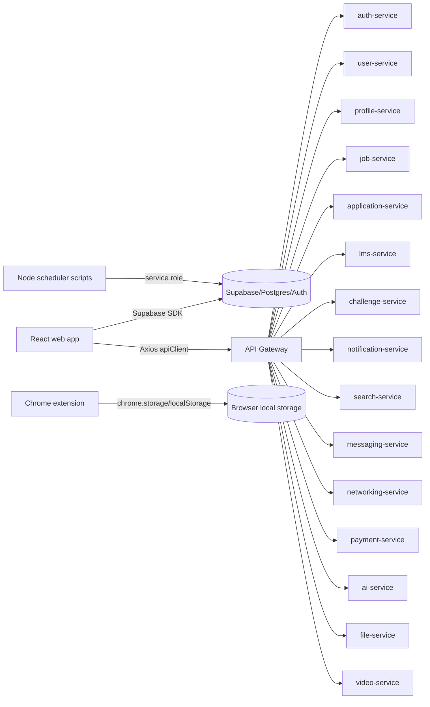

### 21.2 Target dependency direction

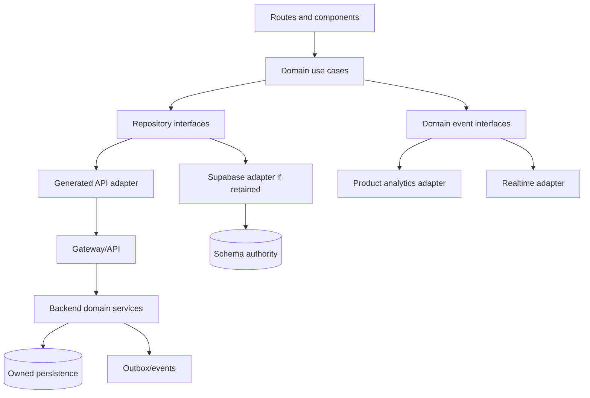

### 21.3 Startup and auth flow

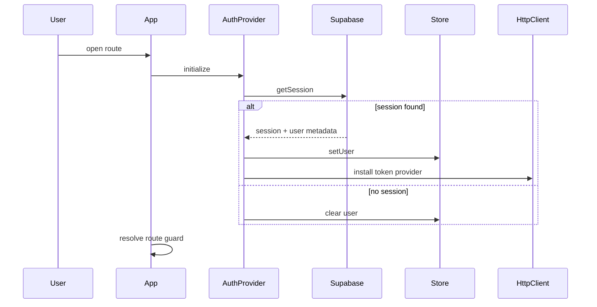

### 21.4 Job application flow

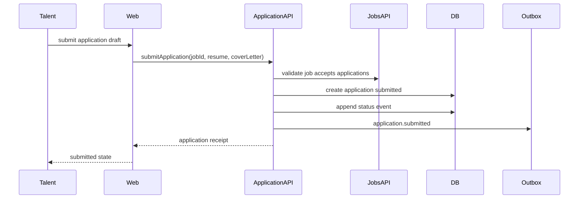

### 21.5 Candidate status flow

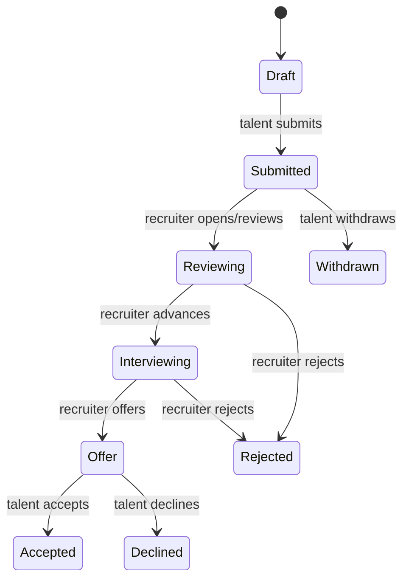

### 21.6 Notification and scheduler flow

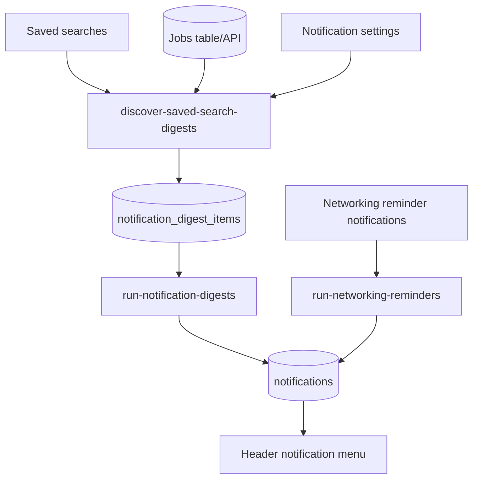

### 21.7 Messaging realtime flow

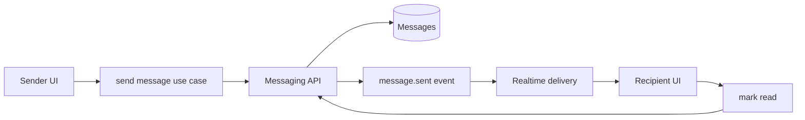

### 21.8 Extension local flow

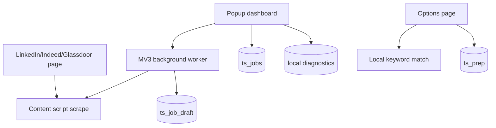

### 21.9 Build and deploy flow target

```mermaid
flowchart LR
  PR[Pull request] --> Lint[Lint/typecheck]
  Lint --> Unit[Unit tests]
  Unit --> Contracts[API/schema contract report]
  Contracts --> Build[Build artifacts]
  Build --> Images[Container images]
  Images --> Scan[Security scan]
  Scan --> DeployStaging[Deploy staging]
  DeployStaging --> Smoke[Smoke and e2e]
  Smoke --> Promote[Promote production]
```

### 21.10 Error handling flow

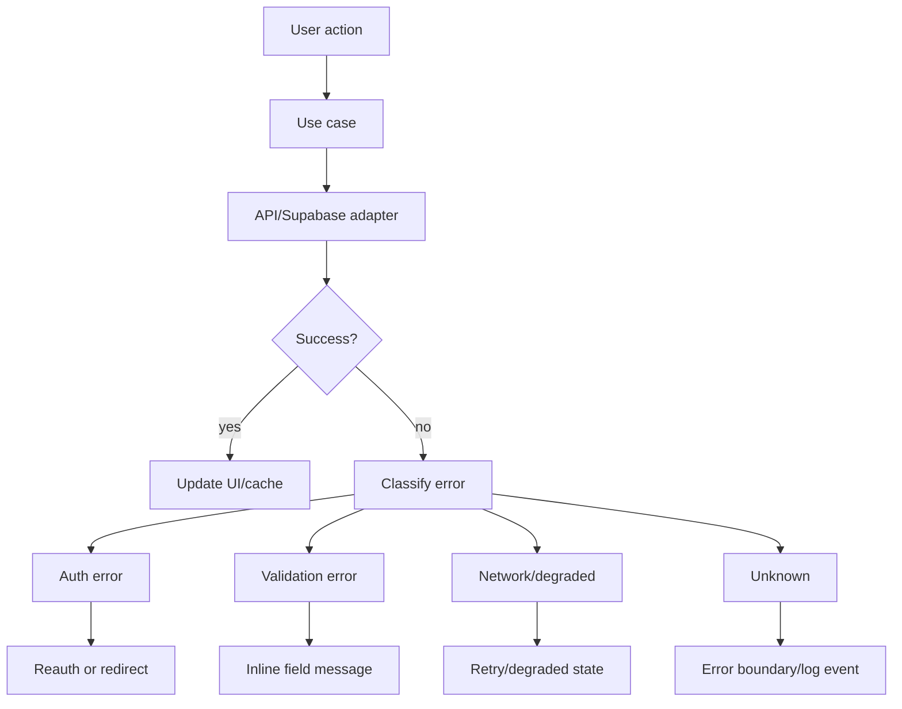

### 21.11 Target folder and source ownership

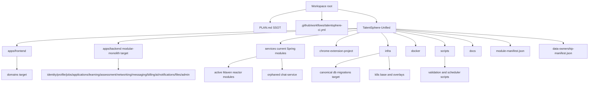

### 21.12 Bounded context relationships

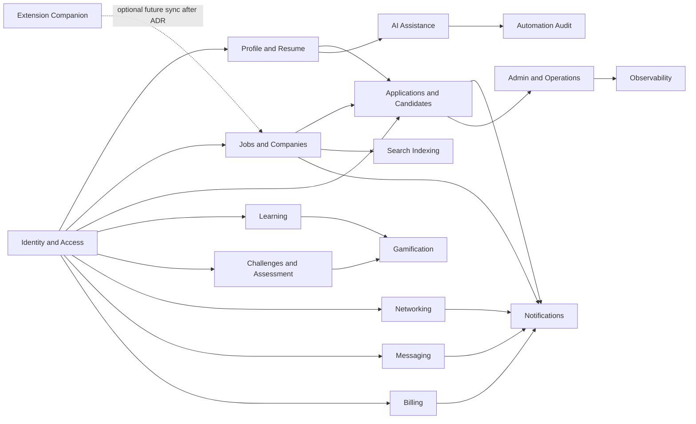

### 21.13 API flow

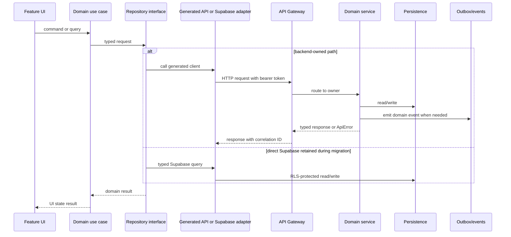

### 21.14 Data ownership and migration flow

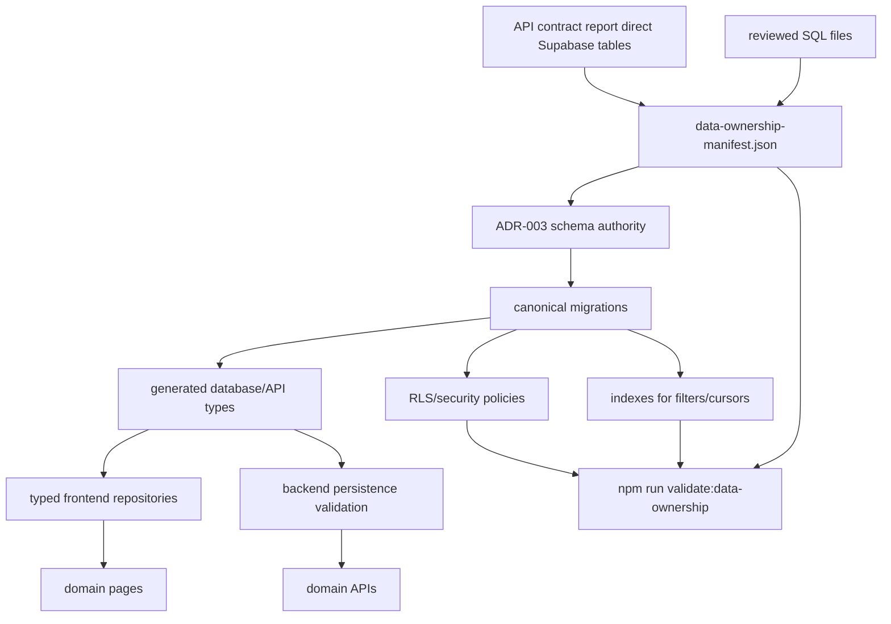

### 21.15 State flow

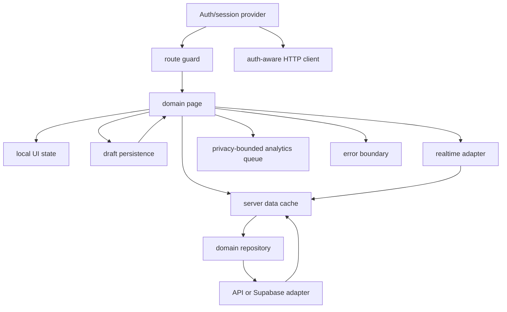

### 21.16 Navigation and role flow

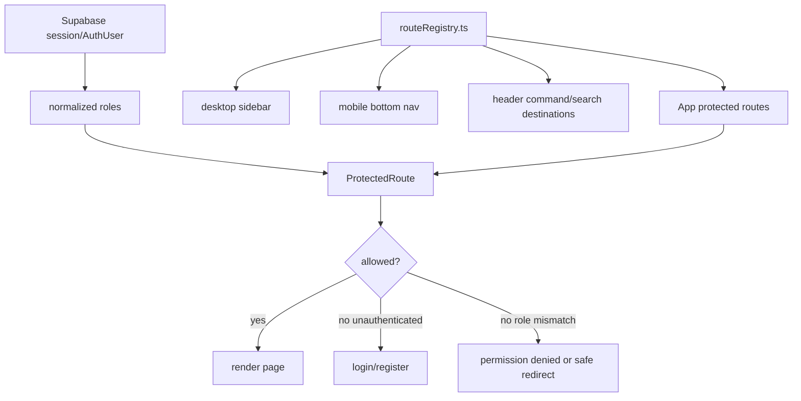

### 21.17 User journey map

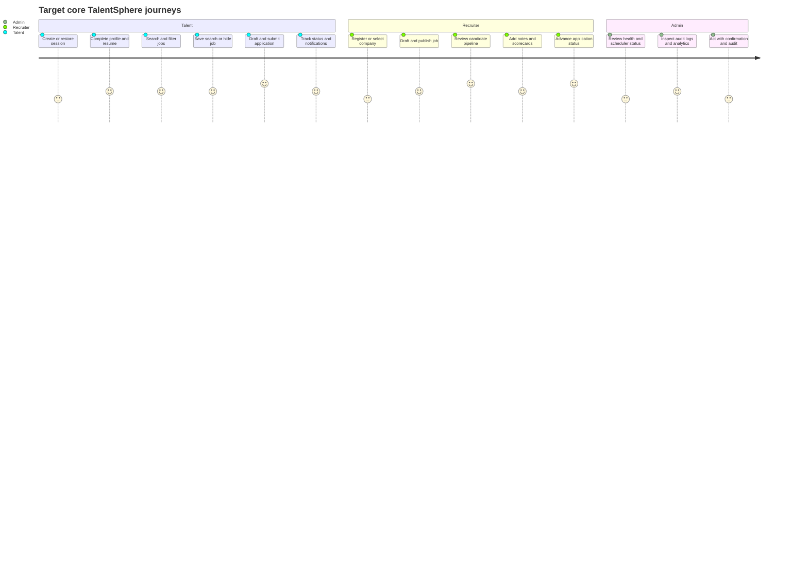

### 21.18 Scheduler module interaction

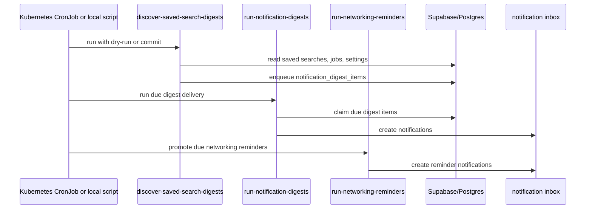

### 21.19 Deployment pipeline target

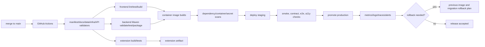

### 21.20 CI/CD verification flow

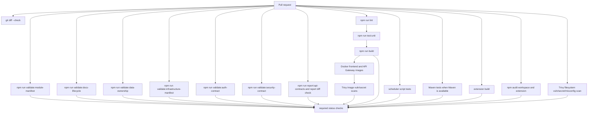

### 21.21 Domain application class diagram

```mermaid
classDiagram
  class DomainUseCase {
    +execute(command)
    -validate(command)
    -authorize(actor, command)
    -mapErrors(error)
  }
  class Repository {
    <<interface>>
    +find(query)
    +save(command)
  }
  class ApiAdapter {
    +request(dto)
    +mapResponse(response)
    +mapApiError(error)
  }
  class SupabaseAdapter {
    +query(table, request)
    +mapDbRow(row)
    +mapDbError(error)
  }
  class DomainEvent {
    +aggregateId
    +eventType
    +actorId
    +correlationId
    +occurredAt
  }
  class ApiError {
    +code
    +safeMessage
    +correlationId
  }
  class UIState {
    +status
    +data
    +source
    +error
  }
  DomainUseCase --> Repository
  DomainUseCase --> DomainEvent
  DomainUseCase --> ApiError
  Repository <|.. ApiAdapter
  Repository <|.. SupabaseAdapter
  DomainUseCase --> UIState
```

### 21.22 Payment and subscription sequence target

```mermaid
sequenceDiagram
  participant User
  participant Web
  participant BillingAPI
  participant Provider as Payment provider
  participant Webhook as Webhook handler
  participant DB as Billing tables
  participant Audit
  User->>Web: choose active plan
  Web->>BillingAPI: create checkout session with idempotency key
  BillingAPI->>Provider: create checkout session
  Provider-->>BillingAPI: hosted checkout URL
  BillingAPI-->>Web: redirect URL
  User->>Provider: complete or abandon checkout
  Provider->>Webhook: signed subscription/payment event
  Webhook->>Webhook: verify signature and idempotency
  Webhook->>DB: update subscription/payment state
  Webhook->>Audit: record billing event
  Web->>BillingAPI: refresh billing status
  BillingAPI->>DB: read webhook-owned state
  BillingAPI-->>Web: subscription/payment history
```

## 22. Technical Debt Register

Priority scale: P0 blocks production, P1 blocks reliable rebuild, P2 important quality issue, P3 cleanup.

| Priority | Debt | Evidence | Rebuild action |
| --- | --- | --- | --- |
| P0 | Split auth authority between Supabase and auth-service | `App.tsx`, `authService.ts`, `auth-service`, `docs/adr/ADR-001-primary-identity-provider.md`, `scripts/validate-auth-contract.mjs`, `RouteValidatorTest`, `JwtUtilsTest`, `AuthControllerLocalCredentialsDisabledTest` | Decision implemented on 2026-06-27: Supabase Auth is primary. Source-level Gateway HMAC verifier config, exact public-route matching, role normalization, and default-disabled backend local credentials are validated. Remaining work is live token verification, Maven/CI execution, and final auth-service bootstrap/retirement. |
| P0 | Gateway public-route substring bypass risk | `RouteValidator`, `RouteValidatorTest`, `scripts/validate-auth-contract.mjs` | Implemented on 2026-06-27: public routes use exact path matching plus explicit `/eureka` prefix handling; auth-contract validation rejects substring matching. Maven execution remains pending. |
| P0 | API auth interceptor not proven wired | `api/axios.ts`, `main.tsx`, `src/main.test.tsx`, `src/api/axios.test.ts` | Implemented and tested on 2026-06-27; keep broader auth-provider ownership open. |
| P0 | Schema authority drift | API report tables vs `infra/supabase_master.sql`, `data-ownership-manifest.json` | Source-validated table ownership manifest implemented on 2026-06-27; billing subscription SQL gap resolved on 2026-06-27; baseline migration and source-derived relationship-aware generated types implemented on 2026-06-27; resolve duplicate SQL sources and verify live RLS/indexes. |
| P0 | CI paths stale | Previous nested workflows under `TalentSphere-Unified/.github/workflows`; current `.github/workflows/talentsphere-ci.yml` | Implemented root CI for actual `apps/frontend`, `services`, extension, scripts on 2026-06-27; hosted run still must be verified. |
| P0 | Missing Maven wrapper while CI expects it | Previous `ci.yml`, file search | Implemented installed-Maven CI path on 2026-06-27; local developer Maven wrapper decision remains open. |
| P1 | Feature flag names become `enable_enable_*` | shared `Feature`, gateway tests | Implemented on 2026-06-27: canonical keys are enum names such as `enable_auth`, Gateway admin mutations reject unknown keys, and tests cover stale-key rejection. Backend Maven execution remains pending. |
| P1 | Gateway JWT/JWK mismatch | Gateway YAML, `JwtUtils`, `scripts/validate-auth-contract.mjs` | Source-level mismatch resolved on 2026-06-27 by removing unused JWKS config and validating HMAC `JWT_SECRET` config; live Supabase token verification is still required. |
| P1 | Direct Supabase access spread across frontend | 45 table report | Partially reduced on 2026-06-27: billing, profile, landing public stats, challenge, application, job, LMS, messaging, networking, recruiter, notification, notification digest, dashboard, company, gamification, AI, analytics, automation audit, and admin direct table paths now use `typedSupabase` and generated table/enums where migrated; auth bootstrap, OAuth, realtime, and remaining frontend Edge Function calls use `typedSupabase`; AI generation calls now use the backend AI API; the observed mutual-count RPC uses generated function types; `npm run validate:data-ownership` and `npm run validate:typed-supabase-boundary` reject frontend production imports of the untyped compatibility client and ungenerated RPC calls; continue encapsulating repositories or move writes to backend. |
| P1 | Local/mock fallback can hide persistence failures | frontend service warnings/fallbacks | Make degraded mode explicit and disable fabricated writes in production. |
| P1 | Messaging and chat boundaries overlap | `messaging-service`, `chat-service` | Merge or define separate responsibilities. |
| P1 | Payment service uses synthetic sessions | `payment-service` | Implement provider-backed checkout/webhook or label as demo. |
| P1 | AI service is heuristic/static | `ai-service` | Define suggestion contracts and provider abstraction only when configured. |
| P1 | File service local disk only | `file-service` | Source-level MIME/signature validation and scanner hook were implemented on 2026-06-27; add production object storage, external malware scanner, scan status persistence, signed URLs, and CDN strategy. |
| P1 | Challenge judging calls external Piston directly | `challenge-service` | Queue and sandbox strategy. |
| P1 | Infra Compose references missing modules | `infra/docker/docker-compose.yml`, `docker-compose.yml`, `scripts/validate-infrastructure-manifest.mjs` | Implemented on 2026-06-27 at source-validation level: missing/orphaned deploy references were removed and CI now validates Compose/Kustomize references against `module-manifest.json`; Docker runtime still must be verified. |
| P1 | `chat-service` is orphaned from the Maven reactor | `services/chat-service/pom.xml`, root `pom.xml`, `module-manifest.json`, API contract report | Gateway and deployment references were removed on 2026-06-27; decide whether to add it to the reactor and CI or retire/merge it into `messaging-service`. |
| P2 | Root Vite/index artifacts duplicate active frontend | `TalentSphere-Unified/vite.config.ts`, `index.html` | Implemented on 2026-06-30: stale root `index.html` and `vite.config.ts` were removed after source evidence showed root scripts use the `apps/frontend` workspace and the root shell pointed at missing `/src/main.tsx`; both paths are guarded by `removedStalePaths`. |
| P2 | Legacy `Aurora-*` classes and token drift | frontend components and CSS, `scripts/validate-ui-design-system.mjs`, `docs/DESIGN_SYSTEM.md` | Implemented on 2026-06-30 at source-validation level: the UI design-system validator rejects old Aurora/neon/glass tokens, decorative gradients, oversized radii/shadows, hard-coded black/white utilities, hard-coded colors outside token definitions, and undefined `var(--token)` references; current source passes the guard. Manual/deployed visual QA remains separate. |
| P2 | Negative heading letter spacing in global CSS | `index.css`, `scripts/validate-ui-design-system.mjs`, `docs/DESIGN_SYSTEM.md` | Implemented on 2026-06-30 at source-validation level: global heading letter spacing is normalized, and the validator rejects `tracking-*` drift, nonzero literal `letter-spacing`, and `letterSpacing`; current source passes the guard. Exported resume/browser/PDF typography review remains separate. |
| P2 | `apps/backend` stub unclear | `apps/backend`, `scripts/setup-dev.sh`, `scripts/validate-backend-topology-adr.mjs` | Clarified on 2026-06-30: ADR-002 retains `apps/backend` as a non-runnable modular-monolith target shell, and setup-dev now points backend validation at the root Maven reactor instead of `cd apps/backend && mvn spring-boot:run`; target package skeleton and migration remain open. |
| P2 | Overbroad service dependencies | service POMs | Trim per service after ownership decisions. |
| P2 | Global exception handler leaks internal messages | `GlobalExceptionHandler`, `scripts/validate-security-contract.mjs` | Implemented on 2026-06-27: shared exception handling returns stable public codes plus correlation IDs, logs raw details server-side, and validates the contract statically. Maven/shared-module JUnit execution remains pending. |
| P2 | Secrets manager config appears nonfunctional | `SecretsManagerConfig` | Implement or remove. |
| P2 | Environment validation is warning-only | `MandatoryEnvironmentPostProcessor`, `scripts/validate-security-contract.mjs` | Implemented on 2026-06-27: production/strict startup now fails for configured missing, unresolved, or placeholder credentials; local/test remains warning-only. Runtime cluster startup with real secrets remains unverified. |
| P2 | API routes and nav permissions duplicated | `App.tsx`, `Sidebar.tsx`, `Header.tsx`, `navigation/routeRegistry.ts` | Implemented on 2026-06-27 for frontend router, sidebar, mobile nav, header search, and protected route role gates; add E2E role-access coverage after auth-owner decision. |
| P2 | Extension lacks test suite | extension package/source | Partially implemented on 2026-06-28: extension package now has source-level messaging, portal fixture, options UX, popup UX, contract, and storage migration tests for content scan extraction, LinkedIn/Indeed/Glassdoor selector parsing, background draft mapping, background/content actions, Resume Match missing/short/large text status copy, accessible compare wiring, Interview Planner labels/live validation/stateful card toggles/reset review relationships, safe options storage failure warnings, safe popup scan status copy, safe popup storage failure warnings, shared storage removal fallback, limited-confidence scanned-draft review warnings, raw page-scan error exclusion from visible logs, MV3 permissions/hosts, local-only sync posture, diagnostics metadata allowlist, bounded queue, raw resume/job/prep-topic diagnostics exclusion, schema marker migration, malformed-key warnings, and install/update migration wiring; live Chromium-compatible runtime smoke now covers host-mapped portal fixture content-script execution, built popup render, local storage, install-time storage schema marker creation, background ping messaging, built options render, Resume Match validation/report behavior, Interview Planner prep-card create/toggle persistence, Prep Clear All cancel/confirm, Settings reset/cancel confirm, popup/options rendered contrast, popup storage load warnings, popup quota-pressure save warnings, options prep/settings storage load warnings, and options prep/settings quota-pressure save warnings. Google Chrome-specific unpacked runtime, live public-portal DOM drift, all-browser popup/options keyboard coverage, true storage-capacity exhaustion, real large-paste options profiling, and published update-path MV3 tests remain open. |
| P3 | Agent/generated artifacts live near product source | `.gemini`, root helper files, generated snapshots, root agent docs | Partially implemented on 2026-06-27: generated/dev-only artifacts are ignored or classified under `developmentArtifacts`; root agent/context docs are marked historical/stale under `documentation`; `project_structure.txt` was removed. Final archive/purge remains open. |

## 23. Rebuild Roadmap

This roadmap is a rebuild blueprint, not a claim that the implementation is complete. The matrix below is the controlling roadmap; the phase subsections preserve concise deliverables and acceptance criteria.

| Phase | Goals | Priority | Dependencies | Deliverables | Breaking changes | Migration plan | Rollback plan | Acceptance criteria | Risks | Estimated complexity |
| --- | --- | --- | --- | --- | --- | --- | --- | --- | --- | --- |
| 0. Freeze and inventory | Stop architecture drift, classify source, make validation runnable. | P0 | Current repo layout, package scripts, Maven/Docker availability, generated reports. | Module manifest, root CI, stale workflow cleanup, API report regeneration, stale-doc labels. | CI paths and Docker build roots may change. | Add manifest first, wire validators, move CI to actual git root, keep deleted stale workflows in git history. | Revert CI/manifest changes and restore prior workflow files if hosted CI proves incompatible. | Frontend validation runs, backend compile/test command is defined, stale workflows no longer target missing paths. | Local tools may not match CI; orphaned modules may hide build failures. | Medium |
| 1. Identity and contracts | Implement accepted auth owner and make frontend/gateway token contract consistent. | P0 | Phase 0 validation, ADR-001, route inventory, gateway security evidence. | Auth ADR, token claim contract, route/permission registry, auth-aware HTTP client, auth-contract validator, contract report in CI. ADR-001 is accepted; source-level Gateway HMAC config, exact public-route matching, role normalization, and default-disabled backend local credentials are validated; live verifier testing remains pending. | Login/session semantics may change; backend auth-service role may shrink. | Introduce compatibility token verifier, migrate route guards to registry, remove duplicate auth paths after tests pass. | Re-enable previous auth path behind explicit compatibility flag and keep session-clearing fallback. | Role matrix tests pass and API calls carry expected auth headers accepted by gateway. | Lockout risk if token claim mapping is wrong. | High |
| 2. Data ownership and migrations | Establish one schema authority and owner for every table/write path. | P0 | Phase 1 auth owner, API report, reviewed SQL, direct Supabase usage list. | Canonical migrations, generated TS types, owner map, RLS/security decisions, repository adapters. | Table names, RLS behavior, and direct client writes may change. | Keep the baseline migration/types synchronized, decompose migrations by domain, wrap direct reads/writes behind repositories, migrate writes domain by domain. | Keep old table/view compatibility or dual-write temporarily with audit checks. | Every table has owner, migration, policy decision, indexes, and no feature page imports Supabase SDK directly. | Data loss or permission regressions if migrations are incomplete. | High |
| 3. Jobs, applications, recruiter core | Stabilize the core marketplace workflow. | P0 | Phases 1-2, job/company/application owner decisions, scheduler contracts. | Job lifecycle, application lifecycle, candidate notes/scorecards API, saved-search scheduler hardening. | Application status and job publish rules become server-owned. | Ship read compatibility first, then command APIs, then disable direct writes and mock success paths. | Re-enable read-only legacy paths and preserve submitted application records. | Talent can apply and track status; recruiter can publish jobs, review candidates, and status events are append-only. | Workflow interruptions if direct Supabase and API states diverge during migration. | High |
| 4. Profile, resume, file, AI drafts | Separate durable profile/resume data from generated suggestions and file storage. | P1 | Phase 2 schema authority, file storage decision, AI provider/demo decision. | Profile/resume boundaries, file provider abstraction, artifact lifecycle, AI review queue normalization. | File URLs, resume artifact semantics, and AI mutation behavior may change. | Add provider adapters, migrate artifacts to metadata records, convert AI outputs to drafts requiring review. | Keep local disk/dev provider and previous artifact records readable. | Resume exports and artifacts have durable metadata; AI suggestions require review and emit audit events. | Provider selection and historical artifact migration can delay rollout. | Medium-high |
| 5. Learning, challenges, networking, messaging | Harden secondary engagement domains and realtime workflows. | P1 | Phase 2 schema authority, messaging/chat ADR, judge/scheduler decisions. | LMS progress authority, async judge pipeline, networking lifecycle, realtime reconciliation. | Challenge submission responses become async; messaging/chat boundaries may merge. | Introduce async statuses, migrate unread/progress state, keep compatibility readers until clients switch. | Keep synchronous judge path disabled behind config and preserve old conversation IDs. | Unbounded lists are paginated; realtime/offline behavior is visible and tested; judge does not block request threads. | Realtime ordering and judge queue reliability can fail under load. | High |
| 6. Billing, admin, observability, security | Make operational and money-handling surfaces production-safe or explicitly demo. | P0/P1 | Phases 1-2, payment provider decision, logging/metrics stack decision. | Provider-backed or demo-labeled billing, admin source labels, dashboards, alerts, secret validation. | Demo payment behavior may be removed from production; startup may fail without secrets. | Gate live mode by env, add webhook processing, add source labels before enabling admin actions, enforce secrets in prod only. | Disable live payment mode, fall back to read-only admin dashboards, restore warning-only secret validation outside prod. | Payment state is webhook-owned if enabled; admin distinguishes live/inferred/mock/degraded/missing; prod fails without required secrets. | Payment/webhook mistakes and strict secret validation can block deploys. | Medium-high |
| 7. Extension hardening | Keep extension local-first and add release confidence. | P2 | Phase 0 build pipeline, extension storage inventory, optional future sync ADR. | MV3 tests, storage migrations, diagnostics tests, and ADR-006 only if account sync is proposed. | Storage keys may version; any future sync behavior changes privacy posture. | Add migration readers/writers, test old sample storage, keep local-only default. | Retain previous local key readers and keep account sync disabled. | Extension works locally without web auth; account sync requires ADR-006 with explicit consent, preview, conflict handling, data minimization, and rollback rules. | Browser API drift and local data migration issues. | Medium |

### Phase 0: Freeze and inventory

Deliverables:

- Mark stale docs and generated artifacts. Implemented on 2026-06-27 at source-validation level with `documentation`, `developmentArtifacts`, visible documentation-status banners, and `npm run validate:docs-lifecycle`; final archive/remove decisions remain open.
- Create module manifest of active source, legacy source, generated source, documentation lifecycle, dev-only artifacts, and removed stale paths. Implemented on 2026-06-27 with `module-manifest.json`, `docs/MODULE_MANIFEST.md`, and `npm run validate:module-manifest`.
- Add Maven wrapper or document installed Maven requirement.
- Fix CI path references enough to run frontend and backend validation. Initial root CI workflow implemented on 2026-06-27; hosted execution remains Not verified from the codebase.
- Validate infrastructure module references. Implemented on 2026-06-27 with `scripts/validate-infrastructure-manifest.mjs` and CI wiring; Docker/Kubernetes runtime remains Not verified from the codebase.
- Regenerate API contract report. Implemented on 2026-06-27 with manifest-aware active vs orphaned controller route classification.

Acceptance criteria:

- CI runs at least frontend lint/test/build and backend compile/test command.
- `docs/ARCHITECTURE_STATUS_INDEX.md` and `PLAN.md` agree on active architecture.
- No stale workflow points at missing directories without an explicit deprecation note.
- `project_structure.txt` stays removed and classified stale unless regenerated by a documented command.
- New Markdown docs are lifecycle-classified or explicitly dev-only before CI passes.

### Phase 1: Identity and contracts

Deliverables:

- ADR: auth provider and token contract. Implemented on 2026-06-27 by `docs/adr/ADR-001-primary-identity-provider.md`; Gateway exact public-route matching, role normalization, source-level HMAC config, and default-disabled backend local credentials are validated by `npm run validate:auth-contract`; live token verification remains open.
- ADR: backend topology, service tree vs modular monolith.
- Shared route/permission registry.
- Wired auth-aware HTTP client.
- API/schema contract generation in CI.

Acceptance criteria:

- Role matrix tests pass for user, recruiter, admin, unauthenticated.
- API calls carry expected auth headers.
- Gateway validates the same token shape produced by the chosen auth provider.

### Phase 2: Data ownership and migrations

Deliverables:

- Canonical schema migrations for all direct Supabase tables.
- Generated TypeScript database types.
- Owner map for each entity. Initial source-validated table owner map implemented on 2026-06-27 with `data-ownership-manifest.json`; production authority remains incomplete.
- Repository adapters around all direct Supabase access.

Acceptance criteria:

- Every table has owner, migration, RLS/security policy decision, indexes, and tests.
- No feature page imports Supabase SDK directly.

### Phase 3: Jobs, applications, and recruiter core

Deliverables:

- Server-owned job lifecycle.
- Application status lifecycle and append-only events.
- Candidate notes/scorecards API.
- Saved-search scheduler hardening.

Acceptance criteria:

- Talent can apply, recover draft, and view status history.
- Recruiter can publish a job, review applicants, write notes/scorecards, and advance status.
- Scheduler jobs are idempotent and audited.

### Phase 4: Profile, resume, file, and AI drafts

Deliverables:

- Profile/resume domain boundaries.
- File provider abstraction.
- Resume artifact lifecycle.
- AI suggestion review queue normalization.

Acceptance criteria:

- Resume exports and artifacts have durable metadata and deletion semantics.
- AI suggestions require user review and produce audit events.

### Phase 5: Learning, challenges, networking, messaging

Deliverables:

- LMS progress authority.
- Challenge async judge pipeline.
- Networking lifecycle/idempotency.
- Messaging/chat boundary decision and realtime reconciliation.

Acceptance criteria:

- Unbounded lists are paginated.
- Realtime and offline/degraded behavior is visible and tested.
- Challenge submissions cannot block request threads on long external execution.

### Phase 6: Billing, admin, observability, security

Deliverables:

- Payment provider implementation or explicit demo mode.
- Admin operational console with real source labels.
- Observability dashboards and alerts.
- Production secret validation. Source-level runtime fail-fast and Kubernetes runtime-secret wiring were implemented on 2026-06-27; live secret provisioning remains unverified.

Acceptance criteria:

- Payment state is webhook-owned if payments are enabled.
- Admin health/scheduler/analytics states distinguish live, inferred, mocked, degraded, and missing.
- Source-level production startup fails without configured required secrets.
- Runtime CI/cluster startup is verified with real environment-supplied secrets.

### Phase 7: Extension hardening

Deliverables:

- MV3 build/test pipeline.
- Source-level local storage migration/versioning.
- Source-level diagnostics export/privacy tests.
- Optional sync ADR.

Acceptance criteria:

- Extension functions locally without web app auth.
- Any sync feature requires explicit consent, preview, and conflict handling.

## 24. Validation Checklist

### 24.1 Repository hygiene

- [x] `PLAN.md` is present at workspace root.
- [x] `PLAN.md` contains repository-backed current and target Mermaid diagrams for architecture, folder/source ownership, dependency direction, feature relationships, startup/auth, data ownership, API flow, state flow, navigation, user journeys, scheduler/module interaction, build/deploy, CI/CD, error handling, sequence views, and class structure.
- [x] Root `.github/workflows/talentsphere-ci.yml` exists for the actual git root.
- [x] Stale nested workflows targeting missing directories were removed from the current worktree.
- [x] `module-manifest.json` classifies active, legacy, orphaned, generated, infrastructure, tooling, documentation lifecycle, dev-only artifacts, and removed stale paths.
- [x] `npm run validate:module-manifest` passed on 2026-06-27 and was rerun successfully on 2026-06-30.
- [x] `npm run validate:infrastructure-manifest` passed on 2026-06-27.
- [x] `npm run validate:docs-lifecycle` passed on 2026-06-27 and was rerun successfully on 2026-06-30.
- [x] Stale docs are marked stale or archived.
- [x] Generated artifacts are excluded or documented.
- [x] Root helper scripts are classified as dev-only or removed.
- [x] `project_structure.txt` is removed from the current worktree and guarded by `removedStalePaths`.
- [x] Validated stale UI presentation files for dashboard, AI, messaging, and networking are removed from the current worktree and guarded by `removedStalePaths`.
- [x] Stale root Vite shell/config artifacts are removed from the current worktree and guarded by `removedStalePaths`; the active frontend remains `apps/frontend`.

### 24.2 Frontend

- [x] Frontend lint passed on 2026-06-30 after the complete UI/UX redesign evidence refresh.
- [x] Frontend production build passed on 2026-06-30 after the complete UI/UX redesign evidence refresh.
- [x] Frontend unit tests passed on 2026-06-30 after the complete UI/UX redesign evidence refresh: 112 test files and 626 tests.
- [x] Frontend Chromium E2E passed on 2026-06-30 after the complete UI/UX redesign evidence refresh: 235 tests covering accessibility semantics, rendered route contrast, visual layout, keyboard navigation, public/auth/recovery routes, dashboards, domain workflows, route access, notifications, and performance smoke checks.
- [x] Auth bootstrap installs API token provider.
- [x] Route registry drives router, sidebar, mobile nav, header search, and permissions.
- [x] UX audit checklist and design-system guide are current lifecycle-classified docs.
- [x] Global app shell and shared primitives use the first shared canvas, panel, gutter, focus, reduced-motion, and surface utility tokens.
- [x] Public landing navigation, role CTAs, preview cards, IA decisions, workflow principles, and public stats expose named semantic structure with Chromium mobile overflow coverage.
- [x] Login/Register share `AuthShell`, hide inactive public auth provider/reset controls, preserve registration role intent, and have browser workflow coverage.
- [x] Login/Register provider-failure states use safe public copy, hide raw provider errors, preserve invalid-credential and weak-password guidance, and have unit coverage.
- [x] Not Found recovery is wildcard-owned, token-backed, public/auth-aware, role-filtered for authenticated destinations, and covered across browser projects plus route visual/a11y audits.
- [x] Global ErrorBoundary uses safe token-backed recovery copy, preserves custom fallback/reload behavior, and has unit coverage against raw exception-message leakage.
- [x] Major feature ownership is source-backed and duplicate primary owners are guarded by `npm run test:ia`.
- [x] Major public, talent, recruiter, and admin routes have Chromium accessibility semantics audit coverage.
- [x] Major public, talent, recruiter, and admin routes have Chromium desktop/mobile layout audit coverage.
- [x] Shell-level command search, notification reminders/account read/load-more actions, mobile navigation, shared tabs, shared modals, and login form submission have Chromium keyboard navigation coverage.
- [x] `CommandSearch` route discovery is a reusable shell component with label-ranked results, role-filtered utility destinations, visible no-result states, and browser workflow coverage.
- [x] Shell notification account-sync labels, degraded fallback labels/retry, due-aware unread counts, scheduled reminder visibility, explicit mark-all payloads, and read-failure rollback paths have browser workflow coverage.
- [x] Shell notification load and mark-all read failures use safe popover copy, hide raw provider errors, preserve unread state on failed mark-all persistence, and have unit coverage for retry through existing Retry notifications and Mark read actions.
- [x] Jobs Explore catalog failed-load state uses safe retry copy, hides raw provider errors, and has unit coverage for retry through the existing catalog refetch workflow.
- [x] Jobs Applied-tab application history failed-load state uses safe retry copy, hides raw provider errors, and has unit coverage for retry through the existing application history load workflow.
- [x] Jobs My Posts recruiter postings failed-load state uses safe retry copy, hides raw provider errors, and has unit coverage for retry through the existing recruiter job load workflow.
- [x] Jobs application-submit and recruiter publish failures use safe modal-scoped copy, hide raw provider errors, and have unit coverage for retry through the existing Review Application and publish checklist workflows.
- [x] Jobs saved-search and hidden Explore preference sync failures use safe local-fallback copy, hide raw provider errors, keep existing saved/hidden controls available, and have unit coverage for the all-hidden Explore empty-state explanation.
- [x] Jobs saved-search and hidden Explore browser storage failures use safe local-storage copy, hide raw quota/provider errors, keep current-session saved/hidden controls available, and have unit coverage for retained restore controls.
- [x] Jobs application draft browser-storage, draft-history storage, and account-sync failures use safe modal-local copy, hide raw quota/provider errors, keep the editable draft and Submit Application available, and have unit coverage through the existing Review Application draft workflow.
- [x] Jobs Explore results, Applied applications, My Posts recruiter postings, and saved searches expose named list/listitem semantics with unit coverage.
- [x] Applied application Details status timelines expose named recorded-event, rejected-fallback, and inferred-step semantics with unit coverage.
- [x] Post Job company context lookup failures use safe inline retry copy, hide raw provider errors, keep the editable draft/company form available, and have unit coverage for retry through the existing company lookup workflow.
- [x] Post Job company create/update and draft save/update failures use safe action copy, hide raw provider errors, preserve the owning form/review state, and have unit coverage for retry through Create & Attach Company, Save Company Profile, Save Draft, and Save Changes.
- [x] Post Job template save/delete and draft-history browser storage failures use accurate safe copy, hide raw quota/provider errors, keep the current form or review state available, and have unit coverage for blocked browser storage combined with failed account sync or successful account deletion with unavailable browser storage.
- [x] Profile failed-load state uses safe retry copy, hides raw provider errors, and has unit coverage for retry through the existing profile load workflow.
- [x] Profile basic-save, completion-row save, row-delete, avatar-upload, and avatar-removal failures use safe inline copy, hide raw provider errors, and have unit coverage for retry through the existing Profile action workflows.
- [x] Profile summary, skills, metrics, completion checklist, suggestions, tabpanels, experience rows, education rows, and achievement cards expose named semantic structure with unit coverage.
- [x] Resume Builder profile-data failed-load state uses safe retry copy, hides raw provider errors, and has unit coverage for retry through the existing resume profile load workflow.
- [x] Resume Builder save, provider upload, uploaded-PDF delete, detected-skill save, and detected-profile-row save failures use safe inline copy, hide raw provider errors, and have unit coverage for retry through the existing Resume action workflows.
- [x] Resume Builder actions, editor fields, import review, export activity, artifact lists, export history, and preview sections expose named semantic structure with unit coverage.
- [x] Learning AI handoff review, consumed route-state cleanup after search application, explicit catalog search, pagination, enrollment, failed enrollment recovery, keyboard lesson selection/completion, lesson completion, failed progress-persistence recovery, and progress filtering paths have browser workflow coverage.
- [x] Learning course-catalog failed-load state uses safe retry copy, hides raw provider errors, and has unit coverage for retry through the existing course catalog fetch workflow.
- [x] Learning enrolled-progress failed-load state uses safe retry copy, hides raw provider errors, preserves already loaded progress, and has unit coverage for retry through the existing enrollment progress load workflow.
- [x] Learning enrollment and lesson-completion persistence failures use safe toast copy, hide raw provider errors, preserve course/progress state, and have unit coverage for retry through the existing Enroll Now and Mark Complete workflows.
- [x] Learning Continue Learning, catalog-card, and course-detail progress tracks expose contextual progressbar semantics with course-specific values and unit coverage.
- [x] Challenges catalog cards and workspace panels expose list/region semantics, contextual editor description, sample-case labels, and retry-history attempt labels with unit coverage.
- [x] AI Assistant long-running generation, provider failure/retry, save/dismiss review sync, audit/analytics payloads, explicit clear-chat review/cancel/delete sync, and Profile/Resume/Jobs/Learning handoff paths have browser workflow coverage.
- [x] AI Assistant chat provider-failure state uses safe draft copy, hides raw provider errors, and has unit coverage for retry through the existing chat response workflow.
- [x] AI Assistant review queue, conversation log/message articles, and prompt suggestions expose named semantic structure with unit coverage.
- [x] Career Path generated guidance, malformed-data retry, provider-unavailable state, Learning handoff, and AI Assistant handoff paths have browser workflow coverage.
- [x] Career Path provider-unavailable state uses safe retry copy, hides raw AI provider errors, and has unit coverage for retry through the existing career-path generation workflow.
- [x] Admin source-labeled operational sections, scheduler verification state, audit pagination/retry, service investigation analytics hygiene, and scheduled automation status refresh paths have browser workflow coverage.
- [x] Admin Console failed-load state uses safe retry copy, hides raw service errors, and has unit coverage for retry through the existing refresh workflow.
- [x] Admin summary metrics, product analytics, scheduled automation, service health, and audit log surfaces expose named semantic structure with unit coverage.
- [x] Dashboard partial/error issue rows use safe section-level retry copy, hide raw provider errors, and have unit coverage for retry through the existing refresh workflow.
- [x] Dashboard metric cards, onboarding tasks, quick actions, recent opportunities/applications, and active challenge summaries expose named list semantics with unit coverage.
- [x] Billing provider-unavailable load state uses safe retry copy, hides raw provider errors, and has unit coverage for retry through the existing billing data load workflow.
- [x] Billing plan checkout and billing portal failures use safe modal-scoped copy, hide raw provider errors, and have unit coverage for retry through the existing Review Plan and Update Payment Method workflows.
- [x] Settings profile-save, password-reset, and account-deactivation failures use safe inline copy, hide raw provider errors, and have unit coverage for retry through the existing Settings action workflows.
- [x] Settings section navigation, notification groups, security actions including the provider-required disabled 2FA state, and billing summary metrics expose tab/list semantics with unit coverage.
- [x] Challenges category filtering, workspace open, local sample-check result handling, unsupported-language/no-visible-sample safeguards, reviewed reset, submission, failed-submission recovery, latest result, and retry-history refresh paths have browser workflow coverage.
- [x] Challenges catalog failed-load state uses safe retry copy, hides raw service errors, and has unit coverage for retry through the existing fetch workflow.
- [x] Challenges submission failures use safe toast copy, hide raw provider errors, keep the workspace and retry history available, and have unit coverage for retry through the existing Submit Solution workflow.
- [x] Candidates detail review, private notes, scorecards, status changes, bulk moves, pagination/search/focus, and keyboard pagination/search/details/queue paths have browser workflow coverage.
- [x] Candidates application-list failed-load state uses safe retry copy, hides raw provider errors, and has unit coverage for retry through the existing candidate application page load workflow.
- [x] Candidates single-status and all-failed bulk status failures use safe confirmation-modal copy, hide raw provider errors, and have unit coverage for retry through the existing Candidates confirmation workflows.
- [x] Candidates review metrics and application rows expose named list semantics with unit coverage.
- [x] Messaging conversation selection, text send, failed-send retry, attachment-link keyboard composer, uploaded-file attachment, visible mark-read, and older-history loading paths have browser workflow coverage.
- [x] Messaging conversation-list and message-history failed-load states use safe retry copy, hide raw provider errors, and have unit coverage for retry through the existing load workflows.
- [x] Messaging send, attachment upload, and visible mark-read failures use safe action copy, hide raw provider errors, and have unit coverage for retry/status preservation through the existing Messaging action workflows.
- [x] Networking suggestion preview, hidden-suggestion restore, connect request, incoming accept/decline, sent reminder set/clear, withdraw, accepted-profile preview, keyboard preview activation, and full-profile popup route target paths have browser workflow coverage.
- [x] Networking failed-load state uses safe retry copy, hides raw service errors, and has unit coverage for retry through the existing suggestion fetch workflow.
- [x] Networking Connect, Accept, Decline, and Withdraw failures use safe inline copy, hide raw provider errors, and have unit coverage for retry through the existing Networking action workflows.
- [x] Billing, profile, challenge, application, job, recruiter, LMS, messaging, networking, notification, notification digest, dashboard, company, gamification, AI, analytics, automation audit, and admin direct Supabase table paths use the generated `Database` typed boundary.
- [ ] Supabase direct access is behind domain repositories.
- [ ] All pages have loading, empty, error, retry, and degraded states.
- [x] No production code silently fabricates successful writes at source level: networking, messaging, orphaned chat, and company write fallbacks now fail explicitly when persistence did not happen, and `npm run validate:write-fallback-safety` scans 237 production Java files for temporary/buffered successful write fallback patterns; Maven/runtime validation remains required.
- [x] Design tokens and typography replace undefined legacy classes at source level: `npm run validate:ui-design-system` rejects legacy Aurora/neon/glass visual classes, decorative gradients, oversized radii/shadows, hard-coded black/white UI utilities, ad hoc hex and functional color literals, nonstandard letter spacing, low-contrast core token pairs, and undefined `var(--token)` references across web and extension UI source.

### 24.3 Backend

- [x] Backend topology ADR accepted.
- [x] Messaging boundary ADR accepted.
- [ ] Every endpoint has authZ tests.
- [ ] Every service has health, metrics, logs, and correlation ID.
- [ ] Outbox has retry exhaustion handling and operator visibility.
- [x] Feature flags have stable source-level names and validation tests added through `npm run validate:feature-flags`; backend Maven execution, admin authZ, persistence, and audit trail remain required before production flag governance is complete.
- [x] Static route contract report is generated and checked in CI.
- [x] Source-derived OpenAPI/payload schema contract is generated, validated, and checked in CI.
- [ ] Runtime Springdoc/OpenAPI output is smoke-tested from running backend services.

### 24.4 Data

- [x] Schema authority ADR accepted.
- [ ] Every table has a migration.
- [x] Initial reviewed schema baseline migration and source-derived DB types are generated and checked in CI.
- [x] Frontend Supabase client exposes a generated-`Database` typed migration boundary.
- [x] Every observed table has a target owner classification.
- [ ] Every table has indexes for common filters/cursors.
- [ ] RLS/security policy is documented.
- [x] Seed data is safe and environment-scoped at source level: destructive SQL and Python seed entry points now require local/dev/test/CI scope plus explicit confirmation and are guarded by `npm run validate:seed-data-safety`; live dev/test seed execution remains required before production release.
- [x] Source-level direct service-role scheduler scripts are dry-run by default, idempotency-oriented, audited to `audit_log` in commit mode, and covered by scheduler tests plus `npm run validate:security-contract`.

### 24.5 Security

- [x] Primary auth provider decision is documented in ADR-001.
- [x] Payment mode ADR accepted and demo billing mode is explicit.
- [x] Source-level Gateway auth contract is validated by `npm run validate:auth-contract`.
- [x] Gateway public-route validation uses exact path/prefix matching instead of substring matching.
- [x] Backend auth-service local credential register/login endpoints are disabled by default behind explicit compatibility flag.
- [ ] Gateway Supabase-token validation path and runtime claim mapping are fully verified with live-compatible tokens. Role normalization is source-implemented, but Maven/CI and integration verification remain pending.
- [x] Source-level required secret validation fails fast in production/strict mode and is validated by `npm run validate:security-contract`.
- [ ] Runtime CI/cluster startup is verified with real environment-supplied production secrets.
- [x] Source-level shared API error handling returns safe public codes with correlation IDs and is validated by `npm run validate:security-contract`.
- [x] Source-level upload validation includes MIME/content-signature checks, active-content rejection, and a malware scanner hook validated by `npm run validate:security-contract`.
- [ ] Provider-backed file malware scanning, scan status persistence, and signed access are production-verified.
- [x] Source-level sensitive-route rate limits are configured for auth, AI, challenge, messaging, and file routes and validated by `npm run validate:auth-contract`.
- [ ] Runtime Redis-backed rate-limit behavior and expected 429 responses are integration-tested.
- [ ] Admin and recruiter actions are audited.
- [x] Source-level dependency, secret, misconfiguration, and container image scan gates are wired into CI and validated by `npm run validate:security-contract`.
- [ ] Dependency, secret, misconfiguration, and container image scan jobs have passed in GitHub Actions.

### 24.6 Operations

- [x] Frontend Dockerfile targets the root npm workspace and `apps/frontend`.
- [x] Docker Compose deployable references and frontend bind mounts reflect current module paths; Docker runtime is not locally verified.
- [x] Kubernetes base service resources reflect active deployable modules; cluster runtime and image availability are not locally verified.
- [x] Scheduler CronJob commands are source-validated and scheduler audit helper coverage is wired into CI; scheduler image build/push is not verified.
- [x] Source-level alert and dashboard catalogs exist for critical flows and are validated by `npm run validate:observability-contract`.
- [ ] Deployed dashboards and alert-manager routing exist for critical flows.
- [x] Source-backed incident runbooks exist and are validated by `npm run validate:runbooks`.
- [ ] Environment-verified runtime runbooks, real on-call contacts, dashboards, and alert-manager links exist for production incidents.

### 24.7 Extension

- [x] Extension production build passed on 2026-06-29.
- [x] Manifest build is validated: `chrome-extension-project/dist/manifest.json` was produced on 2026-06-27.
- [x] Manifest icon assets exist under `chrome-extension-project/public/icons`, are copied into `dist/icons`, and Chrome pack validation passed on a temporary copy of the built artifact.
- [x] Extension contract test validates local-only sync posture, supported manifest permissions/hosts, bounded operational diagnostics, diagnostics metadata allowlist, and raw resume/job diagnostics exclusion.
- [x] Source-level background/content messaging tests cover content scan extraction, background draft mapping, message action wiring, and response behavior.
- [x] Source-level LinkedIn, Indeed, and Glassdoor portal fixture tests cover content selector parsing for role, company, source, URL, confidence, and sanitized description extraction.
- [x] Source-level local storage migration tests cover schema markers, known-key preservation, malformed-key warnings, and install/update migration wiring.
- [x] Source-level options UX contract covers Resume Match missing/short/large text guidance, Interview Planner labels/live validation/stateful card toggles/reset review relationships, safe options storage failure warnings, shared storage removed-key fallback, accessible live alert/status semantics, character counts, result-region semantics, and raw job/resume/prep-topic diagnostics exclusion.
- [x] Source-level popup UX contract covers safe Dashboard scan status copy, safe popup storage-failure warnings, limited-confidence scanned-draft review warnings, alert/status semantics, raw page-scan error exclusion from visible popup logs, and raw quota/runtime/storage-key exclusion from storage-warning copy.
- [x] Source-level diagnostics contract blocks raw resume/job text metadata in extension operational analytics.
- [x] Extension sync rebuild posture is local-only: source uses `chrome.storage.local` or localStorage fallback, contract tests reject sync/network APIs, and account sync is out of scope unless ADR-006 is accepted.
- [x] Live Chromium-compatible MV3 runtime smoke against the built artifact passed with `npm run test:extension-runtime-smoke` in headless Microsoft Edge 149; host-mapped LinkedIn, Indeed, and Glassdoor fixture tabs, injected content-script metadata, popup render, `chrome.storage.local`, install-time storage schema marker, popup-to-background `ping` messaging, options render, Resume Match validation/report behavior, Interview Planner prep-card create/toggle/clear/reset persistence, popup/options rendered contrast, popup storage load warnings, popup quota-pressure save warnings, options prep/settings storage load warnings, and options prep/settings quota-pressure save warnings were verified.
- [ ] Google Chrome-specific unpacked runtime smoke is verified in an environment where Chrome accepts `--load-extension`.

## 25. Decision Records and Open Decisions

Every decision below must become an ADR before implementation removes or replaces current behavior. ADRs must live under `docs/adr/` and include status, repository evidence, decision, alternatives, consequences, migration plan, rollback plan, owner, and validation commands.

### 25.1 Initial ADR backlog

| ADR | Status | Repository evidence | Decision to make | Consequences to document |
| --- | --- | --- | --- | --- |
| ADR-001 Primary identity provider | Accepted | Frontend Supabase auth in `App.tsx` and `authService.ts`; backend `auth-service`; gateway JWT utilities; `docs/adr/ADR-001-primary-identity-provider.md`; `scripts/validate-auth-contract.mjs`. | Supabase Auth is the primary login/session authority. Backend auth-service local credentials are disabled by default and must become compatibility/bootstrap support or be retired from product login paths. Source-level Gateway HMAC config, exact public-route matching, and role normalization are validated. | Token claim shape, live Gateway validation, route guards, user bootstrap, logout behavior, local dev fallback, and final backend auth-service retirement/bootstrap decision remain pending. |
| ADR-002 Backend topology | Accepted | Broad `services/*` tree plus `api-gateway`, orphaned `services/chat-service`, `apps/backend` modular-monolith shell, `docs/adr/ADR-002-backend-topology.md`, and `scripts/validate-backend-topology-adr.mjs`. | Modular monolith first with extractable service boundaries; active services remain source evidence and migration input until domains are moved or retired deliberately. | Target package skeleton, migration sequence, CI topology, service discovery retirement or retention, shared library migration, local developer setup, and chat-service retirement/adapter merge remain pending. |
| ADR-003 Schema authority | Accepted | Direct frontend access to 45 Supabase tables; `data-ownership-manifest.json`; `supabase-schema.sql`; `infra/db/migrations/0001_initial_baseline.sql`; `infra/db/generated/database.types.ts`; legacy `infra/supabase_master.sql`; `infra/db/README.md`; `docs/adr/ADR-003-schema-authority.md`; `scripts/validate-schema-authority-adr.mjs`; `scripts/validate-schema-migrations.mjs`. | Migration-first Supabase/Postgres authority with generated TypeScript types and backend validation. `supabase-schema.sql` is current reviewed baseline evidence, `infra/db/migrations/0001_initial_baseline.sql` is the source-derived initial migration, `infra/db/generated/database.types.ts` includes source-derived table/enum/relationship metadata, and `infra/supabase_master.sql` is legacy historical evidence until migrated, retained, or retired deliberately. | Smaller domain-ordered migrations, live database-generated DB types, live RLS/security validation, data ownership implementation, rollback migrations, seed data scope, duplicate SQL retirement, and direct frontend repository migration remain pending. |
| ADR-004 Messaging boundary | Accepted | `messaging-service`, orphaned `chat-service`, frontend realtime state, `docs/adr/ADR-004-messaging-boundary.md`, `scripts/validate-messaging-boundary-adr.mjs`, API contract report, and OpenAPI non-active chat operations. | One messaging domain boundary. `messaging-service` remains active source evidence; `chat-service` stays orphaned/non-deployable until retired or useful realtime adapter code is merged without duplicate persistence. | Conversation membership authZ, unread semantics, realtime adapter topology, attachment signed access, Maven reactor retirement/merge work, frontend repository migration, and runtime WebSocket validation remain pending. |
| ADR-005 Payment mode | Accepted | Frontend payment tables, backend synthetic sessions, Stripe config/dependency, `docs/adr/ADR-005-payment-mode.md`, `scripts/validate-payment-mode-adr.mjs`, and explicit frontend `billingMode`. | Explicit demo billing mode now. Provider-backed checkout and webhook-owned subscription/payment state are allowed only after signed webhook validation, idempotency, audit records, and runtime provider tests exist. | Live Stripe checkout, webhook handling, idempotency, audit logs, refund/subscription lifecycle, provider catalog, invoices, and tax remain pending. |
| ADR-006 Extension sync | Deferred until account sync is proposed | Extension uses `chrome.storage.local` or localStorage fallback; `extension-contract.test.mjs` rejects sync/network APIs and verifies the UI says extension data stays in this browser. | Current rebuild posture is local-only. ADR-006 is required only before adding account/cloud sync. | Consent UI, import/export preview, conflict resolution, privacy boundaries, data minimization, storage migration, diagnostics content, and rollback plan. |

### 25.2 Open decisions backlog

| Decision | Options | Recommended path |
| --- | --- | --- |
| Primary auth | Supabase Auth, backend auth-service, external IdP | Accepted by ADR-001: Supabase Auth is primary; source-level Gateway auth contract is validated, public-route matching is exact, and backend local credentials are disabled by default; verify live Supabase token behavior and finish auth-service bootstrap/retirement decision. |
| Backend topology | Microservices, modular monolith | Accepted by ADR-002: modular monolith first for rebuild, keep extraction boundaries explicit, and retain the active service tree as migration source evidence until implementation moves or retires each domain. |
| Database access | Frontend direct Supabase, backend-only API, hybrid | Backend-owned writes and generated typed reads; direct Supabase only behind repositories during migration. |
| Schema source | SQL files, Supabase migrations, JPA, generated contracts | Accepted by ADR-003: migration-first Supabase/Postgres authority with generated TypeScript types and backend validation; keep `infra/db/migrations/0001_initial_baseline.sql` and `infra/db/generated/database.types.ts` synchronized, decompose the baseline into smaller ordered migrations, and retire or classify legacy `infra/supabase_master.sql` tables. |
| Messaging boundary | Keep messaging-service and chat-service separate, merge | Accepted by ADR-004: one messaging domain boundary; retire `chat-service` or merge useful realtime adapter code into messaging after authZ/realtime validation. |
| AI provider | Heuristic only, external LLM, hybrid | Keep heuristic/local until provider, evals, prompts, and privacy rules are implemented. |
| Payment mode | Demo synthetic, real provider | Accepted by ADR-005: explicit demo billing mode now; real provider mode only after webhook-owned state, idempotency, audit, and runtime provider validation. |
| Extension sync | Current local-only, future account sync | Resolved for the rebuild: local-only. Future account sync is not part of this rebuild unless ADR-006 accepts explicit consent, preview, conflict handling, data minimization, and sync rollback rules. |

## 26. Risks

| Risk | Impact | Mitigation |
| --- | --- | --- |
| Hybrid Supabase/API writes cause inconsistent data | High | Owner map and repository migration. |
| Auth mismatch blocks API calls | High | Auth ADR, token propagation tests, gateway verification tests. |
| Stale infra deploys wrong services | High | Generate compose/k8s from module manifest. |
| Silent fallbacks hide production outages | High | Degraded UI states and environment-gated mocks. |
| Schema drift causes runtime failures | High | Migration authority and generated types. |
| Placeholder AI/payment/video mistaken for production | Medium | Explicit demo labels and provider readiness checks. |
| Service sprawl slows rebuild | Medium | Modular monolith or strict service ownership. |
| Design token drift degrades UX | Medium | Shared design system migration. |
| Extension local data loss or future sync conflict | Medium | Versioned local storage, browser-runtime migration tests, and no account sync unless ADR-006 accepts consent, preview, conflict handling, and rollback rules. |

## 27. Future Extension Points

These are allowed extension points for capabilities already evidenced in the repository. They are not approved features until an ADR or domain spec accepts the behavior and proves the required contracts.

| Extension point | Current evidence | Future use | Guardrails |
| --- | --- | --- | --- |
| Auth provider adapter | Supabase auth, backend auth-service, gateway JWT utilities. | Swap or add enterprise IdP support after ADR-001. | One login authority, one token claim contract, migration tests before rollout. |
| Payment provider adapter | Payment service, Stripe dependency/config, billing UI. | Add real checkout, webhooks, invoices, tax, and subscription lifecycle. | Webhook-owned state, idempotency keys, explicit demo/live mode, audit trail. |
| AI provider adapter | AI service heuristics and frontend AI review workflows. | Add external model provider, prompt versions, evals, and safety filters. | Suggestions only, no automatic mutations, redaction, rate limits, provenance, review audit. |
| File storage provider | File service local disk implementation, resume/avatar workflows, source-level MIME/signature validation, and local scanner hook. | Add object storage, CDN, image transforms, external virus scanning, signed URLs, and scan status persistence. | Dev provider remains separate, external scan status is explicit, no public raw paths, and provider URLs are signed or access-controlled. |
| Search indexing pipeline | Search service and Elasticsearch dependency. | Add event-driven indexing for jobs, profiles, companies, courses, and challenges. | Source-of-truth remains domain owner; index rebuild jobs and stale index markers required. |
| Notification channels | Notification service, digest scripts, notification settings. | Add email, push, SMS, or browser notifications. | User preferences, unsubscribe controls, provider failure audit, idempotent delivery keys. |
| Realtime transport | Messaging state, notification context, websocket/socket helpers. | Standardize websocket/SSE transport for messages, notifications, and admin updates. | Dedupe, ordering, reconnect, offline state, authorization per conversation/channel. |
| Scheduler platform | Node scheduler scripts and Kubernetes CronJob YAML. | Move schedulers to queue workers or managed jobs. | Dry-run support, idempotency, lock/lease, observable run records, rollback to CronJob. |
| Extension sync | Local extension storage, sync-disabled UI copy, and source-level contract tests that reject sync/network APIs. | Optional account sync for tracked jobs or settings after a future ADR. | Explicit consent, preview, conflict handling, data minimization, local-only default, no raw resume/job text sync, and rollback/migration tests. |
| Analytics exporter | Product analytics events and admin insights. | Export privacy-bounded product analytics to warehouse or BI tools. | Sanitized metadata only, retention policy, opt-out rules, no raw user-generated content. |

## 28. Definition of Done for the Rebuild

The rebuild is production-ready only when all of these are true:

- Every discovered feature has an owner, route/API contract, state model, permissions, analytics, and tests.
- Every write path has one system of record.
- Every schema table is managed by migrations and generated types.
- CI validates frontend, backend, extension, contracts, security scans, and docs.
- Local/mock/demo behavior is impossible to confuse with production persistence.
- Observability can answer: what failed, who was affected, what changed, and whether recovery completed.
- Stale docs and workflows no longer contradict the active architecture.
- Production vendor integrations claimed by the app are implemented and verified, or clearly marked demo/local-only.

## 29. Objective Coverage Matrix

This matrix maps the objective file requirements to the controlling sections in this plan. If a requirement depends on runtime systems, vendor accounts, or deployment environments not proven by source, the corresponding section marks the gap as Not verified from the codebase.

| Objective requirement | Plan coverage |
| --- | --- |
| Complete repository analysis | Sections 1-7 classify repository scope, source maps, runtime architecture, feature inventory, backend inventory, frontend architecture, and data/API contract state. |
| Complete feature inventory | Sections 4 and 4.1 list discovered features with purpose, status, entry points, dependencies, problems, missing validation/error/security/accessibility concerns, and redesign direction. |
| Complete redesign | Sections 8-13 and 13.13-13.18 define principles, domains, target contracts, feature rebuild specs, developer workflow, API/UI state contracts, reusable primitives, standards, and acceptance criteria. |
| Domain-driven organization | Sections 9-12 define bounded contexts, dependency rules, frontend/backend/infrastructure folder ownership, and service-boundary decisions. |
| Production architecture | Sections 10-12, 15-20, and 21 define target layers, module boundaries, data/state/error/security/performance/observability/testing/governance architecture. |
| Ideal folder structure | Sections 10, 11, 12, and diagram 21.11 define target source layout and directory responsibilities. |
| Data flow | Sections 7, 15, 21.3, 21.13, 21.14, and 21.15 cover startup, auth, API, persistence, cache, migration, and state flow. |
| State management | Section 15 defines local, shared, global, persistent, derived/server, realtime, analytics, draft, and extension state ownership. |
| UI/UX system | Section 14 defines design tokens, responsive rules, no overflow/underflow, accessibility, keyboard/screen-reader support, animation, loading/error/offline/empty states, and component hierarchy. |
| Reusability strategy | Section 13.16 defines reusable frontend and backend primitives, ownership, and clean-code constraints. |
| Error handling | Sections 13.15, 15.4, 16, and 21.10 define API/UI error contracts, retry behavior, safe public errors, logging, and audit. |
| Performance | Section 17 defines lazy loading, tree shaking, bundle budgets, render optimization, memoization rules, virtualization, batching, caching, image optimization, background work, cleanup, and memory-leak checks. |
| Security | Section 16 defines auth/authZ, validation, XSS, CSRF, CSP, token storage, API security, secret management, permissions, sensitive logging, rate limits, file scanning, and security scans. |
| Testing strategy | Section 19 defines unit, integration, component, E2E, visual regression, performance, accessibility, contract, mocking, fixture, coverage, and CI strategy. |
| Observability | Section 18 defines logging, monitoring, analytics, telemetry, performance metrics, health checks, feature flags, crash reporting, diagnostics, dashboards, alerts, and runbooks. |
| Documentation and diagrams | Sections 20 and 21 provide governance plus Mermaid diagrams for system architecture, dependencies, startup/auth, user journeys, API/data/state/navigation/build/deploy/CI/error flows, sequences, and class structure. |
| Production readiness checklist | Section 24 tracks repository, frontend, backend, data, security, operations, and extension readiness. |
| Rebuild roadmap | Section 23 defines phases, goals, deliverables, dependencies, breaking changes, migration, rollback, acceptance criteria, risks, priority, and complexity. |
| Technical debt | Section 22 lists prioritized architecture, code, security, infrastructure, testing, UX, and documentation debt with rebuild action. |
| Final validation | Sections 24 and 28 define validation checklists and rebuild definition of done; unresolved runtime/vendor/deployment claims remain explicitly unverified. |
