# TalentSphere Redesign and Rebuild Plan

This file is the single source of truth for a production-grade redesign and rebuild of the repository in this workspace. It is based on repository evidence only. When a capability, runtime state, vendor integration, production deployment, or operational behavior was not proven from local source, this plan says: Not verified from the codebase.

## Table of Contents

1. [Evidence Policy](#1-evidence-policy)
2. [Current Repository Map](#2-current-repository-map)
3. [Current Architecture Snapshot](#3-current-architecture-snapshot)
4. [Current Feature Inventory](#4-current-feature-inventory)
5. [Current Backend Service Inventory](#5-current-backend-service-inventory)
6. [Current Frontend Architecture](#6-current-frontend-architecture)
7. [Current Data and Contract State](#7-current-data-and-contract-state)
8. [Core Redesign Principles](#8-core-redesign-principles)
9. [Target Domain Model](#9-target-domain-model)
10. [Target Frontend Organization](#10-target-frontend-organization)
11. [Target Backend Organization](#11-target-backend-organization)
12. [Target Infrastructure Organization](#12-target-infrastructure-organization)
13. [Feature Rebuild Specs](#13-feature-rebuild-specs)
14. [UX Redesign Plan](#14-ux-redesign-plan)
15. [State, Data Flow, and Side Effects](#15-state-data-flow-and-side-effects)
16. [Security Plan](#16-security-plan)
17. [Performance Plan](#17-performance-plan)
18. [Observability Plan](#18-observability-plan)
19. [Testing Plan](#19-testing-plan)
20. [Documentation and Governance Plan](#20-documentation-and-governance-plan)
21. [Architecture Diagrams](#21-architecture-diagrams)
22. [Technical Debt Register](#22-technical-debt-register)
23. [Rebuild Roadmap](#23-rebuild-roadmap)
24. [Validation Checklist](#24-validation-checklist)
25. [Decision Records and Open Decisions](#25-decision-records-and-open-decisions)
26. [Risks](#26-risks)
27. [Future Extension Points](#27-future-extension-points)
28. [Definition of Done for the Rebuild](#28-definition-of-done-for-the-rebuild)
29. [Objective Coverage Matrix](#29-objective-coverage-matrix)

## 1. Evidence Policy

### 1.1 Repository scope

The active product repository is `TalentSphere-Unified`. The workspace root also contains helper files, agent configuration, and generated/reference artifacts.

Primary evidence reviewed:

| Area | Evidence |
| --- | --- |
| Product docs | `TalentSphere-Unified/README.md`, `TalentSphere-Unified/docs/ARCHITECTURE_STATUS_INDEX.md`, `TalentSphere-Unified/docs/FEATURES_AND_DASHBOARDS.md`, `TalentSphere-Unified/docs/COMPREHENSIVE_PRODUCT_UX_TECHNICAL_ANALYSIS_2026-06-26.md`, `TalentSphere-Unified/docs/API_CONTRACT_MISMATCH_REPORT.md`, `TalentSphere-Unified/docs/PRODUCT_UX_AUTOMATION_AUDIT.md` |
| Frontend | `TalentSphere-Unified/apps/frontend/src`, `TalentSphere-Unified/apps/frontend/package.json`, `TalentSphere-Unified/apps/frontend/vite.config.ts`, `TalentSphere-Unified/apps/frontend/vitest.config.ts`, `TalentSphere-Unified/apps/frontend/playwright.config.ts` |
| Backend | `TalentSphere-Unified/pom.xml`, `TalentSphere-Unified/services/*`, especially controllers, services, `application.yml`, shared modules, and tests |
| Extension | `TalentSphere-Unified/chrome-extension-project/public/manifest.json`, `TalentSphere-Unified/chrome-extension-project/src` |
| Infra and CI | `.github/workflows/talentsphere-ci.yml`, `TalentSphere-Unified/docker-compose.yml`, `TalentSphere-Unified/infra`, `TalentSphere-Unified/docker`, `TalentSphere-Unified/scripts` |
| Data | `TalentSphere-Unified/infra/supabase_master.sql`, `TalentSphere-Unified/docker/init-db.sql`, `TalentSphere-Unified/supabase-schema.sql`, frontend Supabase table usage, generated API report |

### 1.2 Precedence and stale documents

Current repository docs explicitly mark `SSOT.md` as historical/stale and direct readers to `docs/ARCHITECTURE_STATUS_INDEX.md`. This plan treats the Architecture Status Index and generated API mismatch report as higher-confidence evidence than older "complete" claims.

### 1.3 Claim rules

- "Current" means observed in source code, generated reports, tests, or active configuration.
- "Target" means the proposed rebuild design for existing repo-discovered features.
- "Partial" means source exists but ownership, persistence, contracts, runtime wiring, or production readiness is incomplete.
- "Broken/drift" means code or config conflicts with other code or the present repo layout.
- "Not verified from the codebase." means no local source proved the claim.

### 1.4 Execution progress ledger

This ledger tracks implementation against the plan. A task is `Completed` only after implementation, verification, testing, documentation, and integration are all proven.

| Task | Status | Priority | Dependencies | Progress % | Implementation Date | Verification Status | Test Status | Reviewer Notes | Blocking Issues | Next Actions |
| --- | --- | --- | --- | ---: | --- | --- | --- | --- | --- | --- |
| Phase 0 repository/CI alignment | In Progress | P0 | Current git root, package scripts, Maven, Dockerfiles | 55 | 2026-06-27 | YAML parse passed; edited files are ASCII-only; `git diff --check` passed; stale nested workflow paths removed; module and infrastructure manifest validation passed | Frontend lint passed; frontend build passed; frontend unit tests passed; scheduler script tests passed; extension build passed; module manifest validator passed; infrastructure manifest validator passed | Root CI entry point added; stale nested workflows removed; frontend Dockerfile path drift fixed; module manifest added; Compose/Kustomize deployable references are source-validated | Full GitHub-hosted CI, backend Maven validation, Docker image builds, and Kubernetes rollout are Not verified from the codebase because `mvn`, `docker`, and a cluster are unavailable locally. | Continue backend validation when Maven is available; run Docker/Kubernetes smoke validation in an environment with Docker and cluster tooling |
| Root GitHub Actions workflow | Implemented | P0 | `apps/frontend`, `services`, `chrome-extension-project`, scheduler scripts | 90 | 2026-06-27 | `.github/workflows/talentsphere-ci.yml` exists at the actual git root; YAML parse passed; stale path search found no removed workflow references; infrastructure and security manifest validation are wired into CI; extension runtime smoke is wired after extension build | Local commands covered frontend lint/build/unit, scheduler tests, extension build/runtime smoke, module manifest validation, infrastructure manifest validation, and security-contract validation; backend/Docker/security scan CI jobs are not locally executable | Workflow targets manifest validation, infrastructure reference validation, frontend lint/test/build, scheduler script tests, Maven validate/test/package, extension tests/build/runtime smoke, dependency/secret/misconfiguration scans, Docker smoke build, and built-image scans | CI runtime, scanner network/database availability, backend Maven validation, Docker image builds, image scans, GitHub-hosted extension browser availability, and Kubernetes rollout are Not verified from the codebase. | Verify in GitHub Actions or an equivalent CI runner with Maven, Docker, scanner network access, and a Chromium browser that accepts unpacked extensions |
| Nested stale workflow removal | Implemented | P0 | Git root confirmation | 90 | 2026-06-27 | `TalentSphere-Unified/.github/workflows/*.yml` deleted from current worktree; root workflow is the only workflow file found | `git diff --check` passed for deleted workflow pathspecs | Removed workflows that targeted missing `frontend`, missing `product-service`, Node auth service scripts, or missing `mvnw` | Any external automation expecting nested workflows is Not verified from the codebase. | Keep root workflow as the single CI source |
| Frontend Dockerfile workspace fix | Implemented | P0 | Root npm workspace and `apps/frontend` build output | 75 | 2026-06-27 | `TalentSphere-Unified/docker/Dockerfile.frontend` now copies root package lock and `apps/frontend`; frontend workspace build passed locally | Docker build not run locally because `docker` is unavailable | Dockerfile now builds `talentsphere-web` workspace and copies `apps/frontend/dist` | Local Docker daemon/build result is Not verified from the codebase. | Run Docker build when environment permits |
| Auth owner decision | Implemented | P0 | Identity ADR, Supabase/JWT evidence | 74 | 2026-06-27 | `docs/adr/ADR-001-primary-identity-provider.md` accepts Supabase Auth as the primary login/session authority; Gateway role normalization source-normalizes `role`, `roles`, `app_metadata`, and `user_metadata` claims to `ROLE_*`; Gateway public-route matching uses exact paths/prefixes; backend auth-service local register/login return `410 Gone` by default unless `AUTH_LOCAL_CREDENTIALS_ENABLED=true`; `npm run validate:auth-contract` enforces the source-level contract | Docs lifecycle, module manifest, auth-contract validation, API report, and focused frontend auth/route tests passed; Java auth-service and Gateway tests were added but backend Maven execution is unavailable locally | Decision is now recorded: backend `auth-service` no longer presents local credentials as the default product login authority; Gateway role headers default to least-privileged `ROLE_USER` after token validation; unauthenticated public-route matching no longer uses substring checks; unused Gateway JWKS config is removed while HMAC `JWT_SECRET` remains the source-level verifier path | Live Supabase token verification, JWT secret alignment, backend Maven execution, and final identity bootstrap/retirement decisions remain incomplete. | Verify Gateway against a real Supabase access token in CI/integration and decide whether auth-service becomes bootstrap bridge or is retired |
| Gateway sensitive-route rate limits | Tested | P1 | API Gateway Redis rate limiter, auth filter, route inventory | 65 | 2026-06-27 | `api-gateway` now has route-specific Redis `RequestRateLimiter` filters for auth, AI, challenges, messaging, and files; public auth is keyed by IP, authenticated sensitive routes authenticate first and then key by `X-User-Id` with IP fallback; Gateway now declares `spring-boot-starter-data-redis-reactive`; `RateLimitKeyResolverConfig` and focused tests were added | `npm run validate:auth-contract`, Gateway YAML parse, and script syntax check passed; Java Gateway tests were added but backend Maven execution is unavailable locally | Source-level per-IP/per-identity rate-limit wiring exists for the sensitive route families called out by the security plan and is guarded by the auth contract validator | Runtime Redis connectivity, distributed limiter behavior, Maven execution, and live 429 behavior are Not verified from the codebase. | Run Gateway tests in CI/Maven and exercise rate limits against Redis-backed Gateway in integration |
| Production secret validation | Tested | P2 | Shared Spring startup hook, Kubernetes base manifests, module governance scripts | 70 | 2026-06-27 | `MandatoryEnvironmentPostProcessor` now fails fast in `prod`/`production` or explicit strict mode when configured JWT, database, Redis, RabbitMQ, or MongoDB credentials are missing, unresolved, or obvious placeholders; Kubernetes service manifests consume `talentsphere-secrets`; committed production placeholder Secret values and the service-template JWT fallback were removed; `notification-service` now uses the shared `RABBITMQ_*` env contract | `npm run validate:security-contract` and script syntax check passed; Java shared-module tests were added but backend Maven execution is unavailable locally | Production strict validation is service-scoped to configuration a service declares, preserving warning-only local/test behavior; static governance now blocks placeholder Kubernetes production secrets, default JWT template fallbacks, and missing runtime secret references | Real production secret creation, secret manager loading, Kubernetes rollout, and Maven execution are Not verified from the codebase. | Verify startup in CI or cluster with real secrets and decide whether AWS Secrets Manager config is implemented or removed |
| Safe API error contract | Tested | P2 | Shared exception handler, correlation ID filter, security contract validator | 70 | 2026-06-27 | `GlobalExceptionHandler` now returns stable public error codes and the current `X-Correlation-ID` value for domain, validation, invalid-request, access-denied, and unhandled errors; raw exception messages stay in structured logs; invalid validation responses now have `success=false` | `npm run validate:security-contract` and script syntax check passed; Java shared-module tests were added but backend Maven execution is unavailable locally | Public API errors no longer include raw `e.getMessage()`, themed role copy, or raw internal exception prefixes from the shared handler | Maven execution, service-specific exception paths outside the shared handler, and live API responses are Not verified from the codebase. | Run shared-module JUnit tests in CI/Maven and audit service-local `ApiResponse.error(...)` paths that bypass exceptions |
| File upload content security | Tested | P1 | `file-service`, upload feature docs, security contract validator | 65 | 2026-06-27 | `FileService` now checks extension-to-MIME allowlists, content signatures for PDF/PNG/JPEG/WebP/DOCX/text, active HTML/script-like content, and a malware scanner hook before local storage; default local scanner rejects the EICAR test signature; upload/delete failures no longer return raw exception messages | `npm run validate:security-contract` and script syntax check passed; Java file-service tests were updated but backend Maven execution is unavailable locally | Source-level upload guardrails now cover content-type validation and a scanner strategy while preserving local-disk storage for current workflows | Provider-backed object storage, external antivirus engine, CDN, signed URLs, scan status persistence, Maven execution, and live upload tests are Not verified from the codebase. | Run file-service JUnit tests in CI/Maven and decide production storage/scanner provider architecture |
| CI security scans | Tested | P1 | Root GitHub Actions workflow, npm lockfiles, Dockerfiles, Trivy, security contract validator | 70 | 2026-06-27 | Root CI now has a `security-scans` job with npm audits for the workspace and extension plus Trivy filesystem dependency/secret/misconfiguration scanning; Docker smoke builds now depend on the source scan job and run Trivy image scans for the frontend and API Gateway images | `npm run validate:security-contract` and script syntax check passed locally; scan jobs themselves require GitHub Actions/network/Docker runtime and were not executed locally | Dependency, secret, misconfiguration, and container image scan gates are present in the root workflow and guarded by the security contract validator | Live GitHub Actions execution, scanner vulnerability database access, registry/image scan runtime, and full backend dependency scan results are Not verified from the codebase. | Run the root workflow in GitHub Actions and triage any high/critical findings |
| Service-role scheduler audit | Tested | P1 | Node scheduler scripts, `audit_log`, scheduler tests, security contract validator | 70 | 2026-06-27 | `scheduler-audit.mjs` now records sanitized `audit_log` start/completed/failed rows for commit-mode saved-search digest discovery, notification digest delivery, and networking reminder delivery; dry-run remains non-mutating by default unless explicitly audited | `npm run test:scheduler-audit`, `npm run test:saved-search-digest-discovery`, `npm run test:notification-digests`, `npm run test:networking-reminders`, and `npm run validate:security-contract` passed locally | Direct service-role scheduler scripts now have a source-level audit wrapper, redaction tests, CI coverage, manifest classification, and guarded security-contract validation | Runtime Supabase audit inserts, Kubernetes CronJob execution, scheduler image build/push, and production run history are Not verified from the codebase. | Execute scheduler jobs against a real Supabase project from a deployed scheduler image and expose run history in Admin/Ops |
| Extension contract tests | Tested | P2 | Chrome extension manifest, local storage/diagnostics source, root CI | 65 | 2026-06-27 | `chrome-extension-project/scripts/extension-contract.test.mjs` validates MV3 permissions/hosts, local-only sync posture, no network sync APIs, bounded diagnostics queue, explicit analytics metadata allowlist, no raw resume/job diagnostics metadata, and sanitized diagnostics export source | `cd chrome-extension-project && npm run test:contract`, root `npm run test:extension-contract`, and extension production build passed locally; CI now runs the extension contract test before build | Extension hardening now has a source-level privacy/local-only contract without adding new dependencies or changing user-visible behavior | Browser-runtime background/content messaging, storage migration runtime behavior, Chrome Web Store packaging, published extension behavior, and account sync are Not verified from the codebase. | Add browser-level MV3/background/content/storage migration tests; account sync stays out of scope unless ADR-006 accepts explicit consent, preview, conflict handling, and data-minimization rules |
| Extension storage migration | Tested | P2 | Chrome extension storage adapter, MV3 install/update lifecycle, extension tests | 65 | 2026-06-27 | `storageMigrations.ts` adds a versioned local storage schema marker, non-destructive migration summaries, bounded malformed-key warnings, and preservation of known local keys; `storage.ts` applies patches for Chrome storage/localStorage, and the background install/update lifecycle invokes migration with sanitized operational analytics counts | `cd chrome-extension-project && npm run test:storage-migrations`, root `npm run test:extension-storage-migrations`, extension contract test, and extension production build passed locally; CI now runs storage migration tests before contract/build | Source-level migration/versioning coverage now exists for local extension storage without changing sync posture or exporting raw stored content | Browser-runtime Chrome storage migration, extension update from a published prior version, and Chrome Web Store packaging are Not verified from the codebase. | Add browser-level MV3 storage migration tests with real `chrome.storage.local` fixtures |
| Extension messaging contract | Tested | P2 | Chrome extension content script, background worker, page scan draft mapping, extension tests | 70 | 2026-06-27 | Content scan parsing and background draft mapping were extracted into pure helpers; `messaging.test.mjs` validates role/company/source/URL/description/confidence extraction, active-tab fallback draft creation, `scrape_job_metadata` content responses, background `ping`/`analyze_page`/unhandled response contracts, and async response-port behavior | `cd chrome-extension-project && npm run test:messaging`, root `npm run test:extension-messaging`, storage migration test, extension contract test, and extension production build passed locally; CI now runs messaging tests before build | Source-level background/content messaging coverage exists without adding a browser automation dependency or changing user-visible extension behavior | Live Chrome runtime messaging, supported-portal DOM drift in real pages, Web Store packaging, and published extension behavior are Not verified from the codebase. | Add browser-level MV3 tests with real `chrome.runtime`, `chrome.tabs`, and content-script fixtures |
| Extension portal fixtures | Tested | P2 | Content script selectors, LinkedIn/Indeed/Glassdoor fixture snippets, extension CI | 65 | 2026-06-27 | `portal-fixtures.test.mjs` validates content metadata extraction against representative LinkedIn, Indeed, and Glassdoor HTML snippets using the same selector families as the content script | `cd chrome-extension-project && npm run test:portal-fixtures` and root `npm run test:extension-portal-fixtures` passed locally; root CI now runs the portal fixture test before storage migration/contract/build | Supported-portal selector coverage no longer depends only on synthetic callback tests; source-level fixture coverage exists for role, company, source, URL, confidence, and sanitized description extraction | Live real-portal DOM execution, authenticated/variant page layouts, anti-scraping changes, and browser-injected content script behavior remain Not verified from the codebase. | Add browser-level portal fixture pages and periodic real-portal smoke/audit where legally and operationally appropriate |
| Extension runtime smoke | Tested | P2 | Built MV3 `dist`, manifest icons, popup page, background worker, host-mapped portal fixture tabs, Chromium CDP, root CI | 80 | 2026-06-27 | Missing manifest toolbar icons were added under `chrome-extension-project/public/icons`; Chrome pack validation now passes for a temporary copy of the built artifact; `runtime-smoke.test.mjs` launches a live Chromium-compatible browser, loads the built extension, opens host-mapped LinkedIn/Indeed/Glassdoor fixture tabs, verifies injected content-script metadata through `chrome.tabs.sendMessage`, opens the popup, round-trips `chrome.storage.local`, verifies popup-to-background `ping` messaging, and includes a dependency-free CDP WebSocket fallback for Node 20 | `npm run test:extension-runtime-smoke` passed locally in headless Microsoft Edge 149 with portal results for LinkedIn, Indeed, and Glassdoor fixtures; the runtime smoke also passed under Node 20.19.6 with `EXTENSION_RUNTIME_BROWSER_BIN` forced to Microsoft Edge; `cd chrome-extension-project && npm run build` passed after adding icons; root CI now runs `npm run test:runtime-smoke` after extension build | Built artifact is no longer rejected for missing icon resources and has live MV3 runtime coverage for popup, local storage, background messaging, and supported-portal fixture content-script execution, with CI-pinned Node compatibility covered | Google Chrome 149 did not register unpacked extensions via `--load-extension` in this environment; GitHub-hosted browser availability, Chrome-specific runtime registration, live public portal DOM drift, Chrome Web Store packaging, and published behavior are Not verified from the codebase. | Verify the extension job in GitHub Actions or a Chrome-for-Testing environment that accepts unpacked extensions; add update/runtime migration browser tests, options-flow browser tests, and a periodic public-portal drift audit if operationally allowed |
| API interceptor bootstrap | Tested | P0 | Existing Supabase session provider and Redux store | 90 | 2026-06-27 | `main.tsx` now calls `setupInterceptors(store)` before render; setup is idempotent and ejects prior interceptors | Targeted tests passed; full frontend lint, unit suite, and production build passed on 2026-06-27 | API requests now attach the current Supabase access token when one exists; repeated setup does not duplicate request interceptors | 401 redirect behavior and final auth-provider ownership are still tied to the broader identity ADR. | Continue Phase 1 with auth owner ADR and gateway token contract |
| Frontend route registry | Tested | P1 | `App.tsx`, `Sidebar.tsx`, `Header.tsx`, `ProtectedRoute` | 85 | 2026-06-27 | `apps/frontend/src/navigation/routeRegistry.ts` now owns protected route paths, allowed roles, desktop nav sections, mobile nav priorities, and header search metadata; `App.tsx`, `Sidebar.tsx`, and `Header.tsx` consume the registry | `src/navigation/routeRegistry.test.ts` passed; full frontend lint passed; full frontend unit suite passed with 63 files and 398 tests; frontend production build passed | Router, sidebar, mobile bottom nav, header search, and protected-route permissions no longer keep separate route/role arrays | Runtime browser navigation smoke and E2E route/access tests are Not verified from the codebase in this pass. | Add Playwright role-access navigation coverage after auth-owner decision stabilizes |
| Module manifest | Tested | P0 | Root npm package, root Maven reactor, service directories, CI root | 90 | 2026-06-27 | `module-manifest.json` and `docs/MODULE_MANIFEST.md` added; `npm run validate:module-manifest` and `npm run validate:infrastructure-manifest` passed | Validators passed locally and are wired into root CI; frontend lint/build/unit tests and scheduler script tests passed after the manifest update | Active apps, Maven reactor modules, orphaned modules, infrastructure, tooling, legacy sources, generated outputs, removed stale paths, and deployment references are now classified/validated | `services/chat-service` remains explicitly orphaned from the root Maven reactor; Docker image builds and Kubernetes rollout are Not verified from the codebase. | Decide whether to add/retire `chat-service`; run Docker/Kubernetes smoke validation when tooling is available |
| Repository artifact hygiene | Tested | P1 | `module-manifest.json`, root `.gitignore`, workspace helper files | 80 | 2026-06-27 | Root `.gitignore` was repaired as ASCII ignore rules; `developmentArtifacts` now classifies helper scripts, task notes, generated snapshots, generated analysis reports, and the local cookie export; `project_structure.txt` was deleted and added to removed stale paths | `npm run validate:module-manifest` passed after the artifact classification update; final archive/remove decisions remain manual | Product source is now distinguishable from dev-only artifacts in the manifest and future scratch output is ignored by default | `notebooklm_cookies.txt` is still present as a tracked sensitive local export until owner-approved purge; historical docs are marked but not archived. | Purge or archive classified dev-only artifacts and historical docs after owner review |
| Documentation lifecycle validation | Tested | P1 | `module-manifest.json`, Markdown docs, root CI | 85 | 2026-06-27 | Markdown docs now have top-level `Documentation status:` banners; root docs, generated/current docs, historical/stale docs, proposals, drafts, and dated working notes are classified under `documentation`; `scripts/validate-docs-lifecycle.mjs` and `npm run validate:docs-lifecycle` were added and wired into CI | `npm run validate:docs-lifecycle` passed locally; docs lifecycle script syntax check passed; generated API report now emits its own status banner | Stale docs are visibly marked instead of relying on reader memory, and new Markdown docs must be lifecycle-classified unless explicitly dev-only | Historical docs remain in the repository for context; final archive/remove decisions are still open. | Keep lifecycle entries current as docs move, archive stale references after owner review |
| Data ownership manifest | Tested | P0 | API contract report, frontend Supabase access, reviewed SQL files | 50 | 2026-06-27 | `data-ownership-manifest.json`, `docs/DATA_OWNERSHIP.md`, `scripts/validate-data-ownership.mjs`, npm script, and CI wiring added; manifest classifies 59 observed tables, 45 direct frontend Supabase tables, and 59 SQL-defined tables; billing subscription tables are now present in reviewed SQL; schema baseline migration and source-derived DB types are now classified | `npm run validate:data-ownership` passed locally; script syntax check passed; module/docs validators pass after data doc registration | Every currently observed table has a source-validated target owner, target access mode, direct-access flag, SQL-source list, and migration/RLS/index status metadata; `subscription_plans`, `subscriptions`, and payment linkage columns are now defined in `supabase-schema.sql` | Table ownership is classified but not fully implemented; legacy-only tables, duplicate legacy SQL sources, live RLS behavior, query-plan/index adequacy, and repository adapters remain incomplete. | Implement Phase 2 canonical migration/RLS/index review and move direct Supabase writes behind owner APIs or typed repositories |
| Billing subscription schema | Tested | P0 | `paymentService.ts`, `settingsService.ts`, `seed-data.sql`, `supabase-schema.sql` | 65 | 2026-06-27 | `subscription_plans` and `subscriptions` added to `supabase-schema.sql`; `payments` now includes `subscription_id` and `stripe_session_id`; billing indexes, RLS policies, and updated-at triggers were added; seed data now uses JSON plan features and uppercase billing statuses | `npm run validate:data-ownership` passed with 59 SQL-defined tables; SQL/source metadata is updated in `data-ownership-manifest.json` | The reviewed SQL now matches frontend billing table access and seed-data billing inserts at the table/column level needed by current code | Runtime Supabase migration execution, payment provider webhooks, and backend payment-service persistence are Not verified from the codebase. | Run Supabase migration/seed in an integration environment and implement provider-owned subscription/payment state |
| Billing typed repository migration | Tested | P1 | `infra/db/generated/database.types.ts`, `typedSupabase`, `paymentService.ts`, `settingsService.ts`, billing/settings tests | 45 | 2026-06-27 | `apps/frontend/src/lib/supabaseClient.ts` now exports `typedSupabase` using the generated `Database` contract; `paymentService.ts` uses it for `payments`, `subscription_plans`, and `subscriptions`; `settingsService.getBilling` uses it for subscription and payment-history reads; row mappers normalize nullable DB rows into stable UI-facing billing models | `npm run test:unit -- --run src/services/paymentService.test.ts`, `npm run test:unit -- --run src/services/settingsService.test.ts`, `npm run build`, `npm run lint`, `npm run validate:schema-migrations`, `npm run validate:schema-authority-adr`, and `npm run validate:data-ownership` passed locally | Billing is the first direct Supabase domain migrated onto the generated database contract without breaking the legacy compatibility client used by other services | Live Supabase billing queries, provider-backed checkout/webhooks, and migration of the remaining direct frontend tables to typed repositories are Not verified from the codebase. | Continue typed repository migration domain by domain across schema-stabilized surfaces |
| Profile soft-delete schema alignment | Tested | P1 | `settingsService.deleteAccount`, `profiles` schema, generated database types | 60 | 2026-06-27 | `profiles.is_active` and `profiles.deleted_at` were added to `supabase-schema.sql` and `infra/db/migrations/0001_initial_baseline.sql` because existing settings account deletion already writes those fields; `idx_profiles_is_active` was added; generated database types now include the fields; `settingsService.deleteAccount` uses `typedSupabase` | `npm run report:db-types`, `npm run validate:schema-migrations`, `npm run validate:data-ownership`, `npm run validate:schema-authority-adr`, `npm run test:unit -- --run src/services/settingsService.test.ts`, `npm run build`, and `npm run lint` passed locally | A previously hidden schema/code mismatch for soft account deletion is now source-aligned and typed at the command boundary | Runtime Supabase migration execution, live RLS behavior for inactive/deleted profiles, retention policy, account recovery, and hard-delete workflow are Not verified from the codebase. | Define profile/account deletion lifecycle policy, live-test RLS behavior for inactive profiles, and migrate remaining profile-domain services behind typed commands |
| Settings/profile typed repository migration | Tested | P1 | `settingsService.ts`, `notification_settings`, `profiles`, `user_profiles`, generated DB types | 65 | 2026-06-27 | `settingsService.getNotifications`, `updateNotifications`, `updateProfileSettings`, and `deleteAccount` now use `typedSupabase`; notification settings rows are normalized from DB-nullable values into UI booleans/frequencies/times; profile settings now write identity fields to `profiles` and extended fields to `user_profiles`; `create_user_profile()` no longer inserts non-schema `user_profiles.full_name`; `user_profiles.user_id` is unique in the baseline | `npm run test:unit -- --run src/services/settingsService.test.ts`, `npm run report:db-types`, `npm run validate:schema-migrations`, `npm run validate:data-ownership`, `npm run validate:schema-authority-adr`, `npm run build`, and `npm run lint` passed locally | Settings/profile direct Supabase writes no longer depend on invalid profile columns or the untyped compatibility client | Runtime Supabase migration execution, existing duplicate `user_profiles.user_id` cleanup, live RLS behavior, trigger execution, account recovery, and end-to-end profile settings persistence are Not verified from the codebase. | Live-test profile/settings RLS and trigger behavior, add a duplicate-cleanup migration before applying the unique index to existing data, and move direct profile/settings writes behind owner APIs or typed repositories where required |
| Profile service typed Supabase contract | Tested | P1 | Generated DB types, `profileService.ts`, `ResumeBuilder.tsx`, profile/resume artifact tests | 65 | 2026-06-27 | `profileService.ts` now uses `typedSupabase` for `user_profiles`, profile avatar updates, skills, experiences, educations, resume export events, and resume artifacts; profile identity mapping derives resume names from schema-supported profile identity fields, and resume artifact persistence requires `userId` at the service boundary to match `resume_artifacts.user_id` | `src/services/profileService.test.ts`, frontend lint, frontend production build, and full frontend unit suite passed locally | Profile/resume direct table paths now align with generated database contracts instead of the untyped compatibility client, and the resume builder no longer probes non-contract profile-name aliases during production builds | Live profile/resume RLS behavior, backend profile-service reconciliation, public/private read-model boundaries, duplicate skill/date validation, and file-provider runtime behavior remain Not verified from the codebase. | Move profile/resume commands behind owner APIs where required and add role/RLS integration coverage |
| Landing public stats typed Supabase contract | Tested | P2 | Generated DB types, `LandingPage.tsx`, public profile/job counts | 45 | 2026-06-27 | Landing page public stats now use `typedSupabase` for `profiles` and `jobs`; total-user counts filter schema-supported `profiles.is_active`, and active-job counts use the generated `jobs.status` enum value `PUBLISHED` | Frontend lint and frontend production build passed locally | A page-level direct Supabase surface no longer uses the untyped compatibility client and no longer carries a stale comment claiming `profiles.is_active` is absent | Live anonymous RLS behavior, public stats caching, backend/public read-model ownership, and production metric freshness remain Not verified from the codebase. | Move public stats behind a cached public read model if live anonymous table counts are not acceptable in production |
| Infrastructure manifest validation | Tested | P1 | `module-manifest.json`, Compose files, Kustomize base, scheduler npm scripts, API Gateway config | 85 | 2026-06-27 | `scripts/validate-infrastructure-manifest.mjs` added; root Compose frontend bind mounts fixed; root Compose no longer deploys orphaned `chat-service` or missing `pathway-service`; infra Compose no longer deploys missing `analytics-service` or `email-service`; Kustomize no longer deploys orphaned `chat-service` and now includes `video-service`; Gateway no longer routes to orphaned `chat-service`; Gateway `lb://` targets are validated | `npm run validate:infrastructure-manifest` passed locally and is wired into root CI | Source-level deployable references now match active/orphaned module classification and scheduler commands map to package scripts | Docker builds, pushed image availability, and cluster rollout are Not verified from the codebase. | Run Docker Compose config/build and Kustomize/Kubernetes validation in an environment with Docker and cluster tooling |
| API contract report | Tested | P0 | Frontend API calls, backend controllers, API Gateway predicates, module manifest | 90 | 2026-06-27 | `npm run report:api-contracts` regenerated `docs/API_CONTRACT_MISMATCH_REPORT.md`; report is manifest-aware and distinguishes 123 active backend routes from 3 orphaned `chat-service` routes; Gateway route prefixes are 19 after removing stale chat route; generated timestamp is preserved for deterministic CI diff checks | Generator ran locally with 0 unmatched frontend calls, 0 active controller routes without gateway prefix, 0 legacy `/api/*` matchers, and CI checks the committed report diff | Static route coverage is synchronized with active module classification and direct Supabase table count remains 45 | Runtime gateway behavior and backend Maven execution are Not verified from the codebase. | Add runtime Gateway/service smoke tests after Maven and service runtime are available |
| OpenAPI payload contract | Tested | P0 | Backend controllers, Java payload classes, module manifest, API contract report | 70 | 2026-06-27 | `scripts/generate-openapi-contract.mjs` creates `docs/API_OPENAPI_CONTRACT.json` from active Spring controller source, parameters, request bodies, response bodies, concrete entity/DTO/nested payload types, and nested enums; non-active `chat-service` operations are recorded but excluded from deployable paths | `npm run report:api-openapi` generated 123 active operations and 56 schemas; `npm run validate:api-openapi-contract` passed with 90 schema refs, no missing refs, and no parser warnings; CI now regenerates, validates, and checks the committed JSON diff | Source-derived OpenAPI 3.1 contract coverage exists without requiring Maven or running Spring Boot; `module-manifest.json`, `docs/MODULE_MANIFEST.md`, and `docs/ARCHITECTURE_STATUS_INDEX.md` classify the artifact and commands | Runtime Springdoc `/v3/api-docs`, Jackson serialization behavior, validation groups, service discovery, auth propagation, and typed client generation are Not verified from the codebase. | Add runtime Springdoc smoke tests and generate typed frontend clients after backend execution is available |
| Source-backed incident runbooks | Tested | P1 | Critical source validators, CI workflow, module/docs governance, operations checklist | 65 | 2026-06-27 | `docs/runbooks/INCIDENT_RUNBOOKS.md` added as the current source-backed incident runbook covering API route drift, OpenAPI payload drift, auth/gateway regressions, production secrets and safe errors, file uploads, schedulers, extension regressions, data ownership, deployment-reference drift, observability contract drift, frontend validation, CI security scans, and Admin dashboard degradation; older `docs/OPERATIONAL_RUNBOOK.md` remains draft/unverified | `npm run validate:runbooks` passed with 13 incident sections and 20 source commands; validator is wired into root CI, `package.json`, `module-manifest.json`, `docs/MODULE_MANIFEST.md`, and `docs/ARCHITECTURE_STATUS_INDEX.md` | Incident response now has a current source-backed runbook with required commands, privacy constraints, and explicit runtime evidence limits | Deployed on-call process, real production contacts, cluster/provider-specific commands, dashboards, alert manager, and external runbook ownership are Not verified from the codebase. | Add environment-verified runtime runbooks and connect alert rules to runbook links after observability stack is available |
| Source-level observability alerts and dashboards | Tested | P1 | Critical flow inventory, runbooks, CI workflow, module/docs governance | 65 | 2026-06-27 | `infra/observability/alerts/critical-alerts.json` and `infra/observability/dashboards/critical-flows-dashboard.json` define source-level alert and dashboard coverage for 12 critical flows: API contracts, OpenAPI payload contracts, auth/gateway, security, file uploads, schedulers, extension, data ownership, deployment references, frontend validation, CI security scans, and Admin operational degradation | `npm run validate:observability-contract` passed with 12 alerts, 12 dashboard panels, and 12 critical flows; validator is wired into root CI, `package.json`, `module-manifest.json`, `docs/MODULE_MANIFEST.md`, and `docs/ARCHITECTURE_STATUS_INDEX.md` | Every source-level critical alert and dashboard panel has owner, severity/signal coverage where applicable, source command, and current runbook link | Deployed Prometheus/Grafana/Alertmanager, runtime metric names, alert routing, notification receivers, real dashboards, and production alert firing are Not verified from the codebase. | Provision runtime dashboards/alerts from the catalogs and verify alert-manager routing in an environment with observability tooling |
| Backend topology ADR | Tested | P0 | PLAN section 11, ADR-002, module manifest, active service tree, `apps/backend` shell, architecture status index | 70 | 2026-06-27 | ADR-002 accepts modular monolith first with extractable service boundaries; the current `services/*` tree remains source evidence and migration input, `api-gateway` stays the active edge while the service tree is active, and ADR-004 keeps `services/chat-service` orphaned until retired or merged as messaging adapter code | `npm run validate:backend-topology-adr` passed locally; validator is wired into root CI, `package.json`, `module-manifest.json`, `docs/MODULE_MANIFEST.md`, and `docs/ARCHITECTURE_STATUS_INDEX.md` | Backend topology ambiguity is resolved for rebuild planning without claiming runtime migration completion | Modular backend implementation, service migration, runtime Spring execution, Docker/Kubernetes rollout, and chat-service retirement/adapter merge remain Not verified from the codebase. | Define the target package skeleton, migration sequence, and per-domain extraction criteria before moving source modules |
| Feature flag canonical names | Implemented | P1 | Shared feature enum/service, API Gateway admin controller, backend test runner | 70 | 2026-06-27 | `Feature.getFlagName()` now returns canonical enum keys such as `enable_auth`; Gateway admin output canonicalizes mixed-case input; unknown enable/disable/reset requests return API errors instead of successful no-ops; `rg` found no runtime `enable_enable_*` references | JUnit tests added for canonical names, case-insensitive lookup, stale key rejection, and Gateway invalid mutation handling; Maven tests not run locally because Maven is unavailable | The naming defect is fixed in source and tests, but backend execution remains pending. No persistent feature-flag storage was found, so stored-key migration is Not verified from the codebase. | Local backend Maven validation is blocked by missing `mvn`/wrapper in the current environment. | Run the shared and api-gateway JUnit suites in CI or a Maven-enabled environment |
| Schema authority ADR | Tested | P0 | ADR-003, data ownership manifest, reviewed SQL files, schema authority workspace, CI workflow | 70 | 2026-06-27 | ADR-003 accepts migration-first Supabase/Postgres authority with generated TypeScript types and backend validation; `infra/db/migrations/0001_initial_baseline.sql` mirrors `supabase-schema.sql`; `infra/db/generated/database.types.ts` is generated from the baseline with source-derived table, enum, relationship, and RPC function metadata; `apps/frontend/src/lib/supabaseClient.ts` exposes `typedSupabase` for repository migration; `infra/db/legacy-schema-disposition.json` classifies legacy-only and duplicate SQL-source tables; `infra/supabase_master.sql` remains legacy historical evidence | `npm run validate:schema-authority-adr`, `npm run validate:schema-migrations`, `npm run validate:legacy-schema-disposition`, `npm run report:db-types`, `npm run validate:data-ownership`, and frontend production build passed locally; validators are wired into root CI, `package.json`, `module-manifest.json`, `docs/MODULE_MANIFEST.md`, `docs/DATA_OWNERSHIP.md`, and `docs/ARCHITECTURE_STATUS_INDEX.md` | Canonical schema authority is decided, the first migration/type baseline is source-validated, a typed Supabase client boundary exists, relationship and mutual-count RPC metadata are generated from the baseline, and legacy/duplicate table disposition is guarded | Baseline migration and generated database types are source-validated; live Supabase migration execution, live Supabase-generated relationship/function types, live RLS behavior, rollback execution, and query-plan/index validation remain Not verified from the codebase. | Decompose the baseline into smaller ordered migrations, migrate/retain/retire legacy tables, generate DB types from a live migration-applied schema, migrate direct services from `supabase` to `typedSupabase`, and validate RLS/indexes table by table |
| Schema baseline migration and DB types | Tested | P0 | ADR-003, `supabase-schema.sql`, `infra/db`, root CI | 73 | 2026-06-27 | `infra/db/migrations/0001_initial_baseline.sql` was created from the reviewed schema baseline; `scripts/generate-db-types.mjs` generates `infra/db/generated/database.types.ts` with table rows/inserts/updates, enums, 69 source-derived public FK relationships, and the `get_mutual_connection_counts` RPC signature; `scripts/validate-schema-migrations.mjs` checks baseline drift, generated type drift, source-level RLS enablement, source-level index coverage, generated relationship metadata, generated RPC metadata, and SQL `INSERT` column references; `conversations` gained source-level owner/recency indexes; `create_user_profile()` now matches `user_profiles` columns | `npm run report:db-types` and `npm run validate:schema-migrations` passed locally with 49 baseline tables, 38 RLS-enabled tables, 46 indexed tables, 69 generated relationships, and the generated mutual-count RPC contract; root CI now validates and diff-checks the generated type file | Source-level schema drift, missing relationship/RPC metadata for sentinel joins/functions, and undefined trigger/function insert columns are now guarded before live migration tooling is available | Live Supabase migration execution, Supabase CLI-generated types from a live migration-applied database, rollback execution, live RLS behavior, existing duplicate cleanup before unique indexes, and query-plan/index adequacy are Not verified from the codebase. | Split the initial baseline into domain migrations, add rollback/seed validation, and run migration/type generation against an actual Supabase/Postgres instance |
| Legacy schema disposition | Tested | P0 | ADR-003, data ownership manifest, `infra/supabase_master.sql`, service-local migrations, ADR-004 | 55 | 2026-06-27 | `infra/db/legacy-schema-disposition.json` classifies 10 legacy-master-only tables and 15 duplicate reviewed SQL-source tables with domain, target owner, disposition, service-local evidence, and required resolution; `scripts/validate-legacy-schema-disposition.mjs` validates coverage and keeps `chat_messages` tied to orphaned `chat-service` retirement | `npm run validate:legacy-schema-disposition` passed locally; `npm run validate:schema-authority-adr`, `npm run validate:data-ownership`, `npm run validate:module-manifest`, and `npm run validate:docs-lifecycle` include the new governance wiring | Legacy and duplicate SQL sources are no longer undocumented schema drift; every table has a source-level disposition before migration/retirement | Actual legacy table migration, service-private retention boundaries, table retirement migrations, live data safety, and Maven execution remain Not verified from the codebase. | Migrate, retain, or retire each disposition entry; start with auth identity tables and orphaned chat persistence because ADR-001 and ADR-004 already constrain those boundaries |
| Challenge service typed Supabase contract | Tested | P0 | Generated DB types, `challengeService.ts`, challenge schema, frontend tests | 70 | 2026-06-27 | `challengeService.ts` now uses `typedSupabase`, maps canonical `challenges` rows to existing UI fields, filters active challenges through `is_published`, and writes submissions with canonical `code_submitted` instead of non-schema `code`/`status` fields | `src/services/challengeService.test.ts` passed; full frontend lint passed; full frontend unit suite passed with 65 files and 406 tests; frontend production build passed | One direct Supabase service is now aligned with generated database types and a schema contract mismatch in challenge submissions is fixed | Live challenge submission execution, judge results, backend challenge-service schema reconciliation, and live RLS behavior remain Not verified from the codebase. | Continue migrating direct Supabase services to `typedSupabase`, then align challenge-service backend migrations with canonical `challenge_submissions` |
| Application service typed Supabase contract | Tested | P0 | Generated DB types, `applicationService.ts`, application draft/status/application tables, frontend tests | 68 | 2026-06-27 | `applicationService.ts` now uses `typedSupabase`, writes typed `job_applications`, `application_status_events`, `application_drafts`, and `application_draft_versions` payloads, normalizes database status/source values into UI contracts, and preserves the existing nested job mapper behind an explicit typed boundary that tolerates generated relationship gaps | `src/services/applicationService.test.ts`, frontend lint, and frontend production build passed locally | A core job-application workflow now uses generated database table/enums for direct Supabase reads and writes instead of the untyped compatibility client, and source-derived FK relationship metadata now includes `job_applications_job_id_fkey` | Live application submission/status execution, recruiter-owned application updates, backend application-service reconciliation, live Supabase-generated relationship types, and live RLS behavior remain Not verified from the codebase. | Continue migrating direct Supabase services to `typedSupabase`; regenerate relationship-aware DB types from a live migrated schema before removing nested-select fallbacks |
| Notification services typed Supabase contract | Tested | P1 | Generated DB types, `notificationService.ts`, `notificationDigestService.ts`, notifications schema, frontend tests | 65 | 2026-06-27 | `notificationService.ts` now uses the generated `notification_type` enum and typed `notifications` insert/update payloads; `notificationDigestService.ts` writes typed `notification_digest_items` upserts while preserving API/local fallback behavior | `src/services/notificationService.test.ts`, `src/services/notificationDigestService.test.ts`, frontend lint, and frontend production build passed locally | Notification reads, notification upserts, read-state commands, and saved-search digest queue writes are now aligned to generated database table contracts | Live notification-service fallback behavior, scheduler delivery execution, service-role digest writes, and live RLS behavior remain Not verified from the codebase. | Continue migrating remaining direct Supabase services; reconcile scheduler/service-role digest delivery with backend notification ownership |
| Dashboard service typed Supabase contract | Tested | P1 | Generated DB types, `dashboardService.ts`, dashboard/onboarding tables, frontend tests | 60 | 2026-06-27 | `dashboardService.ts` now uses `typedSupabase`; onboarding count queries use explicit canonical table names, and nested profile/job reads are isolated behind typed-boundary casts until relationship-aware DB types are generated | `src/services/dashboardService.test.ts`, frontend lint, and frontend production build passed locally | Dashboard read paths no longer depend on the untyped Supabase compatibility client | Live dashboard data freshness, unread message reconciliation, generated relationship typing for nested profile/job selects, and live RLS behavior remain Not verified from the codebase. | Continue typed migrations for remaining direct Supabase services and generate relationship-aware DB types from a live migrated schema |
| Company service typed Supabase contract | Tested | P1 | Generated DB types, `companyService.ts`, company schema, frontend tests | 65 | 2026-06-27 | `companyService.ts` now uses `typedSupabase`, typed `companies` insert/update payloads, nullable-to-UI mappers, and local validation for the schema-required company name before registration | `src/services/companyService.test.ts`, frontend lint, and frontend production build passed locally | Recruiter company registration/update paths now align with the generated `companies` table contract instead of the untyped compatibility client | Live company RLS behavior, backend company-service reconciliation, duplicate company ownership semantics, and runtime PostJob flow execution remain Not verified from the codebase. | Continue typed migrations and reconcile company writes with the backend company-service owner boundary |
| Gamification service typed Supabase contract | Tested | P1 | Generated DB types, `gamificationService.ts`, leaderboard/badge/XP schema, frontend tests | 62 | 2026-06-27 | `gamificationService.ts` now uses `typedSupabase` for `leaderboard`, `user_badges`, and `xp_transactions`; leaderboard and badge relationship rows are normalized into UI contracts; `getUserXP` now reads `leaderboard.total_xp` instead of non-schema `profiles.total_xp` | `npm run test:unit -- --run src/services/gamificationService.test.ts`, frontend lint, and frontend production build passed locally | Gamification direct reads are aligned with generated database tables and a hidden XP-source schema mismatch is fixed | Live leaderboard updates, badge award flows, XP transaction writes, trigger behavior, and live RLS behavior remain Not verified from the codebase. | Reconcile leaderboard update ownership with challenge/application events and migrate remaining profile/gamification writes behind typed repositories or backend APIs |
| AI service typed Supabase contract | Tested | P1 | Generated DB types, `aiService.ts`, AI sessions, automation suggestions, platform insight counts, frontend tests | 68 | 2026-06-27 | `aiService.ts` now uses `typedSupabase` for `ai_sessions`, `automation_suggestions`, platform insight count queries, and Supabase Edge Function invocations; resume analysis routes through the backend AI API with client heuristic fallback instead of an ungenerated direct Postgres RPC | `npm run test:unit -- --run src/services/aiService.test.ts src/api/axios.test.ts src/services/networkingService.test.ts`, `npm run validate:typed-supabase-boundary`, frontend lint, frontend production build, and full frontend unit suite passed locally with 67 files and 422 tests | AI chat persistence, review-queue persistence, dashboard insight counts, generated-RPC guardrails, and frontend Edge Function calls no longer depend on the untyped compatibility client | Live Edge Function execution, provider-backed AI behavior, backend AI API runtime behavior, prompt/version governance, external model privacy controls, and live RLS behavior remain Not verified from the codebase. | Keep AI suggestions as reviewable drafts and reconcile provider/API contracts with backend AI ownership before production enablement |
| Admin service typed Supabase contract | Tested | P1 | Generated DB types, `adminService.ts`, admin stats, users, settings, audit logs, product analytics tests | 65 | 2026-06-27 | `adminService.ts` now uses `typedSupabase` for admin metrics, user/profile admin reads and role updates, system settings, audit log pagination, and product analytics insights; role and JSON update payloads plus audit/analytics mappers are typed at the database boundary | `src/services/adminService.test.ts`, frontend lint, frontend production build, and full frontend unit suite passed locally | Admin direct table paths now align with generated database contracts instead of the untyped compatibility client | Live admin authorization/RLS behavior, runtime service health, system setting governance, backend admin API ownership, and deployed observability links remain Not verified from the codebase. | Move admin commands behind owner APIs where required and verify admin RLS/service-role boundaries in a live environment |
| LMS service typed Supabase contract | Tested | P1 | Generated DB types, `lmsService.ts`, course catalog, lessons, enrollments, lesson progress tests | 62 | 2026-06-27 | `lmsService.ts` keeps API Gateway as the primary LMS source but now uses `typedSupabase` for fallback `courses`, `lessons`, `enrollments`, and `lesson_progress` paths; enrollment/course/lesson mappers normalize nullable DB fields into UI contracts, and enrollment/course/progress insert/update payloads use generated table and enum contracts | `npm run test:unit -- --run src/services/lmsService.test.ts`, frontend lint, frontend production build, and full frontend unit suite passed locally | LMS catalog fallback, enrollment fallback, lesson-progress writes, and course creation fallback now align with generated database row/insert/update contracts instead of the untyped compatibility client | Live LMS API/Supabase parity, backend lms-service reconciliation, course ownership/RLS, lesson progress concurrency, and real certificate/progress lifecycle remain Not verified from the codebase. | Keep gateway-first behavior, move mutable LMS commands behind the backend owner where required, and add integration coverage for enrollment/progress RLS |
| Messaging boundary ADR | Tested | P1 | ADR-004, `messaging-service`, orphaned `chat-service`, API contract report, OpenAPI contract, module manifest, CI workflow | 55 | 2026-06-27 | ADR-004 accepts one messaging domain boundary; `messaging-service` remains active source evidence, `chat-service` remains orphaned/non-deployable, and `/api/v1/chat/*` remains non-active API surface until retired or merged as adapter code | `npm run validate:messaging-boundary-adr` passed locally; validator is wired into root CI, `package.json`, `module-manifest.json`, `docs/MODULE_MANIFEST.md`, and `docs/ARCHITECTURE_STATUS_INDEX.md` | Messaging/chat boundary ambiguity is resolved for rebuild execution without claiming realtime runtime completion | Runtime WebSocket/STOMP behavior, Mongo connectivity, message ordering/dedupe, attachment signed access, and backend Maven execution remain Not verified from the codebase. | Add messaging membership authZ tests, migrate useful realtime adapter code or retire `chat-service`, and move frontend direct Supabase messaging behind typed repositories or backend APIs |
| Messaging service typed Supabase contract | Tested | P1 | Generated DB types, `messagingService.ts`, conversation/message tables, messaging tests | 61 | 2026-06-27 | `messagingService.ts` now uses `typedSupabase` for conversations, conversation participants, messages, and participant profile lookups; `MessagingPage` also uses the typed client for realtime channel setup; message status writes use the generated enum, conversation/message update payloads are typed, and send-message calls validate schema-required conversation, sender, and content fields before insert | `npm run test:unit -- --run src/services/messagingService.test.ts`, frontend production build, and frontend lint passed locally | Messaging direct table paths and realtime client usage now avoid the untyped compatibility client | Live realtime channel behavior, backend messaging-service reconciliation, membership authorization/RLS, delivery/read receipt ordering, and attachment signed access remain Not verified from the codebase. | Validate realtime ordering/cleanup separately, add membership authorization tests, and decide whether message commands move behind the backend messaging owner |
| Networking service typed Supabase contract | Tested | P1 | Generated DB types, `networkingService.ts`, connection/suggestion/profile tables, networking tests | 60 | 2026-06-27 | `networkingService.ts` now uses `typedSupabase` for profile hydration, connection reads/writes, suggestion preference reads/writes, feed profile activity, and the generated `get_mutual_connection_counts` RPC contract; the feed query now reads display names from the related `profiles` table instead of non-schema `user_profiles.full_name` | `npm run test:unit -- --run src/services/networkingService.test.ts`, frontend production build, and frontend lint passed locally | Networking direct table and RPC paths are typed at the database boundary, and a hidden feed profile-name schema mismatch is fixed | Live networking RLS behavior, backend networking-service reconciliation, live RPC execution, feed freshness, suggestion ranking quality, and connection authorization remain Not verified from the codebase. | Add integration tests for connection authorization, suggestion preference persistence, and live mutual-count RPC execution |
| Job service typed Supabase contract | Tested | P1 | Generated DB types, `jobService.ts`, job/search/draft/template/application tests | 68 | 2026-06-27 | `jobService.ts` now uses `typedSupabase` for job catalog reads, saved searches, hidden Explore preferences, job-post draft versions, job-post templates, recommended-job profile lookups, jobs, and job application paths; job/application insert/update payloads use generated table/enums, and job creation/update now rejects schema-invalid missing required fields or null company clearing before database writes | `npm run test:unit -- --run src/services/jobService.test.ts`, frontend lint, frontend production build, and full frontend unit suite passed locally | Job discovery, recruiter job posting helpers, saved-search preferences, draft/template sync, and application fallback paths now align with generated database contracts instead of the untyped compatibility client | Live job-service API parity, backend job-service ownership, recruiter/company RLS, job publish workflow execution, saved-search scheduler ownership, and application lifecycle integration remain Not verified from the codebase. | Move mutable job commands behind owner APIs where required, add live RLS/integration coverage, and reconcile remaining recruiter-facing application reads |
| Recruiter service typed Supabase contract | Tested | P1 | Generated DB types, `recruiterService.ts`, recruiter applications, notes, scorecards, stats tests | 62 | 2026-06-27 | `recruiterService.ts` now uses `typedSupabase` for recruiter job/application reads, application counts, candidate notes, candidate scorecards, application status updates, and status event inserts; status writes normalize to the generated `application_status` enum, scorecard ratings are guarded before JSON normalization, and nullable DB fields are mapped into optional UI fields | `npm run test:unit -- --run src/services/recruiterService.test.ts`, frontend production build, and frontend lint passed locally | The last known direct table service using the untyped compatibility Supabase export is now typed at the database boundary | Live recruiter RLS behavior, backend recruiter/job/application ownership, bulk status runtime flows, scorecard persistence, and candidate search performance remain Not verified from the codebase. | Move recruiter-owned commands behind owner APIs where required and add integration coverage for application status authorization plus candidate notes/scorecards |
| Schema authority | In Progress | P0 | Data owner decisions, migrations | 83 | 2026-06-27 | Source-validated data ownership manifest now covers observed frontend Supabase tables and SQL table declarations; billing subscription tables were added to reviewed SQL; ADR-003 has accepted migration-first Supabase/Postgres authority; baseline migration, source-derived relationship-aware DB types, a frontend `typedSupabase` migration boundary, legacy disposition matrix, typed billing/settings/profile/landing public stats/challenge/application/job/LMS/messaging/networking/recruiter/notification/dashboard/company/gamification/AI/analytics/admin direct table migrations, generated mutual-count RPC typing plus validator guard, zero production compatibility-client imports, and trigger insert-column validation exist | `npm run validate:data-ownership`, `npm run validate:schema-authority-adr`, `npm run report:db-types`, `npm run validate:schema-migrations`, `npm run validate:typed-supabase-boundary`, `npm run validate:legacy-schema-disposition`, focused settings/profile/challenge/application/job/LMS/messaging/networking/recruiter/notification/dashboard/company/gamification/AI/analytics/admin service tests, focused auth/API interceptor/AI tests, frontend lint, frontend production build, and full frontend unit tests passed with 67 files and 422 tests; billing subscription RLS/index metadata, baseline type generation, 69 generated relationships, 188 typed table call sites, 1 generated RPC call site, 0 production compatibility-client imports, typed frontend Supabase auth/realtime/function client usage, legacy disposition coverage, challenge service typing, application service typing, settings/profile typing, profile service typing, landing stats typing, job service typing, LMS service typing, messaging service typing, networking service typing, recruiter service typing, notification service typing, dashboard service typing, company service typing, gamification service typing, AI service typing, analytics/audit typing, and admin service typing are source-validated | First ownership matrix exists and is checked in CI, the direct billing table gap is resolved, schema authority is no longer ambiguous, baseline drift is guarded, production frontend Supabase imports use the typed client boundary, table service and observed RPC paths use the generated contract where migrated, and legacy/duplicate tables are no longer undocumented | Multiple tables still exist in both `supabase-schema.sql` and `infra/supabase_master.sql`; many manifest RLS/index statuses remain not verified; live migration execution and live Supabase-generated relationship/function types are not implemented; the untyped Supabase export remains as a legacy/test compatibility surface but has no production frontend imports. | Execute disposition resolutions, decompose baseline migrations, verify live RLS and indexes table by table, validate generated RPC/function behavior against a live migrated schema, and move direct Supabase access behind owner APIs where required |
| Payment mode ADR | Tested | P0 | ADR-005, frontend billing page/service/tests, payment-service source, API/OpenAPI contracts, module manifest, CI workflow | 55 | 2026-06-27 | ADR-005 accepts explicit demo billing mode; frontend billing exports `billingMode` with `providerBacked: false`, displays a demo billing banner, and backend payment-service synthetic sessions remain classified as demo/request records | `npm run validate:payment-mode-adr` passed locally; validator is wired into root CI, `package.json`, `module-manifest.json`, `docs/MODULE_MANIFEST.md`, and `docs/ARCHITECTURE_STATUS_INDEX.md` | Billing no longer silently implies provider-backed production payments when source evidence only proves demo/request flows | Live Stripe integration, signed webhook execution, provider-owned subscription/payment state, and provider runtime tests remain Not verified from the codebase. | Implement provider adapter, signed webhook endpoint, idempotency/audit records, and webhook-owned state before enabling live billing mode |

| Analytics and automation audit typed Supabase contract | Tested | P1 | Generated DB types, `productAnalytics.ts`, `automationSuggestionAudit.ts`, analytics/audit tests | 65 | 2026-06-27 | Product analytics and automation suggestion audit helpers now use `typedSupabase` with generated insert/row contracts; analytics keeps schema-supported anonymous `user_id` writes; automation audit writes to the server only with a user id because `automation_suggestion_audit_events.user_id` is required, otherwise it uses the bounded local fallback | `npm run test:unit -- --run src/lib/productAnalytics.test.ts src/lib/automationSuggestionAudit.test.ts`, frontend lint, and frontend production build passed locally | Privacy-bounded analytics and automation audit side effects now align with generated table contracts without losing degraded local fallback behavior | Live Supabase analytics/audit writes, retention policy, admin analytics visibility, service-role ingestion, and live RLS behavior remain Not verified from the codebase. | Add metadata whitelist enforcement at the schema/validator boundary, define retention/export policy, and reconcile analytics/audit ownership with Admin insights |

## 2. Current Repository Map

### 2.1 Top-level structure

| Path | Classification | Notes |
| --- | --- | --- |
| `TalentSphere-Unified/apps/frontend` | Active web app | React 19, Vite 7, TypeScript, Redux Toolkit, Supabase, Axios, React Router, Vitest, Playwright. |
| `TalentSphere-Unified/services` | Active Spring service tree | Maven multi-module Java 21 backend with API gateway and service modules. |
| `TalentSphere-Unified/chrome-extension-project` | Active separate companion extension | Manifest V3 React/Vite extension with local storage and supported job portal content scripts. |
| `TalentSphere-Unified/infra` | Infra source | Docker Compose, Kubernetes YAML, Fluentd config, security templates, CDN notes, Supabase SQL. |
| `TalentSphere-Unified/docker` | Docker source | Frontend/service/scheduler Dockerfiles, Nginx config, init DB SQL. |
| `TalentSphere-Unified/scripts` | Tooling and scheduler jobs | API contract report generation, digest/reminder workers, validation, setup scripts, SQL helper files. |
| `TalentSphere-Unified/module-manifest.json` | Active source manifest | Machine-readable module classification validated by `npm run validate:module-manifest`. |
| `TalentSphere-Unified/docs` | Mixed current and historical docs | Current status index, feature inventory, API mismatch report, UX audit, migration docs, and `docs/MODULE_MANIFEST.md`. |
| `TalentSphere-Unified/apps/backend` | Stub or legacy backend shell | Contains only a Spring Boot application class and `application.yml` declaring `talentsphere.runtime.mode: modular-monolith`; root docs say the single backend rebuild is not implemented. |
| `.github/workflows` | Active CI configs for this checkout | `talentsphere-ci.yml` is rooted at the actual git root and targets `TalentSphere-Unified` subpaths. |
| Workspace root helper files | Non-product artifacts | `fix_controller.py`, `fix_test.py`, `test_spel.py`, `update_controller.py`, `pom_patch.xml`, `pr_description.md`, `opencode.json`, `tasks/todo.md`, `notebooklm_cookies.txt`, and agent files are classified in `module-manifest.json` as `developmentArtifacts`. `project_structure.txt` was removed as a stale generated snapshot. |

### 2.2 Generated and external directories

Large generated or third-party directories such as `node_modules`, `dist`, `.gemini/skills`, package locks, and build outputs must not become architecture inputs except as dependency evidence. The manifest now separates optional generated/external outputs from tracked dev-only artifacts such as repository snapshots, generated analysis reports, and local task notes. The rebuild should prune generated artifacts from source control where possible.

## 3. Current Architecture Snapshot

### 3.1 Runtime model observed

Current TalentSphere is a hybrid system:

- Frontend routes and feature screens live in `apps/frontend/src/App.tsx`, `pages`, `components`, `services`, `lib`, and Redux slices.
- Frontend auth uses Supabase session lookup with dev fallback mock user behavior in `App.tsx`.
- Frontend services directly query many Supabase tables and sometimes call the API Gateway via `apiClient`.
- Backend service modules expose Spring controllers under `/api/v1/*` and are routed through Spring Cloud Gateway in `services/api-gateway/src/main/resources/application.yml`.
- Scheduled jobs for saved-search digest discovery, digest delivery, and networking reminders are Node scripts that use Supabase service-role credentials directly.
- Chrome extension data is browser-local through `chrome.storage.local` or localStorage fallback.

### 3.2 Source-proven platform inventory

| Platform concern | Current evidence | Status |
| --- | --- | --- |
| Web app | `apps/frontend/package.json`, `App.tsx`, route map docs | Active |
| Microservices | `pom.xml` modules and `services/*` controllers | Active but uneven |
| API Gateway | Spring Cloud Gateway YAML and gateway filter classes | Active but security details drift |
| Supabase | `supabaseClient.ts`, direct `.from(...)` calls, generated API report | Active and central |
| PostgreSQL schema authority | `infra/supabase_master.sql` plus many frontend tables not present there | Drift |
| Auth authority | Frontend Supabase auth and backend auth-service JWT both exist; ADR-001 accepts Supabase Auth as the primary login/session authority | Decision made; source-level auth-contract validation, Gateway role normalization, and default-disabled backend local credentials are implemented, but live token verification and final identity bootstrap/retirement work remain incomplete |
| Messaging | `messaging-service`, `chat-service`, frontend realtime libs | Duplicate boundaries |
| Payments | Frontend service, backend payment service, Stripe config/dependency | Partial; real Stripe checkout is Not verified from the codebase. |
| AI | Frontend AI workflows and backend heuristic AI service | Partial; external LLM integration is Not verified from the codebase. |
| Video | Backend video-service with placeholder room/token logic | Partial; real provider integration is Not verified from the codebase. |
| File storage | Backend local disk file service with validation | Partial; S3/CDN/virus scanning is Not verified from the codebase. |
| Observability | Micrometer tags, correlation filter, Gateway metrics, Fluentd config | Partial; deployed metrics/logs stack is Not verified from the codebase. |
| CI/CD | Root GitHub workflow plus Dockerfile smoke target | In progress; stale nested workflows were removed on 2026-06-27, and full hosted CI execution is Not verified from the codebase. |
| Kubernetes | Base manifests and cronjobs | Partial; cluster, rollout status, image availability are Not verified from the codebase. |

## 4. Current Feature Inventory

Statuses:

- Active: source exists and appears wired into the current app.
- Partial: implemented but missing ownership, persistence, backend contract, or production wiring.
- Local-only: intentionally or currently only browser/local storage.
- Drift: source/config/docs disagree.
- Legacy/stub: present but not currently a complete product path.

| Feature | Current capability | Status | Evidence |
| --- | --- | --- | --- |
| Public landing | Landing route `/` with unauthenticated access. | Active | `apps/frontend/src/App.tsx`, `pages/LandingPage.tsx` |
| Login/register | Supabase-backed auth service in frontend; redirects if already authenticated; backend auth-service local credentials are disabled by default behind compatibility flag. | Partial | `App.tsx`, `services/authService.ts`, `services/auth-service`, `validate-auth-contract.mjs` |
| Dev fallback user | In dev, app creates mock user with user, admin, and recruiter roles when Supabase session is unavailable. | Active for dev only | `App.tsx` |
| Protected routes | Role-aware route guard for user, recruiter, admin paths. | Active | `components/auth/ProtectedRoute.tsx`, `App.tsx` |
| App shell | Responsive sidebar, header, mobile nav, logout flow. | Active | `ResponsiveLayout.tsx`, `Sidebar.tsx`, `Header.tsx` |
| Global search | Header search destinations by role and route navigation. | Active | `Header.tsx` |
| Notifications | Header notification feed, unread actions, due-aware networking reminders. | Partial | `Header.tsx`, `services/notificationService.ts` |
| Talent dashboard | Aggregated dashboard service, onboarding signals, role dashboard docs. | Partial | `pages/dashboard`, `services/dashboardService.ts`, docs |
| Recruiter dashboard | Recruiter stats, recent applications, onboarding signal support. | Partial | `services/recruiterService.ts`, docs |
| Admin dashboard | Admin metrics, service health, audit logs, scheduler status and product analytics insights. | Partial | `services/adminService.ts`, admin tests |
| Jobs explore/list | Supabase-first job listing with cursor pagination and API Gateway fallback. | Active but hybrid | `services/jobService.ts`, tests |
| Job detail | Job fetch by ID with fallback paths. | Active but hybrid | `services/jobService.ts` |
| Saved searches | Saved search alerts and digest queue support. | Partial | `jobService.ts`, `scripts/discover-saved-search-digests.mjs`, tests |
| Hidden explore jobs | User hide/clear preferences for job exploration. | Active frontend | `lib/hiddenExploreJobs.ts`, tests |
| Job post drafts | Recruiter draft history and templates. | Active frontend | `lib/jobPostDraftHistory.ts`, `lib/jobPostTemplates.ts`, `services/jobService.ts` |
| Job publishing readiness | Frontend recognizes database readiness constraint errors. | Partial | `jobService.ts`, tests |
| Applications | Apply, draft versions, status events, user applications. | Active frontend; backend partial | `services/applicationService.ts`, `services/application-service` |
| Candidate pipeline | Recruiter application pages, candidate notes, scorecards, cursor pages. | Partial | `services/recruiterService.ts`, candidate tests |
| Company profile | Company registration/update and backend company service. | Partial | `services/companyService.ts`, `services/company-service` |
| Profile | Profile view/update, skills, education, experience, avatar workflows. | Active frontend; backend partial | `services/profileService.ts`, `services/profile-service` |
| Resume builder | Resume data, PDF export, import drafts, artifact library, AI drafts. | Partial | `pages/profile/ResumeBuilder.tsx`, `lib/resume*`, `profileService.ts` |
| LMS | Course listing, enrollments, lesson progress, course creation fallback. | Partial and hybrid | `services/lmsService.ts`, `services/lms-service` |
| Challenges | Challenge listing/submissions and workflow analytics. | Partial | `services/challengeService.ts`, `services/challenge-service` |
| AI assistant/career | Frontend AI workflows and backend heuristic analysis/chat/career path. | Partial | `services/aiService.ts`, `services/ai-service` |
| Networking | Suggestions, connections, feed, reminders. | Partial and hybrid | `services/networkingService.ts`, `services/networking-service`, reminder scripts |
| Messaging | Conversations, messages, attachments, reply suggestions, realtime state. | Partial | `services/messagingService.ts`, `messaging-service`, `chat-service`, Redux tests |
| Billing/payments | Subscription/payment history frontend, backend synthetic checkout session. | Partial | `services/paymentService.ts`, `services/payment-service` |
| Settings | Notification settings, profile settings, billing settings. | Active frontend; persistence hybrid | `services/settingsService.ts`, settings tests |
| Product analytics | Privacy-bounded event taxonomy with Supabase and local fallback. | Active frontend | `lib/productAnalytics.ts`, tests |
| Automation audit | Automation suggestion review/handoff audit events. | Active frontend | `lib/automationSuggestionAudit.ts`, tests |
| Scheduled automations | Saved-search digest discovery, digest delivery, networking reminder promotion. | Partial | `scripts/*.mjs`, `infra/k8s/base/notification-digest-cronjobs.yaml` |
| Chrome extension tracker | Local job tracker, page scan draft, diagnostics. | Local-only | `chrome-extension-project/src/popup`, `background`, `content` |
| Chrome extension resume match | Local keyword overlap preview; not AI-backed. | Local-only | `chrome-extension-project/src/options/OptionsApp.tsx`, `AIView.tsx` |
| Chrome extension interview prep | Local prep cards and settings. | Local-only | `PrepView.tsx`, `SettingsView.tsx` |
| Feature flags | Shared feature flag enum/service/controller. | Partial; source fix implemented, backend execution pending | `services/shared/.../Feature.java`, `FeatureFlagServiceTest`, `FeatureFlagControllerTest` |
| API contract report | Generated report found 0 unmatched frontend API calls and 45 direct Supabase tables. | Active tooling | `scripts/generate-api-contract-report.mjs`, generated report |
| Single backend app | `apps/backend` exists as modular-monolith shell. | Stub | `apps/backend/src/main/...` |

### 4.1 Complete feature inventory field matrix

This matrix expands the compact inventory above into the explicit fields required for a rebuild blueprint. It stays source-backed: every entry points to observed frontend pages, services, backend modules, scripts, extension files, manifests, or docs. If runtime behavior was not proven locally, the row says "Not verified from the codebase."

| Feature Name | Purpose | Current Status | Entry Points | Dependencies and Related Modules | Current Problems, Technical Debt, UX Issues, and Edge Cases | Missing Validations, Error Handling, Performance, Security, and Accessibility Concerns | Recommended Redesign |
| --- | --- | --- | --- | --- | --- | --- | --- |
| Public landing | Give unauthenticated visitors a product entry route. | Active | `/`, `LandingPage.tsx`, `App.tsx` | React Router, auth redirect state, route registry. | Must avoid sending authenticated users through public onboarding again; visual and copy behavior are not tied to a domain owner. | Asset failure, keyboard landmarks, responsive overflow, and CTA telemetry need explicit tests. | Keep as a public shell-owned route with auth redirect tests, accessible landmarks, and analytics for entry and CTA actions only. |
| Login/register | Establish a user session and role profile. | Partial | `LoginPage.tsx`, `RegisterPage.tsx`, `authService.ts`, backend `auth-service` | Supabase client, Gateway JWT validation, ADR-001, backend compatibility flag. | Frontend Supabase Auth and backend local credentials previously competed; backend local credentials are now disabled by default but final bootstrap or retirement remains open. | Live Supabase token verification, callback configuration, weak-password and provider-failure UX, field focus, and no-token logging guarantees are incomplete. | Implement ADR-001 fully: Supabase Auth is primary, backend credentials are compatibility/bootstrap only or removed, and one token/role contract drives frontend and Gateway. |
| Dev fallback user | Allow local development without a live Supabase session. | Active for dev only | `App.tsx` | Environment mode, auth store, route guard. | Grants user, recruiter, and admin roles in development, so accidental production enablement would hide auth failures. | Production gating and clear non-production labeling must be tested; audit/log behavior for fallback users is not proven. | Keep fallback behind strict dev-only checks, surface source labels in dev, and block fallback in production builds and CI smoke tests. |
| Protected routes | Prevent unauthenticated or wrong-role navigation. | Active | `ProtectedRoute.tsx`, `App.tsx`, `routeRegistry.ts` | Auth state, role normalization, route registry, Sidebar/Header consumers. | Route metadata was duplicated before the route registry; runtime browser E2E role checks remain incomplete. | Need user/recruiter/admin/unauthenticated route matrix tests, denied-state accessibility, and consistent redirect recovery. | Make the route registry the only navigation and permission source, with role matrix tests and Playwright coverage. |
| App shell | Provide authenticated layout, logout, sidebar, header, and mobile nav. | Active | `ResponsiveLayout.tsx`, `Sidebar.tsx`, `Header.tsx`, route registry | Notification context, auth state, theme, router. | Shell mixes navigation, notifications, and search concerns; mobile/desktop parity needs continuous testing. | Need keyboard navigation, focus order, narrow viewport overflow, loading/degraded notification states, and logout failure handling. | Split shell primitives from domain actions and make header, sidebar, and mobile nav read the same route and source-state contracts. |
| Global search | Let users navigate to role-valid destinations from the header. | Active | `Header.tsx`, `routeRegistry.ts` | Route metadata, current role, router navigation. | Search is route-navigation oriented, not full-text product search; empty and permission-filtered states need clearer ownership. | Keyboard result navigation, screen-reader labels, debounced performance, and no-result UX need explicit tests. | Rebuild as `CommandSearch` backed by the route registry, with role filtering, keyboard support, and bounded result rendering. |
| Notifications | Show inbox items, unread counts, and due reminders. | Partial | `Header.tsx`, `NotificationContext.tsx`, `notificationService.ts`, scheduler scripts | Notification service, Supabase tables, digest/reminder scripts, notification-service backend. | Frontend and backend ownership is hybrid; provider delivery and durable scheduler status are incomplete. | Missing provider-failure handling, idempotent read/all-read tests, stale/degraded state labels, and notification accessibility coverage. | Create a notification domain with inbox APIs, preferences, delivery records, digest/reminder events, source labels, and retry/dead-letter status. |
| Talent dashboard | Summarize a talent user's next actions and progress. | Partial | `DashboardPage.tsx`, dashboard widgets, `dashboardService.ts` | Jobs, challenges, profile, telemetry, onboarding analytics. | Aggregates multiple domains and risks mixing live, inferred, local, or mock data without consistent labels. | Missing partial-data handling, stale timestamp policy, loading/empty/error per widget, and accessible summary semantics. | Use domain-owned summary APIs or repositories with explicit source labels, freshness, and widget-level degraded states. |
| Recruiter dashboard | Summarize recruiter jobs, candidates, and onboarding. | Partial | Recruiter paths, `recruiterService.ts`, candidate pages | Jobs, applications, companies, candidate analytics. | Recruiter metrics and candidate flows depend on direct Supabase and backend partial services. | Missing ownership checks, pagination limits, degraded source labels, and keyboard-friendly candidate actions. | Define recruiter dashboard read models from jobs/applications/company owners and require source-labeled metrics and authZ tests. |
| Admin dashboard | Show operational, analytics, scheduler, audit, and health state. | Partial | `AdminDashboard.tsx`, `adminService.ts` | Product analytics, service health URLs, scheduler status, audit logs. | Some statuses are inferred or fallback; admin UI can imply production health without live proof. | Need source classification, secret redaction, pagination, empty/error states, audit authZ, and admin action confirmation tests. | Split live, inferred, mock, degraded, and not-configured states; audit every admin action and hide all secrets/internal raw values. |
| Jobs explore/list | Let talent search, filter, hide, save, and page through jobs. | Active but hybrid | `JobsPage.tsx`, `jobService.ts`, API Gateway `/api/v1/jobs` | Supabase job tables, job-service, hidden job lib, saved-search analytics. | Supabase-first with API fallback creates split authority; indexes and schema authority are not fully proven. | Need filter validation, cursor stability, invalid cursor handling, direct table RLS, loading/empty/error states, and list virtualization if data grows. | Move job reads/writes behind a jobs domain repository or API with generated types, indexed cursor contracts, and explicit fallback labels during migration. |
| Job detail | Show one job and related application actions. | Active but hybrid | `jobService.ts`, job detail route consumers | Jobs tables, job-service, application service. | Detail fetch has fallback paths and can drift from list source. | Need not-found, closed-job, permission, stale-data, and accessible detail heading tests. | Provide a single job detail API/read model with source label, authorization policy, and consistent status semantics. |
| Saved searches | Persist search alerts and discover digest matches. | Partial | `jobService.ts`, `discover-saved-search-digests.mjs`, digest tests | Supabase saved-search tables, notification digest scripts, CronJob YAML. | Scheduler and frontend both touch saved-search state; production scheduler runtime is not verified. | Need idempotency, max-item limits, due-window validation, provider failures, dry-run/commit safety, and admin visibility. | Make saved-search matching a scheduler-owned workflow with idempotent delivery keys, skip reasons, and observable run records. |
| Hidden explore jobs | Let users locally or persistently hide jobs from exploration. | Active frontend | `hiddenExploreJobs.ts`, tests, jobs page consumers | Browser storage or Supabase preference paths, jobs list. | Cross-device semantics and owner table authority are unclear. | Need storage quota/error handling, undo/recovery, privacy rules, and no-result UX when all jobs are hidden. | Treat hidden jobs as a user preference repository with reversible commands, source labels, and clear local-vs-account persistence. |
| Job post drafts | Support recruiter draft history and templates. | Active frontend | `jobPostDraftHistory.ts`, `jobPostTemplates.ts`, `jobService.ts`, `PostJobPage.tsx` | Browser storage, Supabase/job tables, company ownership. | Draft and template authority is frontend-heavy; migration/versioning is not fully defined. | Need validation for large drafts, stale schema versions, storage failures, ownership, and publish-readiness mismatch. | Move drafts/templates into a recruiter jobs domain with versioned drafts, template ownership, autosave recovery, and explicit publish commands. |
| Job publishing readiness | Prevent invalid job publication. | Partial | `jobService.ts`, `jobPostReview.ts`, recruiter publish analytics | Jobs tables, company profile, recruiter ownership. | Readiness is partly frontend recognized and partly database constraint-driven. | Need server-side rule coverage, field-level errors, invalid company ownership handling, and race handling between draft and publish. | Put publish readiness in the jobs domain as a server validation policy and return stable field/global error codes. |
| Applications | Let talent draft, submit, and track applications. | Active frontend, backend partial | `applicationService.ts`, backend `application-service`, application draft libs | Jobs, profile/resume, notifications, application status events. | Frontend direct Supabase and backend API contracts differ; status lifecycle is not fully server-owned. | Need duplicate/closed-job validation, draft recovery errors, idempotency, optimistic rollback, and timeline accessibility. | Make applications the write owner for draft, submit, withdraw, and status timeline, with append-only events and one API/schema contract. |
| Candidate pipeline | Let recruiters review candidates, notes, scorecards, interviews, and statuses. | Partial | `CandidatesPage.tsx`, `recruiterService.ts`, candidate libs/tests | Applications, jobs, companies, profile, analytics. | Notes, scorecards, and candidate pages are direct-Supabase heavy and need stronger service ownership. | Missing recruiter-scope authZ tests, status transition validation, note privacy, bulk-action confirmation, pagination, and audit guarantees. | Move candidate workflow into applications/recruiting APIs with append-only audit, cursor paging, and domain-level authorization policies. |
| Company profile | Let recruiters register and maintain company identity. | Partial | `companyService.ts`, backend `company-service`, settings/onboarding consumers | Company tables, job publishing, profile completion analytics. | Verification, ownership, and duplicate handling are not fully centralized. | Need required fields, duplicate website/name policy, logo/file validation, admin verification audit, and accessible form errors. | Make company ownership explicit, separate admin verification, and expose company readiness to job publishing as a typed contract. |
| Profile | Let users maintain profile, skills, education, experience, and avatar. | Active frontend, backend partial | `ProfilePage.tsx`, `profileService.ts`, backend `profile-service` | Supabase profile tables, file service, gamification fallback, profile analytics. | Profile data is split across frontend service and backend service; public/private boundaries need clarification. | Need date range validation, skill dedupe, avatar errors, permission tests, save retries, and accessible section editing. | Rebuild as a profile domain with typed repositories, public/private read models, section-level validation, and file metadata integration. |
| Resume builder | Let users build, import, export, store, and review resume artifacts and AI drafts. | Partial | `ResumeBuilder.tsx`, `resume*` libs, `profileService.ts`, file upload service | File service, PDF export, AI draft/review queue, profile data. | Resume, artifact, file, and AI responsibilities are spread across libs and services. | Need artifact lifecycle, import validation, PDF failure handling, provider unavailable state, raw-content privacy controls, and accessible editor controls. | Separate `ResumeDocument`, `ResumeArtifact`, and export history; use provider-backed file policy when production storage is accepted; keep AI drafts review-only. |
| LMS | Let users browse courses, enroll, and track lesson progress. | Partial and hybrid | `LMSPage.tsx`, `lmsService.ts`, backend `lms-service` | Course tables, enrollment/progress data, gamification, analytics. | API Gateway, Supabase, and mock fallback behavior can disagree; progress authority is not settled. | Need prerequisite validation, idempotent completion, pagination, fallback disabling in production, and progress accessibility. | Make learning domain own catalog, enrollment, lesson completion, progress read models, and source-labeled degraded states. |
| Challenges | Let users solve coding challenges and receive assessment results. | Partial | `ChallengesPage.tsx`, `challengeService.ts`, backend `challenge-service` | Piston API, submissions table, gamification, analytics. | Backend appears to call an external judge during challenge workflow; production isolation is not proven. | Need language allow-list, timeout/memory limits, async queue, judge unavailable states, code privacy, rate limits, and editor accessibility. | Split submission creation from asynchronous judging with persisted queued/running/succeeded/failed statuses and sandbox policy. |
| AI assistant/career | Generate career, resume, job-match, and workflow suggestions. | Partial | `AIAssistant.tsx`, `AICareerPath.tsx`, `aiService.ts`, backend `ai-service`, AI libs | Profile, jobs, applications, LMS, challenges, review queue, analytics. | Backend is heuristic/static; external provider, prompt versions, evals, and production credentials are not proven. | Need redaction, rate limits, provenance, provider errors, no-auto-mutation guarantees, and accessible review controls. | Treat AI as suggestion generation only, with draft provenance, review/accept/reject audit, provider abstraction, and privacy filters before any external model. |
| Networking | Let users discover contacts, connect, post, like, and schedule reminders. | Partial and hybrid | `NetworkingPage.tsx`, `networkingService.ts`, reminder libs/scripts | Networking-service, profile, notification reminders, analytics. | Connection/feed/reminder ownership is split; like and block/decline semantics are incomplete. | Need idempotent requests, block/decline validation, reminder due-window handling, retry states, feed pagination, and accessible card/list controls. | Define connection lifecycle, feed command idempotency, user-controlled reminders, and scheduler audit records. |
| Messaging | Let users manage conversations, messages, attachments, replies, unread state, and realtime. | Partial | `MessagingPage.tsx`, `messagingService.ts`, Redux/realtime tests, backend `messaging-service`, orphaned `chat-service`, ADR-004 | File service, websocket helpers, notifications, reply suggestions. | ADR-004 accepts one messaging domain boundary; `chat-service` remains orphaned/non-deployable until retired or merged as adapter code. | Need membership authZ, attachment policy, realtime dedupe/ordering, resend/retry, unread reconciliation, message privacy, and screen-reader thread controls. | Implement ADR-004 by making messaging the single durable/realtime authority, keeping attachments through file-service and signed access, and retiring duplicate chat persistence. |
| Billing/payments | Let users view plans/history and start checkout. | Partial, explicit demo mode | `BillingPage.tsx`, `BillingSettings.tsx`, `paymentService.ts`, backend `payment-service`, ADR-005 | Supabase billing tables, Stripe dependency/config, payment-service. | ADR-005 accepts explicit demo billing mode; backend checkout is synthetic and repo-external Edge Functions/webhooks are not verified. | Need webhook signature validation, idempotency, provider failure UX, live/demo source labels, no sensitive logging, and accessible plan comparison. | Keep explicit demo mode until provider-backed checkout and webhook-owned subscription/payment state are implemented and tested. |
| Settings | Let users manage notification, profile, billing, security, and account preferences. | Active frontend, hybrid persistence | `SettingsPage.tsx`, settings components, `settingsService.ts` | Notification preferences, billing tables, auth/profile state, analytics. | Settings span many domains and direct persistence modes; destructive actions need stronger ownership. | Need schema validation, save retry, destructive confirmation, security-sensitive audit, permission checks, and form accessibility. | Split settings by owning domain while keeping one UI entry; every setting gets a typed contract, audit rule, and saved/error state. |
| Product analytics | Record privacy-bounded product events and admin insights. | Active frontend | `productAnalytics.ts`, insights libs/tests, admin service consumers | Supabase analytics table or bounded local fallback, workflow analytics libs. | Event ownership and retention policy are not fully operationalized. | Need metadata whitelist enforcement, fallback queue cap, no raw content, transport failure handling, and admin insight source labels. | Centralize event taxonomy, sanitization, bounded queue, retention policy, and generated/admin-visible event documentation. |
| Automation audit | Record review, handoff, accept, and reject events for suggestions. | Active frontend | `automationSuggestionAudit.ts`, AI workflow audit libs/tests | Product analytics, AI review queues, profile/application/resume workflows. | Persistence source and operator visibility are limited to current frontend paths. | Need append-only guarantees, degraded write state, no raw suggestion content, and accessible review timeline. | Make automation audit an append-only domain event stream with privacy-filtered metadata and admin/searchable review status. |
| Scheduled automations | Discover saved-search digests, send notification digests, and promote networking reminders. | Partial | `scripts/discover-saved-search-digests.mjs`, `run-notification-digests.mjs`, `run-networking-reminders.mjs`, CronJob YAML | Supabase service-role access, notification settings, Kubernetes schedulers. | Schedulers use service-role credentials directly and production CronJob runtime is not verified. | Need idempotency, dry-run/commit validation, skip reasons, retry exhaustion, service-role audit, and admin visibility. | Move schedulers behind explicit worker contracts with leases/idempotency, run records, dead-letter status, and runbook links. |
| Chrome extension tracker | Let users scan a job page and maintain a local tracked-job list. | Local-only | `popup/PopupApp.tsx`, popup views, `content/index.ts`, `background/index.ts` | MV3 APIs, local storage fallback, supported portal content scripts. | Local-only storage is intentional; source-level contract, storage migration, messaging tests, supported-portal fixture tests, valid toolbar icon assets, and a live Chromium MV3 popup/background/storage/portal-fixture smoke now exist, but Google Chrome-specific unpacked registration is not verified. | Need content scrape failure UX, storage quota/migration errors, delete/discard confirmation, minimized permissions, popup keyboard coverage, live public portal drift audit, and Chrome-for-Testing runtime validation. | Preserve local-first behavior as the rebuild posture, keep storage versioning and page support diagnostics, add MV3 E2E tests, and require ADR-006 before any account sync. |
| Chrome extension resume match | Provide local resume/job keyword overlap preview. | Local-only | `options/views/AIView.tsx`, extension storage/libs | Local text input, keyword extraction, options UI. | Name can imply AI, but current behavior is local keyword matching. | Need no raw text in diagnostics, empty/invalid text states, performance for large pasted text, accessible compare controls, and browser-runtime options tests. | Label as local preview, keep computation on-device, store only user-approved settings, and never sync raw resume/job text; account sync is out of scope unless a future ADR accepts it. |
| Chrome extension interview prep | Maintain local prep cards and notification/settings choices. | Local-only | `PrepView.tsx`, `SettingsView.tsx`, storage hook | Extension local storage, notification settings, diagnostics. | Cloud sync is disabled; source-level storage migration tests exist, but live Chrome update/runtime behavior is not verified. | Need reset/delete confirmation, migration error handling, accessibility, diagnostics redaction, and browser-runtime update fixtures. | Keep sync disabled for the rebuild, keep versioned local storage keys, test prep card CRUD/reset flows, and require ADR-006 before any account sync. |
| Feature flags | Gate behavior with stable feature names and admin controls. | Partial | Shared `Feature`, `FeatureFlagService`, Gateway `FeatureFlagController` | Shared module, API Gateway, tests, security contract. | Source-level canonical names were fixed, but Maven execution and persistent flag storage are not verified. | Need backend test execution, invalid mutation handling, audit, persistence migration, admin authZ, and fallback defaults. | Keep canonical keys, add persistent store only with migration/audit, and require tests for lookup, mutation, and admin authorization. |
| API contract report | Detect frontend/backend/Gateway route drift and direct Supabase tables. | Active tooling | `generate-api-contract-report.mjs`, `docs/API_CONTRACT_MISMATCH_REPORT.md`, npm script | Frontend services, backend controllers, Gateway YAML, module manifest. | Static report does not validate payload schemas or runtime behavior. | Need OpenAPI/schema generation, runtime smoke tests, stable diff policy, and CI execution. | Keep static drift report and add generated payload contracts, schema tests, and Gateway integration smoke tests. |
| Single backend app | Provide a modular-monolith rebuild shell. | Stub | `apps/backend/src/main/...`, `apps/backend/src/main/resources/application.yml` | Root docs, ADR-002, services tree. | Exists as a shell while services remain primary; ADR-002 accepts modular monolith first with extractable service boundaries as the rebuild target. | Need target module skeleton, migration sequence, database strategy, auth/security config, tests, and deployment target. | Implement ADR-002 by migrating domains deliberately from the active service tree into extractable modules, or document any domain retained as an independently deployable service with proof. |

## 5. Current Backend Service Inventory

| Service | Current responsibilities | Status and gaps |
| --- | --- | --- |
| `api-gateway` | Routes `/api/v1/*`, applies authentication filter, route-specific rate limiter config, feature flag admin endpoints. | Partial. Source-level auth contract now enforces HMAC `JWT_SECRET` config, exact public-route matching, normalized `ROLE_*` forwarding, and sensitive-route rate-limit wiring, but live Supabase token verification, runtime Redis limiter behavior, and Maven execution are still pending. |
| `auth-service` | Compatibility-only local register/login, password hashing, JWT generation, auth outbox event, health/JWKS. | Partial. Frontend uses Supabase Auth; local credential endpoints now return `410 Gone` by default unless `AUTH_LOCAL_CREDENTIALS_ENABLED=true`; final bootstrap/retirement decision remains open. |
| `user-service` | User CRUD and admin list/delete. | Partial. Role checks mix `hasRole('USER')` and `hasRole('ROLE_USER')`. |
| `profile-service` | Profile CRUD, skills, experience, education, gamification stats fallback. | Partial. Some CRUD operations are not fully exposed. |
| `job-service` | Active/featured/search/recommended jobs, recruiter job creation, outbox. | Partial. Update/delete methods exist in service but are not exposed in controller. Recommendations are simulated/profile-light. |
| `application-service` | Apply, count, user/job applications, status update, status event, notification outbox. | Partial. Contract differs from frontend direct Supabase workflows. |
| `company-service` | Company register/search/update/verify, owner lookup from security context. | Partial. Fallback returns pending object, persistence semantics need review. |
| `notification-service` | Notifications, unread counts, mark read/all read. | Partial. Email/push provider not verified from the codebase. |
| `search-service` | Elasticsearch job/profile search and indexing methods. | Partial. Full indexing event pipeline is Not verified from the codebase. |
| `gamification-service` | Leaderboard, achievements, grant achievement, user stats. | Partial. XP history domain is mostly frontend/Supabase. |
| `challenge-service` | Challenge list/trending, code submission judged via Piston API. | Partial. External runtime dependency and production isolation are Not verified from the codebase. |
| `lms-service` | Course list/create, lessons, enrollment, lesson completion, paths. | Partial. Controller is `LmsController` but service class is `CourseService`; feature flag naming drift can block expected flags. |
| `messaging-service` | Durable direct messages and unread state. | Partial. ADR-004 accepts it as current active messaging boundary source evidence. |
| `chat-service` | STOMP and Mongo chat messages. | Orphaned. ADR-004 rejects it as a separate deployable product boundary unless superseded by future evidence. |
| `chat-service` build classification | Source module with `pom.xml`, but not included in the root Maven reactor. | Orphaned. Gateway/deployment references are removed; next step is retire the source or merge useful realtime adapter code into the messaging domain. |
| `networking-service` | Connections, suggestions, posts, likes. | Partial. Like is increment-only; block/pending-user endpoints are not fully exposed. |
| `payment-service` | Synthetic checkout session, transaction history, static plans. | Partial. ADR-005 classifies current behavior as explicit demo mode; real Stripe checkout/webhooks are Not verified from the codebase. |
| `file-service` | Local upload/download/delete with size, path, extension, content-type, content-signature, active-content, and scanner-hook validation. | Partial. Source-level content validation and local scanner hook are implemented; provider object storage, CDN, external antivirus, signed URLs, scan status persistence, and image transform are Not verified from the codebase. |
| `ai-service` | Resume heuristic analysis, job match heuristic, chat strings, career path and insights. | Partial. External LLM integration is Not verified from the codebase. Some hardcoded inter-service URLs appear wrong or stale. |
| `video-service` | Schedule/start/end sessions and placeholder token. | Partial. External video provider is Not verified from the codebase. |

## 6. Current Frontend Architecture

### 6.1 Route model

Observed routes:

| Route | Access |
| --- | --- |
| `/` | Public |
| `/login`, `/register` | Public unless authenticated |
| `/dashboard` | Authenticated |
| `/networking` | Authenticated |
| `/lms` | Authenticated |
| `/challenges` | Authenticated |
| `/jobs` | Authenticated user or recruiter |
| `/jobs/post` | Recruiter |
| `/ai` | Authenticated |
| `/career-path` | Authenticated |
| `/messaging` | Authenticated |
| `/billing` | Authenticated |
| `/settings` | Authenticated |
| `/profile`, `/profile/:userId` | Authenticated |
| `/resume` | Authenticated |
| `/admin` | Admin |
| `/candidates` | Recruiter |
| `*` | Not found |

Evidence: `apps/frontend/src/App.tsx` maps protected route components from `apps/frontend/src/navigation/routeRegistry.ts`; `Sidebar.tsx` and `Header.tsx` use the same registry for role-visible nav and search destinations.

### 6.2 State model

Current state surfaces:

- Redux store: `auth`, `jobs`, `lms`, `challenges`, `ai`, `networking`, `messaging`, plus RTK Query `jobApi`.
- React local state: many pages and components manage loading, errors, modals, drafts, filters, pagination.
- Supabase session: read in `App.tsx`.
- Local storage fallbacks: analytics events, automation audit events, draft histories, extension data, and several service fallbacks.
- Socket/realtime: notification context and messaging state exist, with direct Socket.IO and websocket helpers.

Gaps:

- Resolved 2026-06-27: `main.tsx` now calls `setupInterceptors(store)` before rendering, and `src/main.test.tsx` plus `src/api/axios.test.ts` verify bootstrap installation, token attachment, no-session behavior, and idempotent setup. Remaining identity work belongs to the auth owner ADR and gateway token contract.
- Supabase is used directly from service modules without a single domain-level repository boundary.
- Resolved 2026-06-27: route definitions, nav metadata, mobile nav priority, header search destinations, and protected-route permissions are centralized in `apps/frontend/src/navigation/routeRegistry.ts` with unit coverage.
- `serializableCheck` is disabled globally in Redux. The reason is Not verified from the codebase.

## 7. Current Data and Contract State

### 7.1 API contract status

The generated report at `docs/API_CONTRACT_MISMATCH_REPORT.md` states:

- 19 frontend API client calls.
- 123 active backend controller routes.
- 3 non-active backend controller routes, all from orphaned `services/chat-service`.
- 126 total backend controller routes scanned.
- 19 gateway route prefixes.
- 19 security matcher paths.
- 45 direct Supabase tables.
- 0 unmatched frontend API calls against active controllers.
- 0 active backend controller routes without gateway prefixes.
- 0 legacy `/api/*` security matcher paths.

This proves route prefix coverage in the generated script for active module-manifest controller routes, not runtime correctness. Runtime gateway, service discovery, JWT claims, database access, and auth propagation are Not verified from the codebase. The report explicitly lists orphaned `chat-service` routes so they are not treated as deployable API surface.

The generated OpenAPI companion contract at `docs/API_OPENAPI_CONTRACT.json` currently contains:

- OpenAPI version `3.1.0`.
- 123 active controller operations across 113 API paths.
- 56 source-derived component schemas from concrete entity, DTO, nested request/response, and nested enum Java payload types.
- 90 schema references with no missing `$ref` targets and no parser warnings under `npm run validate:api-openapi-contract`.
- 3 non-active operations from orphaned `services/chat-service` recorded under `x-talentsphere.nonActiveOperations` but excluded from deployable `paths`.

This proves a source-derived route, parameter, request-body, response-body, and component-schema contract can be regenerated and diff-checked in CI. Runtime Springdoc `/v3/api-docs`, Jackson serialization behavior, validation groups, live Gateway behavior, service discovery, JWT claims, database access, and auth propagation are Not verified from the codebase.

### 7.2 Direct Supabase tables observed

The frontend generated report identifies direct access to these tables:

`ai_sessions`, `application_draft_versions`, `application_drafts`, `application_status_events`, `audit_log`, `automation_suggestion_audit_events`, `automation_suggestions`, `candidate_notes`, `candidate_scorecards`, `challenge_submissions`, `challenges`, `companies`, `connections`, `conversation_participants`, `conversations`, `courses`, `educations`, `enrollments`, `experiences`, `hidden_explore_jobs`, `job_applications`, `job_post_draft_versions`, `job_post_templates`, `jobs`, `leaderboard`, `lesson_progress`, `lessons`, `messages`, `networking_suggestion_preferences`, `notification_digest_items`, `notification_settings`, `notifications`, `payments`, `product_analytics_events`, `profiles`, `resume_artifacts`, `resume_export_events`, `saved_job_searches`, `skills`, `subscription_plans`, `subscriptions`, `system_settings`, `user_badges`, `user_profiles`, `xp_transactions`.

Resolved 2026-06-27 at source-validation level: `data-ownership-manifest.json` and `npm run validate:data-ownership` now classify every observed direct frontend table and every reviewed SQL `CREATE TABLE` target with target owner, target access mode, direct-access flag, SQL-source list, migration status, RLS status, and index status.

### 7.3 Schema authority problem

`infra/supabase_master.sql` defines older core tables such as `ai_analysis_results`, `job_applications`, auth token tables, `challenges`, `submissions`, `chat_messages`, `companies`, `leaderboard`, `achievements`, `jobs`, `courses`, `lessons`, `enrollments`, `messages`, `connections`, `notifications`, `profiles`, `experiences`, `educations`, `skills`, `users`, and `roles`.

Many newer frontend tables are not present in this reviewed SQL file. ADR-003 accepts migration-first Supabase/Postgres authority with generated TypeScript types and backend validation.

Resolved 2026-06-27: `subscription_plans` and `subscriptions` are now defined in `supabase-schema.sql`, and `payments` includes the `subscription_id` and `stripe_session_id` columns used by seed data and payment status lookup. Several core tables still appear in both `supabase-schema.sql` and `infra/supabase_master.sql`; ADR-003 chooses the migration-first Supabase/Postgres path, so the duplicate legacy source must be migrated, retained with explicit status, or retired deliberately.

Resolved 2026-06-27 at source-validation level: `docs/adr/ADR-003-schema-authority.md` accepts `supabase-schema.sql` as current reviewed baseline evidence, `infra/db/migrations/0001_initial_baseline.sql` mirrors that baseline, `infra/db/generated/database.types.ts` is generated from the baseline with source-derived FK relationship metadata, `infra/supabase_master.sql` remains legacy historical evidence, and `infra/db/README.md` marks the target schema authority workspace. Baseline migration and generated database types are source-validated; live Supabase migration execution, live Supabase-generated relationship types, live RLS behavior, rollback execution, and query-plan/index validation remain Not verified from the codebase.

### 7.4 Entity lifecycle ownership

| Entity | Current writers | Target owner decision |
| --- | --- | --- |
| User/auth identity | Supabase auth in frontend, backend auth-service | ADR-001 accepts Supabase Auth as primary. Backend auth-service becomes compatibility/bootstrap support or is retired from product login paths; it must not remain a second login authority. |
| Profile | Frontend direct Supabase, profile-service | Backend-owned profile API or generated Supabase repository, not both in feature code. |
| Job | Frontend direct Supabase and job-service | Job domain service owns write lifecycle; frontend reads through typed client unless explicitly direct-read architecture is retained. |
| Application | Frontend direct Supabase and application-service | Application domain service owns status lifecycle and event history. |
| Candidate notes/scorecards | Frontend direct Supabase | Recruiter/candidate domain API should own permissions and audit. |
| Course/enrollment | Frontend direct Supabase and lms-service | LMS service owns progression; frontend direct fallback should be removed or isolated. |
| Notifications/digests | Frontend direct Supabase, notification service, Node schedulers | Notification domain owns inbox; schedulers enqueue via service or audited service-role job. |
| Payments | Frontend direct Supabase and payment-service | Payment service owns checkout, webhooks, invoices, subscriptions. |
| Analytics/audit | Frontend writes Supabase/local fallback | Keep append-only event ingestion with privacy filter and retention policy. |
| Extension records | Chrome storage/localStorage | Keep local-only unless an explicit sync feature is added with consent and conflict handling. |

## 8. Core Redesign Principles

1. Preserve discovered product scope. Do not add unrelated feature families.
2. Choose a single owner for every write path.
3. Keep frontend feature code free of raw persistence details.
4. Generate contracts and types from the chosen backend/schema source.
5. Treat automation as reviewable and reversible unless the current feature proves otherwise.
6. Make local fallback modes visible and bounded; do not silently fabricate persisted outcomes.
7. Separate runtime source, generated artifacts, docs, experiments, and agent assets.
8. Build migration paths before removing hybrid behavior.

## 9. Target Domain Model

### 9.1 Bounded contexts

| Context | Owns | Depends on |
| --- | --- | --- |
| Identity and Access | Sessions, roles, auth claims, user bootstrap | Supabase Auth or auth-service, profile context |
| Profile and Resume | Profile, skills, experience, education, resume artifacts, avatar, AI drafts | File, AI, analytics |
| Jobs and Companies | Job posts, templates, readiness, saved searches, hidden jobs, companies | Notifications, search, analytics |
| Applications and Candidates | Applications, drafts, status events, candidate notes, scorecards, recruiter workflow | Jobs, Profile, Notifications |
| Learning | Courses, lessons, enrollments, progress, learning paths | Gamification, analytics |
| Challenges and Assessment | Challenges, test cases, submissions, judge results | Gamification, Notifications |
| Networking | Connections, suggestions, feed, reminders | Profile, Notifications, Analytics |
| Messaging | Conversations, participants, messages, attachments, reply suggestions | File, Notifications, Realtime |
| Billing | Plans, subscriptions, payments, checkout, billing history | Identity, Notifications |
| AI Assistance | Resume/job match, assistant sessions, handoffs, review queue | Profile, Jobs, Applications, LMS, Challenges |
| Admin and Operations | Audit log, system settings, health links, scheduler status, analytics insights | All contexts |
| Extension Companion | Local tracker, scanned drafts, resume match preview, prep cards, diagnostics | Optional future sync only |

### 9.2 Dependency rules

- UI imports domain feature modules, not raw service clients.
- Feature modules call application services/use cases.
- Use cases depend on repositories/gateways through interfaces.
- Infrastructure adapters implement Supabase, REST, websocket, file, payment, AI, and scheduler calls.
- Domain models do not import React, Supabase SDK, Axios, browser extension APIs, or Spring framework classes.
- Backend service modules share only contracts, security, messaging, resilience, and observability libraries.
- Cross-context communication uses explicit APIs or events, not direct table writes from unrelated contexts.

## 10. Target Frontend Organization

```text
apps/frontend/src/
  app/
    App.tsx
    providers/
      RouterProvider.tsx
      StoreProvider.tsx
      AuthProvider.tsx
      ThemeProvider.tsx
      ToastProvider.tsx
    routes/
      routeConfig.ts
      guards.tsx
    shell/
      Header.tsx
      Sidebar.tsx
      MobileNav.tsx
      CommandSearch.tsx
  domains/
    identity/
    dashboard/
    jobs/
    applications/
    candidates/
    profile/
    resume/
    learning/
    challenges/
    ai/
    networking/
    messaging/
    billing/
    settings/
    admin/
    analytics/
  shared/
    api/
      httpClient.ts
      authInterceptor.ts
      generated/
    components/
      Button.tsx
      Dialog.tsx
      EmptyState.tsx
      ErrorState.tsx
      Pagination.tsx
      Skeleton.tsx
    design/
      tokens.css
      typography.css
    lib/
      dates.ts
      ids.ts
      validation.ts
    observability/
      clientLogger.ts
      productAnalytics.ts
    storage/
      localStore.ts
      boundedQueue.ts
  test/
    mocks/
    builders/
    render.tsx
```

Directory responsibilities:

| Directory | Responsibility | Must not contain |
| --- | --- | --- |
| `app` | Application bootstrap, providers, route config, guards, and shell composition. | Domain business rules, raw Supabase queries, or feature-specific persistence. |
| `app/providers` | Cross-cutting React providers for auth, store, theme, routing, toasts, and diagnostics. | Page-specific state machines or feature adapters. |
| `app/routes` | Route registry, role guards, lazy-loading boundaries, and navigation metadata. | Independent route lists in pages, sidebar, header, or mobile nav. |
| `app/shell` | Header, sidebar, mobile navigation, command search, notification entry points. | Feature data fetching beyond shell summaries or notification commands. |
| `domains/*` | Feature-owned models, use cases, hooks, view components, repositories, and tests. | Shared UI primitives, global provider setup, or other domains' write models. |
| `shared/api` | HTTP client, auth interceptors, generated clients, API error mapping. | Feature-specific query decisions that belong in a domain repository. |
| `shared/components` | Reusable accessible primitives and small composable widgets. | Product workflow state or table names. |
| `shared/design` | CSS tokens, typography, focus rings, spacing, responsive primitives. | Feature-specific layout hacks or undefined legacy class names. |
| `shared/lib` | Framework-light utilities for dates, IDs, validation, formatting, and guards. | Domain decisions or network calls. |
| `shared/observability` | Product analytics, logging, diagnostics, privacy filters. | Raw user-generated content, secrets, tokens, or resume/message/job text. |
| `shared/storage` | Versioned local storage adapters, bounded queues, browser persistence helpers. | Unversioned feature data or silent production fallbacks. |
| `test` | Shared builders, render helpers, contract mocks, accessibility fixtures. | Production-only code paths. |

Migration notes:

- Move current `services/*.ts` into domain data adapters incrementally.
- Centralize route metadata so `App.tsx`, `Sidebar.tsx`, header search, and access rules use the same definitions.
- Wire `setupInterceptors(store)` or replace it with a provider-owned auth-aware HTTP client.
- Keep Supabase direct access behind repositories until backend ownership is decided.
- Preserve tests by moving builders and mocks into a shared test harness.

## 11. Target Backend Organization

### 11.1 Option A: keep service modules

```text
services/
  api-gateway/
  identity-service/
  profile-service/
  jobs-service/
  applications-service/
  learning-service/
  assessment-service/
  networking-service/
  messaging-service/
  billing-service/
  ai-service/
  notification-service/
  file-service/
  admin-service/
  shared/
  shared-security/
  shared-messaging/
  shared-resilience/
  contracts/
  schemas/
```

### 11.2 Option B: modular monolith first, services later

```text
apps/backend/src/main/java/com/talentsphere/
  TalentSphereApplication.java
  identity/
    domain/
    application/
    infrastructure/
    web/
  profile/
  jobs/
  applications/
  learning/
  assessment/
  networking/
  messaging/
  billing/
  ai/
  notifications/
  files/
  admin/
  shared/
    security/
    persistence/
    events/
    observability/
```

Accepted by ADR-002 on 2026-06-27: choose Option B for the rebuild unless independent service deployment is a proven requirement. The current service tree is broad, but the repo also has an `apps/backend` modular-monolith stub and many service boundaries are incomplete or overlapping. Service independence, separate databases, production discovery, and production deployments are Not verified from the codebase.

If Option A is retained, every service needs its own database ownership, API contract, smoke tests, health checks, deployment manifest, and observability dashboard.

Backend directory responsibilities:

| Directory | Responsibility | Must not contain |
| --- | --- | --- |
| `identity` | Session bootstrap, token verification, role normalization, user identity lifecycle. | Profile editing or authorization decisions for unrelated domains. |
| `profile` | Profile, skills, education, experience, avatar metadata, public/private profile views. | Resume export generation, file storage implementation, or AI prompts. |
| `jobs` | Job posts, saved searches, hidden jobs, job templates, company publish readiness. | Application status lifecycle or candidate scorecards. |
| `applications` | Application drafts, submitted applications, status events, candidate notes, scorecards. | Job ownership rules beyond read validation of job availability. |
| `learning` | Courses, lessons, enrollments, progress, learning paths. | Challenge judging or gamification internals except emitted events. |
| `assessment` | Challenges, submissions, judge jobs, scoring lifecycle. | Direct synchronous dependency on an external judge in request threads. |
| `networking` | Connections, suggestions, posts, likes, reminders. | Messaging conversations or notification delivery provider logic. |
| `messaging` | Conversations, participants, messages, unread state, attachment references, realtime events. | Separate duplicate chat persistence; ADR-004 accepts one messaging domain boundary. |
| `billing` | Plans, checkout commands, provider webhooks, subscriptions, payments, invoices. | Client-owned payment success state or unaudited subscription mutation. |
| `ai` | Suggestion generation, provenance, redaction, prompt/provider adapters if configured. | Direct mutation of profiles, resumes, applications, or jobs. |
| `notifications` | Inbox, digest queue, delivery state, notification preferences, scheduler handoff. | Source domain rules such as job matching or networking connection transitions. |
| `files` | Upload validation, storage providers, scan status, signed access. | Domain records beyond file metadata and access policy. |
| `admin` | Operational summaries, audit-log views, source labels, controlled admin commands. | Secrets, unaudited destructive actions, or hidden mock source labels. |
| `shared/*` | Security, events, persistence primitives, observability, contracts, resilience. | Domain-specific business rules. |

## 12. Target Infrastructure Organization

```text
infra/
  docker/
    compose.dev.yml
    compose.services.yml
  k8s/
    base/
    overlays/
      dev/
      staging/
      prod/
  db/
    migrations/
    seeds/
    rls/
    generated-types/
  observability/
    fluentd/
    dashboards/
    alerts/
  security/
    templates/
    policies/
  schedulers/
    saved-search-digest.yaml
    notification-digest.yaml
    networking-reminders.yaml
```

Infrastructure directory responsibilities:

| Directory | Responsibility | Evidence and target rule |
| --- | --- | --- |
| `infra/docker` | Developer and service Compose definitions. | Must validate service references against `module-manifest.json`; current Compose runtime is Not verified from the codebase. |
| `infra/k8s/base` | Shared Kubernetes resources for active deployable modules and schedulers. | Must not include orphaned or missing modules; cluster rollout is Not verified from the codebase. |
| `infra/k8s/overlays` | Environment-specific patches for dev, staging, and production. | Secrets and image tags must be supplied by environment, not hardcoded placeholders. |
| `infra/db/migrations` | Canonical schema migrations after ADR-003. | Must replace duplicate SQL authority instead of adding another competing source. |
| `infra/db/seeds` | Environment-scoped seed data and safe demo fixtures. | Must not create production users, secrets, or provider-owned billing state. |
| `infra/db/rls` | RLS and database policy source if Supabase direct access remains. | Must be covered by validation and table-owner manifest checks. |
| `infra/db/generated-types` | Generated database/client types. | Must be produced by documented command, not hand-edited. |
| `infra/observability` | Logs, metrics, dashboards, alert rules, traces. | Must expose source, severity, owner, and runbook link for production alerts. |
| `infra/security` | Security policies, scanner configuration, templates. | Must remove placeholder secrets from deployable manifests. |
| `infra/schedulers` | CronJob/worker definitions for saved-search digests, notification digests, reminders. | Must map to package scripts and preserve dry-run/idempotency controls. |

Current drift to fix:

- Resolved 2026-06-27 at source-validation level: `docker-compose.yml` no longer uses stale `./src` and `./public` frontend bind mounts and no longer deploys orphaned `chat-service` or missing `pathway-service`.
- Resolved 2026-06-27 at source-validation level: `infra/docker/docker-compose.yml` no longer references missing `analytics-service` or `email-service` modules.
- Resolved 2026-06-27 at source-validation level: `infra/k8s/base/kustomization.yaml` no longer deploys orphaned `chat-service` and now includes active `video-service`.
- `npm run validate:infrastructure-manifest` validates Compose service module references, Compose `depends_on` references, root frontend bind mounts, Kustomize deployable resources, scheduler CronJob npm commands, and API Gateway `lb://` targets against `module-manifest.json` and `package.json`.
- Resolved 2026-06-27: stale nested workflow files under `TalentSphere-Unified/.github/workflows` were removed from the current worktree, and `.github/workflows/talentsphere-ci.yml` was added at the actual git root.
- Resolved 2026-06-27: `TalentSphere-Unified/docker/Dockerfile.frontend` now builds the root npm workspace and `apps/frontend` instead of a missing `frontend` directory.
- Remaining verification gap: GitHub-hosted CI, Maven runtime behavior, Docker image builds, and Kubernetes rollout are Not verified from the codebase.

## 13. Feature Rebuild Specs

Each feature below must be rebuilt with the same contract shape:

- User goal.
- Inputs.
- Outputs.
- Permissions.
- Business rules.
- Loading, empty, error, retry, and offline/degraded states.
- Domain events and analytics.
- Tests.

### 13.1 Identity and access

Current:

- Frontend reads Supabase session and maps metadata to `AuthUser`.
- Dev fallback user grants multiple roles.
- Backend auth-service contains local user/JWT implementation, but register/login are disabled by default unless compatibility mode is explicitly enabled.
- API Gateway validates bearer tokens using `JWT_SECRET`.
- ADR-001 is accepted: Supabase Auth is the primary login/session authority, and backend auth-service must not remain a second product login authority.

Target:

- Implement ADR-001 by making Supabase Auth the only primary login/session provider.
- If Supabase remains primary, remove default login authority from backend auth-service or convert it to user bootstrap and JWT verification support. Default local credential login/register disabling was implemented on 2026-06-27; final bootstrap/retirement remains open.
- Normalize roles to one shape: `USER`, `RECRUITER`, `ADMIN` at domain level and `ROLE_*` only where Spring requires it.
- Bootstrap the HTTP client once during app startup.
- Add route-level and API-level tests for unauthenticated, user, recruiter, and admin flows.
- Normalize Gateway role extraction to `ROLE_*` from verified JWT claims. Source-level implementation and `JwtUtilsTest` were added on 2026-06-27; Maven/CI execution remains pending.
- Keep Gateway auth configuration on exactly one verifier. Source-level HMAC `JWT_SECRET` validation is now enforced by `npm run validate:auth-contract`; live Supabase token verification remains pending.

Not verified from the codebase: production Supabase project settings, JWT secret alignment, deployed callback URLs, and RLS policies.

### 13.2 Jobs and saved searches

Current:

- Job listing is Supabase-first with API Gateway fallback.
- Cursor pagination exists for jobs.
- Saved searches, hidden jobs, templates, and draft history are frontend/Supabase features.
- Backend job-service exposes create/search/read but not update/delete controller routes.

Target:

- Make `JobPost` lifecycle explicit: draft, ready, published, paused, closed, archived.
- Move publish readiness to a domain rule with server validation and user-facing errors.
- Provide one job read API with cursor contract and total-count policy.
- Provide recruiter write APIs for create, update, publish, unpublish, archive, templates, and draft history.
- Keep saved-search digest discovery as a service-owned or audited scheduler workflow.
- Emit events: `job.created`, `job.updated`, `job.published`, `saved_search.match_discovered`, `job.hidden`.

### 13.3 Applications and candidate pipeline

Current:

- Applications, drafts, draft versions, and status events exist in frontend direct Supabase workflows.
- Backend application-service supports apply and status update.
- Recruiter service handles notes and scorecards through direct Supabase.

Target:

- Make application status lifecycle server-owned: draft, submitted, reviewing, interviewing, offer, rejected, withdrawn.
- Store status event history append-only.
- Expose candidate notes and scorecards through recruiter-scoped APIs.
- Preserve draft version history and recovery states.
- Add optimistic UI only where rollback behavior is implemented.
- Emit events: `application.submitted`, `application.status_changed`, `candidate.note_added`, `candidate.scorecard_submitted`.

### 13.4 Profile and resume

Current:

- Profile, skills, education, experience, avatar update, resume exports, artifacts, imports, AI drafts are spread across frontend service/lib modules and profile-service.
- File upload service uses local disk backend.

Target:

- Separate `Profile`, `ResumeDocument`, `ResumeArtifact`, and `AvatarAsset`.
- Make resume export records append-only with soft delete for artifacts.
- Decide whether file storage is local-only for dev and object storage for production.
- Add file provider abstraction, external malware scan provider, signed URLs, and scan status persistence if production file serving is required. Source-level MIME/content-signature validation and a local malware scanner hook were added on 2026-06-27.
- Keep AI resume suggestions in a review queue; never mutate profile/resume without user confirmation.

Not verified from the codebase: production storage provider, CDN, image transform service, and antivirus scanner.

### 13.5 Learning

Current:

- LMS frontend attempts API Gateway first and falls back to Supabase and sometimes mock data.
- Backend CourseService handles courses, lessons, enrollment, progress.

Target:

- Make course catalog read API and enrollment progress write API authoritative.
- Define lesson completion idempotency and prerequisite rules.
- Remove silent mock fallbacks from production mode.
- Add cursor pagination and enrollment map endpoints.
- Emit events: `course.created`, `course.enrolled`, `lesson.completed`, `course.completed`.

### 13.6 Challenges and assessment

Current:

- Backend runs code through external Piston API and stores submissions.
- Frontend has challenge workflow analytics and local checks.

Target:

- Separate synchronous submission creation from asynchronous judging.
- Queue judge jobs and persist intermediate status.
- Define execution limits, allowed languages, timeout, memory, network, and sandbox policy.
- Emit `challenge.submitted`, `challenge.judged`, and gamification events.

Not verified from the codebase: production-safe code execution isolation.

### 13.7 AI assistance

Current:

- Backend AI service uses static heuristics and static chat responses.
- Frontend includes AI sessions, review queue, workflow handoffs, prefill audit, profile/resume/application/learning drafts.

Target:

- Treat AI as suggestion generation, not system-of-record mutation.
- Define all AI outputs as drafts with provenance, confidence, input references, and expiration.
- Keep review/accept/reject audit events.
- Add rate limits, prompt/version logging, redaction, and model/provider abstraction only if an actual provider is configured.

Not verified from the codebase: external LLM provider, prompts, evals, model safety layer, or production AI credentials.

### 13.8 Networking

Current:

- Networking includes suggestions, connections, feed, posts, likes, reminders.
- Backend and frontend both implement parts of these workflows.

Target:

- Make connection lifecycle explicit: suggested, requested, accepted, declined, blocked.
- Make feed post/like APIs idempotent.
- Keep reminder scheduling user-controlled and auditable.
- Emit events: `connection.requested`, `connection.accepted`, `networking.reminder_scheduled`, `networking.reminder_due`.

### 13.9 Messaging

Current:

- `messaging-service` and `chat-service` both exist.
- Frontend has conversations, participants, messages, attachments, reply suggestions, realtime state tests.

Target:

- Merge or explicitly separate durable messaging and live chat.
- Define conversation membership and unread semantics once.
- Make attachments use file-service and signed access.
- Add realtime delivery with reconnect, dedupe, ordering, and unread reconciliation.
- Emit events: `message.sent`, `message.read`, `conversation.created`, `attachment.uploaded`.

### 13.10 Billing

Current:

- Frontend queries billing/payment tables.
- Backend payment-service creates synthetic checkout sessions and static plans.
- Stripe config/dependency exists.

Target:

- Implement real checkout session creation only after provider credentials and webhook verification are configured.
- Store subscription state from provider webhooks, not client success redirects.
- Define plan catalog source.
- Add idempotency keys and audit logs.

Not verified from the codebase: live Stripe integration, webhook endpoint, product catalog, and tax/invoice handling.

### 13.11 Admin and operations

Current:

- Admin service gathers Supabase metrics, service health links, audit logs, product analytics, scheduler rollout status.
- Some statuses are inferred or fallback/mock.

Target:

- Split "reported by provider", "inferred", "configured", "degraded", and "not configured".
- Add real health endpoints, scheduler status ingestion, and audit log authority.
- Hide secrets and internal URLs.
- Provide admin-only actions with confirmation, audit event, and rollback path.

### 13.12 Chrome extension

Current:

- Manifest V3 extension supports LinkedIn, Indeed, and Glassdoor content scripts.
- Popup includes local job tracker, page scan draft, diagnostic logs, operational analytics export.
- Options include local resume keyword match, interview prep cards, local settings.
- Cloud sync is explicitly not connected.
- Manifest toolbar icon assets now exist under `public/icons`, and Chrome pack validation passes against a temporary copy of the built artifact.
- Source-level extension contract tests validate local-only sync posture, supported hosts/permissions, bounded operational diagnostics, metadata allowlists, and raw resume/job text exclusion from diagnostics.
- Source-level portal fixture tests validate LinkedIn, Indeed, and Glassdoor selector parsing for role, company, source, URL, confidence, and sanitized description extraction.
- Source-level storage migration tests validate schema versioning, preservation of known local keys, malformed-key warnings, and install/update migration wiring.
- Source-level messaging tests validate content-script scan extraction, background draft mapping, background/content message action wiring, and async/sync response behavior.
- Live Chromium-compatible MV3 runtime smoke opens host-mapped LinkedIn, Indeed, and Glassdoor fixture tabs, verifies injected content-script metadata, opens the built popup, validates `chrome.storage.local`, and verifies popup-to-background `ping` messaging through `npm run test:extension-runtime-smoke`.

Target:

- Preserve local-only behavior as the rebuild posture. The extension uses `chrome.storage.local` or localStorage fallback, and the current contract test rejects `chrome.storage.sync`, `storage.sync`, `fetch(...)`, and `XMLHttpRequest` in extension source.
- Treat account/cloud sync as out of scope until ADR-006 is accepted. Any future sync must require explicit consent, preview, conflict handling, data minimization, and a rollback path before implementation.
- Keep safe metadata analytics only; never store raw resume/job text in diagnostics.
- Continue migration/versioning for local storage keys with browser-level fixtures. Source-level schema marker and migration tests were added on 2026-06-27.
- Keep `npm run test:extension-portal-fixtures` as the source-level supported-portal selector gate and `npm run test:extension-runtime-smoke` as the local live-runtime gate for built popup/background/storage behavior plus host-mapped portal fixture content-script execution; add storage fallback/update fixtures and options flows.

Not verified from the codebase: Chrome Web Store packaging, published extension, account sync endpoint, Google Chrome-specific unpacked runtime registration in this local environment, live real-portal DOM runtime behavior, extension update migration from a published prior version, or browser notification scheduling.

### 13.13 Detailed feature build matrix

This matrix turns the inventory into implementation-ready rebuild requirements. API names are target names unless an existing route already proves the exact path.

| Feature area | User journey | Inputs and outputs | Business rules and edge cases | UI states | APIs, events, analytics | Required tests |
| --- | --- | --- | --- | --- | --- | --- |
| Public landing | Visitor opens the product, reviews the offer, and moves to login/register. | Input: none. Output: route navigation. | Authenticated users should not be forced through public entry if session exists. | Initial render, image/font failure, narrow mobile. | Analytics: public entry viewed, CTA clicked. | Route render, auth redirect, accessibility landmarks. |
| Login/register | User creates or resumes account. | Input: email, password, OAuth provider if enabled. Output: session and role profile. | Duplicate email, weak password, provider error, expired session, missing metadata, dev fallback only in dev. | Loading, validation error, provider unavailable, authenticated redirect. | `auth.login`, `auth.register`, `auth.session_restored`; backend or Supabase based on ADR. | Auth unit, route guard, JWT propagation, role mapping, error copy. |
| App shell/navigation | Authenticated user navigates role-specific product areas. | Input: current route, roles, search term, notification feed. Output: route changes, notification actions. | Admin/recruiter/user routes must be hidden and blocked consistently. | Desktop expanded/collapsed, mobile bottom nav, search empty/results, notification empty/error/loading. | `navigation.route_opened`, `notification.read`, `notification.all_read`. | Route registry snapshot, mobile/desktop nav, keyboard search, role access matrix. |
| Dashboard | User sees work summary by role and enters next action. | Input: current user, role, service data, Supabase/API health. Output: dashboard sections and CTA links. | Never mix fallback/mock metrics with live metrics without source label. | Loading skeleton, empty onboarding, partial data, stale/degraded, fatal error. | Dashboard query endpoint or repositories; `dashboard.loaded`, `dashboard.degraded`. | Data aggregation, source labels, role dashboards, degraded states. |
| Jobs explore | Talent searches, filters, hides, saves search, opens job detail. | Input: search, filters, cursor, hidden preferences. Output: job page, saved searches, hidden jobs. | Cursor order must be stable; filters must map to indexed fields; hide is reversible. | Loading, empty search, no more results, invalid cursor, partial fallback. | `jobs.list`, `jobs.detail`, `saved_search.created`, `job.hidden`. | Cursor tests, filter tests, saved search tests, empty/error UI, accessibility. |
| Recruiter job posting | Recruiter drafts, reviews, publishes, updates, closes job posts. | Input: job fields, company, requirements, template, publish command. Output: draft/published job and history. | Publish requires readiness; invalid company ownership blocked; update/delete requires recruiter ownership. | Draft saved, validation errors, publish review, publish failed, template empty. | `jobs.create`, `jobs.update`, `jobs.publish`, `jobs.archive`, `job_post_draft.saved`. | Publish policy, role authZ, optimistic rollback, template migration. |
| Applications | Talent drafts, submits, tracks application. | Input: job, resume, cover letter, draft. Output: submitted application, status timeline. | Duplicate applications, closed job, missing resume, draft recovery, withdrawal rules. | Draft loading, autosave saved/error, submit pending, submitted receipt, status empty/error. | `applications.submit`, `applications.draft.save`, `application.submitted`. | Draft versioning, idempotency, no fabricated success, status timeline. |
| Candidate pipeline | Recruiter reviews applicants, notes, scorecards, status changes. | Input: job, candidate filters, note, scorecard, status command. Output: candidate list/detail and audit trail. | Notes/scorecards recruiter-scoped; status event append-only; invalid transitions blocked. | Loading list, empty pipeline, note save error, scorecard validation, bulk action review. | `candidates.list`, `candidate.note.added`, `candidate.scorecard.submitted`, `application.status_changed`. | AuthZ, cursor, status lifecycle, audit, bulk action confirmation. |
| Company profile | Recruiter creates and maintains company identity. | Input: name, website, logo, industry, size, description. Output: company record and onboarding signal. | Duplicate names, ownership, verification/admin-only fields. | Empty onboarding, validation, logo upload error, verified/unverified. | `companies.create`, `companies.update`, `company.verified`. | Duplicate handling, owner permissions, profile completion scoring. |
| Profile | User edits public profile, skills, experience, education, avatar. | Input: profile fields, skill/education/experience forms, avatar file. Output: profile and sections. | Required identity fields, skill dedupe, date ranges, avatar constraints. | Section empty, inline validation, avatar crop/review, save degraded. | `profile.update`, `profile.skill.added`, `profile.avatar.updated`. | Mapper tests, form validation, file errors, public/private view. |
| Resume | User builds resume, imports drafts, exports PDFs, manages artifacts. | Input: resume sections, import source, export command, artifact metadata. Output: resume document, PDF/export event, artifact library. | Exports append history; artifact delete is soft delete; AI drafts require review. | Autosave, import preview, export processing, provider unavailable, artifact empty. | `resume.exported`, `resume.artifact.created`, `resume.ai_draft.accepted/rejected`. | PDF unit, artifact lifecycle, import validation, AI review audit. |
| LMS | User browses courses, enrolls, completes lessons. | Input: filters, course, lesson completion command. Output: enrollment and progress. | Lesson prerequisites; completion idempotent; course creation recruiter/admin only if enabled. | Course empty, enrollment pending, progress stale, locked lesson. | `courses.list`, `enrollments.create`, `lesson.completed`. | Pagination, prerequisite, progress calculation, fallback disabled in prod. |
| Challenges | User solves challenge and submits code. | Input: challenge ID, language, code. Output: submission status, score, feedback. | Code execution async; allowed languages; timeouts; repeated submissions versioned. | Editor loading, local validation, queued, judging, passed/failed, judge unavailable. | `challenge.submitted`, `challenge.judged`, `xp.awarded`. | Judge queue, timeout, scoring, sandbox policy tests. |
| AI assistant | User asks for help or requests draft suggestions, then reviews outputs. | Input: prompt/context refs, selected workflow. Output: suggestion draft, handoff, audit event. | No automatic mutation; redact sensitive fields; rate limit; suggestion provenance required. | Thinking, no suggestion, review queue, accept/reject, provider unavailable. | `ai.suggestion.created`, `ai.suggestion.accepted/rejected`, `workflow.prefill_used`. | Prompt adapter, audit, review queue, redaction, rate limits. |
| Networking | User views suggestions, sends/accepts connections, uses feed/reminders. | Input: profile signal, connection command, post, reminder time. Output: connection/feed/reminder records. | Connection idempotency; block/decline; reminder must be user-controlled. | Suggestions empty, request pending, reminder scheduled/due, feed empty/error. | `connection.requested`, `connection.accepted`, `networking.reminder_scheduled`. | Idempotency, permission, reminder scheduler, feed like/unlike. |
| Messaging | User sends messages, reads threads, attaches files, handles realtime. | Input: message text, attachment, conversation. Output: message, unread state, realtime event. | Conversation membership; duplicate realtime events; attachment limits; read semantics. | Thread empty, send pending, reconnecting, attachment upload, failed resend. | `message.sent`, `message.read`, `attachment.uploaded`. | Realtime reducer, ordering, unread reconciliation, attachment errors. |
| Billing | User views plans/history and starts checkout. | Input: plan, checkout command, provider callback/webhook. Output: checkout session and subscription state. | Provider webhook owns final state; idempotency keys; demo mode explicit. | Plans loading, checkout pending, provider error, subscription inactive. | `billing.checkout_started`, `payment.webhook_received`, `subscription.updated`. | Webhook signature, idempotency, demo/live mode separation. |
| Settings | User manages notifications, privacy, billing, account settings. | Input: preference forms and destructive commands. Output: saved settings or account action. | Destructive actions require review; settings changes audited when security-sensitive. | Save pending/saved/error, delete review, provider unavailable. | `settings.updated`, `account.delete_requested`. | Form tests, destructive review, preference persistence. |
| Admin | Admin monitors services, audit logs, scheduler status, analytics. | Input: filters, health endpoints, scheduler provider status. Output: operational dashboard and actions. | Source labels required; admin-only; no secret leakage; actions audited. | Live/inferred/mock/degraded/not configured, pagination, empty logs. | `admin.health_viewed`, `admin.scheduler_status_loaded`, `audit_log.read`. | AuthZ, provider status parser, secret redaction, audit pagination. |
| Product analytics | App records privacy-bounded events and insights. | Input: event name, area, allowed metadata. Output: append-only event or bounded local queue. | Whitelist metadata; no raw content; local queue bounded; retention policy. | N/A for user except diagnostics/admin views. | `product_analytics_events`, local fallback key. | Metadata sanitizer, fallback cap, insights aggregation. |
| Automation audit | User reviews suggestions and handoffs. | Input: suggestion/handoff actions. Output: audit event. | Created/reviewed/accepted/rejected/handoff events append-only. | Review queue empty, audit write degraded. | `automation_suggestion_audit_events`. | Audit event mapping, fallback queue, privacy. |
| Scheduled jobs | System discovers and delivers saved-search digests/reminders. | Input: due records, settings, current time, commit flag. Output: queued/delivered/skipped records and sanitized scheduler run audits. | Dry-run by default; commit only in scheduler; idempotent delivery key; skip reasons persisted; commit-mode service-role runs write `audit_log` start/completed/failed rows. | Admin scheduler status only; provider run history remains incomplete. | `saved_search_digest_discovery`, `notification_digest_delivery`, `networking_reminder_delivery`, `audit_log`. | Dry-run/commit, idempotency, skip reasons, max item limits, audit redaction, audit failure blocking before commit. |
| Chrome extension tracker | User scans posting or adds local tracked job. | Input: active tab metadata, manual form, local status. Output: local job or draft. | Company and role required to save scanned draft; delete/discard review required. | Scan unavailable, draft ready, validation error, local storage error. | Local event queue only; `ts_jobs`, `ts_job_draft`. | MV3 messaging, content scrape, storage fallback, delete review. |
| Chrome extension resume/prep/settings | User compares text locally, maintains prep cards, toggles local settings. | Input: pasted job/resume text, prep cards, local toggles. Output: local score/report/cards/settings. | Keyword match is local preview, not AI; account/cloud sync is disabled; diagnostics opt-in. | Empty fields, comparing, report ready, prep empty, clear review. | `ts_prep`, `ts_settings_notif`, `ts_settings_analytics`. | Keyword extraction, local diagnostics opt-in, prep reset, settings persistence. |

### 13.14 Developer workflow standards

Every domain rebuild should follow this local workflow:

1. Add or update the domain model and lifecycle tests.
2. Add repository interface and infrastructure adapter.
3. Add API contract or schema migration.
4. Add use case with explicit error mapping.
5. Add UI state machine or query hook.
6. Add component/page tests for loading, empty, error, success, and permission states.
7. Add product analytics and audit events where the current feature already proves that kind of tracking.
8. Update route registry, docs, and runbook if the feature changes runtime behavior.

Every pull request should include:

- Affected domain and data owner.
- Migration impact.
- Permissions changed.
- Analytics/audit events added or changed.
- Fallback/degraded behavior.
- Tests added and validation commands run.

### 13.15 API and UI state contract

All list APIs should return:

```json
{
  "items": [],
  "nextCursor": null,
  "hasMore": false,
  "totalCount": null,
  "source": "live"
}
```

`totalCount` may be `null` when count is expensive or unavailable. The UI must not infer exact totals from page length unless the contract says the count is exact.

All mutation APIs should return:

```json
{
  "data": {},
  "requestId": "correlation-id",
  "status": "accepted"
}
```

Allowed mutation statuses:

- `completed`: write has committed.
- `accepted`: async work has been queued.
- `rejected`: validation or permission rejected the command.
- `degraded`: a non-critical side effect failed while the primary write succeeded.

All UI feature surfaces must implement:

- Initial loading.
- Background refresh.
- Empty state.
- Filtered empty state.
- Inline validation.
- Permission denied.
- Network unavailable.
- Degraded source.
- Retry.
- Fatal error boundary fallback.

### 13.16 Reusable component and clean-code plan

Reusable frontend primitives:

| Primitive | Required behavior |
| --- | --- |
| `Button` | Variants, disabled/loading, icon slot, tooltip for icon-only buttons, accessible label. |
| `Dialog` | Focus trap, Escape close, focus restore, destructive review variant. |
| `DataList` | Loading skeleton, empty/filtered empty, cursor controls, error retry. |
| `FormField` | Label, description, error, required marker, input ID binding. |
| `StatusBadge` | Domain status mapping with semantic color and text. |
| `SourceBadge` | Live, cached, local, mock, degraded, not configured. |
| `AuditTimeline` | Append-only event timeline with actor, timestamp, source. |
| `FilePicker` | Size/type validation, upload progress, retry, remove/review. |
| `CommandSearch` | Keyboard navigation, route metadata source, role filtering. |
| `Toast` | Success/info/warning/error with bounded queue and dismiss. |

Backend reusable primitives:

| Primitive | Required behavior |
| --- | --- |
| `ApiError` | Safe public code/message, internal cause logged by correlation ID. |
| `PageCursor` | Stable encode/decode, invalid cursor error, test builders. |
| `DomainEvent` | Actor, aggregate, version, correlation ID, occurredAt. |
| `OutboxWriter` | Idempotency key, retry count, dead-letter or exhausted status. |
| `AuthorizationPolicy` | Domain-level permission checks independent of controller annotations. |
| `FeatureFlag` | Stable key, default, category, owner, rollout state. |
| `FilePolicy` | Size, extension, content type, storage provider, scan result. |

Clean-code constraints:

- No page component should know table names.
- No domain model should import framework/client SDK types.
- No production branch should return mock persisted success.
- No module should own another context's write model.
- No route should define its permission outside the shared registry.
- No generated report should be hand-edited.

### 13.17 Coding and documentation standards

Frontend standards:

- TypeScript domain models live with their owning context and are exported through explicit barrel files only when cross-context use is intentional.
- `any`, non-null assertions, and broad `unknown` casts require a local comment that names the external contract or migration gap they isolate.
- Components receive domain-ready props; they do not perform table queries, token lookup, role derivation, or API error normalization.
- Forms use shared validation helpers or schema validators and map validation errors to stable field IDs.
- Async UI uses a named state machine shape: idle, loading, refreshing, success, empty, filtered-empty, validation-error, permission-denied, degraded, fatal.
- Product analytics calls must use the approved event taxonomy and metadata sanitizer; raw resume text, job text, messages, tokens, and secrets are never analytics metadata.

Backend standards:

- Controllers translate HTTP concerns only; business rules live in application/domain services.
- Domain services return typed outcomes or throw domain exceptions mapped by a shared exception handler.
- Role checks must be represented in both annotations or filters and domain-level authorization policies for state-changing commands.
- All externally visible errors use safe public codes and correlation IDs; internal exception messages stay in structured logs.
- Cross-service communication uses generated clients/contracts or domain events; hardcoded service URLs are forbidden outside configuration adapters.
- Feature flags use stable canonical keys, defaults, category, owner, and tests before a guarded behavior ships.

Documentation standards:

- Every ADR records status, evidence, decision, alternatives, consequences, migration plan, rollback plan, and owner.
- Generated reports include the command used to generate them and must not be manually edited.
- Domain docs include lifecycle, permissions, events, analytics, API/schema contracts, runbooks, and test commands.
- When behavior cannot be proven locally, docs must use the exact phrase "Not verified from the codebase."

### 13.18 Feature acceptance contract

The rows in section 13.13 are implementation-ready only when each feature also satisfies this contract. The current repository proves many entry points and partial implementations; the rebuild must fill the target contract without inventing new feature families.

| Feature area | Single responsibility | Validation and lifecycle | Failure, retry, and degraded behavior | Permissions, accessibility, logging, analytics |
| --- | --- | --- | --- | --- |
| Public landing | Route unauthenticated visitors to product entry points. | Validate only navigation targets and authenticated redirect rules. | Handle asset/font failure without blocking login/register navigation. | Public landmarks, keyboard CTA focus, `public.entry_viewed` and CTA analytics only. |
| Login/register | Establish one verified session and role profile. | Validate email/password/provider result, duplicate user, weak password, expired or missing session, role claim shape. | Retry provider/network failures; clear partial session on fatal auth errors; dev fallback is dev-only and visibly non-production. | Public forms with field errors, focus management, auth audit events, no secret/token logging. |
| Shell/navigation | Present role-valid routes and global actions. | Route registry is the only permission/navigation source. | Show search empty/error states, notification degraded state, reconnect state where realtime is used. | Keyboard navigation, screen-reader labels for icons, route-open analytics, notification audit events. |
| Dashboards | Summarize role-specific work and system state. | Validate source label for every metric and freshness timestamp where available. | Partial data is allowed only with degraded/source labels; mock and inferred values must be marked. | Role-restricted sections, accessible status summaries, dashboard load/degraded analytics. |
| Jobs and saved searches | Own job discovery, recruiter job lifecycle, saved-search matching. | Validate filters, cursor, company ownership, publish readiness, duplicate/closed job rules. | Invalid cursor gets reset path; saved-search digest jobs are idempotent; fallback reads must be source-labeled. | User/recruiter access split, empty search guidance, audit publish/archive, job and saved-search analytics. |
| Applications and candidate pipeline | Own application draft, submission, status, notes, and scorecard lifecycle. | Validate duplicate application, job availability, status transition, recruiter scope, append-only event rules. | Autosave retry with recovery; status mutation rollback when optimistic UI is used; partial candidate data is source-labeled. | Talent/recruiter boundaries, timeline accessibility, status-change audit, candidate workflow analytics. |
| Company, profile, and resume | Own identity-adjacent user/company records, resume artifacts, and export history. | Validate required fields, duplicate company/skill, date ranges, file size/type, artifact soft-delete rules. | Preserve drafts on save/export failure; file provider unavailable state; AI drafts never auto-commit. | Public/private profile permissions, form labels, artifact audit, profile/resume analytics without raw content. |
| Learning and challenges | Own courses, lesson progress, challenge submissions, and assessment state. | Validate enrollment, prerequisites, completion idempotency, language allow-list, submission limits, judge status. | Challenge judging is async with queued/running/failed states; course progress retries must not double-complete lessons. | Learner/admin permissions, accessible progress/status, judge errors redacted, learning/challenge events. |
| AI assistance | Generate reviewable suggestions with provenance. | Validate input references, redaction, rate limits, provider/model availability, suggestion expiration. | Provider unavailable gives draft-safe degraded state; retry does not mutate source records. | Suggestions are review-first, screen-reader friendly review controls, prompt/version logs without raw sensitive content. |
| Networking and messaging | Own connections, reminders, conversations, messages, realtime reconciliation. | Validate membership, duplicate requests, block/decline state, attachment policy, unread/read semantics. | Reconnect, dedupe, resend, failed attachment retry, offline/degraded banners. | Participant permissions, keyboard thread controls, message audit and analytics without message body content. |
| Billing | Own plan catalog, checkout command, webhook-owned subscription/payment state. | Validate plan status, idempotency key, provider session, webhook signature, subscription state transitions. | Client redirect never finalizes state; retry checkout safely; demo mode is explicit when provider is absent. | User billing scope, accessible plan comparison, payment/subscription audit, no card/secret logging. |
| Settings, analytics, and automation audit | Own preferences, append-only analytics, and suggestion/handoff audit events. | Validate preference schema, destructive command review, analytics metadata whitelist, bounded fallback queues. | Settings retry is explicit; analytics fallback queue is capped; audit write degraded state is visible when user-facing. | User/admin scope, accessible forms, privacy filters, sanitized event taxonomy. |
| Admin and operations | Show operational state and controlled admin actions. | Validate source state as live/inferred/mock/degraded/not configured; actions require confirmation and authZ. | Provider unavailable is shown as degraded or not configured, never as healthy. | Admin-only, accessible severity/status, structured audit logs, no secret leakage. |
| Schedulers | Discover and deliver due automation work. | Validate dry-run/commit flag, due windows, idempotency key, max item limits, skip reasons. | Retries preserve idempotency; exhausted retries surface to admin/runbook; dry-run cannot mutate. | Service-role access audited, structured job logs, run analytics with counts and skip reasons. |
| Chrome extension | Keep job tracker, scan draft, resume match, prep, settings, and diagnostics local-first. | Validate supported portal scrape, required fields, storage migration, diagnostics opt-in, keyword-only resume match. | Storage fallback and migration errors are user-visible; deletion/discard needs review. | MV3 permissions minimized, accessible popup/options controls, local analytics only, no raw resume/job diagnostics. |

## 14. UX Redesign Plan

### 14.1 Design system

Current UI evidence:

- Active CSS tokens are slate/accent variables in `apps/frontend/src/index.css`.
- Many components use older `Aurora-*` classes and `font-display` tokens that are not proven defined in the active CSS.
- Global heading styles use negative letter spacing.
- Extension UI uses separate Tailwind config and dark neon styling.

Target:

- Create one web design token source for colors, spacing, radii, typography, shadows, focus rings, z-index, breakpoints.
- Replace undefined legacy classes with tokenized components.
- Keep cards to individual repeated items, dialogs, and framed tools.
- Use icons from the existing icon library for tool buttons.
- Standardize loading skeletons, empty states, inline validation, destructive action review panels, and toast semantics.
- Use role-aware navigation but source it from shared route metadata.
- Ensure mobile nav and desktop sidebar do not diverge in permissions.

### 14.2 Page-level redesign priorities

| Area | Redesign goal |
| --- | --- |
| Dashboard | Dense, role-specific operational overview with explicit data freshness and degraded-state markers. |
| Jobs | Stable search/filter/pagination, saved search management, hidden job controls, application draft continuity. |
| Recruiter | Pipeline board/list, candidate compare, notes/scorecards, publish readiness, company onboarding. |
| Profile/resume | Clear separation of public profile, resume builder, artifacts, export history, avatar editing. |
| LMS/challenges | Learning progress and assessment status with clear locked/loading/error states. |
| AI | Review queue and workflow handoffs first; suggestions remain drafts. |
| Networking | Suggestions and connection workflows with reminder controls and clear inbox/feed split. |
| Messaging | Thread list, active conversation, attachment state, realtime reconnect indicators. |
| Admin | Operational console with severity, source, last checked time, and action audit. |
| Extension | Keep compact, local-first, review-before-delete workflows; align colors and typography with product tokens where possible. |

### 14.3 UI quality contract

Every rebuilt screen, extension view, and shared component must satisfy these non-negotiable UI rules:

- No overflow or underflow at supported breakpoints. Fixed-format UI such as boards, toolbars, cards, counters, tab bars, tables, and extension panels must define stable dimensions with min/max constraints, aspect ratios, wrapping rules, or scroll regions before content is dynamic.
- Responsive breakpoints must be tokenized and tested at mobile, tablet, desktop, and wide desktop widths. Mobile navigation and desktop sidebar must use the same route metadata and permission rules.
- Text must fit inside its parent without overlapping adjacent controls. Long labels, emails, company names, file names, role names, and error strings must wrap, clamp, or move to a disclosure surface instead of resizing surrounding layout unpredictably.
- Color tokens must meet accessible contrast requirements for text, icons, focus rings, status badges, charts, and disabled states. Semantic colors must carry text or icon affordances so status is not color-only.
- Keyboard navigation must cover route navigation, command search, forms, dialogs, menus, tabs, tables, cards with actions, message threads, candidate pipelines, and extension popup/options flows.
- Screen-reader support requires landmarks, programmatic labels, field error associations, live-region updates for async status, and meaningful names for icon-only actions.
- Animation must be short, purposeful, reduced-motion aware, and never required to understand state. Loading skeletons must preserve layout dimensions.
- Empty, loading, error, retry, offline, degraded, and permission-denied states must be designed per feature, not left to generic blank containers.
- Component hierarchy must keep shared primitives generic and domain workflows in domain modules. Cards are only for repeated items, dialogs, and framed tools; page sections are not nested cards.
- Visual QA must include screenshot or Playwright coverage for pages where overflow, responsive behavior, color contrast, or navigation hierarchy can regress.

## 15. State, Data Flow, and Side Effects

### 15.1 Target state categories

| Category | Store |
| --- | --- |
| Auth/session | Auth provider plus Redux auth slice or RTK Query cache |
| Server data | RTK Query or TanStack Query per domain |
| Local UI state | Component state |
| Drafts | Domain draft store with persistence adapter |
| Realtime | Messaging/notification event adapter with dedupe |
| Analytics | Append-only event queue with privacy filter |
| Extension data | Versioned Chrome storage/localStorage adapter |

### 15.2 Side-effect rules

- Reads must be cancellable and retryable.
- Mutations must return domain-specific errors.
- Local fallback must be explicit in UI when persistence is not guaranteed.
- No service should silently return mock success in production.
- Every automation write must have idempotency and audit metadata.
- Every destructive action must have review UI and server-side authorization.

### 15.3 Cache, synchronization, and invalidation

| State owner | Lifetime | Synchronization rule | Invalidation trigger | Rollback rule |
| --- | --- | --- | --- | --- |
| Auth/session | Browser session plus backend token validation. | Session provider is initialized before protected routes and API calls. | Login, logout, token refresh, role/profile change. | Clear session, clear protected caches, return to login or public route. |
| Server data | Domain query cache or generated client cache. | Query keys include domain, user scope, filters, cursor, and source. | Successful mutation, realtime event, scheduler completion, explicit refresh, auth change. | Restore previous cache snapshot when optimistic mutation fails. |
| Drafts | Domain draft store with versioned persistence adapter. | Autosave stores draft version and source timestamp. | Submit, discard, migration, owner change. | Keep last valid draft version and show recovery state. |
| Realtime state | Messaging/notification adapter plus domain reducers. | Events include aggregate ID, version or timestamp, actor, and correlation ID where available. | Reconnect, duplicate event, membership change, unread/read command. | Reconcile from server snapshot after reconnect or ordering conflict. |
| Local fallback queues | Bounded local storage adapter. | Fallback queue records source, createdAt, retry count, and privacy-filtered payload. | Successful replay, queue cap reached, user clears local data, logout. | Drop oldest non-critical events when bounded capacity is reached and record diagnostic count. |
| Extension storage | Versioned Chrome storage/localStorage adapter. | Storage migration reads older keys and writes current schema with backup where possible. | Extension update, user reset, optional future sync decision. | Keep old-key reader until migration tests prove compatibility. |

### 15.4 Unified error and retry strategy

All user-facing and API errors must be normalized before they reach components.

| Error class | Examples | UI response | Retry policy | Logging and audit |
| --- | --- | --- | --- | --- |
| Validation | Invalid form fields, invalid cursor, unsupported file type, invalid status transition. | Inline field or section error with focus target. | User edits input; no automatic retry. | Safe validation code and field ID only. |
| Authentication | Missing/expired token, rejected session, missing role profile. | Reauth prompt, route redirect, or session restore state. | Refresh once if provider supports it, then clear session. | Correlation ID and auth code, no token contents. |
| Authorization | Role mismatch, owner mismatch, blocked route/action. | Permission-denied state with safe next action. | No automatic retry unless role/profile changed. | Audit denied command for sensitive domains. |
| Network/timeout | API unavailable, Supabase timeout, websocket disconnect. | Retry control, background-refresh marker, offline/degraded state. | Bounded exponential backoff for idempotent reads; command retries require idempotency key. | Structured warning with domain, operation, source, correlation ID. |
| Provider unavailable | Payment, AI, judge, file storage, email/push provider missing or down. | Explicit not configured/degraded/provider unavailable state. | Retry only when command is idempotent or queued. | Provider status event with no secrets or raw user content. |
| Partial failure | Primary write succeeded but notification/analytics/outbox failed. | Success with degraded side-effect marker only when user action completed. | Retry side effect through outbox/scheduler, not from UI unless user owns it. | Outbox retry count, dead-letter/exhausted status, runbook link. |
| Unexpected exception | Unclassified runtime error or adapter exception. | Error boundary or fatal panel with safe request ID. | Manual retry; capture diagnostics. | Error log with stack server-side only, safe public code client-side. |

## 16. Security Plan

Current security evidence:

- API Gateway auth filter requires bearer token on secured routes.
- Shared security modules and CORS config exist.
- File service blocks dangerous extensions, validates paths, limits upload size, sanitizes filenames, checks declared MIME type against extension allowlists, verifies common file signatures, rejects active HTML/script-like content, and runs a malware scanner hook before local storage.
- Product analytics and extension analytics sanitize/bound metadata.
- `MandatoryEnvironmentPostProcessor` fails fast in production/strict mode for configured JWT, database, Redis, RabbitMQ, and MongoDB credential placeholders or omissions, while preserving warning-only local/test behavior.
- Kubernetes base service manifests load runtime secret values from `talentsphere-secrets`; committed `replace-me` production Secret values were removed from the base manifests, and the service template no longer defaults `JWT_SECRET` to a placeholder.
- `GlobalExceptionHandler` returns safe public error codes with correlation IDs and logs raw exception details server-side.
- API Gateway has route-specific Redis rate limits for auth, AI, challenge, messaging, and file routes, with IP keys for public auth and user-or-IP keys for authenticated sensitive routes.
- Root CI includes npm audit dependency checks for the web workspace and extension, Trivy filesystem dependency/secret/misconfiguration scanning, and Trivy scans for built frontend and API Gateway images.
- Service-role scheduler scripts for saved-search digest discovery, notification digest delivery, and networking reminder delivery now wrap commit-mode execution in sanitized `audit_log` start/completed/failed records; dry-run remains non-mutating by default.
- AWS Secrets Manager config returns an empty map and does not prove secret loading.

Target security requirements:

- One auth provider and one JWT claim contract.
- Backend authorization tests for every role-restricted route.
- RLS policy source if Supabase direct access remains.
- Content Security Policy must be defined for the web app and extension. The policy must block inline scripts by default, restrict connect/image/font/frame sources to documented providers, and be tested in report-only mode before enforcement.
- XSS defenses must include escaping by default, no raw HTML rendering without sanitizer ownership, safe Markdown/rendered-content policy if introduced, and no user-generated content in analytics or logs.
- Verify required production secrets in a real CI/cluster startup with environment-supplied secret values.
- Remove placeholder secrets from deployable manifests.
- Add CSRF/session strategy if cookies are used; otherwise enforce bearer-token policy.
- Token storage must be documented for browser session, Supabase SDK, API Gateway, and extension boundaries. Tokens must not be stored in extension local data or product analytics.
- API security must include request validation, authZ tests, rate limits, correlation IDs, idempotency keys for commands, and safe public error codes.
- Secret management must use environment or secret-manager supplied values in deployable environments; committed defaults are allowed only for local non-secret development values.
- Sensitive logging must redact tokens, passwords, payment identifiers, file contents, raw resumes, job descriptions, messages, and provider secrets.
- Verify runtime Redis-backed rate limits and expected 429 behavior for auth, AI, challenge submission, messaging, and file upload.
- Add provider-backed file malware scanning, scan status persistence, and signed access before production file serving.
- Add audit logs for admin, recruiter candidate actions, payment, auth, and remaining automation changes.
- Continue auditing service-local error responses that bypass the shared exception handler.
- Verify dependency, secret, misconfiguration, and container scan execution in GitHub Actions and triage any high/critical findings.

Not verified from the codebase: production secret manager, live WAF, RLS policies, runtime rate limit behavior, deployed TLS configuration, or live scanner execution/results.

## 17. Performance Plan

Current performance evidence:

- Cursor pagination exists in jobs, LMS, notifications, audit logs, recruiter applications.
- Frontend uses lazy routes and Suspense.
- Vite config optimizes `socket.io-client`.
- Backend has Redis/cache annotations in services and gateway rate limiter config.
- Scripts include `analyze-performance.cjs`.

Target:

- Define per-page performance budgets.
- Define bundle-size budgets per app shell, route chunk, extension popup, extension options page, and shared vendor chunk.
- Preserve route-level lazy loading and verify tree shaking by keeping feature modules behind explicit boundaries and rejecting imports that pull whole domains into the shell.
- Optimize renders with stable query keys, memoization only around measured hot paths, selector-based subscriptions, and component boundaries that prevent dashboard/list churn.
- Virtualize or paginate unbounded tables, message threads, candidate lists, job lists, audit logs, notification feeds, and analytics views.
- Batch or debounce request patterns for search, filters, admin health checks, notification actions, analytics flushes, and scheduler status refreshes.
- Use cursor pagination for all unbounded lists.
- Normalize total-count policy to avoid expensive counts by default.
- Add query keys and cache invalidation rules per domain.
- Add skeletons that preserve layout dimensions.
- Add backend indexes for every cursor and filter pattern.
- Add async job processing for challenge judging, AI generation, digest delivery, and heavy exports.
- Optimize images through declared dimensions, responsive sizes, lazy loading, cache headers, avatar/logo transforms, and provider-backed file URLs before production media serving.
- Move heavy export, PDF, AI, search indexing, notification digest, and challenge judge work to background workers or queues with progress state.
- Require resource cleanup for timers, subscriptions, websockets, event listeners, object URLs, AbortControllers, browser extension ports, and scheduler leases.
- Add memory-leak checks for realtime messaging/notifications, large resume/job paste flows, PDF export, file preview, extension popup/options sessions, and long-lived admin dashboards.
- Remove duplicate bundle roots and stale root Vite artifacts.

Not verified from the codebase: production CDN, browser RUM, backend APM, cache hit rates, DB query plans.

## 18. Observability Plan

Current evidence:

- `ObservabilityConfig` adds Micrometer common tags.
- `CorrelationIdFilter` creates `X-Correlation-ID` and MDC.
- Gateway exposes management metrics/prometheus/tracing config.
- Fluentd config exists.
- Frontend product analytics and automation audit write privacy-bounded events.
- Admin service can read product analytics insights and scheduler status env/provider data.
- Current source-backed incident runbooks live at `docs/runbooks/INCIDENT_RUNBOOKS.md` and are validated by `npm run validate:runbooks`.
- Source-level critical alert and dashboard catalogs live under `infra/observability` and are validated by `npm run validate:observability-contract`.

Target:

- Correlation ID from browser to gateway to service logs to outbox events.
- Structured JSON logs for services and scheduler jobs.
- Metrics: request latency, error rate, DB latency, queue lag, outbox retries, scheduler runs, digest counts, realtime reconnects, file upload failures, AI generation outcomes, challenge judge timings.
- Traces for gateway-to-service calls.
- Dashboards by domain and service.
- Alerts for auth failures, payment webhook failures, scheduler consecutive failures, outbox retry exhaustion, challenge judge outage, Supabase/API fallback surge.
- Product analytics retention and privacy governance.
- Crash reporting must capture frontend error-boundary failures, backend unhandled exceptions, scheduler fatal failures, and extension popup/options/background failures with release, route/domain, safe error code, correlation ID where available, and no raw user content.
- Diagnostics must expose source labels, build version, feature flags, degraded providers, storage mode, scheduler run status, and extension local-only status without leaking secrets or raw resume/job/message text.
- Feature flags must have owner, category, default, rollout state, kill-switch behavior, audit trail for changes, and test coverage for enabled and disabled paths before they gate production behavior.
- Health checks must distinguish process liveness, dependency readiness, migration state, queue lag, provider configuration, and degraded-but-serving states.

Not verified from the codebase: deployed Prometheus/Grafana/Tempo/ELK stack, alert manager, runtime metric names, alert routing, notification receivers, real on-call process, or environment-verified runtime runbooks.

## 19. Testing Plan

Current test evidence:

- Frontend has many Vitest unit tests in `src/lib` and `src/services`.
- Frontend Playwright config exists for `apps/frontend/tests`.
- Backend tests exist for several services: file, payment, messaging, search, application, LMS, notification, AI, API gateway feature flags, job.
- Node scheduler tests cover saved-search digest discovery, notification digest delivery, networking reminder promotion, and the shared scheduler audit helper.
- Extension package now has `npm run test:messaging` for source-level content scan extraction, background draft mapping, and background/content message action contracts.
- Extension package now has `npm run test:contract` for source-level local-only sync, manifest permission/host, bounded diagnostics, and raw-content privacy contracts.
- Extension package now has `npm run test:storage-migrations` for source-level local storage schema marker, non-destructive migration, malformed-key warning, and install/update wiring coverage.
- Current environment docs say Maven/mvnw are not available locally; no Maven wrapper was found.

Target test layers:

| Layer | Required coverage |
| --- | --- |
| Domain unit | Pure business rules, mappers, validators, lifecycle transitions |
| Repository/adapter | Supabase/API clients with contract mocks and error mapping |
| Component | Role-aware UI, empty/error/loading states, form validation |
| Page integration | Main user workflows with mocked network |
| API contract | Generated OpenAPI or schema contract between frontend and backend |
| Backend unit | Services, authorization, validators, event emission |
| Backend integration | Controllers, persistence, migrations, outbox, gateway auth |
| E2E | Login, job apply, recruiter publish, candidate pipeline, LMS progress, messaging, admin scheduler status |
| Visual regression | Responsive screenshots for shell, dashboard, jobs, candidate pipeline, messaging, billing mode labels, admin status, and extension popup/options |
| Accessibility | Keyboard, focus management, landmarks, labels, color contrast, reduced motion, and screen-reader status updates |
| Extension | MV3 build, popup tracker, content scrape, options resume match, storage migration |
| Security | AuthZ matrix, file upload rejection, rate limits, secret scanning |
| Performance | Bundle size, slow query tests, pagination tests, scheduler load |

Coverage goals:

- Domain unit coverage must cover all lifecycle transitions, validation branches, permission branches, and error mapping for changed domains.
- Component/page coverage must include loading, empty, filtered empty, validation error, permission denied, degraded/offline, retry, and success states for every rebuilt workflow.
- Backend coverage must include controller authZ, service validation, persistence adapter mapping, exception mapping, event/outbox behavior, and migration rollback where applicable.
- E2E coverage must prove at least the core talent apply flow, recruiter publish/review flow, admin status flow, messaging flow, and extension popup/options local flow before production release.
- Security and privacy coverage must include token absence from logs/analytics, raw content redaction, file rejection cases, rate-limit behavior, and demo/live mode separation.
- Performance coverage must include bundle budgets, unbounded-list pagination or virtualization, slow-query/index checks, and scheduler/worker load boundaries.

Mocking strategy:

- Unit tests use local builders and deterministic clocks/IDs; they must not require Supabase, browser extension APIs, network, Docker, or a Kubernetes cluster.
- Repository and adapter tests use contract mocks generated or derived from schema/API evidence and must verify error mapping, retries, cancellation, and source labels.
- Component/page integration tests use mocked network boundaries only at the repository or API-adapter layer, not inside components.
- E2E tests use seeded fixture data and explicit environment labels. They must never rely on production provider credentials.
- Browser extension tests use source-level fixtures for selectors/storage and browser-runtime fixtures for MV3 APIs; live public portal drift checks are separate audits.
- Scheduler tests use dry-run by default and commit-mode fixtures only against isolated test projects or local databases.

Fixtures:

- Required fixtures include auth users by role, job/company/application lifecycle records, candidate notes/scorecards, profile/resume artifacts, LMS/challenge progress, conversations/messages, billing demo/live mode records, admin health/scheduler states, file upload samples, analytics/audit events, and extension portal snippets.
- Fixtures must be classified as test data, contain no real personal data or secrets, and document the command or builder that creates them.

CI must run:

```bash
npm run report:api-contracts
npm run report:api-openapi
npm run validate:api-openapi-contract
npm run validate:module-manifest
npm run validate:infrastructure-manifest
npm run validate:docs-lifecycle
npm run validate:runbooks
npm run validate:observability-contract
npm run validate:backend-topology-adr
npm run validate:schema-authority-adr
npm run validate:messaging-boundary-adr
npm run validate:payment-mode-adr
npm run validate:data-ownership
npm run validate:auth-contract
npm run validate:security-contract
npm run test:extension-messaging
npm run test:extension-portal-fixtures
npm run test:extension-storage-migrations
npm run test:extension-contract
npm run test:extension-runtime-smoke
npm run lint
npm run test:unit
npm run build
git diff --check
```

Backend CI must add or restore a Maven wrapper:

```bash
./mvnw test
./mvnw package -DskipTests
```

The exact backend command is Not verified from the codebase because no Maven wrapper was found.

## 20. Documentation and Governance Plan

Current:

- Several architecture, generated, agent, proposal, draft, and working-note docs exist; lifecycle status is now explicit in file banners and `module-manifest.json`.
- `SSOT.md` is historical and must not be treated as current.
- Generated reports include lifecycle ownership; `docs/API_CONTRACT_MISMATCH_REPORT.md` is regenerated by `npm run report:api-contracts`.
- `docs/runbooks/INCIDENT_RUNBOOKS.md` is the current source-backed incident runbook and is validated by `npm run validate:runbooks`.

Target docs:

- `PLAN.md`: this redesign/rebuild source of truth.
- `docs/ARCHITECTURE_STATUS_INDEX.md`: current architecture index only.
- `docs/adr/`: decision records for major choices.
- `docs/contracts/`: generated API/schema contract reports.
- `docs/runbooks/`: operational runbooks for source validation, gateway/auth, schedulers, files, extension, data, CI, admin degradation, payments, challenge judge, and AI.
- `docs/domains/`: feature lifecycle and entity ownership.
- `docs/testing/`: validation matrix and local setup.

Governance rules:

- Every stale doc must be marked stale or archived.
- Every generated report must include generation command and timestamp.
- Every Markdown doc must be classified in `module-manifest.json` and pass `npm run validate:docs-lifecycle`, unless it is explicitly classified as a dev-only artifact.
- Current incident runbooks must pass `npm run validate:runbooks`.
- Every ADR must include status, decision, alternatives, consequences, and migration impact.
- New features must include owner context, data owner, permissions, events, analytics, tests, and runbook.

## 21. Architecture Diagrams

Unless a diagram is labeled current, it is a target rebuild view for repository-discovered capabilities. Target diagrams are not claims that runtime deployment, vendor integrations, or production operations are already verified.

### 21.1 Current high-level architecture

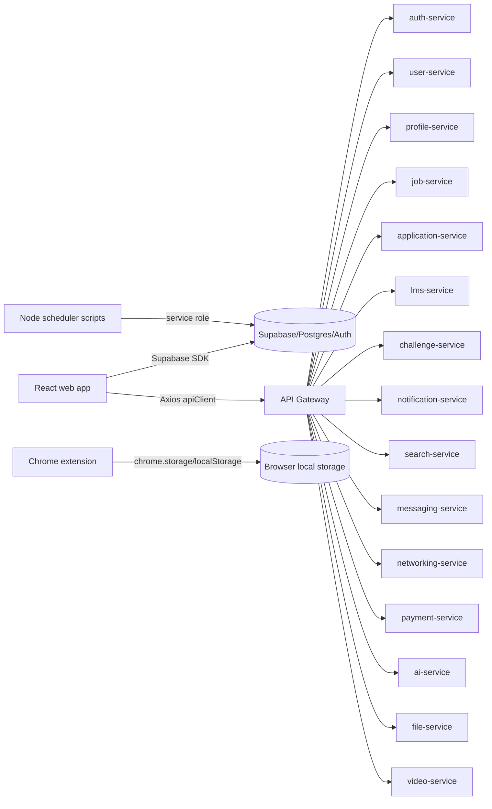

### 21.2 Target dependency direction

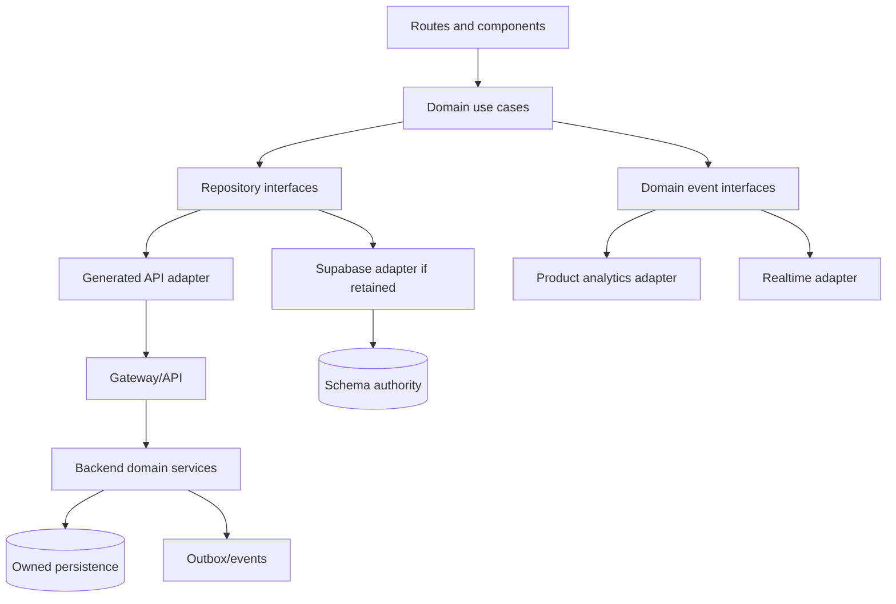

### 21.3 Startup and auth flow

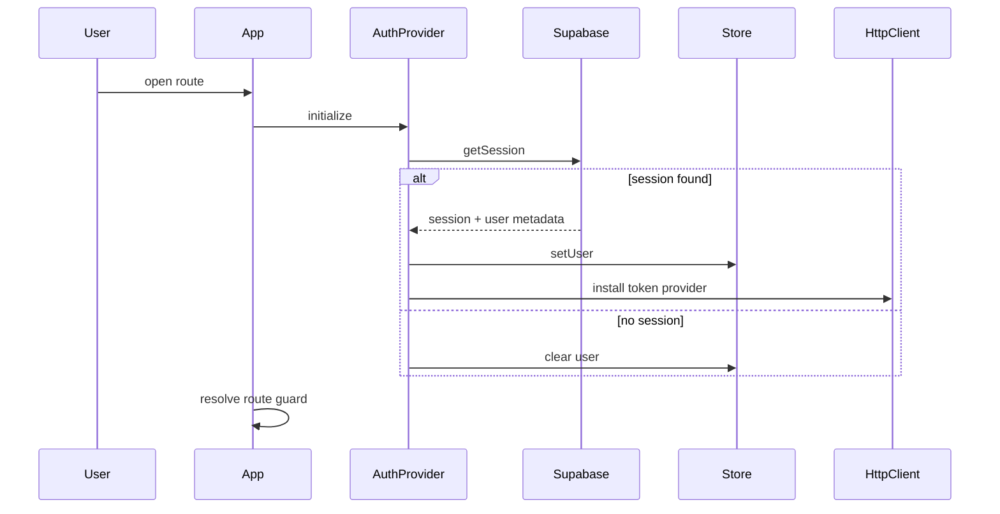

### 21.4 Job application flow

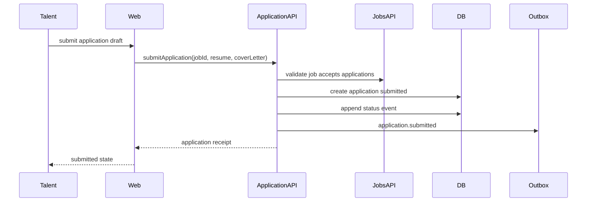

### 21.5 Candidate status flow

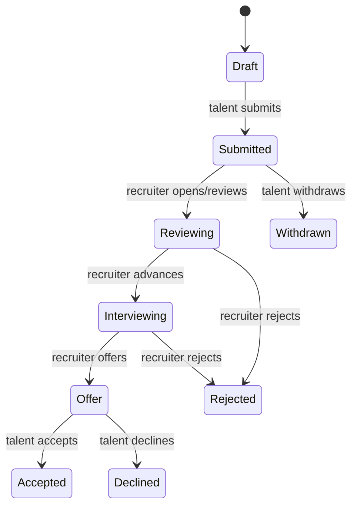

### 21.6 Notification and scheduler flow

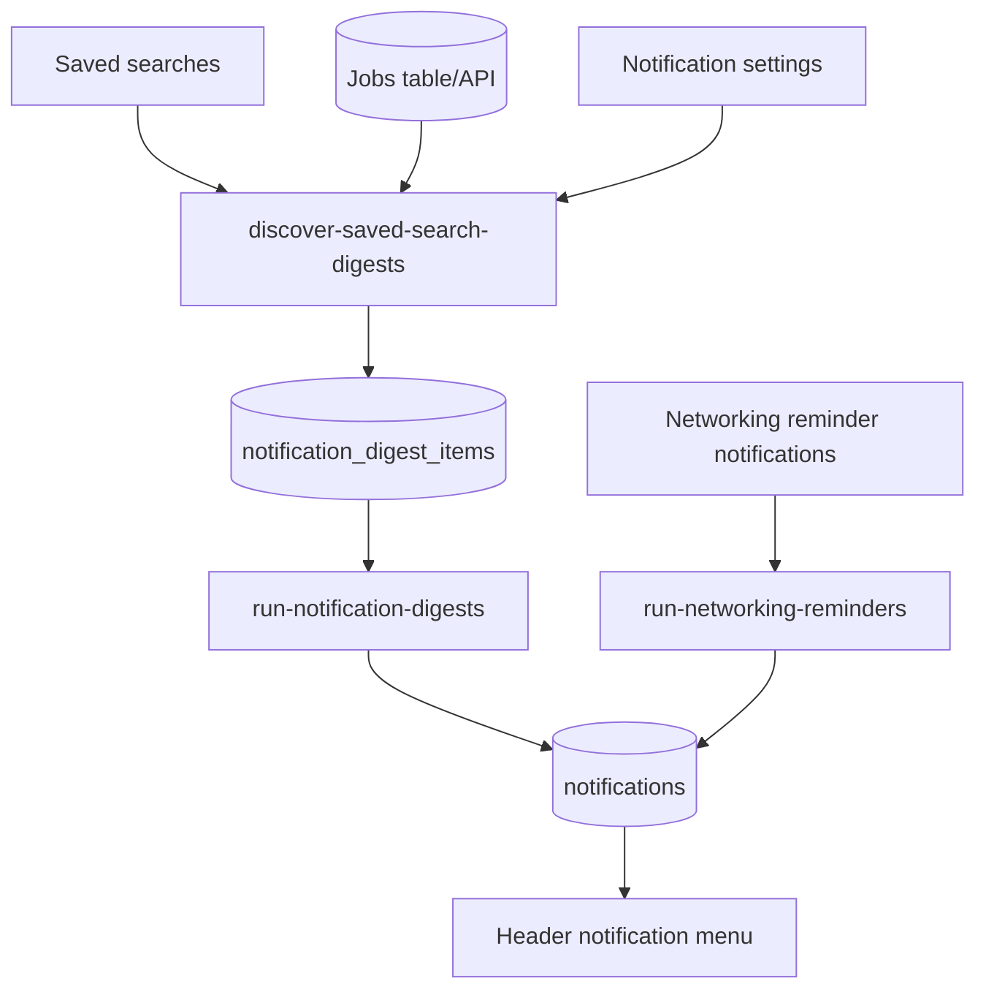

### 21.7 Messaging realtime flow

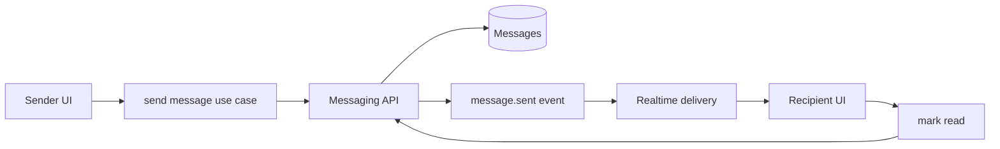

### 21.8 Extension local flow

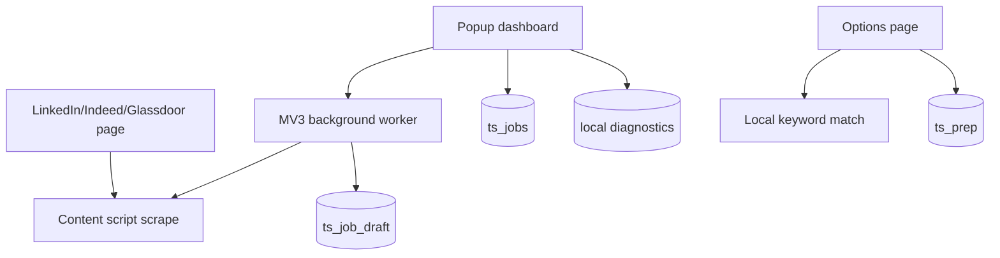

### 21.9 Build and deploy flow target

```mermaid
flowchart LR
  PR[Pull request] --> Lint[Lint/typecheck]
  Lint --> Unit[Unit tests]
  Unit --> Contracts[API/schema contract report]
  Contracts --> Build[Build artifacts]
  Build --> Images[Container images]
  Images --> Scan[Security scan]
  Scan --> DeployStaging[Deploy staging]
  DeployStaging --> Smoke[Smoke and e2e]
  Smoke --> Promote[Promote production]
```

### 21.10 Error handling flow

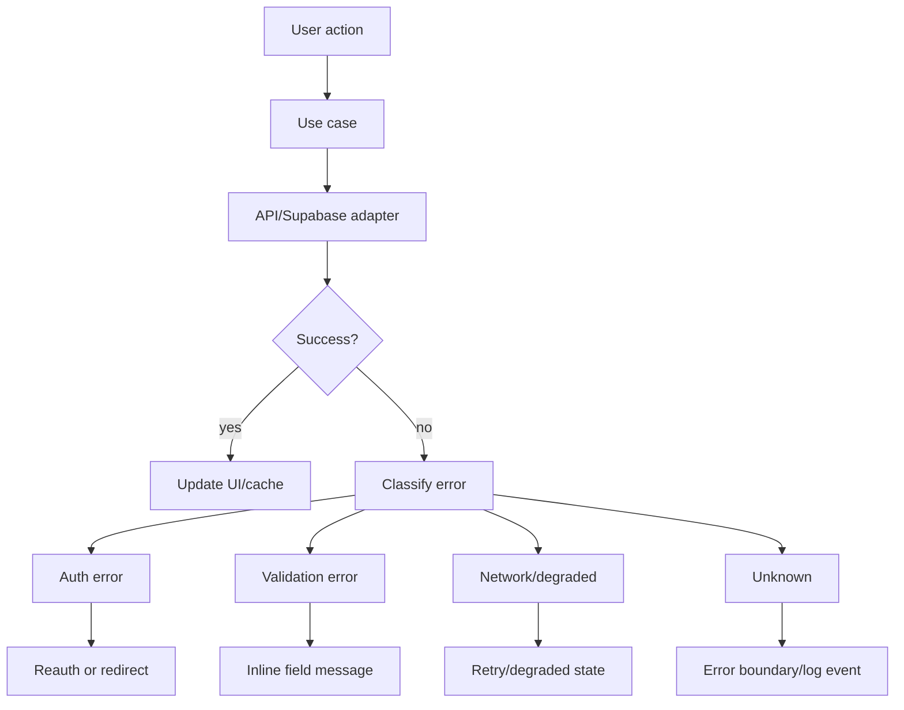

### 21.11 Target folder and source ownership

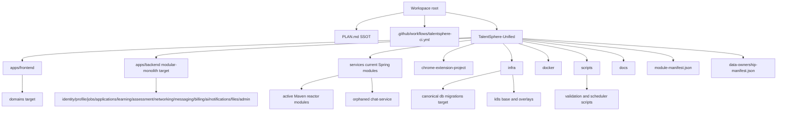

### 21.12 Bounded context relationships

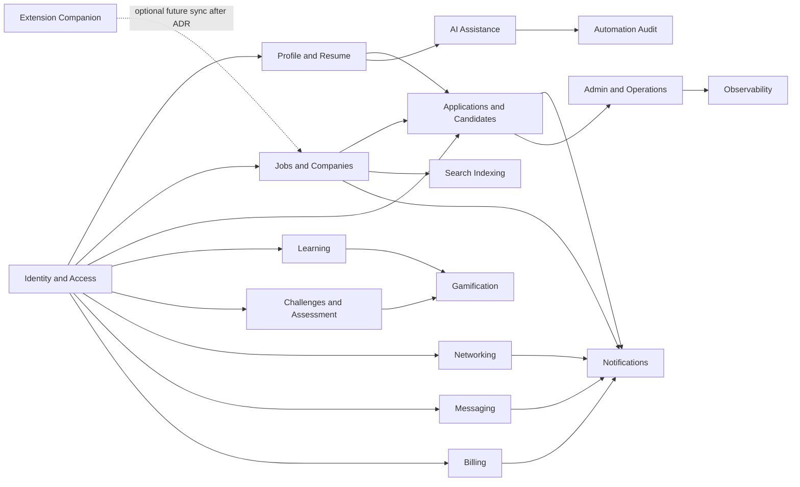

### 21.13 API flow

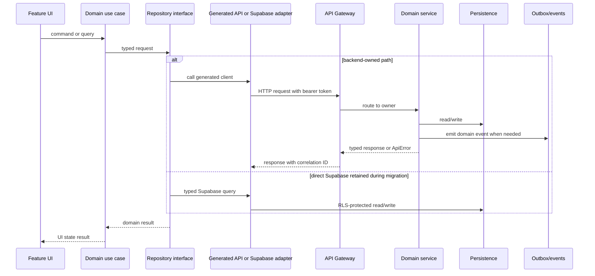

### 21.14 Data ownership and migration flow

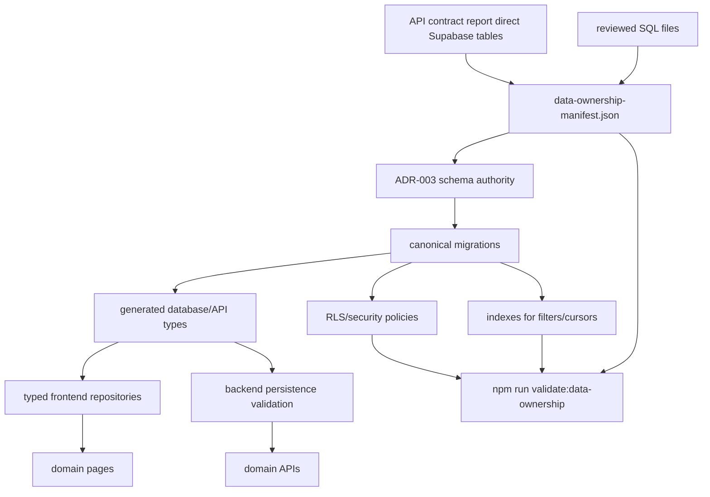

### 21.15 State flow

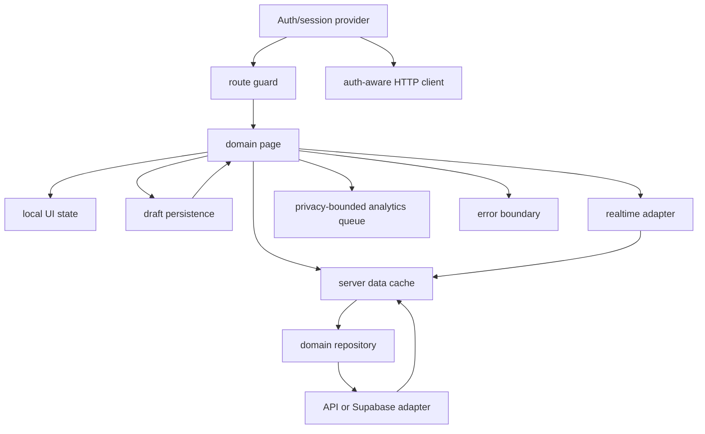

### 21.16 Navigation and role flow

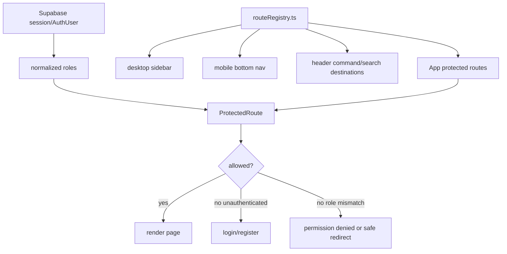

### 21.17 User journey map

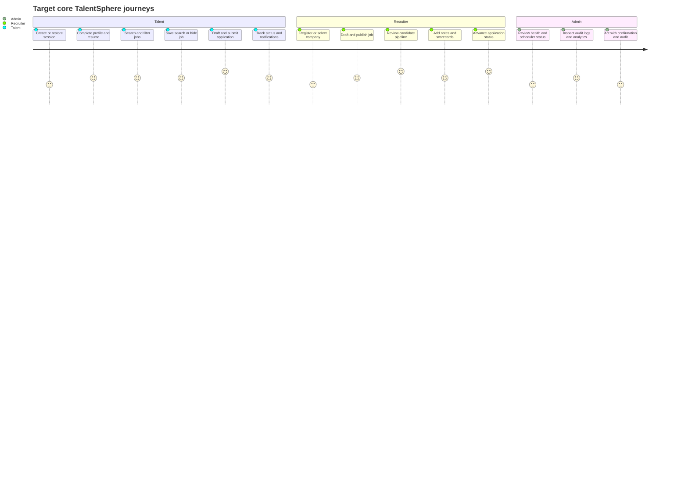

### 21.18 Scheduler module interaction

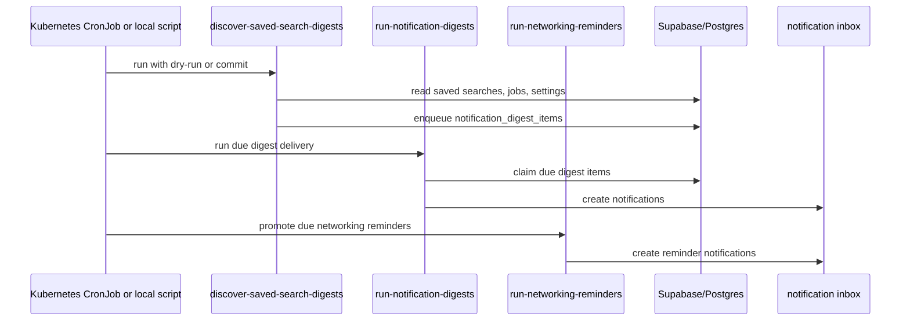

### 21.19 Deployment pipeline target

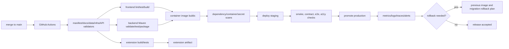

### 21.20 CI/CD verification flow

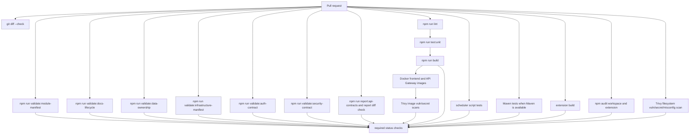

### 21.21 Domain application class diagram

```mermaid
classDiagram
  class DomainUseCase {
    +execute(command)
    -validate(command)
    -authorize(actor, command)
    -mapErrors(error)
  }
  class Repository {
    <<interface>>
    +find(query)
    +save(command)
  }
  class ApiAdapter {
    +request(dto)
    +mapResponse(response)
    +mapApiError(error)
  }
  class SupabaseAdapter {
    +query(table, request)
    +mapDbRow(row)
    +mapDbError(error)
  }
  class DomainEvent {
    +aggregateId
    +eventType
    +actorId
    +correlationId
    +occurredAt
  }
  class ApiError {
    +code
    +safeMessage
    +correlationId
  }
  class UIState {
    +status
    +data
    +source
    +error
  }
  DomainUseCase --> Repository
  DomainUseCase --> DomainEvent
  DomainUseCase --> ApiError
  Repository <|.. ApiAdapter
  Repository <|.. SupabaseAdapter
  DomainUseCase --> UIState
```

### 21.22 Payment and subscription sequence target

```mermaid
sequenceDiagram
  participant User
  participant Web
  participant BillingAPI
  participant Provider as Payment provider
  participant Webhook as Webhook handler
  participant DB as Billing tables
  participant Audit
  User->>Web: choose active plan
  Web->>BillingAPI: create checkout session with idempotency key
  BillingAPI->>Provider: create checkout session
  Provider-->>BillingAPI: hosted checkout URL
  BillingAPI-->>Web: redirect URL
  User->>Provider: complete or abandon checkout
  Provider->>Webhook: signed subscription/payment event
  Webhook->>Webhook: verify signature and idempotency
  Webhook->>DB: update subscription/payment state
  Webhook->>Audit: record billing event
  Web->>BillingAPI: refresh billing status
  BillingAPI->>DB: read webhook-owned state
  BillingAPI-->>Web: subscription/payment history
```

## 22. Technical Debt Register

Priority scale: P0 blocks production, P1 blocks reliable rebuild, P2 important quality issue, P3 cleanup.

| Priority | Debt | Evidence | Rebuild action |
| --- | --- | --- | --- |
| P0 | Split auth authority between Supabase and auth-service | `App.tsx`, `authService.ts`, `auth-service`, `docs/adr/ADR-001-primary-identity-provider.md`, `scripts/validate-auth-contract.mjs`, `RouteValidatorTest`, `JwtUtilsTest`, `AuthControllerLocalCredentialsDisabledTest` | Decision implemented on 2026-06-27: Supabase Auth is primary. Source-level Gateway HMAC verifier config, exact public-route matching, role normalization, and default-disabled backend local credentials are validated. Remaining work is live token verification, Maven/CI execution, and final auth-service bootstrap/retirement. |
| P0 | Gateway public-route substring bypass risk | `RouteValidator`, `RouteValidatorTest`, `scripts/validate-auth-contract.mjs` | Implemented on 2026-06-27: public routes use exact path matching plus explicit `/eureka` prefix handling; auth-contract validation rejects substring matching. Maven execution remains pending. |
| P0 | API auth interceptor not proven wired | `api/axios.ts`, `main.tsx`, `src/main.test.tsx`, `src/api/axios.test.ts` | Implemented and tested on 2026-06-27; keep broader auth-provider ownership open. |
| P0 | Schema authority drift | API report tables vs `infra/supabase_master.sql`, `data-ownership-manifest.json` | Source-validated table ownership manifest implemented on 2026-06-27; billing subscription SQL gap resolved on 2026-06-27; baseline migration and source-derived relationship-aware generated types implemented on 2026-06-27; resolve duplicate SQL sources and verify live RLS/indexes. |
| P0 | CI paths stale | Previous nested workflows under `TalentSphere-Unified/.github/workflows`; current `.github/workflows/talentsphere-ci.yml` | Implemented root CI for actual `apps/frontend`, `services`, extension, scripts on 2026-06-27; hosted run still must be verified. |
| P0 | Missing Maven wrapper while CI expects it | Previous `ci.yml`, file search | Implemented installed-Maven CI path on 2026-06-27; local developer Maven wrapper decision remains open. |
| P1 | Feature flag names become `enable_enable_*` | shared `Feature`, gateway tests | Implemented on 2026-06-27: canonical keys are enum names such as `enable_auth`, Gateway admin mutations reject unknown keys, and tests cover stale-key rejection. Backend Maven execution remains pending. |
| P1 | Gateway JWT/JWK mismatch | Gateway YAML, `JwtUtils`, `scripts/validate-auth-contract.mjs` | Source-level mismatch resolved on 2026-06-27 by removing unused JWKS config and validating HMAC `JWT_SECRET` config; live Supabase token verification is still required. |
| P1 | Direct Supabase access spread across frontend | 45 table report | Partially reduced on 2026-06-27: billing, profile, landing public stats, challenge, application, job, LMS, messaging, networking, recruiter, notification, notification digest, dashboard, company, gamification, AI, analytics, automation audit, and admin direct table paths now use `typedSupabase` and generated table/enums where migrated; auth bootstrap, OAuth, realtime, and frontend Edge Function calls now also use `typedSupabase`; the observed mutual-count RPC uses generated function types; `npm run validate:data-ownership` and `npm run validate:typed-supabase-boundary` reject frontend production imports of the untyped compatibility client and ungenerated RPC calls; continue encapsulating repositories or move writes to backend. |
| P1 | Local/mock fallback can hide persistence failures | frontend service warnings/fallbacks | Make degraded mode explicit and disable fabricated writes in production. |
| P1 | Messaging and chat boundaries overlap | `messaging-service`, `chat-service` | Merge or define separate responsibilities. |
| P1 | Payment service uses synthetic sessions | `payment-service` | Implement provider-backed checkout/webhook or label as demo. |
| P1 | AI service is heuristic/static | `ai-service` | Define suggestion contracts and provider abstraction only when configured. |
| P1 | File service local disk only | `file-service` | Source-level MIME/signature validation and scanner hook were implemented on 2026-06-27; add production object storage, external malware scanner, scan status persistence, signed URLs, and CDN strategy. |
| P1 | Challenge judging calls external Piston directly | `challenge-service` | Queue and sandbox strategy. |
| P1 | Infra Compose references missing modules | `infra/docker/docker-compose.yml`, `docker-compose.yml`, `scripts/validate-infrastructure-manifest.mjs` | Implemented on 2026-06-27 at source-validation level: missing/orphaned deploy references were removed and CI now validates Compose/Kustomize references against `module-manifest.json`; Docker runtime still must be verified. |
| P1 | `chat-service` is orphaned from the Maven reactor | `services/chat-service/pom.xml`, root `pom.xml`, `module-manifest.json`, API contract report | Gateway and deployment references were removed on 2026-06-27; decide whether to add it to the reactor and CI or retire/merge it into `messaging-service`. |
| P2 | Root Vite/index artifacts duplicate active frontend | `TalentSphere-Unified/vite.config.ts`, `index.html` | Remove or mark as legacy after migration. |
| P2 | Legacy `Aurora-*` classes and token drift | frontend components and CSS | Consolidate design system. |
| P2 | Negative heading letter spacing in global CSS | `index.css` | Normalize typography tokens. |
| P2 | `apps/backend` stub unclear | `apps/backend` | Decide modular monolith path or remove stub. |
| P2 | Overbroad service dependencies | service POMs | Trim per service after ownership decisions. |
| P2 | Global exception handler leaks internal messages | `GlobalExceptionHandler`, `scripts/validate-security-contract.mjs` | Implemented on 2026-06-27: shared exception handling returns stable public codes plus correlation IDs, logs raw details server-side, and validates the contract statically. Maven/shared-module JUnit execution remains pending. |
| P2 | Secrets manager config appears nonfunctional | `SecretsManagerConfig` | Implement or remove. |
| P2 | Environment validation is warning-only | `MandatoryEnvironmentPostProcessor`, `scripts/validate-security-contract.mjs` | Implemented on 2026-06-27: production/strict startup now fails for configured missing, unresolved, or placeholder credentials; local/test remains warning-only. Runtime cluster startup with real secrets remains unverified. |
| P2 | API routes and nav permissions duplicated | `App.tsx`, `Sidebar.tsx`, `Header.tsx`, `navigation/routeRegistry.ts` | Implemented on 2026-06-27 for frontend router, sidebar, mobile nav, header search, and protected route role gates; add E2E role-access coverage after auth-owner decision. |
| P2 | Extension lacks test suite | extension package/source | Partially implemented on 2026-06-27: extension package now has source-level messaging, portal fixture, contract, and storage migration tests for content scan extraction, LinkedIn/Indeed/Glassdoor selector parsing, background draft mapping, background/content actions, MV3 permissions/hosts, local-only sync posture, diagnostics metadata allowlist, bounded queue, raw resume/job diagnostics exclusion, schema marker migration, malformed-key warnings, and install/update migration wiring; live Chromium-compatible runtime smoke now covers host-mapped portal fixture content-script execution, built popup render, local storage, and background ping messaging. Google Chrome-specific unpacked runtime, live public-portal DOM drift, and published update-path MV3 tests remain open. |
| P3 | Agent/generated artifacts live near product source | `.gemini`, root helper files, generated snapshots, root agent docs | Partially implemented on 2026-06-27: generated/dev-only artifacts are ignored or classified under `developmentArtifacts`; root agent/context docs are marked historical/stale under `documentation`; `project_structure.txt` was removed. Final archive/purge remains open. |

## 23. Rebuild Roadmap

This roadmap is a rebuild blueprint, not a claim that the implementation is complete. The matrix below is the controlling roadmap; the phase subsections preserve concise deliverables and acceptance criteria.

| Phase | Goals | Priority | Dependencies | Deliverables | Breaking changes | Migration plan | Rollback plan | Acceptance criteria | Risks | Estimated complexity |
| --- | --- | --- | --- | --- | --- | --- | --- | --- | --- | --- |
| 0. Freeze and inventory | Stop architecture drift, classify source, make validation runnable. | P0 | Current repo layout, package scripts, Maven/Docker availability, generated reports. | Module manifest, root CI, stale workflow cleanup, API report regeneration, stale-doc labels. | CI paths and Docker build roots may change. | Add manifest first, wire validators, move CI to actual git root, keep deleted stale workflows in git history. | Revert CI/manifest changes and restore prior workflow files if hosted CI proves incompatible. | Frontend validation runs, backend compile/test command is defined, stale workflows no longer target missing paths. | Local tools may not match CI; orphaned modules may hide build failures. | Medium |
| 1. Identity and contracts | Implement accepted auth owner and make frontend/gateway token contract consistent. | P0 | Phase 0 validation, ADR-001, route inventory, gateway security evidence. | Auth ADR, token claim contract, route/permission registry, auth-aware HTTP client, auth-contract validator, contract report in CI. ADR-001 is accepted; source-level Gateway HMAC config, exact public-route matching, role normalization, and default-disabled backend local credentials are validated; live verifier testing remains pending. | Login/session semantics may change; backend auth-service role may shrink. | Introduce compatibility token verifier, migrate route guards to registry, remove duplicate auth paths after tests pass. | Re-enable previous auth path behind explicit compatibility flag and keep session-clearing fallback. | Role matrix tests pass and API calls carry expected auth headers accepted by gateway. | Lockout risk if token claim mapping is wrong. | High |
| 2. Data ownership and migrations | Establish one schema authority and owner for every table/write path. | P0 | Phase 1 auth owner, API report, reviewed SQL, direct Supabase usage list. | Canonical migrations, generated TS types, owner map, RLS/security decisions, repository adapters. | Table names, RLS behavior, and direct client writes may change. | Keep the baseline migration/types synchronized, decompose migrations by domain, wrap direct reads/writes behind repositories, migrate writes domain by domain. | Keep old table/view compatibility or dual-write temporarily with audit checks. | Every table has owner, migration, policy decision, indexes, and no feature page imports Supabase SDK directly. | Data loss or permission regressions if migrations are incomplete. | High |
| 3. Jobs, applications, recruiter core | Stabilize the core marketplace workflow. | P0 | Phases 1-2, job/company/application owner decisions, scheduler contracts. | Job lifecycle, application lifecycle, candidate notes/scorecards API, saved-search scheduler hardening. | Application status and job publish rules become server-owned. | Ship read compatibility first, then command APIs, then disable direct writes and mock success paths. | Re-enable read-only legacy paths and preserve submitted application records. | Talent can apply and track status; recruiter can publish jobs, review candidates, and status events are append-only. | Workflow interruptions if direct Supabase and API states diverge during migration. | High |
| 4. Profile, resume, file, AI drafts | Separate durable profile/resume data from generated suggestions and file storage. | P1 | Phase 2 schema authority, file storage decision, AI provider/demo decision. | Profile/resume boundaries, file provider abstraction, artifact lifecycle, AI review queue normalization. | File URLs, resume artifact semantics, and AI mutation behavior may change. | Add provider adapters, migrate artifacts to metadata records, convert AI outputs to drafts requiring review. | Keep local disk/dev provider and previous artifact records readable. | Resume exports and artifacts have durable metadata; AI suggestions require review and emit audit events. | Provider selection and historical artifact migration can delay rollout. | Medium-high |
| 5. Learning, challenges, networking, messaging | Harden secondary engagement domains and realtime workflows. | P1 | Phase 2 schema authority, messaging/chat ADR, judge/scheduler decisions. | LMS progress authority, async judge pipeline, networking lifecycle, realtime reconciliation. | Challenge submission responses become async; messaging/chat boundaries may merge. | Introduce async statuses, migrate unread/progress state, keep compatibility readers until clients switch. | Keep synchronous judge path disabled behind config and preserve old conversation IDs. | Unbounded lists are paginated; realtime/offline behavior is visible and tested; judge does not block request threads. | Realtime ordering and judge queue reliability can fail under load. | High |
| 6. Billing, admin, observability, security | Make operational and money-handling surfaces production-safe or explicitly demo. | P0/P1 | Phases 1-2, payment provider decision, logging/metrics stack decision. | Provider-backed or demo-labeled billing, admin source labels, dashboards, alerts, secret validation. | Demo payment behavior may be removed from production; startup may fail without secrets. | Gate live mode by env, add webhook processing, add source labels before enabling admin actions, enforce secrets in prod only. | Disable live payment mode, fall back to read-only admin dashboards, restore warning-only secret validation outside prod. | Payment state is webhook-owned if enabled; admin distinguishes live/inferred/mock/degraded/missing; prod fails without required secrets. | Payment/webhook mistakes and strict secret validation can block deploys. | Medium-high |
| 7. Extension hardening | Keep extension local-first and add release confidence. | P2 | Phase 0 build pipeline, extension storage inventory, optional future sync ADR. | MV3 tests, storage migrations, diagnostics tests, and ADR-006 only if account sync is proposed. | Storage keys may version; any future sync behavior changes privacy posture. | Add migration readers/writers, test old sample storage, keep local-only default. | Retain previous local key readers and keep account sync disabled. | Extension works locally without web auth; account sync requires ADR-006 with explicit consent, preview, conflict handling, data minimization, and rollback rules. | Browser API drift and local data migration issues. | Medium |

### Phase 0: Freeze and inventory

Deliverables:

- Mark stale docs and generated artifacts. Implemented on 2026-06-27 at source-validation level with `documentation`, `developmentArtifacts`, visible documentation-status banners, and `npm run validate:docs-lifecycle`; final archive/remove decisions remain open.
- Create module manifest of active source, legacy source, generated source, documentation lifecycle, dev-only artifacts, and removed stale paths. Implemented on 2026-06-27 with `module-manifest.json`, `docs/MODULE_MANIFEST.md`, and `npm run validate:module-manifest`.
- Add Maven wrapper or document installed Maven requirement.
- Fix CI path references enough to run frontend and backend validation. Initial root CI workflow implemented on 2026-06-27; hosted execution remains Not verified from the codebase.
- Validate infrastructure module references. Implemented on 2026-06-27 with `scripts/validate-infrastructure-manifest.mjs` and CI wiring; Docker/Kubernetes runtime remains Not verified from the codebase.
- Regenerate API contract report. Implemented on 2026-06-27 with manifest-aware active vs orphaned controller route classification.

Acceptance criteria:

- CI runs at least frontend lint/test/build and backend compile/test command.
- `docs/ARCHITECTURE_STATUS_INDEX.md` and `PLAN.md` agree on active architecture.
- No stale workflow points at missing directories without an explicit deprecation note.
- `project_structure.txt` stays removed and classified stale unless regenerated by a documented command.
- New Markdown docs are lifecycle-classified or explicitly dev-only before CI passes.

### Phase 1: Identity and contracts

Deliverables:

- ADR: auth provider and token contract. Implemented on 2026-06-27 by `docs/adr/ADR-001-primary-identity-provider.md`; Gateway exact public-route matching, role normalization, source-level HMAC config, and default-disabled backend local credentials are validated by `npm run validate:auth-contract`; live token verification remains open.
- ADR: backend topology, service tree vs modular monolith.
- Shared route/permission registry.
- Wired auth-aware HTTP client.
- API/schema contract generation in CI.

Acceptance criteria:

- Role matrix tests pass for user, recruiter, admin, unauthenticated.
- API calls carry expected auth headers.
- Gateway validates the same token shape produced by the chosen auth provider.

### Phase 2: Data ownership and migrations

Deliverables:

- Canonical schema migrations for all direct Supabase tables.
- Generated TypeScript database types.
- Owner map for each entity. Initial source-validated table owner map implemented on 2026-06-27 with `data-ownership-manifest.json`; production authority remains incomplete.
- Repository adapters around all direct Supabase access.

Acceptance criteria:

- Every table has owner, migration, RLS/security policy decision, indexes, and tests.
- No feature page imports Supabase SDK directly.

### Phase 3: Jobs, applications, and recruiter core

Deliverables:

- Server-owned job lifecycle.
- Application status lifecycle and append-only events.
- Candidate notes/scorecards API.
- Saved-search scheduler hardening.

Acceptance criteria:

- Talent can apply, recover draft, and view status history.
- Recruiter can publish a job, review applicants, write notes/scorecards, and advance status.
- Scheduler jobs are idempotent and audited.

### Phase 4: Profile, resume, file, and AI drafts

Deliverables:

- Profile/resume domain boundaries.
- File provider abstraction.
- Resume artifact lifecycle.
- AI suggestion review queue normalization.

Acceptance criteria:

- Resume exports and artifacts have durable metadata and deletion semantics.
- AI suggestions require user review and produce audit events.

### Phase 5: Learning, challenges, networking, messaging

Deliverables:

- LMS progress authority.
- Challenge async judge pipeline.
- Networking lifecycle/idempotency.
- Messaging/chat boundary decision and realtime reconciliation.

Acceptance criteria:

- Unbounded lists are paginated.
- Realtime and offline/degraded behavior is visible and tested.
- Challenge submissions cannot block request threads on long external execution.

### Phase 6: Billing, admin, observability, security

Deliverables:

- Payment provider implementation or explicit demo mode.
- Admin operational console with real source labels.
- Observability dashboards and alerts.
- Production secret validation. Source-level runtime fail-fast and Kubernetes runtime-secret wiring were implemented on 2026-06-27; live secret provisioning remains unverified.

Acceptance criteria:

- Payment state is webhook-owned if payments are enabled.
- Admin health/scheduler/analytics states distinguish live, inferred, mocked, degraded, and missing.
- Source-level production startup fails without configured required secrets.
- Runtime CI/cluster startup is verified with real environment-supplied secrets.

### Phase 7: Extension hardening

Deliverables:

- MV3 build/test pipeline.
- Source-level local storage migration/versioning.
- Source-level diagnostics export/privacy tests.
- Optional sync ADR.

Acceptance criteria:

- Extension functions locally without web app auth.
- Any sync feature requires explicit consent, preview, and conflict handling.

## 24. Validation Checklist

### 24.1 Repository hygiene

- [x] `PLAN.md` is present at workspace root.
- [x] `PLAN.md` contains repository-backed current and target Mermaid diagrams for architecture, folder/source ownership, dependency direction, feature relationships, startup/auth, data ownership, API flow, state flow, navigation, user journeys, scheduler/module interaction, build/deploy, CI/CD, error handling, sequence views, and class structure.
- [x] Root `.github/workflows/talentsphere-ci.yml` exists for the actual git root.
- [x] Stale nested workflows targeting missing directories were removed from the current worktree.
- [x] `module-manifest.json` classifies active, legacy, orphaned, generated, infrastructure, tooling, documentation lifecycle, dev-only artifacts, and removed stale paths.
- [x] `npm run validate:module-manifest` passed on 2026-06-27.
- [x] `npm run validate:infrastructure-manifest` passed on 2026-06-27.
- [x] `npm run validate:docs-lifecycle` passed on 2026-06-27.
- [x] Stale docs are marked stale or archived.
- [x] Generated artifacts are excluded or documented.
- [x] Root helper scripts are classified as dev-only or removed.
- [x] `project_structure.txt` is removed from the current worktree and guarded by `removedStalePaths`.

### 24.2 Frontend

- [x] Frontend lint passed on 2026-06-27.
- [x] Frontend production build passed on 2026-06-27.
- [x] Frontend unit tests passed on 2026-06-27 after typed Supabase/profile/admin/LMS/messaging/job/recruiter/auth/AI-boundary work: 67 test files and 422 tests.
- [x] Auth bootstrap installs API token provider.
- [x] Route registry drives router, sidebar, mobile nav, header search, and permissions.
- [x] Billing, profile, challenge, application, job, recruiter, LMS, messaging, networking, notification, notification digest, dashboard, company, gamification, AI, analytics, automation audit, and admin direct Supabase table paths use the generated `Database` typed boundary.
- [ ] Supabase direct access is behind domain repositories.
- [ ] All pages have loading, empty, error, retry, and degraded states.
- [ ] No production code silently fabricates successful writes.
- [ ] Design tokens replace undefined legacy classes.

### 24.3 Backend

- [x] Backend topology ADR accepted.
- [x] Messaging boundary ADR accepted.
- [ ] Every endpoint has authZ tests.
- [ ] Every service has health, metrics, logs, and correlation ID.
- [ ] Outbox has retry exhaustion handling and operator visibility.
- [ ] Feature flags have stable names and tests added; backend Maven execution still required.
- [x] Static route contract report is generated and checked in CI.
- [x] Source-derived OpenAPI/payload schema contract is generated, validated, and checked in CI.
- [ ] Runtime Springdoc/OpenAPI output is smoke-tested from running backend services.

### 24.4 Data

- [x] Schema authority ADR accepted.
- [ ] Every table has a migration.
- [x] Initial reviewed schema baseline migration and source-derived DB types are generated and checked in CI.
- [x] Frontend Supabase client exposes a generated-`Database` typed migration boundary.
- [x] Every observed table has a target owner classification.
- [ ] Every table has indexes for common filters/cursors.
- [ ] RLS/security policy is documented.
- [ ] Seed data is safe and environment-scoped.
- [x] Source-level direct service-role scheduler scripts are dry-run by default, idempotency-oriented, audited to `audit_log` in commit mode, and covered by scheduler tests plus `npm run validate:security-contract`.

### 24.5 Security

- [x] Primary auth provider decision is documented in ADR-001.
- [x] Payment mode ADR accepted and demo billing mode is explicit.
- [x] Source-level Gateway auth contract is validated by `npm run validate:auth-contract`.
- [x] Gateway public-route validation uses exact path/prefix matching instead of substring matching.
- [x] Backend auth-service local credential register/login endpoints are disabled by default behind explicit compatibility flag.
- [ ] Gateway Supabase-token validation path and runtime claim mapping are fully verified with live-compatible tokens. Role normalization is source-implemented, but Maven/CI and integration verification remain pending.
- [x] Source-level required secret validation fails fast in production/strict mode and is validated by `npm run validate:security-contract`.
- [ ] Runtime CI/cluster startup is verified with real environment-supplied production secrets.
- [x] Source-level shared API error handling returns safe public codes with correlation IDs and is validated by `npm run validate:security-contract`.
- [x] Source-level upload validation includes MIME/content-signature checks, active-content rejection, and a malware scanner hook validated by `npm run validate:security-contract`.
- [ ] Provider-backed file malware scanning, scan status persistence, and signed access are production-verified.
- [x] Source-level sensitive-route rate limits are configured for auth, AI, challenge, messaging, and file routes and validated by `npm run validate:auth-contract`.
- [ ] Runtime Redis-backed rate-limit behavior and expected 429 responses are integration-tested.
- [ ] Admin and recruiter actions are audited.
- [x] Source-level dependency, secret, misconfiguration, and container image scan gates are wired into CI and validated by `npm run validate:security-contract`.
- [ ] Dependency, secret, misconfiguration, and container image scan jobs have passed in GitHub Actions.

### 24.6 Operations

- [x] Frontend Dockerfile targets the root npm workspace and `apps/frontend`.
- [x] Docker Compose deployable references and frontend bind mounts reflect current module paths; Docker runtime is not locally verified.
- [x] Kubernetes base service resources reflect active deployable modules; cluster runtime and image availability are not locally verified.
- [x] Scheduler CronJob commands are source-validated and scheduler audit helper coverage is wired into CI; scheduler image build/push is not verified.
- [x] Source-level alert and dashboard catalogs exist for critical flows and are validated by `npm run validate:observability-contract`.
- [ ] Deployed dashboards and alert-manager routing exist for critical flows.
- [x] Source-backed incident runbooks exist and are validated by `npm run validate:runbooks`.
- [ ] Environment-verified runtime runbooks, real on-call contacts, dashboards, and alert-manager links exist for production incidents.

### 24.7 Extension

- [x] Extension production build passed on 2026-06-27.
- [x] Manifest build is validated: `chrome-extension-project/dist/manifest.json` was produced on 2026-06-27.
- [x] Manifest icon assets exist under `chrome-extension-project/public/icons`, are copied into `dist/icons`, and Chrome pack validation passed on a temporary copy of the built artifact.
- [x] Extension contract test validates local-only sync posture, supported manifest permissions/hosts, bounded operational diagnostics, diagnostics metadata allowlist, and raw resume/job diagnostics exclusion.
- [x] Source-level background/content messaging tests cover content scan extraction, background draft mapping, message action wiring, and response behavior.
- [x] Source-level LinkedIn, Indeed, and Glassdoor portal fixture tests cover content selector parsing for role, company, source, URL, confidence, and sanitized description extraction.
- [x] Source-level local storage migration tests cover schema markers, known-key preservation, malformed-key warnings, and install/update migration wiring.
- [x] Source-level diagnostics contract blocks raw resume/job text metadata in extension operational analytics.
- [x] Extension sync rebuild posture is local-only: source uses `chrome.storage.local` or localStorage fallback, contract tests reject sync/network APIs, and account sync is out of scope unless ADR-006 is accepted.
- [x] Live Chromium-compatible MV3 runtime smoke against the built artifact passed with `npm run test:extension-runtime-smoke` in headless Microsoft Edge 149; host-mapped LinkedIn, Indeed, and Glassdoor fixture tabs, injected content-script metadata, popup render, `chrome.storage.local`, and popup-to-background `ping` messaging were verified.
- [ ] Google Chrome-specific unpacked runtime smoke is verified in an environment where Chrome accepts `--load-extension`.

## 25. Decision Records and Open Decisions

Every decision below must become an ADR before implementation removes or replaces current behavior. ADRs must live under `docs/adr/` and include status, repository evidence, decision, alternatives, consequences, migration plan, rollback plan, owner, and validation commands.

### 25.1 Initial ADR backlog

| ADR | Status | Repository evidence | Decision to make | Consequences to document |
| --- | --- | --- | --- | --- |
| ADR-001 Primary identity provider | Accepted | Frontend Supabase auth in `App.tsx` and `authService.ts`; backend `auth-service`; gateway JWT utilities; `docs/adr/ADR-001-primary-identity-provider.md`; `scripts/validate-auth-contract.mjs`. | Supabase Auth is the primary login/session authority. Backend auth-service local credentials are disabled by default and must become compatibility/bootstrap support or be retired from product login paths. Source-level Gateway HMAC config, exact public-route matching, and role normalization are validated. | Token claim shape, live Gateway validation, route guards, user bootstrap, logout behavior, local dev fallback, and final backend auth-service retirement/bootstrap decision remain pending. |
| ADR-002 Backend topology | Accepted | Broad `services/*` tree plus `api-gateway`, orphaned `services/chat-service`, `apps/backend` modular-monolith shell, `docs/adr/ADR-002-backend-topology.md`, and `scripts/validate-backend-topology-adr.mjs`. | Modular monolith first with extractable service boundaries; active services remain source evidence and migration input until domains are moved or retired deliberately. | Target package skeleton, migration sequence, CI topology, service discovery retirement or retention, shared library migration, local developer setup, and chat-service retirement/adapter merge remain pending. |
| ADR-003 Schema authority | Accepted | Direct frontend access to 45 Supabase tables; `data-ownership-manifest.json`; `supabase-schema.sql`; `infra/db/migrations/0001_initial_baseline.sql`; `infra/db/generated/database.types.ts`; legacy `infra/supabase_master.sql`; `infra/db/README.md`; `docs/adr/ADR-003-schema-authority.md`; `scripts/validate-schema-authority-adr.mjs`; `scripts/validate-schema-migrations.mjs`. | Migration-first Supabase/Postgres authority with generated TypeScript types and backend validation. `supabase-schema.sql` is current reviewed baseline evidence, `infra/db/migrations/0001_initial_baseline.sql` is the source-derived initial migration, `infra/db/generated/database.types.ts` includes source-derived table/enum/relationship metadata, and `infra/supabase_master.sql` is legacy historical evidence until migrated, retained, or retired deliberately. | Smaller domain-ordered migrations, live database-generated DB types, live RLS/security validation, data ownership implementation, rollback migrations, seed data scope, duplicate SQL retirement, and direct frontend repository migration remain pending. |
| ADR-004 Messaging boundary | Accepted | `messaging-service`, orphaned `chat-service`, frontend realtime state, `docs/adr/ADR-004-messaging-boundary.md`, `scripts/validate-messaging-boundary-adr.mjs`, API contract report, and OpenAPI non-active chat operations. | One messaging domain boundary. `messaging-service` remains active source evidence; `chat-service` stays orphaned/non-deployable until retired or useful realtime adapter code is merged without duplicate persistence. | Conversation membership authZ, unread semantics, realtime adapter topology, attachment signed access, Maven reactor retirement/merge work, frontend repository migration, and runtime WebSocket validation remain pending. |
| ADR-005 Payment mode | Accepted | Frontend payment tables, backend synthetic sessions, Stripe config/dependency, `docs/adr/ADR-005-payment-mode.md`, `scripts/validate-payment-mode-adr.mjs`, and explicit frontend `billingMode`. | Explicit demo billing mode now. Provider-backed checkout and webhook-owned subscription/payment state are allowed only after signed webhook validation, idempotency, audit records, and runtime provider tests exist. | Live Stripe checkout, webhook handling, idempotency, audit logs, refund/subscription lifecycle, provider catalog, invoices, and tax remain pending. |
| ADR-006 Extension sync | Deferred until account sync is proposed | Extension uses `chrome.storage.local` or localStorage fallback; `extension-contract.test.mjs` rejects sync/network APIs and verifies the UI says extension data stays in this browser. | Current rebuild posture is local-only. ADR-006 is required only before adding account/cloud sync. | Consent UI, import/export preview, conflict resolution, privacy boundaries, data minimization, storage migration, diagnostics content, and rollback plan. |

### 25.2 Open decisions backlog

| Decision | Options | Recommended path |
| --- | --- | --- |
| Primary auth | Supabase Auth, backend auth-service, external IdP | Accepted by ADR-001: Supabase Auth is primary; source-level Gateway auth contract is validated, public-route matching is exact, and backend local credentials are disabled by default; verify live Supabase token behavior and finish auth-service bootstrap/retirement decision. |
| Backend topology | Microservices, modular monolith | Accepted by ADR-002: modular monolith first for rebuild, keep extraction boundaries explicit, and retain the active service tree as migration source evidence until implementation moves or retires each domain. |
| Database access | Frontend direct Supabase, backend-only API, hybrid | Backend-owned writes and generated typed reads; direct Supabase only behind repositories during migration. |
| Schema source | SQL files, Supabase migrations, JPA, generated contracts | Accepted by ADR-003: migration-first Supabase/Postgres authority with generated TypeScript types and backend validation; keep `infra/db/migrations/0001_initial_baseline.sql` and `infra/db/generated/database.types.ts` synchronized, decompose the baseline into smaller ordered migrations, and retire or classify legacy `infra/supabase_master.sql` tables. |
| Messaging boundary | Keep messaging-service and chat-service separate, merge | Accepted by ADR-004: one messaging domain boundary; retire `chat-service` or merge useful realtime adapter code into messaging after authZ/realtime validation. |
| AI provider | Heuristic only, external LLM, hybrid | Keep heuristic/local until provider, evals, prompts, and privacy rules are implemented. |
| Payment mode | Demo synthetic, real provider | Accepted by ADR-005: explicit demo billing mode now; real provider mode only after webhook-owned state, idempotency, audit, and runtime provider validation. |
| Extension sync | Current local-only, future account sync | Resolved for the rebuild: local-only. Future account sync is not part of this rebuild unless ADR-006 accepts explicit consent, preview, conflict handling, data minimization, and sync rollback rules. |

## 26. Risks

| Risk | Impact | Mitigation |
| --- | --- | --- |
| Hybrid Supabase/API writes cause inconsistent data | High | Owner map and repository migration. |
| Auth mismatch blocks API calls | High | Auth ADR, token propagation tests, gateway verification tests. |
| Stale infra deploys wrong services | High | Generate compose/k8s from module manifest. |
| Silent fallbacks hide production outages | High | Degraded UI states and environment-gated mocks. |
| Schema drift causes runtime failures | High | Migration authority and generated types. |
| Placeholder AI/payment/video mistaken for production | Medium | Explicit demo labels and provider readiness checks. |
| Service sprawl slows rebuild | Medium | Modular monolith or strict service ownership. |
| Design token drift degrades UX | Medium | Shared design system migration. |
| Extension local data loss or future sync conflict | Medium | Versioned local storage, browser-runtime migration tests, and no account sync unless ADR-006 accepts consent, preview, conflict handling, and rollback rules. |

## 27. Future Extension Points

These are allowed extension points for capabilities already evidenced in the repository. They are not approved features until an ADR or domain spec accepts the behavior and proves the required contracts.

| Extension point | Current evidence | Future use | Guardrails |
| --- | --- | --- | --- |
| Auth provider adapter | Supabase auth, backend auth-service, gateway JWT utilities. | Swap or add enterprise IdP support after ADR-001. | One login authority, one token claim contract, migration tests before rollout. |
| Payment provider adapter | Payment service, Stripe dependency/config, billing UI. | Add real checkout, webhooks, invoices, tax, and subscription lifecycle. | Webhook-owned state, idempotency keys, explicit demo/live mode, audit trail. |
| AI provider adapter | AI service heuristics and frontend AI review workflows. | Add external model provider, prompt versions, evals, and safety filters. | Suggestions only, no automatic mutations, redaction, rate limits, provenance, review audit. |
| File storage provider | File service local disk implementation, resume/avatar workflows, source-level MIME/signature validation, and local scanner hook. | Add object storage, CDN, image transforms, external virus scanning, signed URLs, and scan status persistence. | Dev provider remains separate, external scan status is explicit, no public raw paths, and provider URLs are signed or access-controlled. |
| Search indexing pipeline | Search service and Elasticsearch dependency. | Add event-driven indexing for jobs, profiles, companies, courses, and challenges. | Source-of-truth remains domain owner; index rebuild jobs and stale index markers required. |
| Notification channels | Notification service, digest scripts, notification settings. | Add email, push, SMS, or browser notifications. | User preferences, unsubscribe controls, provider failure audit, idempotent delivery keys. |
| Realtime transport | Messaging state, notification context, websocket/socket helpers. | Standardize websocket/SSE transport for messages, notifications, and admin updates. | Dedupe, ordering, reconnect, offline state, authorization per conversation/channel. |
| Scheduler platform | Node scheduler scripts and Kubernetes CronJob YAML. | Move schedulers to queue workers or managed jobs. | Dry-run support, idempotency, lock/lease, observable run records, rollback to CronJob. |
| Extension sync | Local extension storage, sync-disabled UI copy, and source-level contract tests that reject sync/network APIs. | Optional account sync for tracked jobs or settings after a future ADR. | Explicit consent, preview, conflict handling, data minimization, local-only default, no raw resume/job text sync, and rollback/migration tests. |
| Analytics exporter | Product analytics events and admin insights. | Export privacy-bounded product analytics to warehouse or BI tools. | Sanitized metadata only, retention policy, opt-out rules, no raw user-generated content. |

## 28. Definition of Done for the Rebuild

The rebuild is production-ready only when all of these are true:

- Every discovered feature has an owner, route/API contract, state model, permissions, analytics, and tests.
- Every write path has one system of record.
- Every schema table is managed by migrations and generated types.
- CI validates frontend, backend, extension, contracts, security scans, and docs.
- Local/mock/demo behavior is impossible to confuse with production persistence.
- Observability can answer: what failed, who was affected, what changed, and whether recovery completed.
- Stale docs and workflows no longer contradict the active architecture.
- Production vendor integrations claimed by the app are implemented and verified, or clearly marked demo/local-only.

## 29. Objective Coverage Matrix

This matrix maps the objective file requirements to the controlling sections in this plan. If a requirement depends on runtime systems, vendor accounts, or deployment environments not proven by source, the corresponding section marks the gap as Not verified from the codebase.

| Objective requirement | Plan coverage |
| --- | --- |
| Complete repository analysis | Sections 1-7 classify repository scope, source maps, runtime architecture, feature inventory, backend inventory, frontend architecture, and data/API contract state. |
| Complete feature inventory | Sections 4 and 4.1 list discovered features with purpose, status, entry points, dependencies, problems, missing validation/error/security/accessibility concerns, and redesign direction. |
| Complete redesign | Sections 8-13 and 13.13-13.18 define principles, domains, target contracts, feature rebuild specs, developer workflow, API/UI state contracts, reusable primitives, standards, and acceptance criteria. |
| Domain-driven organization | Sections 9-12 define bounded contexts, dependency rules, frontend/backend/infrastructure folder ownership, and service-boundary decisions. |
| Production architecture | Sections 10-12, 15-20, and 21 define target layers, module boundaries, data/state/error/security/performance/observability/testing/governance architecture. |
| Ideal folder structure | Sections 10, 11, 12, and diagram 21.11 define target source layout and directory responsibilities. |
| Data flow | Sections 7, 15, 21.3, 21.13, 21.14, and 21.15 cover startup, auth, API, persistence, cache, migration, and state flow. |
| State management | Section 15 defines local, shared, global, persistent, derived/server, realtime, analytics, draft, and extension state ownership. |
| UI/UX system | Section 14 defines design tokens, responsive rules, no overflow/underflow, accessibility, keyboard/screen-reader support, animation, loading/error/offline/empty states, and component hierarchy. |
| Reusability strategy | Section 13.16 defines reusable frontend and backend primitives, ownership, and clean-code constraints. |
| Error handling | Sections 13.15, 15.4, 16, and 21.10 define API/UI error contracts, retry behavior, safe public errors, logging, and audit. |
| Performance | Section 17 defines lazy loading, tree shaking, bundle budgets, render optimization, memoization rules, virtualization, batching, caching, image optimization, background work, cleanup, and memory-leak checks. |
| Security | Section 16 defines auth/authZ, validation, XSS, CSRF, CSP, token storage, API security, secret management, permissions, sensitive logging, rate limits, file scanning, and security scans. |
| Testing strategy | Section 19 defines unit, integration, component, E2E, visual regression, performance, accessibility, contract, mocking, fixture, coverage, and CI strategy. |
| Observability | Section 18 defines logging, monitoring, analytics, telemetry, performance metrics, health checks, feature flags, crash reporting, diagnostics, dashboards, alerts, and runbooks. |
| Documentation and diagrams | Sections 20 and 21 provide governance plus Mermaid diagrams for system architecture, dependencies, startup/auth, user journeys, API/data/state/navigation/build/deploy/CI/error flows, sequences, and class structure. |
| Production readiness checklist | Section 24 tracks repository, frontend, backend, data, security, operations, and extension readiness. |
| Rebuild roadmap | Section 23 defines phases, goals, deliverables, dependencies, breaking changes, migration, rollback, acceptance criteria, risks, priority, and complexity. |
| Technical debt | Section 22 lists prioritized architecture, code, security, infrastructure, testing, UX, and documentation debt with rebuild action. |
| Final validation | Sections 24 and 28 define validation checklists and rebuild definition of done; unresolved runtime/vendor/deployment claims remain explicitly unverified. |
